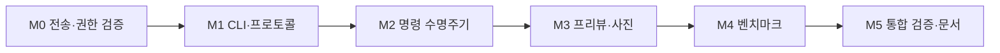

# HALCamera CLI v0.1 구현 계획

작성일: 2026-09-12 · 상태: 구현·통합 검증 완료, 릴리스 준비 · 관련 이슈: [#56](https://github.com/TTolsun/hal-camera/issues/56)

[CLI 설계 초안](design/CLI.md)의 PC·ADB 방식을 기준으로 한다. 사용자의 구현·worktree·리뷰·Release 요청에 따라 작업을 진행하고 있다. [검증 기록](validation/cli-device.md)에 현재 증거와 남은 검사를 구분한다. 아래 체크리스트는 최종 요구사항 대조까지 유지한다.

## 1. 목표 시나리오

사용자는 기기에서 ADB 연결을 승인하고 앱에서 CLI 사용과 카메라 권한을 허용한다. 이후 PC에서 카메라를 선택하여 사진 한 쌍 또는 벤치마크 run을 생성하고, 결과를 지정한 폴더로 가져온다. USB 분리나 CLI 종료 후에도 요청 ID로 상태를 확인하고 결과 다운로드를 다시 시도할 수 있어야 한다.

v0.1은 기존 `camera2-standard-v1`의 의미를 유지한다. UI에서 실행한 결과와 같은 보고서 계약으로 비교할 수 있어야 한다. baseline 지정이나 기존 사진·이력 삭제는 명령에 포함하지 않는다.

## 2. 진행 순서

개발 순서는 위와 같이 직렬로 둔다. M0 결과로 설계를 조정하기 전에는 앱 controller 분리나 전체 CLI 구현을 시작하지 않는다. 일수는 현재 확정하지 않으며, M0에서 기기 호환성과 기존 화면 분리 비용을 확인한 뒤 산정한다.

### M0. 전송·권한·release 호환성 검증

최소 시험용 Provider와 PC 호출 스크립트로 전송 경로를 검증한다. 시험은 임시 JSON·바이너리 데이터만 사용하고 카메라 동작을 연결하지 않는다.

- [x] `content call` 요청과 base64url 응답의 왕복을 검증한다.
- [x] `adb exec-out content read`로 JSON과 JPEG 크기의 바이너리를 가져와 byte 길이와 SHA-256을 비교한다.
- [x] 실제 Binder UID, DUMP 권한, 사용자 0에서의 Provider 접근을 debug·release 각각 확인한다.
- [x] 일반 앱 UID로 call·query·openFile을 시도하여 모두 거부되는지 확인한다.
- [x] CLI 비활성화, 앱 미설치, 프로세스 미실행, 잘못된 URI·payload·write mode를 검증한다.
- [ ] 비밀번호 잠금의 전체 조합을 후속 검증한다. 전면 실행·Activity 종료·전환 경합은 이번 범위에서 확인했다.
- [x] API 26 에뮬레이터와 사용 가능한 최신 실기기에서 수행한다. 설치 서명이 다르면 기존 앱을 제거하지 않고 별도 시험 package를 사용한다.
- [x] 실기기 모델·OS·ADB 버전·APK 종류·전송 결과·제약을 `docs/validation/cli-transport.md`에 기록한다.

**완료 조건:** root·`run-as` 없이 서명된 release 시험 앱에서 왕복 호출과 바이너리 검증이 성공하고 일반 앱 접근이 차단된다. 실패하면 원인을 기록하고 transport만 재설계한 뒤 M0를 반복한다. 지원하지 못한 OS는 지원 완료로 표시하지 않는다.

### M1. CLI 패키지와 버전 계약

- [x] `tools/halcam/` 아래에 Python 패키지, `pyproject.toml`, console script와 `__main__.py`를 추가한다.
- [x] `devices`, `doctor`, `launch` 및 공통 `--serial`, `--json`, timeout 처리를 구현한다.
- [x] 명령·응답 JSON schema와 공통 fixture를 만들고 protocol v1을 고정한다.
- [x] 장치 0개·여러 개·unauthorized·offline, ADB 실행 파일 누락, 앱 버전 불일치를 구분한다.
- [x] subprocess 인자 처리와 원격 shell payload 인코딩을 분리한다. 한글·공백·따옴표·개행·shell 특수문자 입력을 테스트한다.
- [x] stdout 최종 JSON과 stderr 진행 메시지, 종료 코드를 고정한다.

**완료 조건:** 카메라 없이 fake ADB와 M0 Provider로 CLI 설치·실행·진단·프로토콜 오류를 검증한다. 패키지 설치는 저장소 경로에서 재현할 수 있어야 한다.

### M2. 앱 명령 수명주기와 상태 조회

- [x] `cli/`에 `CliProvider`, `CommandCoordinator`, `CommandStore`와 모델, coordinator 내부 artifact 등록 책임을 추가한다.
- [x] 앱 설정의 CLI 허용 스위치와 각 Provider 진입점의 shell UID 검사를 구현한다.
- [x] accepted부터 terminal state까지의 전이와 한 번에 하나의 작업 소유권을 구현한다.
- [x] 요청 ID·정규화된 요청 내용를 동작 전에 원자적으로 기록한다.
- [x] 같은 요청의 중복 접수, 내용 충돌, 프로세스 재시작 시 interrupted 처리를 구현한다.
- [x] `status`, `cancel`, `--no-wait`, `--request-id`와 연결 끊김 후 재조회를 연결한다.
- [x] 메타데이터 보존 상한·만료를 구현하고 활성 요청과 원본 파일이 정리 대상에 포함되지 않음을 검증한다.

**완료 조건:** 실제 Activity·fake clock·격리된 AtomicFile store로 중복 실행 방지, 취소 경합, 시간 제한, 재시작 복구를 검증한다. 두 CLI와 UI가 동시에 요청해도 하나의 변경 작업만 실행되어야 한다.

### M3. Camera2 프리뷰·사진·결과 수집

- [x] MainActivity에서 UI와 CLI가 공유할 LIVE 동작을 `LiveController`로 점진적으로 분리한다.
- [x] camera 목록에 logical ID와 physical endpoint, 선택 가능 여부를 구분한다.
- [x] 지정 카메라 준비와 surface 생명주기를 연결하고 `preview`의 성공 기준을 첫 프리뷰 준비로 고정한다.
- [x] request ID·capture ID·센서 시각이 연결된 타입 기반 저장 완료·실패 콜백을 추가한다. 기존 엔진의 session ID와 telemetry 연결은 유지한다.
- [x] 기존 timestamp 일치 조건과 YUV/JPEG 한 쌍 저장 동작을 유지한다.
- [x] 두 저장 URI를 artifact로 등록하고 측정 외 IO 단계에서 크기·해시를 계산한다.
- [x] `capture`, `fetch`, `.part` 다운로드·해시 검증·파일명 충돌 처리를 연결한다.
- [x] 저장 중 화면 이탈·연결 분리·취소가 발생했을 때 실제 저장 결과를 보존한다.

**완료 조건:** 실기기에서 명령 한 번으로 사진 두 장을 받아 확인하고, 동일 요청 재제출 시 추가 촬영이 발생하지 않는다. 다운로드만 실패한 뒤 `fetch`로 복구할 수 있어야 한다. UI 사진·갤러리·기존 녹화 동작도 회귀 확인한다.

### M4. 벤치마크 실행과 JSON 회수

- [x] BenchmarkActivity의 준비·환경 수집·실행·저장 경로를 공통 `BenchmarkController`로 분리한다.
- [x] LIVE 카메라 close 완료 후 BENCHMARK surface를 준비하고 실행을 시작한다.
- [x] 기존 profile·preflight·warm-up·통계·적격성·baseline 규칙을 그대로 연결한다.
- [x] 결과 파일 쓰기 실패를 명시적으로 전달하고 파일 저장 완료 후 요청을 완료한다.
- [x] 중단·hard failure가 발생한 run은 해당 상태와 수집 가능한 partial report를 함께 반환한다.
- [x] polling이 main thread의 프레임 처리나 측정 중 파일 IO를 늘리지 않도록 상태 snapshot을 사용한다.
- [x] USB 연결에 따른 충전·thermal 등 환경 조건이 원본 보고서에 그대로 기록되는지 확인한다.

**완료 조건:** CLI에서 생성한 JSON이 기존 report codec과 `tools/aggregate.py`로 읽히며 동일 profile의 UI 결과와 비교 계약이 일치한다. 정상 완료, preflight 거부, 중단, 저장 실패가 서로 다른 결과로 확인되어야 한다.

### M5. 통합 검증과 사용 문서

- [x] 아래 표의 핵심 시나리오를 수행하고 실기기·에뮬레이터·JVM·Python 결과와 미검증 조합을 분리해 기록했다.
- [x] Windows의 실제 USB·무선 ADB 연결을 검증한다. Linux·macOS의 Python 테스트와 기기 연결 검증 범위를 명시한다.
- [x] debug·release의 사진·상태·회수와 release 벤치마크를 확인했다. API·OEM별 검증 범위는 검증 문서에 한정한다.
- [x] README에 설치·초기 설정·명령 예시·종료 코드·복구 절차를 추가한다.
- [x] 개발자 가이드 원고와 `.omm/` 구조 설명을 새 구성 요소에 맞게 갱신하고 공식 생성 파이프라인을 실행한다.
- [x] 이슈 #56의 완료 조건에 검증 근거를 대응시키고 남은 제약을 정리한다.

**완료 조건:** 이슈 #56의 초기 범위가 사용 문서만으로 재현되고, 실패와 복구 경로를 포함한 검증 기록이 준비된다. 단순 접수 성공이나 빌드 성공만으로 완료 처리하지 않는다.

## 3. 변경 예상 위치

아래 파일명은 구현 경계를 설명하는 제안이며 실제 파일 구조는 단계별 변경 크기에 맞춰 조정한다.

| 영역 | 예상 위치 | 책임 |
|---|---|---|
| PC 패키지 | `tools/halcam/pyproject.toml`, `tools/halcam/halcam/` | CLI, ADB transport, protocol, 다운로드 |
| PC 테스트 | `tools/halcam/tests/` | fake ADB, 오류·인코딩·파일 무결성·복구 |
| 앱 명령 | `app/src/main/java/dev/halcamera/cli/` | 호출자 검사, coordinator, 상태 저장, artifacts |
| LIVE 공유 동작 | `camera/LiveController.kt`, MainActivity | 카메라 생명주기와 CLI·UI 작업 소유권 |
| 사진 결과 | Camera2Engine, MediaLibrary | 요청과 저장 완료·실패의 연계 |
| 벤치마크 공유 동작 | `benchmark/BenchmarkController.kt`, BenchmarkActivity | 실행 준비·runner 연결·저장 완료 |
| 앱 선언·설정 | AndroidManifest, 기존 설정 UI | Provider 선언, CLI 허용 설정 |
| 검증·안내 | `docs/validation/cli-*.md`, README, 가이드 원고 | 호환성 근거와 설치·사용·복구 절차 |

## 4. 검증 표

| 계층 | 핵심 시나리오 | 합격 기준 |
|---|---|---|
| Python 단위 | 기기 선택, 인자 검증, JSON, 종료 코드, shell 특수문자 | 예상한 명령만 전달하고 실패를 정확히 분류한다. |
| JVM 단위 | 상태 전이, 중복 ID, 충돌, timeout, 취소 경합, store crash | 중복 동작이나 terminal state의 잘못된 덮어쓰기가 없다. |
| Provider 기기 | 일반 앱 UID, disabled, 다른 사용자, URI 조작, write 시도 | 허용되지 않은 명령·파일 접근이 차단된다. |
| 전송 | UTF-8, 바이너리, ADB 단절, 잘린 응답, 해시 불일치 | 손상된 파일을 완료 파일로 표시하지 않는다. |
| 사진 실기기 | 정상 한 쌍, 지원 불가 카메라, 저장 실패, 화면 이탈 | 저장 완료와 CLI 결과가 일치하고 반쪽 성공을 표시하지 않는다. |
| 벤치마크 실기기 | 정상, preflight 거부, background abort, 저장 실패 | 기존 측정 계약과 partial 결과를 보존한다. |
| 경합·복구 | UI 작업 중 CLI, 두 CLI, Ctrl+C, 프로세스 종료, 재조회 | 다른 작업을 무단 중단하거나 촬영을 자동 재실행하지 않는다. |
| UI 회귀 | 프리뷰, 엔진 변경, 사진, 녹화, 갤러리, 벤치마크 | 공통 controller 분리 후 기존 동작이 유지된다. |
| 측정 영향 | 같은 기기·profile에서 UI와 CLI를 번갈아 각 5회 탐색 측정 | 계약·이벤트 누락·추가 IO를 확인한다. 차이가 보이면 표본을 늘려 원인을 조사하며 동등성을 성급히 주장하지 않는다. |

APK를 변경하는 단계에서는 JDK 17 환경에서 `./gradlew assembleDebug testDebugUnitTest lintDebug`를 실행한다. Windows에서는 `gradlew.bat`를 사용한다. release는 기존 서명을 보존하여 빌드·검증한다. JVM 테스트 통과를 실기기 검증으로 대체하지 않는다.

문서 단계에서는 `.github/workflows/docs-check.yml`의 회귀·동기화 검사, 디자인 생성 일치, 사실 추출, 최신성 검사, 생성 일치와 상태 파일 차이를 확인한다. 기존 작업 트리에 관련 변경이 있으면 별도 임시 복사본에서 파이프라인을 실행하여 사용자 변경에 영향을 주지 않는다.

## 5. 주요 위험과 대응

| 위험 | 대응 |
|---|---|
| content 호출 형식 또는 권한이 기기마다 다름 | M0를 선행하고 지원 범위와 실제 전송 계약을 고정한다. |
| UI와 CLI가 각각 카메라를 열어 충돌함 | 하나의 coordinator에서 소유권을 관리하고 close 완료 후 다음 화면으로 넘긴다. |
| 요청을 다시 보내 중복 촬영함 | 제출 전 ID 기록, 서버 중복 검사, 재조회·fetch만 자동 재시도한다. |
| 화면 종료와 저장 완료가 경합함 | Activity 수명과 결과 기록을 분리하고 실제 저장 결과로 완료한다. |
| release에서 결과를 꺼낼 수 없음 | 기존 FileProvider 공개 확대나 `run-as` 대신 제한된 artifact 경로를 검증한다. |
| CLI polling이 측정에 영향을 줌 | 저빈도 snapshot 조회, 측정 후 해시·다운로드, UI·CLI 비교 검증을 수행한다. |
| 작업 중 다른 UI 변경과 충돌함 | 현재 UI 변경이 병합된 기준을 먼저 확인하고 controller 추출을 작은 변경으로 나눈다. |

## 6. 릴리스와 후속 검증

앱 0.6.0과 Python CLI 0.1.0의 코드리뷰·서명 빌드·최종 CI·Release asset 게시를 수행한다. [기능 검증](validation/cli-device.md)과 [릴리스 리뷰](releases/0.6.0-review.md)에 근거를 연결한다. 실행 계획의 class 경계는 구현 비용에 따라 조정했다. artifact 등록은 coordinator에 통합했고, 요청 내용 전체를 정규화하여 비교하며, controller 경합은 실제 Activity로 검증했다.

미검증 범위는 다른 OEM, Linux·macOS의 실제 장치 연결, 비밀번호 잠금 조합, root·다른 Android 사용자다. 이것을 지원 완료나 전체 조합 검증으로 표시하지 않는다. 사진·기존 benchmark 측정 계약과 이슈 #56의 초기 명령 범위는 구현했다.
