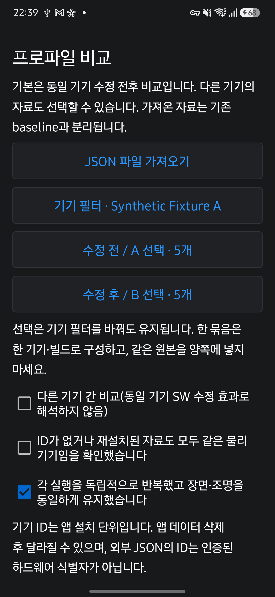
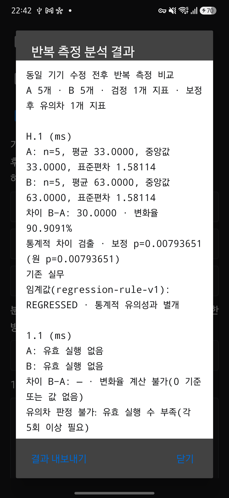

# 동일 기기 수정 전후 프로파일 비교

RESULTS에서 **반복 측정 비교 · JSON 가져오기**를 엽니다. 같은 물리 기기의 수정 전 실행을 A, 수정 후 실행을 B로 선택합니다. Exynos 기기의 SW/HAL 수정 전후 분석이 우선 목적이며, 모델 이름이나 S25+ 점수 calibration은 이 분석의 적용 조건이 아닙니다.

## 자료 선택

1. 로컬 기록을 선택하거나 시스템 문서 선택기로 benchmark JSON을 가져옵니다.
2. 모델 필터로 자료를 찾고 A와 B에 독립적으로 반복한 실행을 넣습니다. 각 묶음에는 하나의 기기·빌드·subject·profile·카메라 구성을 사용합니다.
3. 구형 파일이나 앱 재설치로 설치 ID가 없거나 달라졌다면 같은 물리 기기인지 직접 확인합니다. 모델과 카메라 ID만으로 같은 기기라고 판단하지 않습니다.
4. 장면·조명을 일정하게 유지하고 실행 간 독립성을 확인한 뒤 분석합니다. 그룹 사이의 빌드 변경은 허용합니다.
5. 결과를 텍스트로 내보냅니다. 앱을 다시 열면 선택을 복원하며, 최근 분석 결과도 다시 열 수 있습니다.

다른 기기의 자료를 선택하려면 **다른 기기 간 비교**를 켭니다. 계약·설정이 맞지 않아도 원시 지표를 열람할 수 있습니다. 같은 카메라 ID·역할도 같은 렌즈·화각을 보장하지 않으며 기기 간 차이를 SW 수정 효과로 해석할 수 없습니다.

## 통계 방법: run-permutation-v1

표본 하나는 JSON 한 개에 기록된 독립 실행의 `metrics[].value`입니다. 그 실행 안의 프레임·촬영 개수인 `metrics[].n`을 독립 반복 수로 늘려 세지 않습니다. 지표마다 A와 B의 유효 실행이 각각 5개 이상이어야 검정하며, 그룹별 선택은 최대 50개입니다.

- N, 평균, 중앙값, 표본 표준편차를 표시합니다. 표준편차의 분모는 N−1이며 N=1이면 계산하지 않습니다.
- 차이는 평균 B−A이며 변화율은 `(B−A)/A × 100`입니다. A=0이면 변화율을 계산하지 않습니다.
- 귀무가설 아래 그룹 라벨을 교환할 수 있다는 가정으로 `|평균 B−평균 A|`의 양측 순열검정을 합니다. 독립성·교환 가능성이 필요하며 시간에 따른 드리프트나 장면 차이를 자동 제거하지 않습니다. 무작위 실행 순서나 환경 복원은 실험 설계에서 통제해야 합니다.
- 가능한 라벨 배치가 50,000개 이하면 모두 열거합니다. 그보다 많으면 Java `Random` seed `680069`로 19,999회 균일 추출하고 `(극단값 횟수+1)/(19,999+1)`을 사용합니다. 극단값은 관측 통계량 이상인 경우이며, 0–1 정규화 뒤 1e−12의 수치 오차 허용값을 적용합니다. 그룹 안의 값을 정렬하므로 파일 선택 순서에 따라 결과가 바뀌지 않습니다.
- 그 비교에서 실제 검정한 지표 수 K로 Bonferroni 보정 `min(1, p×K)`을 적용합니다. 보정 p가 0.05 미만일 때 차이를 검출했다고 표시합니다. 반복해서 다른 부분집합을 시험하는 분석 전체의 다중성까지 보정하지는 않습니다.

통계적 차이와 `regression-rule-v1`의 기존 실무 임계값은 별도로 표시합니다. 표본 부족, 비교 부적격, 유의차 미검출은 서로 다른 상태이며 유의차 미검출이 동등성의 증거는 아닙니다. 신뢰구간·검정력 분석·자동 표본 수 계산은 제공하지 않습니다. 결과는 SW 변경에 따른 인과 효과를 자동 입증하지 않습니다.

최소 5회는 충분한 검정력을 보장하지 않습니다. 예를 들어 각각 5회로 20개 지표를 모두 정확 검정하면, 가장 극단적인 차이의 보정 p도 `20 × 2 / 252 ≈ 0.1587`이므로 0.05에 도달하지 못합니다. 충분한 반복 수를 계획해야 합니다.

순열검정과 무작위 추출 시 보수적 p 계산의 참고 자료는 [SciPy permutation_test 문서](https://docs.scipy.org/doc/scipy/reference/generated/scipy.stats.permutation_test.html)이며, 다중 비교 보정은 [NIST Bonferroni 설명](https://www.itl.nist.gov/div898/handbook/prc/section4/prc47.htm)을 참고합니다. 이 구현의 양측 정의는 위 절댓값 통계량 기준으로 고정합니다.

## 비교 제한과 추적

중단·부적격 실행, 지원하지 않는 측정·유효성 규칙, 높은 발열 단계, 절전 모드, 없는 값·잘못된 값·타임아웃·중복 지표는 제외 사유를 표시합니다. 계약·profile·카메라·실제 설정의 불일치, 필수 환경 정보 누락, 충전·절전 조건 차이는 검정을 제한합니다. 3A 지표는 노출 부하가 없거나 최대/최소 비율이 4를 넘으면 검정하지 않습니다. 기록된 값이 유한한 0–10¹² 범위를 벗어나면 가져오기 또는 분석에서 거부합니다.

같은 원본 해시가 여러 번 선택되거나 전후에 겹치면 검정하지 않습니다. 설치 ID·모델·run ID가 같은 다른 파일도 사본 또는 충돌로 다룹니다. 설치 ID가 없는 같은 모델의 동일 run ID는 보수적으로 충돌로 취급하며, 원문 보관과 열람은 허용합니다.

새 실행의 `raw.device_instance_id`는 앱 설치 단위 UUID입니다. 앱 업데이트 후 유지되며 앱 데이터 삭제 시 달라집니다. 선택적 raw 정보이므로 schema 4를 유지하고 schema 3·4를 읽습니다. 외부 JSON의 ID는 인증된 하드웨어 식별자가 아닙니다.

선택은 출처와 SHA-256으로 저장합니다. 원본이 변경·삭제되면 해당 선택을 제거하고 확인 조건을 초기화합니다. 결과 텍스트에는 A/B 소속, 원래 run ID, 원본 해시, 기기·빌드·설정·환경, 적용한 방법과 제외 사유를 기록합니다. 최근 결과 파일은 다음 분석 시 대체되므로 필요한 결과는 내보내어 보관합니다.

## 가져오기 저장소

`ProfileLibrary.parse`는 JSON 객체, schema 3·4, kind, 측정 계약 일치, canonical profile, 기기·앱·카메라·환경·지표 필드를 검사합니다. 파일 크기는 16 MiB, 중첩 깊이는 64, 지표 수는 100, 보관 파일 수는 200, 한 번의 파일 선택은 50개까지입니다. UTF-8을 엄격하게 읽으며 JSON 뒤의 추가 데이터도 거부합니다.

검증을 마친 원문만 `files/profile-imports/<sha256>.json`에 원자적으로 씁니다. 같은 바이트는 중복으로 알리고, run ID가 같아도 다른 바이트는 별도로 보관합니다. 원래 run ID나 제공자 파일명을 경로로 사용하지 않습니다. 다중 가져오기는 파일별로 처리하므로 정상 파일은 저장하고 실패 파일은 이유를 표시합니다. 취소하거나 한 파일이 실패해도 기존 자료를 덮어쓰지 않습니다.

가져온 자료는 `BenchmarkStore`, baseline 인덱스, 자동 reference 선택에 들어가지 않습니다. 저장된 점수·비교 판정을 분석 근거로 사용하지 않고, 유효성 flag와 기록된 환경을 다시 검사합니다. 가져온 사본 삭제는 원본 제공자의 파일과 로컬 실행을 삭제하지 않습니다.

구현을 확인하려면 `ProfileComparisonTest`, `RepeatStatisticsTest`, `ProfileArchiveTest`와 실제 Android JSON·파일 경계를 검사하는 `ProfileImportChecks`를 읽으세요. 합성 시험 자료는 실제 HAL 개선 결과를 뜻하지 않습니다.

## 검증 기록 (2026-09-14)

구현 커밋 `9f18bb8`에서 JVM 테스트 307개, `lintDebug`, debug·release APK 빌드를 통과했습니다. 문서 파이프라인 회귀 검사는 85개를 통과했으며 장시간 전송·실제 Qwen 호출 검사 4개는 기본 설정대로 제외했습니다. 최신성·생성 일치·디자인 검사도 통과했습니다.

S25+ SM-S936N(Android 16)에 기존 서명을 유지한 release APK를 설치했습니다. 실제 Android JSON·파일 경계 검사 24개를 통과했고 다음 화면 동작을 확인했습니다.

- 시스템 문서 선택기로 합성 JSON 12개를 선택했으며 정상 파일 11개는 가져오고 잘못된 파일 1개는 이유를 표시했습니다.
- 합성 A/B 5개씩 선택한 H.1은 평균 33/63 ms, 표준편차 각각 1.58114, 평균 차이 30 ms, 보정 p=0.00793651로 표시됐습니다. 없는 지표는 표본 부족으로 판정을 보류했습니다.
- 앱 업데이트 후 A/B 선택·필터·확인 조건을 복원했고, 파일 선택 취소 시 기존 선택을 유지했습니다. 텍스트 공유 선택기가 열리는 것을 확인했으며 수신자에게 보내지는 않았습니다.
- 다른 기기 필터와 원래 run ID·설치 ID·원시 지표 열람을 확인했습니다. 외부 사본의 UI 삭제와 보존된 로컬 이력 57개를 확인했습니다.
- 검증 후 가져온 합성 사본 11개와 합성 분석 결과를 정리했습니다. 해시로 식별한 시험 자료만 삭제했으며 실제 측정 기록은 유지했습니다.

아래 화면은 **합성 시험 자료**입니다. S25+나 Exynos의 실제 HAL 성능 변화 또는 개선을 입증하지 않습니다. 실제 Exynos 수정 전후의 효과 검증은 해당 기기와 빌드가 준비된 뒤 수행합니다.

