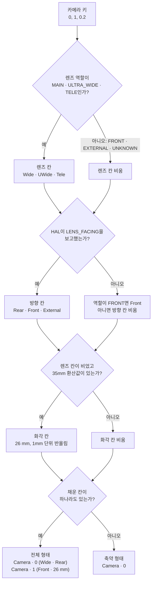
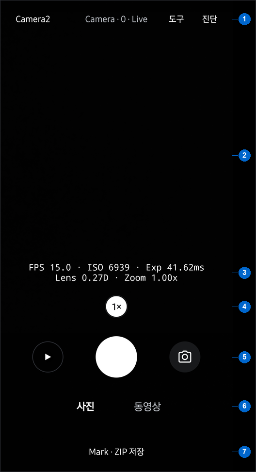
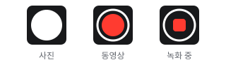
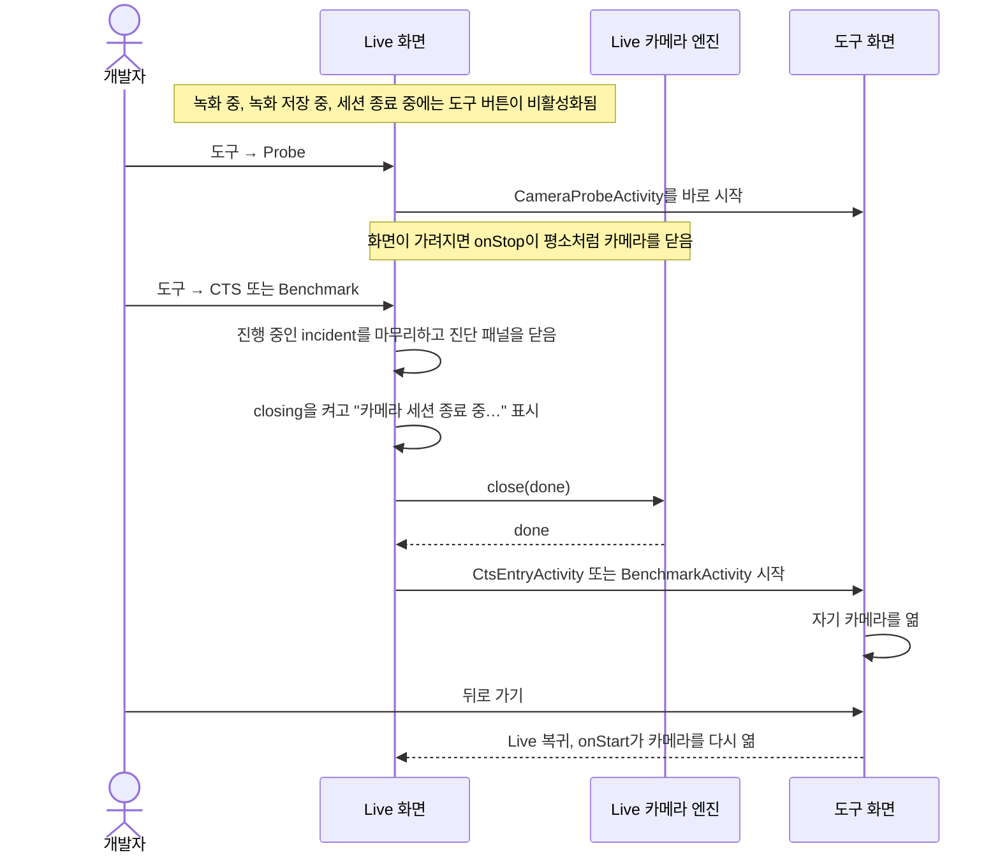
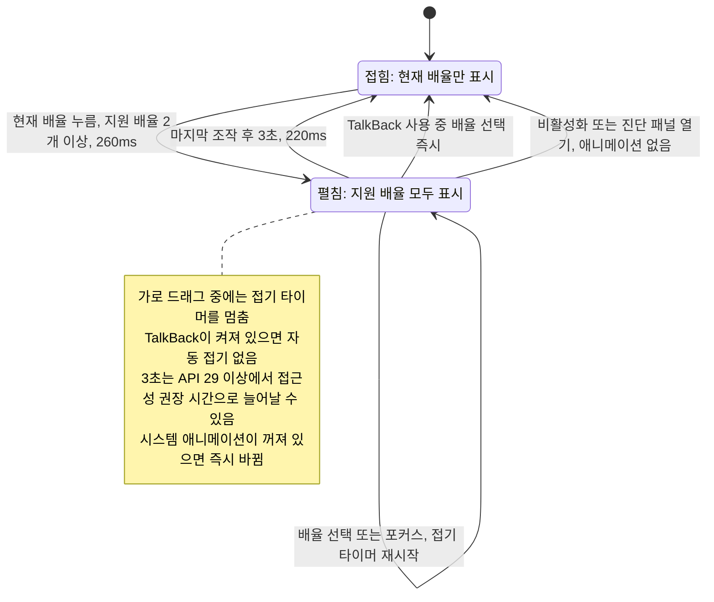

# HAL CAM 앱 UI·UX

**앱과 문서 사이트는 HAL-CAMERA-Editorial을 공통 디자인 기준으로 사용합니다.** 촬영 배치는 삼성 카메라를, 간결한 조작은 애플 카메라를 참고합니다. 개발자가 프리뷰와 현재 설정을 보면서 촬영하고, 같은 화면에서 관측값을 읽거나 벤치마크를 시작할 수 있도록 만듭니다.

색상·글꼴·선·모서리의 공통 기준은 [DESIGN.md](DESIGN.md)에서 관리합니다. 이 문서는 그 기준을 적용한 Android 앱의 배치와 조작을 설명합니다.

## 참고 방향과 우선순위

삼성 카메라의 시각 기준은 사용자의 Galaxy S25+에서 직접 실행해 확인한 기본 카메라 앱입니다. 검은 프리뷰 배경, 하단 중앙의 흰 원형 셔터, 양옆의 원형 보조 버튼과 하단 촬영 조작 영역을 참고합니다. 삼성의 공식 안내도 하단 조작부와 펼쳐지는 설정을 설명합니다. [Galaxy S25 카메라 조작부 안내](https://www.samsung.com/in/support/mobile-devices/changes-in-camera-controls-layout-on-galaxy-s25/)

애플 카메라에서는 현재 모드를 확인하고 구도를 조절한 뒤 셔터를 누르는 순서를 참고합니다. 모드 선택, 프레임 하단의 줌 조작, 별도의 셔터 실행은 Apple의 기본 사용 안내에서 확인할 수 있습니다. [iPhone 카메라 기본 사항](https://support.apple.com/guide/iphone/camera-basics-iph263472f78/ios)

아래의 API 토글, 카메라 선택 목록, 직접 모드·줌 선택은 사용자가 지정한 HAL CAM의 규칙입니다. 참고 앱의 모양이나 제스처와 차이가 생기면 이 규칙을 우선합니다. 전후면 즉시 전환은 제공하지 않습니다.

## 공통 Editorial 스타일의 적용

흑백 기반, 얇은 선, 절제된 파란 강조와 시스템 산세리프를 앱과 문서에 함께 적용합니다. Android의 공용 값은 `ui/Look`에 모으며, 어두운 화면의 배경은 `#18191b`, 보조 표면은 `#202124`, 구분선은 `#303238`로 매핑합니다. 일반 버튼과 상세 영역은 4dp 모서리를 사용합니다.

카메라의 원형 셔터·썸네일·줌은 조작 의미를 보존하는 예외입니다. 줌 선택은 흰 원과 검은 글씨로 표현합니다. 프리뷰 상단과 하단에만 은은한 그라데이션을 적용합니다. 하단 촬영 조작부와 Mark 행은 하나의 연속된 그라데이션을 공유합니다. 글자 그림자와 녹화·오류·그래프의 의미 있는 색상은 유지합니다. 앱의 터치 영역은 48dp 이상이며, 움직임은 시스템 애니메이션 설정을 따릅니다. Ollama 테마는 사용하지 않습니다.

## 아이콘과 글씨의 기준

동작이 익숙하고 의미가 명확한 뒤로 가기·닫기·일시정지·재개·갤러리·정보·공유·삭제·이전·다음·재생·확대는 아이콘으로 표시합니다. 공통 `IconButton`은 24dp의 둥근 선 아이콘과 48dp 이상의 터치 영역을 사용합니다. 각 버튼에는 한국어 접근성 이름과 길게 눌렀을 때 보이는 설명을 제공합니다.

현재 값을 읽어야 하는 API·카메라 ID·촬영 모드·줌·필터와, 작업의 의미를 알려야 하는 `선택`·`Mark`·`도구`·`Probe`·`CTS`·`Benchmark`·`진단`은 글씨를 유지합니다. 새 동작도 아이콘만으로 의미가 모호하면 글씨를 사용합니다. 표시 개수를 줄이더라도 현재 값, 동작, 선택 상태는 확인할 수 있어야 합니다.

Live 아래의 모든 화면은 화면 제목 왼쪽에 48dp 뒤로 가기 아이콘을 둡니다. 갤러리·Probe·CTS·벤치마크·실행 이력이 같은 자리와 같은 기호를 쓰므로 빠져나가는 버튼을 화면마다 다시 찾지 않아도 됩니다. 공통 제목 줄은 `Look.titleBar`가 만듭니다. 벤치마크 실행 중에는 이 아이콘을 표시하지 않고 `중단`으로만 멈춥니다. 실행·비교·내보내기와 필터의 구체적인 작업 이름은 글씨를 유지합니다.

## 카메라를 부르는 이름

화면마다 카메라를 다르게 불러서는 안 됩니다. 같은 카메라를 LIVE는 `후면 · 0`, BENCHMARK는 `Rear main · ID 0`, PROBE는 `후면 · MAIN · FULL`, CTS는 `ID 0`으로 적던 상태에서는 같은 기기의 같은 렌즈인지 읽는 사람이 매번 다시 확인해야 했습니다. 이제 다음 두 가지 형태만 사용합니다.

| 형태 | 표기 | 사용하는 자리 |
| --- | --- | --- |
| 전체 | `Camera · 0 (Wide · Rear)`, `Camera · 2 (UWide · Rear)` | 줄을 다 쓸 수 있는 자리. 카메라 선택 버튼과 선택 목록, 카메라 필터가 `Camera · 전체`일 때의 실행 기록 행, PROBE의 카메라 머리글, BENCHMARK의 시작·결과 제목 줄입니다. |
| 축약 | `Camera · 0`, `Camera · 2` | 칸이 좁은 자리. LIVE 상단의 한 줄 상태 표시, CTS 진행 줄과 보고서 줄, 실행 기록 필터 버튼입니다. |

괄호 안은 `렌즈 · 방향 · 화각`입니다. 렌즈는 35mm 환산 초점 거리로 추론한 `Wide`·`UWide`·`Tele`이고, 방향은 `Rear`·`Front`·`External`입니다. 전면과 외부 카메라는 렌즈를 추론하지 않으므로 방향만 적고, 대신 HAL이 보고한 35mm 환산 초점 거리를 1mm 단위로 반올림해 `Camera · 1 (Front · 26 mm)`처럼 덧붙입니다. 렌즈 이름이 붙은 카메라에는 화각을 적지 않습니다. 이름이 이미 렌즈를 지목하므로 수치는 군더더기이기 때문입니다. 셋 다 알 수 없으면 괄호를 생략하고 축약 형태로 되돌립니다. 논리 카메라 뒤의 물리 카메라는 `Camera · 0.2 (UWide · Rear)`처럼 점으로 이은 키를 사용합니다.

괄호 안의 세 칸은 아래 순서로 채웁니다. 이 절과 아래 두 절의 그림은 `.omm/ui-*/diagram.mmd`를 그대로 옮긴 사본입니다. 코드가 바뀌어 `.omm` 그림을 고치면 이 사본도 함께 고쳐야 하며, 두 그림이 다르면 `npm test --prefix tools/docgen`이 실패합니다. 방향 칸은 HAL이 보고한 `LENS_FACING` 값을 먼저 따르며, 값이 없을 때 역할이 `FRONT`인 카메라만 `Front`로 적습니다. 역할이 `EXTERNAL`이어도 보고값이 없으면 방향을 적지 않습니다. 열거 과정이 `LENS_FACING`을 읽지 못한 카메라에도 `EXTERNAL`을 붙이기 때문입니다.

<!-- omm-copy: ui-camera-label -->

화각을 덧붙이는 이유는 전면 카메라가 목록에서 id 말고는 구별되지 않았기 때문입니다. Galaxy S25+의 `Camera · 1`과 `Camera · 3`은 초점 거리 3.3mm인 전면 렌즈 하나를 센서 크롭만 달리해 노출한 것이고(35mm 환산 약 26mm와 30mm), 전면에 렌즈 추론을 적용해도 두 값이 모두 `Wide` 구간(20–35mm)에 들어가 구분되지 않습니다. 그래서 렌즈 이름을 새로 지어내는 대신 HAL이 보고한 수치를 그대로 적어 `Camera · 1 (Front · 26 mm)`과 `Camera · 3 (Front · 30 mm)`으로 갈라 둡니다. 이름이 아니라 보고값이므로 앱이 판단을 보태지 않는다는 원칙도 지켜집니다. 같은 규칙이 후면에도 적용됩니다. `LensRoles.dedupeMain`이 두 번째 `Wide` 후보를 `UNKNOWN`으로 내리면 그 카메라도 이름을 잃으므로 화각을 받습니다. 반올림하지 않은 값은 PROBE의 `35mm equivalent` 행에 그대로 남습니다.

가운뎃점으로 이어 붙인 제목 줄에서는 축약 형태를 쓰지 않습니다. `Galaxy S25+ · Camera · 0 · camera2-standard-v1`처럼 구분자가 겹쳐 어디까지가 카메라 이름인지 읽히지 않기 때문입니다. 그런 자리에는 괄호가 경계를 만들어 주는 전체 형태를 씁니다.

표기를 만드는 곳은 `camera/CameraEndpoint.kt`의 `CameraLabel` 하나이며, 화면에서 직접 문자열을 조립하지 않습니다. `CameraLabelTest`가 위의 표기를 고정합니다. CTS 케이스의 판정 문구에 들어 있는 `Camera 0 does not support ...` 같은 문장은 AOSP `CameraTestUtils`의 원문이므로 이 규칙을 적용하지 않고 그대로 둡니다. `--camera 0`처럼 CLI 인자와 JSON에 들어가는 값도 표기가 아니라 식별자이므로 그대로 둡니다.

## Live 화면의 배치

| 영역 | 구성과 목적 |
| --- | --- |
| 상단 | 현재 API, `도구`, `진단`을 배경·테두리 없는 글자로 표시합니다. API 버튼을 누를 때마다 Camera2↔CameraX로 전환하며, 메뉴 사이에 `Camera · 0 · Live`처럼 카메라 이름과 상태를 표시합니다. |
| 프리뷰 | 검은 배경 위에 카메라 영상을 최대한 넓게 표시합니다. 조작에 필요한 글자와 버튼의 대비는 유지하며, 영상을 가리는 타일과 상시 그래프는 줄입니다. |
| 하단 측정 영역 | 별도 타일 없이 FPS·ISO·노출·초점·적용 줌을 2줄로 얇게 표시합니다. 프레임 간격 그래프와 Partial·Buffer 관측값은 `진단` 패널에서 제공합니다. |
| 하단 촬영 영역 | 지원하는 줌 배율, 셔터 행, 사진·동영상 모드의 순서로 배치합니다. 셔터 행은 왼쪽 최근 촬영물 썸네일, 중앙 셔터, 오른쪽 카메라 선택으로 구성합니다. |
| 고정 작업 행 | `Mark · ZIP 저장`을 항상 표시합니다. 버튼과 작업 행 자체의 배경은 투명합니다. 촬영 조작부와 Mark 행이 하나의 은은한 그라데이션을 공유해 색 경계 없이 이어지며 Mark 글씨에는 그림자를 적용합니다. 진단 패널을 스크롤해도 위치를 유지합니다. |
| 진단 패널 | 작업 행 위 가용 높이의 60%를 사용하여 상단 프리뷰를 유지합니다. 촬영 조작은 패널을 닫으면 복원됩니다. 카메라 선택·일시정지와 프레임 간격 그래프를 먼저 표시하고, 상세 수치와 ADB CLI 설정은 펼쳐 봅니다. 3A·콜백 그래프, incident 공유·기록 목록, 측정 안내도 제공합니다. |

Galaxy S25+(SM-S936N, Android 16)에서 0.13.1 빌드의 사진 모드를 캡처했습니다. 개인 알림이 보이는 상태 표시줄은 잘라냈고, 카메라 앞이 어두워 프리뷰가 검게 나왔습니다. 번호는 표의 영역을 위에서부터 나눈 것입니다.

1. 상단 막대: API 버튼, 카메라 이름과 상태, `도구`, `진단`
2. 프리뷰
3. 하단 측정 영역: FPS·ISO·노출과 초점·적용 줌의 두 줄
4. 줌
5. 셔터 행: 최근 촬영물 썸네일, 셔터, 카메라 선택
6. 사진·동영상 모드
7. 고정 작업 행: `Mark · ZIP 저장`

진단 패널은 닫은 상태입니다. 셔터의 세 가지 상태는 녹화 파일을 남기지 않도록 캡처하지 않고 그렸습니다.

사진 셔터는 흰 원으로 표시합니다. 동영상 모드에서는 흰 테두리 안의 빨간 원으로, 녹화 중에는 빨간 정지 사각형으로 표시합니다. 양옆 보조 버튼과 셔터의 중심선을 맞춥니다. 갤러리 버튼에는 최근 촬영물의 원형 썸네일을 표시하며, 항목이 없거나 불러오지 못하면 갤러리 아이콘을 사용합니다. 카메라 아이콘을 누르면 현재 ID가 선택된 목록을 엽니다. 진단 패널의 제목은 `진단`으로 표시하며 닫기 아이콘으로 닫습니다. 촬영 화면의 선택 색은 회색·흰색을 중심으로 사용하며 색상과 글꼴은 `ui/Look`의 공용 값을 사용합니다.

## 도구 메뉴와 독립 화면

Benchmark는 메인 프리뷰에 별도 버튼을 두지 않고 상단 `도구` 메뉴에서 엽니다. 메뉴는 `ui/SelectionPopup.kt`의 `showActionPopup` 목록으로 `Probe`·`CTS`·`Benchmark`를 표시합니다. 값을 고르는 목록이 아니라 이동할 곳의 목록이므로 라디오 버튼을 붙이지 않습니다. 각 기능은 독립 화면(`CameraProbeActivity`, `CtsEntryActivity`, `BenchmarkActivity`)을 엽니다. Probe와 Benchmark는 현재 카메라 ID를 초기값으로 받으며 자체 카메라 선택을 제공합니다. CTS는 커스텀 케이스와 AOSP 원문 중 경로를 고른 뒤 체크리스트에서 실행할 항목을 선택합니다.

목록의 순서는 개발자가 하나의 질문에서 다음 질문으로 넘어가는 순서를 따릅니다. Probe는 HAL이 무엇을 할 수 있다고 선언하는지, CTS는 그 선언대로 통과하는지, Benchmark는 실제로 얼마나 걸리는지를 답합니다. 문서 사이트의 탭도 같은 순서를 사용하므로, 앱에서 본 차례와 문서에서 읽는 차례가 어긋나지 않습니다.

| 항목 | 역할 | 카메라 세션 |
| --- | --- | --- |
| `Probe` | Camera2 HAL이 공개한 `CameraCharacteristics` 사양 표 | 카메라를 열지 않습니다. 닫기 대기 없이 바로 엽니다 |
| `CTS` | 커스텀 케이스 또는 AOSP 원문 테스트를 선택해 순차 실행 | 실행 화면에서 자기 카메라를 엽니다 |
| `Benchmark` | 선택한 카메라의 반복 실행·비교·실행 기록 | 자기 카메라를 엽니다 |

`CTS`와 `Benchmark`는 자기 카메라를 열기 때문에 Live 세션을 닫고 `close(done)` 콜백을 받은 뒤에 화면을 엽니다. 이 대기 때문에 전환이 즉시 일어나지 않을 수 있으며, 그동안 메뉴를 다시 누를 수 없게 합니다. 녹화 중과 저장 중에는 `도구` 메뉴 전체를 비활성화합니다. `Probe`는 카메라를 열지 않으므로 닫기 완료를 기다리지 않고 바로 엽니다. 이때 Live 카메라는 화면이 가려질 때 평소처럼 닫히고 돌아오면 다시 열립니다.

<!-- omm-copy: ui-tool-handoff -->

세 화면은 상단에 화면 이름을 글씨로 표시하고 뒤로 가기 아이콘으로 Live에 복귀합니다. 세 화면은 서로를 직접 열지 않으며, 다른 도구로 옮길 때에는 Live의 `도구` 메뉴를 다시 사용합니다. `도구` 메뉴의 항목은 값을 고르는 것이 아니라 화면을 여는 것이므로 라디오 버튼 없이 이름만 표시합니다.

## 선택과 실행

현재 API 버튼을 누르면 다른 API로 전환합니다. 사진·동영상은 각각의 모드 이름을 한 번 눌러 선택합니다. 카메라 선택은 버튼에 붙는 목록을 열고 현재 값을 표시합니다. 벤치마크의 카메라 선택과 실행 기록 필터도 목록 방식을 유지합니다.

목록은 아래 공간이 부족하면 버튼 위에 열립니다. 바깥을 누르거나 뒤로 가면 값을 유지하고 닫으며, 화면을 나가면 목록도 닫습니다. 값 하나를 고르기 위해 중앙 대화상자나 별도 화면으로 이동하지 않습니다.

모드나 카메라를 선택하는 동작은 설정만 바꿉니다. 촬영과 녹화는 중앙 셔터를 눌러 실행합니다. 녹화 중에는 모드 위치에 경과 시간을 표시합니다. 엔진·카메라·줌·모드 변경과 일시정지·갤러리·`도구` 메뉴는 비활성화합니다. 정지 셔터를 누르면 `저장 중…`을 표시하고, 녹화 종료 처리 동안 셔터를 비활성화해 중복 정지를 막습니다. 앨범 저장 완료는 별도 알림으로 표시합니다.

## 줌과 접근성

줌은 현재 배율만 표시하다가 누르면 지원 배율로 펼쳐집니다. 선택 후 3초 동안 추가 조작이 없으면 선택한 배율을 유지한 채 접힙니다. 선택된 흰 원의 지름은 32dp이고 터치 영역은 48dp입니다. 펼침은 260ms, 접힘은 220ms 동안 폭과 투명도·크기가 부드럽게 바뀝니다. 좁은 창에서는 가로 스크롤을 제공하고, 드래그 중에는 자동 접기를 미룹니다. 시스템 접근성 시간 제한을 반영하며 TalkBack에서는 자동 접기 없이 선택을 기다린 뒤 접힙니다. 시스템 애니메이션 비활성화 설정도 따릅니다.

<!-- omm-copy: ui-zoom -->

바깥 레일은 높이 36dp이며 버튼을 펼쳐도 셔터와 측정값의 높이는 움직이지 않습니다. 현재 배율, 모드와 셔터의 실행 동작은 접근성 이름과 상태 설명으로도 전달합니다.

## 갤러리에서 확인과 정리

촬영 화면의 썸네일은 DCIM/HALCamera의 저장 완료 항목만 백그라운드에서 조회합니다. 사진·동영상 저장과 갤러리 복귀 시 갱신하며, 불완전한 저장 항목을 표시하지 않습니다. 촬영 화면을 나가면 변경 감시를 중단하고 뒤늦은 조회 결과를 반영하지 않습니다.

최근 항목이 동영상이면 썸네일 가운데에 재생 표시를 겹칩니다. 격자의 `▶ 0:53` 배지와 같은 주장이며, 48dp 원 안에는 재생 시간을 넣을 자리가 없어 표시만 남깁니다. 원형 버튼은 모서리가 잘리므로 격자와 달리 가운데에 둡니다. 반투명한 검은 판 위의 흰 표시라 밝은 썸네일과 어두운 썸네일에서 모두 읽힙니다.

HALCamera 앨범만 검은 배경의 정사각형 격자로 표시합니다. 화면 폭에 따라 3–6열을 사용하고 썸네일 간격은 2dp로 둡니다. 사진에는 YUV·JPEG 표시를, 동영상에는 재생 시간 표시를 붙입니다. 전체·사진·동영상 필터는 현재 값 버튼에 붙는 선택 목록으로 제공합니다.

상단 부제는 격자를 설명하므로 언제나 현재 필터가 남긴 항목만 셉니다. `전체`에서는 `사진 8장 · 동영상 6개`처럼 종류를 나누어 적고, 필터를 건 상태에서는 그 종류만 `동영상 6개`로 적습니다. 선택 모드도 같은 항목을 세며 `총 6개 · 동영상`으로 적습니다. 두 모드가 다른 목록을 세면 선택 모드에 들어가는 것만으로 개수가 달라져 보입니다.

사진은 앱 안에서 열고, 두 손가락·두 번 누르기·돋보기 아이콘으로 확대할 수 있게 합니다. 돋보기의 +·−와 접근성 설명은 실제 확대 상태에 맞춰 바뀝니다. 화면에 맞춘 크기에서는 좌우로 쓸어 넘길 수 있으며, 이전·다음 아이콘도 제공합니다. 동영상은 재생 아이콘을 눌러 시작합니다. 파일명·크기·해상도 등 상세 정보는 정보 아이콘을 펼쳤을 때 표시하며, 정보의 표시 여부와 아이콘의 선택 상태를 일치시킵니다. 앨범 필터와 스크롤 위치, 열어 둔 항목은 화면 복귀와 재생성 시 유지합니다.

`선택` 버튼이나 길게 누르기로 여러 항목을 고르고, 공유·삭제 아이콘으로 선택한 항목을 처리합니다. 공유에는 선택한 URI의 읽기 권한만 전달합니다. 삭제는 확인을 거치며 Android 11 이상에서는 시스템 삭제 확인을 사용합니다.

갤러리 상단은 16dp 좌우 여백을 사용하고 제목·버튼 사이를 12dp 띄웁니다. 사진 상세의 탐색 버튼 사이에는 16dp, 공유·삭제 사이에는 24dp 간격을 둡니다. 탐색과 공유·삭제 행의 터치 영역 사이에는 패딩과 행 간격을 합쳐 28dp 여백을 확보합니다. 터치 영역은 48dp 이상을 유지합니다. 선택 체크 표시는 24dp 크기로 썸네일 가장자리에서 8dp 안쪽에 둡니다.

선택 모드에서는 상단 제목에 선택 개수를 크게 표시하고, 전체 선택 체크박스로 현재 필터의 모든 항목을 고르거나 해제합니다. 화면 밖의 항목도 포함합니다. 개별 항목을 해제하면 전체 선택 상태와 개수가 즉시 바뀝니다. 필터를 바꾸거나 선택을 취소하면 기존 선택을 해제합니다. 항목이 없거나 삭제 확인이 진행 중일 때에는 전체 선택을 비활성화합니다. 삭제는 기존 시스템 확인을 거칩니다. 2,000개를 넘는 선택은 2,000개 이하로 나누어 순서대로 시스템 확인을 요청하며, 중간에 취소하면 남은 요청을 중단합니다.

## 개발 도구로서의 정보

Camera HAL 개발자의 반복 관측·재현·비교 작업을 우선합니다. Probe와 CTS의 첫 화면은 검사 출처와 결과 단위, 정적 사양 여부만 짧게 표시합니다. 공식 CTS 실행과의 구분, 중단 시 FAIL 처리, 측정 범위와 비교 조건은 해당 동작 가까이 유지합니다.

Benchmark 결과는 판정 한 줄을 먼저 표시하고, 그 아래에 측정한 모든 항목을 카테고리별 막대로 그립니다. 값과 기준을 나란히 읽는 것이 이 화면의 목적이므로 숫자 표를 접어 두지 않습니다. 두 run의 비교도 이 막대와 눈금 하나로 보여 주며, 별도의 변화율 차트나 `비교` 버튼은 두지 않습니다. 실행 정보는 `실행 정보` 접힘에 라벨과 값 한 쌍씩 두고 기준 run의 정보를 이어 적으며, validity flag는 저장된 코드가 아니라 뜻으로 적습니다. 결과를 PC로 옮기는 경로는 `내보내기` 하나로 유지하며 화면 텍스트를 클립보드로 복사하는 버튼은 두지 않습니다. 판정 문구와 화면 요소의 자세한 내용은 [Benchmark 가이드](../../guide/benchmark.md)에서 관리합니다.

실행 기록의 각 행은 실행 시각과 배지, 사실 한 줄의 두 줄로 적습니다. run id와 profile, 원본 flag는 행이 아니라 행이 여는 결과 화면에 둡니다. 카메라 필터로 카메라 하나를 고르면 행의 사실 줄에서 카메라 이름을 뺍니다. 모든 행에서 같은 글자가 반복되고, 그 글자 때문에 줄이 넘어가기 때문입니다. baseline 실행은 `Baseline` 제목 아래 맨 위에 두고 나머지는 `다른 실행 · N개` 아래에 둡니다. 개수는 목록 위의 별도 줄이 아니라 제목에 적습니다. `두 실행 비교`와 `목록 CSV 내보내기`는 한 줄에 나란히 둡니다. `두 실행 비교`로 눈금으로 둘 run과 비교할 run을 차례로 고르며, 먼저 고른 run을 테두리로 표시합니다. 화면에서는 `기준` 대신 `Baseline`·`선택한 run`·`이번 run`이라고 부릅니다. 각 행의 `⋮` 메뉴는 baseline 지정·비교·내보내기 등을 제공하고 길게 누르기도 유지합니다. 보관 한도는 `보관 개수` 슬라이더로 고르며, 눈금 간격을 일정하게 두어 같은 거리가 같은 변화를 뜻하게 합니다.

Live에서는 실제로 관측한 수치와 단위를 표시합니다. Mark는 직전 10초와 이후 5초를 incident ZIP으로 저장하는 작업이며, 사진 셔터와 구별합니다. 열려 있는 세션의 자세한 그래프와 incident 내보내기는 `진단` 패널에서, 사양 조회·CTS 실행·벤치마크는 `도구` 메뉴에서 독립 화면으로 엽니다. 어떤 항목을 어디에 둘지는 "현재 세션이 열려 있어야 의미가 있는가"로 판단합니다.

버튼의 현재 값, 요청한 줌, capture result에서 읽은 적용 줌의 의미를 유지합니다. 시각 구성을 바꾸더라도 측정 계약, 스트림 조건, 결과 비교 규칙은 변경하지 않습니다.

## 구현과 확인 범위

Live 배치는 `MainActivity.kt`, 셔터·줌·선택 목록은 `ui/ShutterButton.kt`·`ui/ExpandingZoomControl.kt`·`ui/SelectionPopup.kt`에서 관리합니다. 최근 촬영물은 `camera/RecentMediaThumbnail.kt`와 `ui/RecentMediaButton.kt`에서 조회·표시합니다. 공통 아이콘 동작은 `ui/IconButton.kt`, 갤러리는 `GalleryActivity.kt`와 `ui/GalleryImageView.kt`에서 관리합니다. 도구 메뉴는 `CameraProbeActivity.kt`, `cts/CtsEntryActivity.kt`, `benchmark/BenchmarkActivity.kt` 순서로 연결합니다. UI 변경을 검토할 때에는 프리뷰를 가리는 영역, 가독성, 터치 영역, 실제 상태와 아이콘의 일치, 접근성 설명을 확인합니다. 기기 관찰과 테스트 결과는 해당 변경의 검토 기록에 별도로 남깁니다.

카메라와 측정 데이터의 실행 흐름은 [아키텍처 가이드](../guide/architecture.md)에서 확인합니다.
