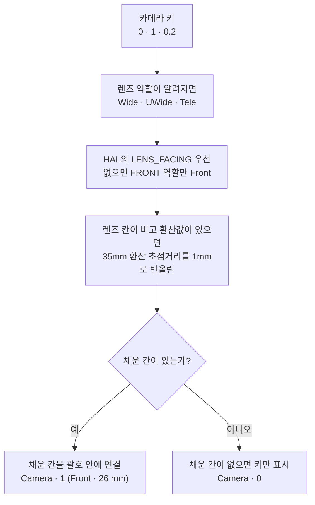
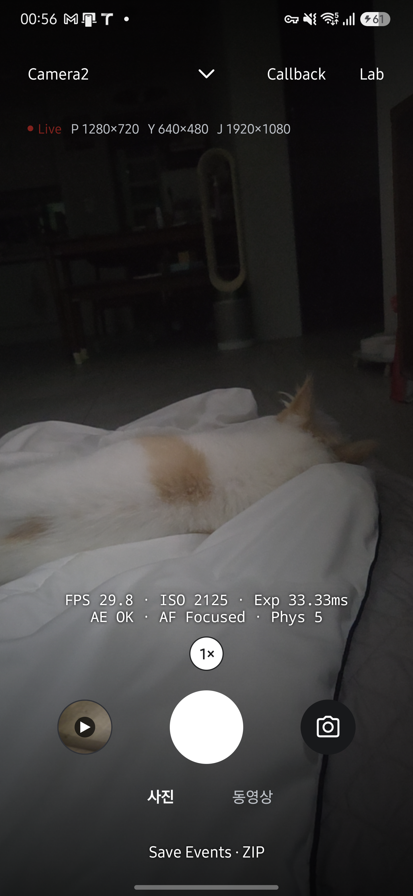
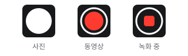
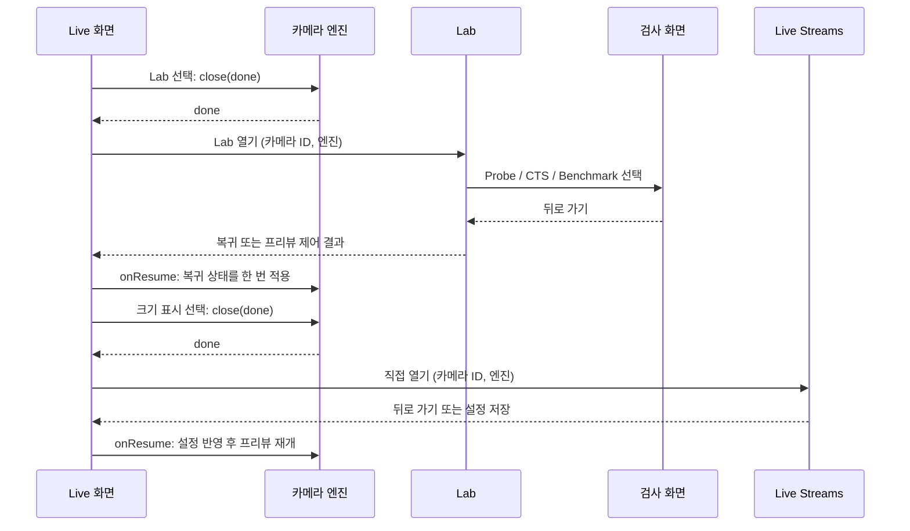
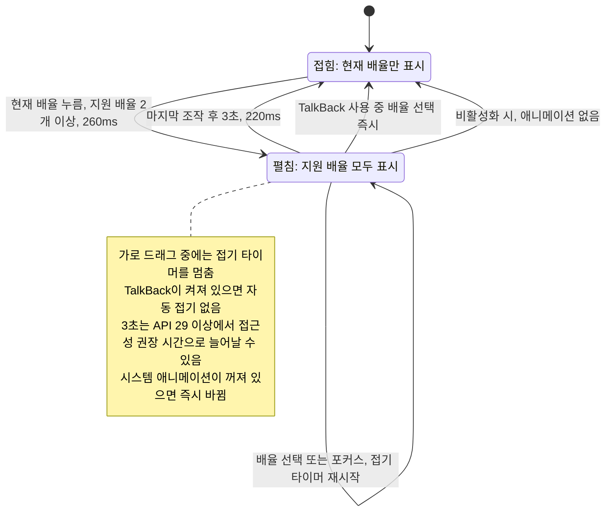
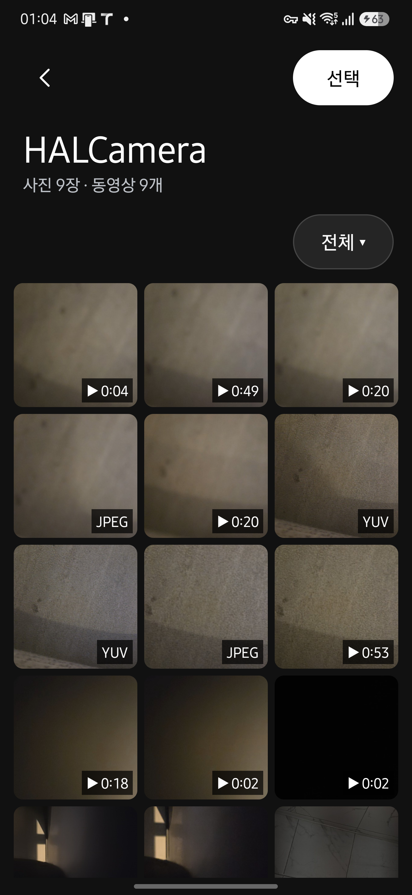
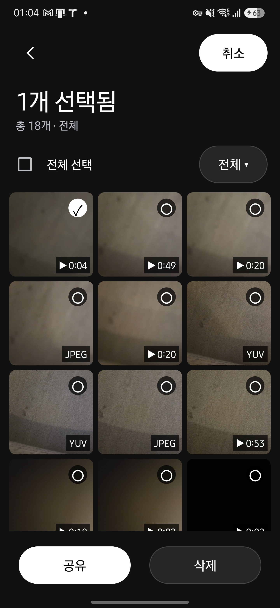
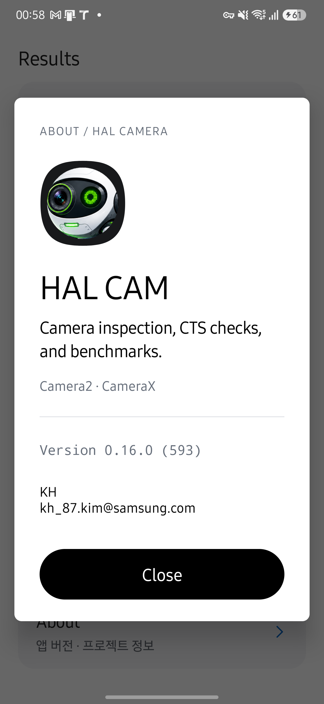
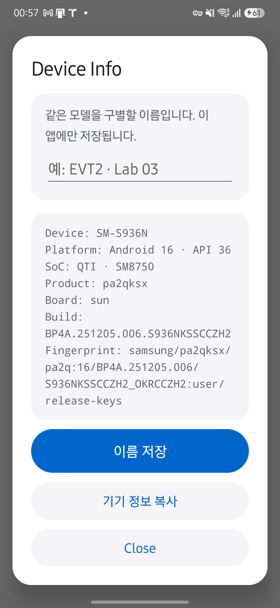

# HAL CAM 앱 UI·UX

**앱을 켜면 바로 Live 프리뷰가 나옵니다.** Exynos Camera HAL 개발자가 여러 시험 기기에서 같은 작업을 반복하는 흐름을 우선합니다. Live는 프리뷰와 촬영, 현재 세션의 관측을 담당하며 검사·결과·설정은 Lab 버튼으로 바로 엽니다. 앱과 문서 사이트는 HAL-CAMERA-Editorial을 공통 기준으로 사용하며, Lab과 연결 검사 화면은 사용자가 지정한 Apple 참고안의 밝은 화면 구성을 적용합니다.

색상·글꼴·선·모서리의 공통 기준은 [DESIGN.md](DESIGN.md)에서 관리합니다. 이 문서는 그 기준을 적용한 Android 앱의 배치와 조작을 설명합니다.

## Live 수동 촬영

제목·탭·버튼·모드 이름은 영어로 표기하고, 사용 안내·제약·오류 설명은 한글로 씁니다. 예를 들어 `Manual`, `Shutter`, `Focus`, `Reset`, `Hide`를 사용합니다. 긴 영어 탭은 필요한 너비를 배분해 단어가 중간에서 줄바꿈되지 않도록 합니다.

상단 촬영 제어의 `M`은 셔터 위의 Manual 패널을 엽니다. 패널을 열 때 상단 제어 행은 접고, 기존 줌·셔터·갤러리의 위치는 유지합니다. ISO·Shutter·Focus·WB 중 선택한 항목만 조절합니다. 기본 편집 화면은 스크롤 없이 표시하며 글자 크기를 키워 공간이 부족한 경우에만 편집 영역을 제한합니다. 글자를 말줄임으로 숨기지 않습니다.

입력 숫자가 요청값을 담당하고 패널 아래에는 실제값만 표시합니다. 패널에서 표시하는 ISO 또는 노출 시간은 하단 측정줄에서 제외하고 패널을 접으면 복원합니다. 값 조절은 슬라이더와 직접 입력으로 한정하고, 패널을 펼친 상태에서는 제목에 접기 동작을 중복 배치하지 않습니다. WB gains와 행렬의 세부 설명·실제값은 고급 편집창에 모읍니다.

노출의 Auto/Manual은 ISO와 셔터에 함께 적용하고 초점과 WB는 독립적으로 선택합니다. 파란 숫자는 직접 입력, 슬라이더는 프리뷰를 보며 조절하는 용도입니다. 잘못된 숫자는 입력창을 닫지 않고 설명합니다. `Hide`와 시스템 뒤로 가기는 수동 값을 유지하고, 접힌 패널에는 현재 요청을 표시합니다. `Reset`은 노출·초점·WB를 초기화합니다.

카메라·엔진·스트림 전환은 수동 설정을 초기화합니다. 녹화와 사진에도 설정을 유지하되 FPS 제한이 바뀌어 노출을 줄여야 하면 안내합니다. CameraX에서는 지원하지 않는 이유와 기존 상단 엔진 버튼의 위치를 안내합니다. CLI가 카메라를 제어하거나 종료·저장이 진행 중이면 입력을 막습니다.

## Lab과 기기 식별

Live의 `Lab`에서 기기 모델과 Android 정보를 확인하고, 기기 행을 눌러 SoC와 OS 빌드 등 상세 정보를 엽니다. Lab 자체는 카메라를 열거나 촬영 권한을 요구하지 않습니다. SoC는 기기가 보고한 값을 사용하며 Exynos로 가정하지 않습니다. API 31 미만에서는 `Build.HARDWARE`를 표시합니다.

1. `Device Info`에서 같은 모델의 시험 기기를 구별할 별칭을 저장합니다. 별칭은 앱 로컬 설정이며 측정 빌드 라벨이나 보고서의 기기 계약을 바꾸지 않습니다.
2. 촬영과 실시간 관측은 상단 `Live` 링크로 돌아갑니다.
3. `Probe`, `CTS`, `Benchmark`에서 검사 목적을 선택합니다.
4. 저장된 실행의 비교·내보내기는 `Run History`, 촬영물 확인은 `Gallery`로 이동합니다.

기기 이름과 모델은 Lab 기기 행에 표시하며 하위 화면 제목 아래에서 반복하지 않습니다. 기기 정보 대화상자는 OS 빌드와 fingerprint 복사를 제공하며 하드웨어 serial을 읽지 않습니다. Lab은 실제 창 너비를 기준으로 본문 폭을 최대 680dp로 제한하고 긴 내용은 세로로 스크롤합니다. 시스템 표시줄과 디스플레이 컷아웃은 인셋으로 피합니다.

## 참고 방향과 우선순위

삼성 카메라의 시각 기준은 사용자의 Galaxy S25+에서 직접 실행해 확인한 기본 카메라 앱입니다. 검은 프리뷰 배경, 하단 중앙의 흰 원형 셔터, 양옆의 원형 보조 버튼과 하단 촬영 조작 영역을 참고합니다. 삼성의 공식 안내도 하단 조작부와 펼쳐지는 설정을 설명합니다. [Galaxy S25 카메라 조작부 안내](https://www.samsung.com/in/support/mobile-devices/changes-in-camera-controls-layout-on-galaxy-s25/)

애플 카메라에서는 현재 모드를 확인하고 구도를 조절한 뒤 셔터를 누르는 순서를 참고합니다. 모드 선택, 프레임 하단의 줌 조작, 별도의 셔터 실행은 Apple의 기본 사용 안내에서 확인할 수 있습니다. [iPhone 카메라 기본 사항](https://support.apple.com/guide/iphone/camera-basics-iph263472f78/ios)

아래의 API 토글, 카메라 선택 목록, 직접 모드·줌 선택은 사용자가 지정한 HAL CAM의 규칙입니다. 참고 앱의 모양이나 제스처와 차이가 생기면 이 규칙을 우선합니다. 전후면 즉시 전환은 제공하지 않습니다.

## 공통 Editorial 스타일의 적용

흑백 기반, 얇은 선, 절제된 파란 강조와 시스템 산세리프를 앱과 문서에 함께 적용합니다. Android의 공용 값은 `ui/Look`에 모으며, 어두운 화면의 배경은 `#18191b`, 보조 표면은 `#202124`, 구분선은 `#303238`로 매핑합니다. Live와 Gallery는 기존 어두운 표면을 유지합니다. Lab 연결 화면은 아래 Apple 매핑의 18dp 그룹과 캡슐 버튼을 사용합니다.

카메라의 원형 셔터·썸네일·줌은 조작 의미를 보존하는 예외입니다. 줌 선택은 흰 원과 검은 글씨로 표현합니다. 프리뷰 상단과 하단에만 은은한 그라데이션을 적용합니다. 하단 촬영 조작부와 이벤트 저장 행은 하나의 연속된 그라데이션을 공유합니다. 글자 그림자와 녹화·오류·그래프의 의미 있는 색상은 유지합니다. 앱의 터치 영역은 48dp 이상이며, 움직임은 시스템 애니메이션 설정을 따릅니다. Ollama 테마는 사용하지 않습니다.

## 아이콘과 글씨의 기준

동작이 익숙하고 의미가 명확한 뒤로 가기·닫기·갤러리·정보·공유·삭제·이전·다음·재생·확대는 아이콘으로 표시합니다. 공통 `IconButton`은 24dp의 둥근 선 아이콘과 48dp 이상의 터치 영역을 사용합니다. 각 버튼에는 접근성 이름과 길게 눌렀을 때 보이는 설명을 제공합니다. Live의 촬영·녹화 조작과 이벤트 저장은 영어로 표시하며, 다른 화면은 각 화면의 언어 규칙을 따릅니다.

현재 값을 읽어야 하는 API·카메라 ID·촬영 모드·줌·필터와, 작업의 의미를 알려야 하는 `선택`·`Save Events · ZIP`·`Lab`·`Probe`·`CTS`·`Benchmark`·`Callback`은 글씨를 유지합니다. 새 동작도 아이콘만으로 의미가 모호하면 글씨를 사용합니다. 표시 개수를 줄이더라도 현재 값, 동작, 선택 상태는 확인할 수 있어야 합니다.

Lab 연결 화면은 제목 위에 Back 링크를 두고 공통 제목 줄은 `Look.titleBar`로 만듭니다. 갤러리는 기존 뒤로 가기 아이콘을 유지합니다. 벤치마크 실행 중에는 Back을 표시하지 않고 `Stop`으로 멈춥니다. 실행·비교·내보내기와 필터의 구체적인 작업 이름은 글씨를 유지합니다.

## 카메라를 부르는 이름

화면마다 카메라를 다르게 불러서는 안 됩니다. 같은 카메라를 LIVE는 `후면 · 0`, BENCHMARK는 `Rear main · ID 0`, PROBE는 `후면 · MAIN · FULL`, CTS는 `ID 0`으로 적던 상태에서는 같은 기기의 같은 렌즈인지 읽는 사람이 매번 다시 확인해야 했습니다. 이제 다음 두 가지 형태만 사용합니다.

| 형태 | 표기 | 사용하는 자리 |
| --- | --- | --- |
| 전체 | `Camera · 0 (Wide · Rear)`, `Camera · 2 (UWide · Rear)` | 줄을 다 쓸 수 있는 자리. 카메라 선택 버튼과 선택 목록, 카메라 필터가 `Camera · 전체`일 때의 실행 기록 행, PROBE의 카메라 머리글, BENCHMARK의 시작·결과 제목 줄입니다. |
| 축약 | `Camera · 0`, `Camera · 2` | 칸이 좁은 자리. CTS 진행 줄과 보고서 줄, 실행 기록 필터 버튼입니다. |

괄호 안은 `렌즈 · 방향 · 화각`입니다. 렌즈는 35mm 환산 초점 거리로 추론한 `Wide`·`UWide`·`Tele`이고, 방향은 `Rear`·`Front`·`External`입니다. 전면과 외부 카메라는 렌즈를 추론하지 않으므로 방향만 적고, 대신 HAL이 보고한 35mm 환산 초점 거리를 1mm 단위로 반올림해 `Camera · 1 (Front · 26 mm)`처럼 덧붙입니다. 렌즈 이름이 붙은 카메라에는 화각을 적지 않습니다. 이름이 이미 렌즈를 지목하므로 수치는 군더더기이기 때문입니다. 셋 다 알 수 없으면 괄호를 생략하고 축약 형태로 되돌립니다. 논리 카메라 뒤의 물리 카메라는 `Camera · 0.2 (UWide · Rear)`처럼 점으로 이은 키를 사용합니다.

괄호 안의 세 칸은 아래 순서로 채웁니다. 이 절과 아래 두 절의 그림은 `.omm/ui-*/diagram.mmd`를 그대로 옮긴 사본입니다. 코드가 바뀌어 `.omm` 그림을 고치면 이 사본도 함께 고쳐야 하며, 두 그림이 다르면 `npm test --prefix tools/docgen`이 실패합니다. 방향 칸은 HAL이 보고한 `LENS_FACING` 값을 먼저 따르며, 값이 없을 때 역할이 `FRONT`인 카메라만 `Front`로 적습니다. 역할이 `EXTERNAL`이어도 보고값이 없으면 방향을 적지 않습니다. 열거 과정이 `LENS_FACING`을 읽지 못한 카메라에도 `EXTERNAL`을 붙이기 때문입니다.

<!-- omm-copy: ui-camera-label -->

```mermaid
flowchart TB
    key["카메라 키<br/>0 · 1 · 0.2"] --> lens["렌즈 역할이 알려지면<br/>Wide · UWide · Tele"]
    lens --> facing["HAL의 LENS_FACING 우선<br/>없으면 FRONT 역할만 Front"]
    facing --> focal["렌즈 칸이 비고 환산값이 있으면<br/>35mm 환산 초점거리를 1mm로 반올림"]
    focal --> filled{"채운 칸이 있는가?"}
    filled -->|"예"| label["채운 칸을 괄호 안에 연결<br/>Camera · 1 (Front · 26 mm)"]
    filled -->|"아니오"| empty["채운 칸이 없으면 키만 표시<br/>Camera · 0"]
```

화각을 덧붙이는 이유는 전면 카메라가 목록에서 id 말고는 구별되지 않았기 때문입니다. Galaxy S25+의 `Camera · 1`과 `Camera · 3`은 초점 거리 3.3mm인 전면 렌즈 하나를 센서 크롭만 달리해 노출한 것이고(35mm 환산 약 26mm와 30mm), 전면에 렌즈 추론을 적용해도 두 값이 모두 `Wide` 구간(20–35mm)에 들어가 구분되지 않습니다. 그래서 렌즈 이름을 새로 지어내는 대신 HAL이 보고한 수치를 그대로 적어 `Camera · 1 (Front · 26 mm)`과 `Camera · 3 (Front · 30 mm)`으로 갈라 둡니다. 이름이 아니라 보고값이므로 앱이 판단을 보태지 않는다는 원칙도 지켜집니다. 같은 규칙이 후면에도 적용됩니다. `LensRoles.dedupeMain`이 두 번째 `Wide` 후보를 `UNKNOWN`으로 내리면 그 카메라도 이름을 잃으므로 화각을 받습니다. 반올림하지 않은 값은 PROBE의 `35mm equivalent` 행에 그대로 남습니다.

가운뎃점으로 이어 붙인 제목 줄에서는 축약 형태를 쓰지 않습니다. `Galaxy S25+ · Camera · 0 · camera2-standard-v1`처럼 구분자가 겹쳐 어디까지가 카메라 이름인지 읽히지 않기 때문입니다. 그런 자리에는 괄호가 경계를 만들어 주는 전체 형태를 씁니다.

표기를 만드는 곳은 `camera/CameraEndpoint.kt`의 `CameraLabel` 하나이며, 화면에서 직접 문자열을 조립하지 않습니다. `CameraLabelTest`가 위의 표기를 고정합니다. CTS 케이스의 판정 문구에 들어 있는 `Camera 0 does not support ...` 같은 문장은 AOSP `CameraTestUtils`의 원문이므로 이 규칙을 적용하지 않고 그대로 둡니다. `--camera 0`처럼 CLI 인자와 JSON에 들어가는 값도 표기가 아니라 식별자이므로 그대로 둡니다.

## Live 화면의 배치

| 영역 | 구성과 목적 |
| --- | --- |
| 상단 | 현재 API, `Lab`, `Callback`을 배경·테두리 없는 글자로 표시합니다. 상단 버튼은 12sp와 한 줄 표시를 유지합니다. 중앙 화살표의 영역은 48dp이고, 나머지 폭을 양쪽에 똑같이 배분하여 도구·Callback 공간을 확보합니다. 각 버튼의 터치 영역은 최소 48dp입니다. API 버튼을 누를 때마다 Camera2↔CameraX로 전환합니다. API 아래에는 작은 원과 `Live`를 두고, 실제 프리뷰가 동작할 때만 둘 다 빨간색으로 깜빡입니다. 프리뷰가 정지하면 회색으로 고정하며, 시스템 애니메이션이 꺼져 있으면 동작 중에도 빨간색을 고정합니다. |
| 카메라 제어 | 상단 중앙에 글씨 없이 아래 화살표만 두고, 누르면 플래시·AF·AE·EV 원형 버튼 줄을 펼칩니다. 쓰지 않는 제어가 프리뷰를 가리지 않도록 평소에는 접어 둡니다. 펼친 동안에는 위 화살표로 바뀝니다. 켜 둔 제어는 펼친 버튼과 화살표의 접근성 이름·길게 누르기 설명에서 확인합니다. 버튼의 켜짐은 줌 레일과 같은 흰 원으로, 잠금은 글자 아래 자물쇠로 표시합니다. 플래시는 같은 자리에서 Off·Auto·On·Torch 선택지로 바뀌고, EV는 버튼 줄 아래 한 줄에 눈금 다이얼과 `− / + / 0` 버튼을 엽니다. 한 단계의 크기와 범위는 기기의 지원값을 따릅니다. 버튼 아래에 상시 설명을 붙이지 않으며, 접근성 이름과 길게 누르기 설명으로 동작을 확인합니다. 지원하지 않는 제어는 흐리게 두고 누르면 이유를 알립니다. |
| 프리뷰 | 검은 배경 위에 카메라 영상을 최대한 넓게 표시합니다. 조작에 필요한 글자와 버튼의 대비는 유지하며, 영상을 가리는 타일과 상시 그래프는 줄입니다. |
| 하단 측정 영역 | 별도 타일 없이 최대 2줄로 얇게 표시합니다. 첫 줄은 FPS·ISO·노출, 둘째 줄은 AE·AF 상태입니다. 줌 레일과 제어 버튼이 이미 보여 주는 값은 반복하지 않으며, 플래시 상태와 요청과 다른 EV·줌, 물리 렌즈는 둘째 줄 폭이 허락할 때만 이 순서로 붙습니다. `Callback`로 콜백 그래프를 켜면 이 두 줄을 숨기며, 그래프를 닫으면 다시 표시합니다. |
| 하단 촬영 영역 | 지원하는 줌 배율, 셔터 행, `Photo`·`Video` 모드의 순서로 배치합니다. 셔터 행은 왼쪽 최근 촬영물 썸네일, 중앙 셔터, 오른쪽 카메라 선택으로 구성합니다. 사진·녹화 셔터와 행 높이는 64dp이며, 양옆 버튼은 48dp 터치 영역을 유지하고 셔터 중심에 맞춥니다. 하단에 고정한 모드·이벤트 저장 행을 기준으로 셔터 행 높이를 줄여 줌과 측정 영역도 아래로 배치합니다. |
| 고정 작업 행 | `Save Events · ZIP`을 항상 표시합니다. 버튼과 작업 행 자체의 배경은 투명합니다. 촬영 조작부와 이벤트 저장 행이 하나의 은은한 그라데이션을 공유해 색 경계 없이 이어지며 이벤트 저장 글씨에는 그림자를 적용합니다. 콜백 그래프를 켜도 위치를 유지합니다. |
| 콜백 그래프 | 상단의 `Callback`은 프리뷰 위에 한 프레임의 콜백 도착 시각을 표시합니다. Shutter와 Metadata를 기본 행으로 두고 구성된 출력 스트림을 추가합니다. Partial은 표시하지 않습니다. 이전 프레임의 onCaptureStarted 수신 시각을 모든 행의 공통 기준으로 사용합니다. 첫 셔터는 0ms이며 이후 셔터는 직전 Shutter와의 간격입니다. Metadata와 출력도 같은 기준에서 도착 위치를 점으로 그립니다. 수치는 오른쪽 고정 열에 정렬하고, 글자·눈금·점의 어두운 외곽선으로 밝은 배경에서도 대비를 유지합니다. 실제 자동 고정 중에만 프레임 번호 앞에 일시정지 표시가 나타나며 상태가 바뀌어도 글자와 버튼 위치는 유지합니다. 시간축은 표시된 값에 맞춰 자동으로 확장하며 작은 범위가 3초간 유지되면 축소합니다. 자동 고정 중에는 늦은 결과에 필요한 확장만 허용합니다. 시간축 범위 설정은 없습니다. 콜백 없음·요청 대상 아님·시작 시각 없음은 구분합니다. 그래프를 켜면 FPS·ISO·노출·AF·AE의 실시간 정보 두 줄을 숨기며, 그래프를 닫으면 다시 표시합니다. 촬영 조작부는 유지합니다. |

앱 0.16.0의 상단은 Callback → Lab 순서이며 아래에는 측정값, 줌, 셔터, 모드와 `Save Events · ZIP` 조작부를 표시합니다. 저장 대기 중에는 `Saving in 5.0s`처럼 남은 시간을 표시합니다.

2026-09-30 Galaxy S25+에서 촬영한 실제 화면입니다. [촬영 및 리뷰 기록](../validation/gallery-lab-ui-20260930.md)에 빌드와 확인 범위를 기록했습니다.

콜백 그래프는 숨긴 상태입니다. 셔터의 세 가지 상태는 녹화 파일을 남기지 않도록 캡처하지 않고 그렸습니다.

사진 셔터는 흰 원으로 표시합니다. 동영상 모드에서는 흰 테두리 안의 빨간 원으로, 녹화 중에는 빨간 정지 사각형으로 표시합니다. 양옆 보조 버튼과 셔터의 중심선을 맞춥니다. 갤러리 버튼에는 최근 촬영물의 원형 썸네일을 표시하며, 항목이 없거나 불러오지 못하면 갤러리 아이콘을 사용합니다. 카메라 아이콘을 누르면 현재 ID가 선택된 목록을 엽니다. 콜백 그래프는 `Callback`나 뒤로 가기로 숨깁니다. 촬영 화면의 선택 색은 회색·흰색을 중심으로 사용하며 색상과 글꼴은 `ui/Look`의 공용 값을 사용합니다.

## Lab과 독립 화면

Lab과 Probe·CTS·Benchmark·Run History·Comparison은 흰 배경, 18dp의 밝은 회색 그룹, 파란색 조작부와 34sp 페이지 제목을 공유합니다. 각 화면의 제목은 영어이며 보조 설명은 한글입니다. 긴 검사 이름은 26sp로 표시합니다. Gallery는 기존 디자인을 유지합니다.

Live 상단은 Callback, Lab 순서입니다. Lab 버튼은 메뉴 없이 `WorkbenchActivity`를 엽니다. 검사 도구는 Probe·CTS·Benchmark 순서로 배치하고, Results에는 Run History·Gallery·ZIP Archives를, Settings에는 ADB CLI·Reconnect Camera·About을 제공합니다. 항목 이름은 영어로, 짧은 보조 설명은 한글로 표시합니다. 프리뷰 일시정지 기능은 제공하지 않습니다. Probe와 Benchmark는 Live의 카메라 ID를, Benchmark는 엔진을 이어받습니다.

목록의 순서는 개발자가 하나의 질문에서 다음 질문으로 넘어가는 순서를 따릅니다. Probe는 HAL이 무엇을 할 수 있다고 선언하는지, CTS는 그 선언대로 통과하는지, Benchmark는 실제로 얼마나 걸리는지를 답합니다. 문서 사이트의 탭도 같은 순서를 사용하므로, 앱에서 본 차례와 문서에서 읽는 차례가 어긋나지 않습니다.

| 항목 | 역할 | 카메라 세션 |
| --- | --- | --- |
| `Probe` | Camera2 HAL이 공개한 `CameraCharacteristics` 사양 표 | 카메라를 열지 않습니다. 닫기 대기 없이 바로 엽니다 |
| `CTS` | 커스텀 케이스 또는 AOSP 원문 테스트를 선택해 순차 실행 | 실행 화면에서 자기 카메라를 엽니다 |
| `Benchmark` | 선택한 카메라의 반복 실행·비교·실행 기록 | 자기 카메라를 엽니다 |

Lab 진입은 Live 세션의 close(done)을 기다립니다. Lab 자체는 카메라를 열지 않으며 검사 화면은 Lab에서 선택합니다. 녹화·저장·세션 종료·CLI 작업 중에는 Lab 버튼을 비활성화합니다. 프리뷰 제어는 결과를 Live에 전달하고 돌아가 적용합니다. CLI로 중지된 Live에서는 Lab → Reconnect Camera 경로를 안내합니다.

<!-- omm-copy: ui-tool-handoff -->

```mermaid
sequenceDiagram
    participant L as Live 화면
    participant E as 카메라 엔진
    participant W as Lab
    participant T as 검사 화면
    L->>E: Lab 선택: close(done)
    E-->>L: done
    L->>W: Lab 열기 (카메라 ID, 엔진)
    W->>T: Probe / CTS / Benchmark 선택
    T-->>W: 뒤로 가기
    W-->>L: 복귀 또는 프리뷰 제어 결과
    L->>E: onResume: 복귀 상태를 한 번 적용
    participant S as Live Streams
    L->>E: 크기 표시 선택: close(done)
    E-->>L: done
    L->>S: 직접 열기 (카메라 ID, 엔진)
    S-->>L: 뒤로 가기 또는 설정 저장
    L->>E: onResume: 설정 반영 후 프리뷰 재개
```

검사 화면에서 뒤로 가면 Lab으로 돌아옵니다. 다른 검사 도구는 Lab에서 선택합니다. Lab의 시스템 뒤로 가기와 상단 Live 링크은 기존 프리뷰 화면으로 돌아갑니다.

## 선택과 실행

현재 API 버튼을 누르면 다른 API로 전환합니다. 사진·동영상은 각각의 모드 이름을 한 번 눌러 선택합니다. 카메라 선택은 버튼에 붙는 목록을 열고 현재 값을 표시합니다. 벤치마크의 카메라 선택과 실행 기록 필터도 목록 방식을 유지합니다.

목록은 아래 공간이 부족하면 버튼 위에 열립니다. 바깥을 누르거나 뒤로 가면 값을 유지하고 닫으며, 화면을 나가면 목록도 닫습니다. 값 하나를 고르기 위해 중앙 대화상자나 별도 화면으로 이동하지 않습니다.

모드나 카메라를 선택하는 동작은 설정만 바꿉니다. 촬영과 녹화는 중앙 셔터를 눌러 실행합니다. 녹화 중에는 모드 위치에 경과 시간을 표시합니다. 엔진·카메라·모드 변경과 갤러리·`Lab` 버튼는 비활성화합니다. 줌과 카메라 제어(토치·잠금·EV)는 녹화를 멈추지 않고 바꿀 수 있습니다. 정지 셔터를 누르면 `Saving… Wrapping the reel.`을 표시하고, 녹화 종료 처리 동안 셔터를 비활성화해 중복 정지를 막습니다. 앨범 저장 완료는 별도 알림으로 표시합니다.

## 줌과 접근성

줌은 현재 배율만 표시하다가 누르면 지원 배율로 펼쳐집니다. 선택 후 3초 동안 추가 조작이 없으면 선택한 배율을 유지한 채 접힙니다. 선택된 흰 원의 지름은 28dp이고 터치 영역은 48dp입니다. 펼침은 260ms, 접힘은 220ms 동안 폭과 투명도·크기가 부드럽게 바뀝니다. 좁은 창에서는 가로 스크롤을 제공하고, 드래그 중에는 자동 접기를 미룹니다. 시스템 접근성 시간 제한을 반영하며 TalkBack에서는 자동 접기 없이 선택을 기다린 뒤 접힙니다. 시스템 애니메이션 비활성화 설정도 따릅니다.

<!-- omm-copy: ui-zoom -->

```mermaid
stateDiagram-v2
    state "접힘: 현재 배율만 표시" as Folded
    state "펼침: 지원 배율 모두 표시" as Open
    [*] --> Folded
    Folded --> Open : 현재 배율 누름, 지원 배율 2개 이상, 260ms
    Open --> Open : 배율 선택 또는 포커스, 접기 타이머 재시작
    Open --> Folded : 마지막 조작 후 3초, 220ms
    Open --> Folded : TalkBack 사용 중 배율 선택 즉시
    Open --> Folded : 비활성화 시, 애니메이션 없음
    note right of Open
        가로 드래그 중에는 접기 타이머를 멈춤
        TalkBack이 켜져 있으면 자동 접기 없음
        3초는 API 29 이상에서 접근성 권장 시간으로 늘어날 수 있음
        시스템 애니메이션이 꺼져 있으면 즉시 바뀜
    end note
```

바깥 레일은 높이 36dp이며 버튼을 펼쳐도 셔터와 측정값의 높이는 움직이지 않습니다. 현재 배율, 모드와 셔터의 실행 동작은 접근성 이름과 상태 설명으로도 전달합니다.

## 갤러리에서 확인과 정리

촬영 화면의 썸네일은 DCIM/HALCamera의 저장 완료 항목만 백그라운드에서 조회합니다. 사진·동영상 저장과 갤러리 복귀 시 갱신하며, 불완전한 저장 항목을 표시하지 않습니다. 촬영 화면을 나가면 변경 감시를 중단하고 뒤늦은 조회 결과를 반영하지 않습니다.

최근 항목이 동영상이면 썸네일 가운데에 재생 표시를 겹칩니다. 격자의 `▶ 0:53` 배지와 같은 주장이며, 48dp 원 안에는 재생 시간을 넣을 자리가 없어 표시만 남깁니다. 원형 버튼은 모서리가 잘리므로 격자와 달리 가운데에 둡니다. 반투명한 검은 판 위의 흰 표시라 밝은 썸네일과 어두운 썸네일에서 모두 읽힙니다.

HALCamera 앨범만 Runway 스타일의 어두운 배경과 정사각형 격자로 표시합니다. 화면 폭에 따라 3–6열을 사용하고 썸네일 간격은 6dp, 모서리는 8dp, 격자의 좌우 여백은 12dp로 둡니다. 사진에는 YUV·JPEG 표시를, 동영상에는 재생 시간 표시를 붙입니다. 전체·사진·동영상 필터는 현재 값 버튼에 붙는 선택 목록으로 제공합니다.

상단 부제는 격자를 설명하므로 언제나 현재 필터가 남긴 항목만 셉니다. `전체`에서는 `사진 8장 · 동영상 6개`처럼 종류를 나누어 적고, 필터를 건 상태에서는 그 종류만 `동영상 6개`로 적습니다. 선택 모드도 같은 항목을 세며 `총 6개 · 동영상`으로 적습니다. 두 모드가 다른 목록을 세면 선택 모드에 들어가는 것만으로 개수가 달라져 보입니다.

사진은 앱 안에서 열고, 두 손가락·두 번 누르기·돋보기 아이콘으로 확대할 수 있게 합니다. 돋보기의 +·−와 접근성 설명은 실제 확대 상태에 맞춰 바뀝니다. 화면에 맞춘 크기에서는 좌우로 쓸어 넘길 수 있으며, 이전·다음 아이콘도 제공합니다. 동영상은 재생 아이콘을 눌러 시작합니다. 파일명·크기·해상도 등 상세 정보는 정보 아이콘을 펼쳤을 때 표시하며, 정보의 표시 여부와 아이콘의 선택 상태를 일치시킵니다. 앨범 필터와 스크롤 위치, 열어 둔 항목은 화면 복귀와 재생성 시 유지합니다.

`선택` 버튼이나 길게 누르기로 여러 항목을 고르고, 공유·삭제 버튼으로 선택한 항목을 처리합니다. 공유에는 선택한 URI의 읽기 권한만 전달합니다. 삭제는 확인을 거치며 Android 11 이상에서는 시스템 삭제 확인을 사용합니다.

갤러리의 상단 복귀·선택 행은 16dp 좌우 여백을 사용합니다. 그 아래에 32sp 제목과 항목 수를 좌우 20dp 여백으로 표시합니다. 사진 상세의 탐색 버튼 사이에는 16dp, 공유·삭제 사이에는 24dp 간격을 둡니다. 탐색과 공유·삭제 행의 터치 영역 사이에는 패딩과 행 간격을 합쳐 28dp 여백을 확보합니다. 터치 영역은 48dp 이상을 유지합니다. 선택 체크 표시는 24dp 크기로 썸네일 가장자리에서 8dp 안쪽에 둡니다.

선택 모드에서는 상단 제목에 선택 개수를 크게 표시하고, 전체 선택 체크박스로 현재 필터의 모든 항목을 고르거나 해제합니다. 화면 밖의 항목도 포함합니다. 개별 항목을 해제하면 전체 선택 상태와 개수가 즉시 바뀝니다. 필터를 바꾸거나 선택을 취소하면 기존 선택을 해제합니다. 항목이 없거나 삭제 확인이 진행 중일 때에는 전체 선택을 비활성화합니다. 삭제는 기존 시스템 확인을 거칩니다. 2,000개를 넘는 선택은 2,000개 이하로 나누어 순서대로 시스템 확인을 요청하며, 중간에 취소하면 남은 요청을 중단합니다.

기기에 저장된 사진 9장과 동영상 9개를 조회한 화면입니다. 선택 수를 확인한 뒤 취소했으며 공유나 삭제는 실행하지 않았습니다. [상세 사진 화면](../../guide/assets/screenshots/gallery-detail.png)도 같은 빌드에서 촬영했습니다.

## 개발 도구로서의 정보

Camera HAL 개발자의 반복 관측·재현·비교 작업을 우선합니다. Probe와 CTS의 첫 화면은 검사 출처와 결과 단위, 정적 사양 여부만 짧게 표시합니다. 공식 CTS 실행과의 구분, 중단 시 FAIL 처리, 측정 범위와 비교 조건은 해당 동작 가까이 유지합니다.

Benchmark 결과는 판정 한 줄을 먼저 표시하고, 그 아래에 측정한 모든 항목을 카테고리별 막대로 그립니다. 값과 기준을 나란히 읽는 것이 이 화면의 목적이므로 숫자 표를 접어 두지 않습니다. 두 run의 비교도 이 막대와 눈금 하나로 보여 주며, 별도의 변화율 차트나 `비교` 버튼은 두지 않습니다. 실행 정보는 `실행 정보` 접힘에 라벨과 값 한 쌍씩 두고 기준 run의 정보를 이어 적으며, validity flag는 저장된 코드가 아니라 뜻으로 적습니다. 결과를 PC로 옮기는 경로는 `내보내기` 하나로 유지하며 화면 텍스트를 클립보드로 복사하는 버튼은 두지 않습니다. 판정 문구와 화면 요소의 자세한 내용은 [Benchmark 가이드](../../guide/benchmark.md)에서 관리합니다.

실행 기록의 각 행은 실행 시각과 배지, 사실 한 줄의 두 줄로 적습니다. run id와 profile, 원본 flag는 행이 아니라 행이 여는 결과 화면에 둡니다. 카메라 필터로 카메라 하나를 고르면 행의 사실 줄에서 카메라 이름을 뺍니다. 모든 행에서 같은 글자가 반복되고, 그 글자 때문에 줄이 넘어가기 때문입니다. baseline 실행은 `Baseline` 제목 아래 맨 위에 두고 나머지는 `다른 실행 · N개` 아래에 둡니다. 개수는 목록 위의 별도 줄이 아니라 제목에 적습니다. `두 실행 비교`와 `목록 CSV 내보내기`는 한 줄에 나란히 둡니다. `두 실행 비교`로 눈금으로 둘 run과 비교할 run을 차례로 고르며, 먼저 고른 run을 테두리로 표시합니다. 먼저 고른 run은 `기준(Baseline)`, 나중에 고른 run은 `비교 대상(Compare)`이라고 부르며, 결과 화면의 범례도 같은 이름을 씁니다. 각 행의 `⋮` 메뉴는 baseline 추가·빼기, 비교, 내보내기 등을 제공하고 길게 누르기도 유지합니다. 보관 한도는 `최대 보관 개수` 슬라이더로 고르며, 눈금 간격을 일정하게 두어 같은 거리가 같은 변화를 뜻하게 합니다.

Live에서는 실제로 관측한 수치와 단위를 표시합니다. Mark는 직전 10초와 이후 5초를 incident ZIP으로 저장하는 작업이며, 사진 셔터와 구별합니다. 상단의 `Callback`은 프리뷰 위에 한 프레임의 콜백 도착 시각을 표시합니다. Shutter와 Metadata를 기본 행으로 두고 구성된 출력 스트림을 추가합니다. Partial은 표시하지 않습니다. 이전 프레임의 onCaptureStarted 수신 시각을 모든 행의 공통 기준으로 사용합니다. 첫 셔터는 0ms이며 이후 셔터는 직전 Shutter와의 간격입니다. Metadata와 출력도 같은 기준에서 도착 위치를 점으로 그립니다. 수치는 오른쪽 고정 열에 정렬하고, 글자·눈금·점의 어두운 외곽선으로 밝은 배경에서도 대비를 유지합니다. 실제 자동 고정 중에만 프레임 번호 앞에 일시정지 표시가 나타나며 상태가 바뀌어도 글자와 버튼 위치는 유지합니다. 시간축은 표시된 값에 맞춰 자동으로 확장하며 작은 범위가 3초간 유지되면 축소합니다. 자동 고정 중에는 늦은 결과에 필요한 확장만 허용합니다. 시간축 범위 설정은 없습니다. 콜백 없음·요청 대상 아님·시작 시각 없음은 구분합니다. 그래프를 켜면 FPS·ISO·노출·AF·AE의 실시간 정보 두 줄을 숨기며, 그래프를 닫으면 다시 표시합니다. 촬영 조작부는 유지합니다. 사양 조회·CTS 실행·벤치마크와 ZIP 기록, 설정은 `Lab` 버튼에서 엽니다. Camera2의 Android 13 이상에서 Preview는 PRIVATE 버퍼가 앱에 도착한 시각이며 화면 갱신 시각을 사용하지 않습니다. HAL 내부 처리 완료 시각을 직접 측정한 값은 아닙니다. Android 12 이하와 CameraX의 Preview는 직접 관측하지 못합니다. YUV·JPEG는 이미지 수신 시점입니다. Camera2의 Android 13 이상에서는 Recording도 PRIVATE 버퍼를 앱에서 받아 인코더에 전달하기 전의 수신 시점을 표시합니다. Recording 버퍼 콜백을 대신해 Metadata 값을 사용하지 않습니다. Android 12 이하와 CameraX의 Recording은 직접 관측하지 못합니다.

버튼의 현재 값, 요청한 줌, capture result에서 읽은 적용 줌의 의미를 유지합니다. 시각 구성을 바꾸더라도 측정 계약, 스트림 조건, 결과 비교 규칙은 변경하지 않습니다.

## 구현과 확인 범위

Live 배치는 `MainActivity.kt`, 셔터·줌·선택 목록은 `ui/ShutterButton.kt`·`ui/ExpandingZoomControl.kt`·`ui/SelectionPopup.kt`에서 관리합니다. 최근 촬영물은 `camera/RecentMediaThumbnail.kt`와 `ui/RecentMediaButton.kt`에서 조회·표시합니다. 공통 아이콘 동작은 `ui/IconButton.kt`, 갤러리는 `GalleryActivity.kt`와 `ui/GalleryImageView.kt`에서 관리합니다. Lab은 `WorkbenchActivity.kt`에서 관리하고 검사 도구는 `CameraProbeActivity.kt`, `cts/CtsEntryActivity.kt`, `benchmark/BenchmarkActivity.kt` 순서로 연결합니다. UI 변경을 검토할 때에는 프리뷰를 가리는 영역, 가독성, 터치 영역, 실제 상태와 아이콘의 일치, 접근성 설명을 확인합니다. 기기 관찰과 테스트 결과는 해당 변경의 검토 기록에 별도로 남깁니다.

카메라와 측정 데이터의 실행 흐름은 [아키텍처 가이드](../guide/architecture.md)에서 확인합니다.

`고정`은 자동 고정을 켜고 `해제`는 자동 고정을 끄면서 갱신을 재개합니다. 자동 고정의 기본값은 켜짐이므로 초기 버튼은 `해제`입니다. 자동 고정은 JPEG처럼 반복 요청하지 않는 출력이 도착한 프레임을 고정합니다. 자동 고정이 켜져 있으면 `Event Frame #번호`, 꺼져 있으면 `Real-time Frame #번호`로 표시하며 콜백의 frameNumber를 사용합니다. 수치 영역의 버튼은 `고정`/`해제`와 시간 버튼 두 개입니다. 시간 버튼은 `3s → 5s → 10s → 15s → 30s → 1s` 순환이며 다음 자동 고정부터 적용하고 재실행 후에도 유지합니다. 자동 고정을 끄면 시간 버튼을 숨기고 다시 켜면 이전 시간을 표시합니다. 별도 설정창은 없습니다. 카메라와 프리뷰는 계속 동작합니다. 고정 중 같은 프레임의 늦은 콜백은 채우지만 다른 프레임의 값은 섞지 않습니다. 새 단발 출력이 오면 해당 프레임으로 교체하고 고정 시간을 다시 셉니다. 그래프를 다시 열거나 카메라·출력 구성을 바꾸면 고정을 해제하며 과거 촬영을 재생하지 않습니다. 평상시 수치는 100ms 주기로 최신 결과가 모인 프레임을 표시합니다. 특정 출력이 250ms 이상 도착하지 않으면 새 프레임으로 진행하며 해당 행은 수신 대기로 표시합니다.

### Live 스트림 크기 표시와 설정 진입

Live 표시등 옆에 P·Y·J 크기를 한 줄로 표시하며 꺼진 사진 출력은 Off로 표시합니다. 녹화 중에는 P·R과 H264·HEVC·Auto를 표시합니다. 크기 글씨는 Look.onDarkMuted를 사용하고 깜빡이지 않으며 폭에 맞춰 크기를 줄입니다. 48dp 높이의 터치 영역을 누르면 기존 카메라 close(done) 뒤 Live Streams로 이동합니다. 이 경로의 저장·뒤로 가기는 Live 프리뷰로 복귀하고 Lab 경로는 Lab으로 복귀합니다. 녹화·저장·세션 종료·CLI 작업·권한 요청 중에는 진입을 막습니다. 두 엔진 모두 출력 활성화와 크기를 선택하며 설정 적용 실패 시 오류를 표시하고 정상 구성 기록이 있으면 오류 바로 아래에 `이전 설정으로 복원` 버튼을 제공합니다. 정상 상태에서는 복원 버튼을 표시하지 않습니다.

Live Streams의 Stabilization은 카메라별 지원 모드 중 하나를 고릅니다. Auto·Off·OIS·EIS (Video)·EIS (Preview + Video)를 구분하며 CameraX에는 Auto와 Camera2 전환 안내만 제공합니다. Mode는 초안이고 저장해야 적용됩니다. Live 상단의 P·Y·J 크기 행에 같은 10sp 글꼴과 색으로 EIS: V(Video), EIS: P, V(Preview + Video), EIS: ?(확인 불가)를 표시합니다. EIS 표시도 크기 표시와 같은 Live Streams 진입 동작을 사용하며 최소 48dp 터치 영역·리플·키보드 포커스를 제공합니다. 촬영·녹화·저장 중에는 두 진입점을 함께 비활성화합니다. 정상 상태에는 별도 카드가 없으며, 접근성 설명은 약어의 전체 의미와 현재 프리뷰·녹화 단계를 제공합니다. 미적용이며 경고가 없으면 EIS 표시를 숨깁니다. 요청과 다른 미적용 결과에는 EIS: Off를 표시하고, 불일치 경고만 다음 줄의 어두운 영역에 표시합니다. 결과 키가 없거나 1.5초 이상 오래됐으면 확인 불가이며, 세션·촬영 단계·요청 모드 변경 전의 결과를 재사용하지 않습니다. 명시적인 EIS 요청과 다른 결과가 1초 이상 이어지면 주황색 텍스트로 요청값과 결과값을 표시합니다. 일치하는 결과가 오면 경고를 해제하며, 같은 문구를 매 프레임 다시 알리지 않습니다. 설정 화면의 Last session result 영역은 제거하고 실패 메시지만 Status로 표시합니다. 적용 상태는 카메라의 결과 메타데이터를 뜻하며 영상의 보정 효과를 측정한 값은 아닙니다. 기존 녹화·저장 중 진입 차단과 close(done) 이후 재개 정책을 따릅니다.

## Lab 대화상자와 About

Device Info는 회색 그룹 안에서 별칭을 편집하고 기기·빌드 정보를 표시하며, 이름 저장과 정보 복사를 제공합니다. ADB CLI 스위치는 기존처럼 변경 즉시 반영합니다. ZIP 목록은 파일명·크기를 표시하고 파일 작업 대화상자에서 공유·다른 위치에 저장·삭제를 제공합니다. 삭제 확인은 별도 대화상자로 열립니다. 이 화면들은 Apple 기반 `LabDialog`를 사용합니다.

About은 Runway 스타일의 흰 배경, 보통 굵기 제목과 검은 Close 버튼을 사용합니다. 기존 로봇 캐릭터, 영어 소개, Camera2·CameraX 표기, 실제 버전과 연락처를 유지합니다. 버전을 다섯 번 누르면 작성자 메시지를 표시하며 연락처를 누르면 메일 앱을 엽니다.

About과 Device Info의 실제 화면입니다. [ADB CLI](../../guide/assets/screenshots/cli-settings.png), [ZIP 목록](../../guide/assets/screenshots/incident-history.png), [파일 작업](../../guide/assets/screenshots/incident-actions.png), [삭제 확인](../../guide/assets/screenshots/incident-delete.png)의 실제 화면도 확인할 수 있습니다. 설정값과 저장된 파일은 변경하지 않았습니다.

프리뷰의 연결·준비·중지·권한·오류 안내와 촬영·녹화·저장 상태는 짧은 영어 문구로 표시합니다. 연결 중에는 엔진·카메라 이름과 함께 `Connecting… Waking the pixels.`를 표시합니다. 촬영 중에는 `Capturing… Say cheese.`, 저장 완료에는 `Pixels secured.`처럼 가벼운 유머를 쓰고, 실패·지원 불가 문구에는 원인과 다음 동작을 명확하게 적습니다. 녹화 중 사진 촬영은 오른쪽 카메라 선택 자리에 나타나는 48dp 버튼을 사용하며, 완료 알림은 `Snapshot saved. The show goes on.`입니다.
프리뷰의 터치 초점·노출 안내, 줌·셔터·갤러리·제어 버튼의 접근성 설명과 길게 누르기 설명도 영어로 표시합니다. Callback 그래프는 Live·Hold 버튼과 짧은 영어 상태명을 사용하며, 이벤트 ZIP 저장 알림과 완료 대화상자도 영어로 제공합니다. 조작 설명과 오류는 의미를 분명하게 유지합니다.
