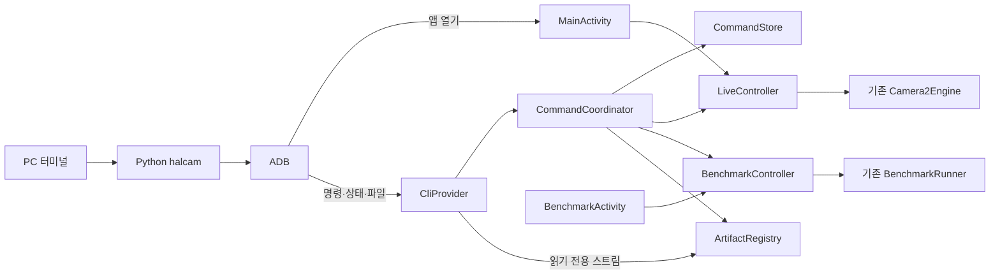
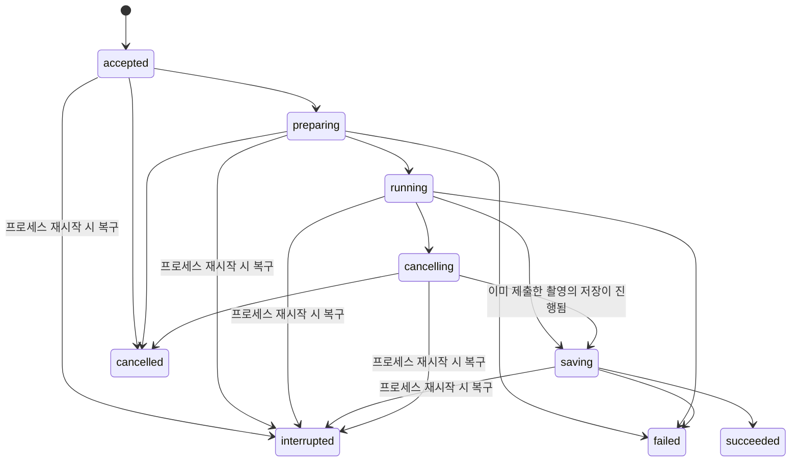

# HALCamera CLI 설계 초안

작성일: 2026-09-12 · 상태: 구현·검증 진행 · 관련 이슈: [#56](https://github.com/TTolsun/hal-camera/issues/56)

이 문서는 PC에서 ADB로 Android 앱을 제어하는 설계와 검증 기준이다. 기본 명령은 전용 worktree에서 구현 중이며 아직 배포하지 않았다. 실제 통과 범위는 [기능 검증 기록](../validation/cli-device.md)에 기록한다. 아래의 미확정 정책은 최종 리뷰에서 구현과 대조해야 한다. 구현 순서와 검증 기준은 [구현 계획](../PLAN-CLI-v0.1.md)에 정의한다.

## 1. 목표와 범위

터미널에서 카메라를 선택하고 사진 촬영·벤치마크 실행·결과 수집을 수행한다. UI와 CLI는 동일한 앱 기능과 측정 계약을 사용한다. 명령을 받았다는 응답과 실제 작업 완료를 구분하고, 연결이 끊겨도 같은 요청을 조회하여 중복 촬영을 방지한다.

| 구분 | v0.1 제안 |
|---|---|
| 실행 환경 | Python 3.11 이상과 Android SDK Platform Tools가 설치된 PC |
| 배포 | 저장소의 Python 패키지와 `halcam` console script, 개발 시 `python -m halcam` |
| 운영체제 | Windows를 먼저 실기기 검증하고 Linux·macOS의 CLI 테스트를 수행한다. 기기 연결 검증 범위는 별도로 기록한다. |
| Android | 앱의 기존 minSdk 26을 유지한다. 실제 지원 선언은 M0 호환성 검증 결과에 따른다. |
| 연결 | 이미 연결·인증된 USB 또는 무선 ADB를 사용한다. 무선 페어링은 Platform Tools에서 수행한다. |
| 빌드 | debug와 서명된 release를 모두 목표로 한다. `run-as`나 root를 전제로 하지 않는다. |
| 기능 | 기기·카메라 목록, 앱 실행, Camera2 프리뷰, 사진 촬영, 기존 profile 벤치마크, 상태 조회, 결과 다운로드, 실행 취소 |
| 후속 범위 | 녹화, 줌·CameraX 제어, incident 수집, baseline 변경, 이력 삭제, 무인 백그라운드 촬영 |

Android 사용자 0의 잠금 해제된 전면 앱을 첫 지원 조건으로 한다. 다른 Android 사용자·업무 프로필·root adbd 환경은 명시적으로 지원하지 않는다고 안내한다. 기기가 여러 대이면 `--serial`을 필수로 받으며 임의의 기기를 선택하지 않는다.

## 2. 현재 코드에서 확인한 사실

검토 기준은 `38b9b5c` 및 2026-09-12의 로컬 작업 내용이다. 작업 트리에는 별도의 UI 변경이 있으므로 구현 시 병합된 기준으로 다시 확인한다.

| 근거 | 현재 동작과 설계에 미치는 영향 |
|---|---|
| [MainActivity](../../app/src/main/java/dev/halcamera/MainActivity.kt) | `onStart`에서 카메라를 열고 `onStop`에서 정리한다. 권한 요청, 엔진 교체, 미디어 동작이 화면 내부에 있다. |
| [CameraEngine](../../app/src/main/java/dev/halcamera/camera/CameraEngine.kt) | `capture()`는 결과를 반환하지 않는다. CLI용 완료 통지를 추가해야 한다. |
| [Camera2Engine](../../app/src/main/java/dev/halcamera/camera/Camera2Engine.kt) | 사진 저장 후 `media_saved` 이벤트가 발생한다. 상태 문자열을 해석하지 않고 요청 ID를 포함한 타입 기반 완료 결과를 제공해야 한다. |
| [MediaLibrary](../../app/src/main/java/dev/halcamera/camera/MediaLibrary.kt) | YUV에서 변환한 JPEG과 카메라 JPEG을 저장하고 URI 목록을 반환한다. 저장 실패 시 생성 항목을 정리한다. |
| [BenchmarkActivity](../../app/src/main/java/dev/halcamera/benchmark/BenchmarkActivity.kt) | 실행 준비·환경 수집·driver 연결·결과 저장을 담당한다. `onStop`에서 실행을 중단하며, 결과 파일 쓰기는 비동기 작업이다. |
| [BenchmarkRunner](../../app/src/main/java/dev/halcamera/benchmark/BenchmarkRunner.kt) | 순수 Kotlin 상태 머신이다. 기존 순서·타이밍·실패 규칙을 유지한다. |
| [BenchmarkReport](../../app/src/main/java/dev/halcamera/benchmark/BenchmarkReport.kt) | schema 4로 결과를 저장하며 schema 3도 읽는다. CLI 프로토콜 버전은 보고서 schema와 분리한다. |
| [AndroidManifest](../../app/src/main/AndroidManifest.xml) | MainActivity만 외부 실행이 가능하다. BenchmarkActivity와 기존 공유용 FileProvider는 외부에 공개되어 있지 않다. |
| [aggregate.py](../../tools/aggregate.py) | PC에서 저장된 JSON을 CSV로 변환한다. CLI는 원본 JSON을 수집하고 CSV 변환은 이 도구를 재사용한다. |

## 3. 구성과 책임



`CliProvider`는 인증·입력 검증·짧은 응답만 담당한다. 카메라나 벤치마크를 Binder 호출 안에서 실행하거나 완료까지 기다리지 않는다. 검증된 명령은 main thread의 `CommandCoordinator`에 전달하며 파일 작업은 IO executor가 처리한다.

`LiveController`와 `BenchmarkController`는 화면의 권한·preview surface·생명주기와 기존 엔진 사이를 연결한다. 화면 전체를 한 번에 재작성하지 않고 CLI와 UI가 함께 호출할 동작과 완료 결과부터 분리한다. Activity 참조는 attach/detach로 관리하고, 프로세스 범위 객체가 종료된 Activity를 보유하지 않도록 한다.

`CommandStore`는 요청·상태·결과 식별자를 앱 내부에 보관한다. `ArtifactRegistry`는 CLI 요청이 생성한 결과만 노출한다. 기존 갤러리 전체나 임의의 앱 내부 파일을 조회하는 API로 확대하지 않는다.

## 4. ADB 전송 방식

### 선택 제안

별도 `ContentProvider`를 `content://dev.halcamera.cli`에 추가한다. ADB의 `content call`로 명령을 제출하고 `content read`로 JSON과 파일을 읽는다. 앱 실행에는 기존 launcher Activity를 사용하는 `am start`를 사용한다. AOSP에는 두 content 명령이 구현되어 있다. 다만 OEM·API별 동작과 바이너리 전송은 M0에서 검증해야 한다. [AOSP content 명령 구현](https://android.googlesource.com/platform/frameworks/base/+/refs/heads/main/cmds/content/src/com/android/commands/content/Content.java)

| 후보 | 판단 |
|---|---|
| Activity Intent만 사용 | 앱 실행에는 적합하지만 지속적인 상태 조회와 결과 파일 회수에 별도 경로가 필요하다. |
| Broadcast + logcat | 로그 유실·다른 요청과 혼합되는 문제 때문에 완료·결과 전달 경로로 사용하지 않는다. |
| `run-as` + 내부 파일 | 일반 release 빌드를 지원하는 기본 경로로 사용할 수 없다. |
| ADB port forwarding + 서버 | 스트리밍 확장에는 유용하지만 서버 생명주기·인증·접속 관리를 추가해야 한다. 후속 대안으로 보류한다. |
| shell 전용 ContentProvider | 명령 제출과 파일 읽기를 같은 접근 통제로 묶을 수 있어 우선 검증한다. |

### 접근 조건

Provider는 `exported=true`, `grantUriPermissions=false`, `android.permission.DUMP`로 보호하는 방안을 검증한다. **각 외부 진입점에서 Binder 호출자의 UID가 shell UID 2000인지 직접 검사한다.** DUMP 권한이나 호출 패키지 이름만으로 허용하지 않는다. 같은 앱의 UI는 Provider를 경유하지 않고 controller를 직접 호출한다.

`call()`의 세부 권한은 구현자가 검사해야 한다. `call`, `query`, `openFile` 등 구현한 모든 진입점에서 동일한 검사기를 사용하고, 호출자 확인 전에 `clearCallingIdentity()`를 실행하거나 작업을 다른 스레드로 넘기지 않는다. 앱 권한으로 MediaStore를 읽는 것은 검사 후 제한된 artifact URI를 해석한 경우에만 허용한다. [ContentProvider API](https://developer.android.com/reference/android/content/ContentProvider)

앱 설정에 **ADB CLI 허용** 스위치를 추가하고 초기값은 꺼짐으로 제안한다. 활성화는 사용자 0의 앱 설정에 저장하여 재실행 후에도 유지한다. 비활성화하면 신규 명령과 파일 접근을 막고 실행 중 작업은 취소 절차를 진행한다. 비활성화 상태의 shell에는 파일이나 실행 이력이 없는 `CLI_DISABLED` 진단만 반환한다. 이 설정은 ADB로 승인된 모든 PC에 적용되며 PC별 접근 권한은 ADB 인증이 담당한다.

기존 MainActivity에 Intent extras만으로 촬영하는 경로를 추가하지 않는다. CLI가 먼저 앱을 열고 Provider로 검증된 요청을 전달한다. BenchmarkActivity는 계속 비공개로 유지하고 앱 내부에서 이동한다.

### 전송 계약 초안

| 경로 | 내용 |
|---|---|
| `call(method=submit, arg=<base64url JSON>)` | UTF-8 요청을 전달하고 짧은 접수·거부 응답을 반환한다. |
| `call(method=cancel, arg=<base64url JSON>)` | 요청 ID를 지정하여 취소를 요청한다. |
| `/v1/hello` | 프로토콜 버전, 앱 버전, 지원 명령, 활성화·권한 상태를 JSON으로 읽는다. |
| `/v1/status` | 현재 앱 상태, 실행 중 요청 ID를 JSON으로 읽는다. |
| `/v1/requests/<uuid>` | 특정 요청의 상태와 결과 목록을 JSON으로 읽는다. |
| `/v1/requests/<uuid>/artifacts/<artifact-id>` | 등록된 결과 파일을 읽기 전용으로 전송한다. |

`call` 응답 Bundle에는 `halcam_v1` 키 하나로 base64url JSON을 담는다. PC는 AOSP의 Bundle 출력 형식 전체를 범용 파싱하지 않고 허용된 키·인코딩·버전만 검사한다. 출력 형식이 예상과 다르면 `PROTOCOL_ERROR`를 반환한다. M0에서 이 방식이 API 26과 실제 기기에서 안정적인지 검증한 뒤 확정한다.

JSON·파일 읽기는 `adb exec-out content read`의 bytes를 Python에서 직접 받아 처리한다. 터미널 리다이렉션이나 텍스트 인코딩 변환을 통과시키지 않는다. ADB 종료 코드만 신뢰하지 않고 JSON schema 또는 artifact 크기·SHA-256까지 검사한다.

PC 명령은 `subprocess` 인자 배열로 실행한다. ADB의 원격 shell 해석도 고려하여 전달 값은 고정 명령·검증된 ID·base64url payload로 제한한다. `--output`은 PC에서만 처리하며 앱에 파일 경로로 보내지 않는다. 요청 JSON은 디코딩 후 8 KiB, 문자열은 항목별 길이 제한을 적용한다. 알 수 없는 명령·옵션·버전은 거부한다.

## 5. 사용자 명령

```bash
halcam devices
halcam --serial DEVICE doctor --json
halcam --serial DEVICE launch
halcam --serial DEVICE cameras --json
halcam --serial DEVICE preview --camera 0
halcam --serial DEVICE capture --camera 0 --output ./photos
halcam --serial DEVICE benchmark run --camera 0 --profile camera2-standard-v1 --output ./runs
halcam --serial DEVICE status --request REQUEST_UUID --json
halcam --serial DEVICE fetch REQUEST_UUID --output ./recovered
halcam --serial DEVICE cancel REQUEST_UUID
```

| 명령 | 의미 |
|---|---|
| `devices` | 앱에 접근하지 않고 ADB 연결 상태를 조회한다. |
| `doctor` | 앱 설치·프로토콜·CLI 허용·권한·사용자·잠금 상태를 진단한다. 앱 설치나 권한 변경을 자동 수행하지 않는다. |
| `launch` | 앱을 전면으로 연다. 이 명령의 성공은 카메라 준비 완료를 의미하지 않는다. |
| `cameras` | logical camera와 endpoint 정보를 구분해 반환한다. 카메라를 열어 촬영하지 않는다. |
| `preview` | 지정한 Camera2 logical camera의 첫 프리뷰 준비까지 기다린다. 완료 후에는 일반 LIVE 상태가 된다. |
| `capture` | 앱을 열고 카메라 준비 후 사진 한 쌍을 저장하고 PC로 수집한다. |
| `benchmark run` | 기존 preflight를 통과한 profile을 한 번 실행하고 원본 JSON을 수집한다. |
| `status` | 앱을 전면으로 이동시키지 않고 상태를 조회한다. |
| `fetch` | 이미 생성된 결과를 다시 내려받는다. 촬영·측정을 다시 실행하지 않는다. |
| `cancel` | 실행 중 요청을 취소한다. 완료된 요청에는 현재 결과를 반환한다. |

`--camera`는 독립적으로 열 수 있는 logical ID만 허용한다. physical endpoint의 `0.2` 같은 key를 camera ID로 잘못 전달하지 않도록 목록에 `selectable`과 선택 불가 사유를 포함한다. 다른 카메라로 자동 대체하지 않는다.

`--json`에서는 stdout에 최종 JSON 하나만 출력하고 진행·진단은 stderr로 출력한다. 모든 작업 결과에는 request ID를 포함한다. `--no-wait`은 요청 접수 결과를 반환하며 다운로드를 수행하지 않는다. 해당 결과에는 `completed=false`를 표시한다. 이후 `status`와 `fetch`로 이어간다.

`--request-id`로 이전 요청 ID를 재사용할 수 있다. 기본 ID는 CLI가 생성하며 제출 전에 stderr에 알린다. `--output`은 고유 요청 하위 폴더를 생성하고 기존 파일은 덮어쓰지 않는다. 동일 요청을 다시 받을 때 해시가 일치하는 파일은 재사용한다.

## 6. 요청·상태·오류 계약

```json
{
  "protocol_version": 1,
  "request_id": "1b285c16-9806-4c80-aea3-d99b1fcc8eb6",
  "command": "capture",
  "params": { "camera_id": "0" },
  "execution_timeout_ms": 30000
}
```

```json
{
  "protocol_version": 1,
  "request_id": "1b285c16-9806-4c80-aea3-d99b1fcc8eb6",
  "state": "succeeded",
  "completed": true,
  "result": { "camera_id": "0", "artifact_count": 2 },
  "artifacts": [],
  "error": null
}
```

위 응답은 형태를 보여주는 축약 예시다. 실제 사진 성공 응답의 `artifacts`에는 두 항목이 있어야 하며 각 항목에는 `artifact_id`, `name`, `mime_type`, `size_bytes`, `sha256`을 포함한다. Android 원본 URI와 임의 경로는 외부 입력으로 받지 않는다.



동시에 상태를 변경하는 요청은 하나만 허용하고 대기열은 두지 않는다. UI 촬영·녹화·벤치마크도 같은 작업 소유권을 사용한다. 충돌은 `BUSY`로 반환한다. 상태 조회·취소는 계속 허용하고 결과 대용량 전송은 측정 중 `BUSY`로 제한한다. 앱을 열거나 화면을 전환하기 전에 활성 작업을 확인하여 진행 중인 UI 벤치마크를 중단하지 않는다.

명령 정규화 후 요청 ID와 payload hash를 원자적으로 저장하고 동작을 시작한다. 같은 ID·같은 내용은 기존 결과를 반환하며, 같은 ID·다른 내용은 `REQUEST_CONFLICT`로 거부한다. 중복 방지 보장은 기록 보존 기간 안에서만 제공한다. 기록이 사라진 요청을 클라이언트가 자동 재제출하지 않는다.

프로세스 재시작 시 끝나지 않은 요청은 `interrupted`로 기록하고 자동으로 다시 실행하지 않는다. 저장 완료된 파일의 매핑을 복구할 수 있으면 partial artifacts로 노출한다. 저장과 상태 갱신 사이의 crash에서는 작업이 일어났는지 단정하지 않고 결과가 불확실하다고 표시한다. 영속 기록만으로 정확히 한 번의 촬영을 보장한다고 주장하지 않는다.

사진 성공은 timestamp가 일치하는 두 이미지의 저장과 artifact 등록이 끝났을 때다. 저장 중 취소는 파일을 무조건 삭제하지 않는다. 취소가 실행보다 늦었으면 실제 성공 결과와 `cancel_effective=false`를 반환한다. 벤치마크 취소는 기존 runner의 abort 경로를 거쳐 partial report를 저장한 다음 `cancelled`로 완료한다.

Activity가 전면에서 사라지면 준비 중 요청은 실패하고 실행 중 벤치마크는 중단한다. 이미 제출된 사진은 저장 콜백으로 결과를 확정하며 화면이 닫혔다고 성공 파일을 지우지 않는다. LIVE에서 BENCHMARK로 이동할 때는 기존 카메라의 close 완료와 새 preview surface 준비를 기다린다.

권한이 없으면 `PERMISSION_REQUIRED`로 종료하고 앱에서 허용할 방법을 출력한다. CLI가 권한을 자동 부여하거나 무기한 권한 대화상자를 기다리지 않는다. Android의 백그라운드 카메라 제약을 회피하는 별도 서비스는 v0.1에 포함하지 않는다. [Android 실행 제한](https://developer.android.com/develop/background-work/services/fgs/restrictions-bg-start)

### 시간 제한과 종료 코드

앱 실행 제한의 초기값은 준비 포함 preview·capture 30초, benchmark 180초로 제안한다. 최종 상한은 실기기 검증으로 조정한다. 앱은 monotonic clock을 사용한다. 앱 실행 제한, PC 대기 제한, 파일 전송 제한은 별개다. PC 대기 제한이나 연결 끊김은 앱의 실패를 의미하지 않는다. CLI는 요청 ID와 확인 방법을 반환하며 자동 재촬영하지 않는다.

Ctrl+C는 best effort로 취소를 요청한다. 응답을 받지 못하면 취소되었다고 표시하지 않고 종료 코드 130과 요청 ID를 남긴다. 상태 polling은 기본 2초로 하며 벤치마크 중에는 저장된 상태 snapshot만 읽는다.

| 종료 코드 | 의미와 대표 오류 |
|---|---|
| 0 | 명령 성공. `--no-wait`에서는 접수 성공이며 완료 여부는 별도 필드로 표시한다. |
| 2 | 잘못된 인자, `INVALID_ARGUMENT` |
| 3 | 기기·ADB 연결 문제, `DEVICE_NOT_FOUND`, `MULTIPLE_DEVICES`, `DEVICE_UNAUTHORIZED`, `CONNECTION_LOST` |
| 4 | 실행 조건·호환성 문제, `CLI_DISABLED`, `PERMISSION_REQUIRED`, `BUSY`, `UNSUPPORTED_CAMERA`, `PREFLIGHT_FAILED`, `PROTOCOL_MISMATCH` |
| 5 | 실행·저장 실패, `CAPTURE_FAILED`, `SAVE_FAILED`, `INTERRUPTED` |
| 6 | 시간 제한. 오류 필드에 PC 대기인지 앱 실행인지 명시한다. |
| 7 | 결과 수집 실패, `ARTIFACT_MISSING`, `ARTIFACT_EXPIRED`, `CHECKSUM_MISMATCH`, `DOWNLOAD_FAILED` |
| 8 | 응답 형식 오류, `PROTOCOL_ERROR` |
| 130 | 사용자가 취소했거나 취소된 요청의 완료를 기다리던 경우 |

벤치마크 실행 성공과 측정 적격성은 구분한다. 기존 runner가 완료되고 보고서 저장이 성공하면 validity flag나 회귀 여부 때문에 자동으로 실패 처리하지 않는다. 실행 중단·hard failure·저장 실패는 실패 또는 취소로 반환하되 수집 가능한 partial report를 유지한다. `--fail-on-regression` 같은 CI 판정 옵션은 후속 설계로 둔다.

## 7. 파일·저장·성능

결과는 `files/cli/requests/<uuid>.json`의 원자적 상태 기록과 등록된 artifact ID로 관리한다. 사진은 MediaStore URI, benchmark는 기존 report 파일을 참조한다. 요청 ID, capture ID, session ID, run ID의 매핑을 명시적으로 보관하며 최신 파일명이나 logcat 검색으로 추정하지 않는다.

초기 보존 정책은 완료 후 24시간, 완료 요청 최대 200개다. 활성 요청은 정리하지 않는다. 상한 때문에 먼저 만료될 수 있으므로 응답에 만료 시각과 보존 상한을 알린다. 정리는 CLI 메타데이터·전송용 임시 파일만 대상으로 하며 원본 사진과 기존 benchmark 이력을 삭제하지 않는다. 사용자가 원본을 삭제하면 `ARTIFACT_MISSING`을 반환한다.

Provider는 허용된 ID만 받으며 경로 이동 문자열, 다른 authority, write mode, 등록되지 않은 URI를 거부한다. 파일을 읽을 때 접근 조건을 다시 검사한다. 스위치를 끄기 전에 이미 전달한 파일 디스크립터는 즉시 회수되지 않을 수 있음을 설계 제약으로 기록한다.

파일 크기와 해시는 측정이 끝난 후 IO 작업으로 계산한다. PC는 `.part` 파일로 받은 뒤 길이와 SHA-256을 확인하고 최종 이름으로 이동한다. 한 쌍 중 하나만 내려받은 경우 앱의 촬영 성공과 PC의 전송 실패를 분리해 출력하고 `fetch`로 복구한다. 전송 재시도는 파일에만 적용하며 촬영 요청을 반복하지 않는다.

벤치마크 동안 프레임별 상태 저장, 대용량 파일 복사, 해시 계산을 하지 않는다. 상태 기록은 단계 전환에 한정하고 UI와 CLI 실행의 profile·스트림·시계·warm-up·통계·baseline 규칙을 동일하게 유지한다. ADB 연결에 따른 충전 상태는 기존 환경·적격성 규칙대로 기록하며 점수 산정을 위해 숨기지 않는다.

## 8. 확정이 필요한 사항

| 항목 | 초안의 선택 | 확정 시점 |
|---|---|---|
| 사용자 실행 환경 | PC + ADB | 구현 착수 전 사용 목적과 일치하는지 확인한다. |
| 전송 경로 | shell 전용 Provider | M0에서 API·OEM·release 호환성을 확인한다. |
| release 정책 | CLI 스위치 기본 꺼짐, shell UID 검사 | M0와 M1의 접근 통제 검증 후 확정한다. |
| 배포 | Python 패키지, 외부 Python 의존성 최소화 | M1에서 저장소 설치 명령을 고정한다. 단일 실행 파일 배포는 후속이다. |
| 시간 제한·보존량 | 30/180초, 24시간·200개 | M4와 M5 실측 후 문서와 테스트에 고정한다. |
| Android 지원 하한 | 기존 API 26 유지 목표 | M0 결과에 따라 CLI만 별도 지원 하한이 필요한지 판단한다. |

이 문서의 선택은 구현 계획을 구체화하기 위한 제안이다. 기기 호환성이나 권한 경로가 검증된 것으로 취급하지 않는다.
