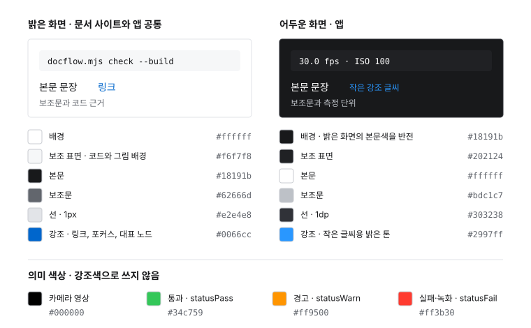

# HAL CAMERA · 공통 디자인 시스템

문서를 읽은 사람이 시스템을 이해하고, 작성자의 판단을 신뢰할 수 있게 만듭니다. 시각적 완성도는 정보의 위계, 근거의 정확성, 읽는 순서에서 드러나야 합니다.

## 디자인 방향

Linear 45%, Apple Editorial 30%, Vercel 20%, 개인 시그니처 5%를 방향성으로 사용합니다. 이 비율은 레이아웃 면적이나 구성요소 수를 뜻하지 않습니다.

| 참고 방향 | HAL CAMERA에 적용하는 방식 |
| --- | --- |
| Linear | 절제된 탐색 구조, 정밀한 정렬, 낮은 시각적 소음으로 표현합니다. |
| Apple Editorial | 큰 제목, 넓은 여백, 짧은 문장, 대표 다이어그램으로 표현합니다. |
| Vercel | 흑백 기반과 작은 코드 근거, 얇은 선으로 표현합니다. |
| 개인 시그니처 | `Engineering the invisible.`과 `by K.H. Kim`을 사용합니다. |

## 적용 범위

Android 앱과 문서 사이트는 이 문서를 단일 디자인 기준으로 사용합니다. 색상·글꼴·선·모서리는 함께 관리하며, 플랫폼별 크기와 조작은 아래 매핑을 따릅니다. 앱의 화면별 배치·동작은 [APP-UI.md](APP-UI.md)에 기록합니다. 별도 테마를 도입하지 않습니다.

## 문서 사이트 첫 화면의 순서

1. HAL CAMERA 브랜드와 문서 탐색을 표시합니다.
2. `Engineering the invisible.`을 큰 제목으로 표시하고 목적과 빠른 시작 링크를 제공합니다.
3. Architecture, Engine, Probe, CTS, Benchmark, Callback, CLI, Evidence를 01–08 번호가 있는 행으로 배치합니다. Engine은 Architecture 바로 다음에 둡니다. 도구 세 가지는 앱의 Lab과 같은 Probe, CTS, Benchmark 순서를 사용하며 Callback은 Benchmark 바로 다음에 둡니다. Decisions는 탐색 메뉴에서 제외하고 기존 문서 주소는 유지합니다.
4. 앱의 책임을 설명하는 대표 그림과 상세 문서 링크를 제공합니다.
5. 짧은 편집 문장과 근거 확인 링크로 마무리합니다.

상단 탭과 브라우저 제목은 Architecture·Engine처럼 같은 영어 이름을 사용합니다. 페이지의 대표 제목은 짧은 영어 문장으로 쓰고, 절 제목·설명·절차는 한국어로 작성합니다. 기능 이름과 API 식별자는 원문을 유지합니다. 첫 화면의 편집 문장과 서명은 영어로 유지하며, 서명은 12px로 배치합니다.

## 시각 토큰

| 요소 | 값과 용도 |
| --- | --- |
| 배경 | `#ffffff`를 기본으로 사용하고 `#f6f7f8`을 코드와 그림 배경에 사용합니다. |
| 본문과 보조문 | `#18191b`, `#62666d`를 사용합니다. |
| 선 | `#e2e4e8`의 1px 선을 사용합니다. |
| 강조 | `#0066cc` 하나만 링크, 키보드 포커스, 대표 노드에 사용합니다. |
| 글꼴 | Inter가 설치되어 있으면 사용하고, 없으면 시스템 산세리프와 한국어 대체 글꼴을 사용합니다. |
| 첫 제목 | 최대 80px, 모바일 최소 48px, 줄 간격 1.06을 사용합니다. |
| 문서 제목과 본문 | 제목 36–64px, 본문 16px, 근거 12–13px를 사용합니다. |
| 폭과 여백 | 전체 폭은 최대 1120px, 본문 단락은 최대 800px입니다. 주요 절 사이에는 56–80px를 둡니다. |
| 모서리와 움직임 | 코드와 버튼에는 3–4px 모서리를 사용합니다. 링크 색상 전환은 150ms로 제한하고 reduced-motion을 존중합니다. |

카드 격자, 장식용 그라디언트, 그림자, 큰 배지, 의미 없는 수치 대시보드는 사용하지 않습니다. 정보 구분에는 여백과 선을 먼저 사용합니다.

## Android 매핑

| 요소 | 앱에 적용하는 값 |
| --- | --- |
| 밝은 화면 | 공통 배경 `#ffffff`, 보조 표면 `#f6f7f8`, 본문 `#18191b`, 보조문 `#62666d`, 선 `#e2e4e8`을 사용합니다. |
| 어두운 화면 | 본문색을 배경 `#18191b`로 반전하고 보조 표면 `#202124`, 선 `#303238`, 흰 글씨와 보조문 `#bdc1c7`을 사용합니다. 카메라 영상 영역은 검정입니다. |
| 강조 | 공통 파랑 `#0066cc`를 사용하며, 어두운 화면의 작은 글씨에는 가독성을 위해 같은 파랑의 밝은 톤 `#2997ff`를 사용합니다. 녹화·오류·측정 그래프의 의미 색상은 별도로 유지합니다. |
| 형태 | 일반 버튼과 정보 표면은 4dp 모서리와 1dp 선을 사용합니다. 셔터·썸네일·줌·원형 아이콘 버튼은 촬영 조작의 의미에 따라 원을 유지합니다. |
| 글꼴과 크기 | 시스템 산세리프를 기본으로, 측정 수치는 검증된 고정폭 글꼴로 표시합니다. 큰 웹 제목을 그대로 축소하지 않고 앱 제목 20–24sp, 본문 14–16sp, 측정·보조문 12sp를 사용합니다. |
| 여백과 조작 | 4dp 단위로 정렬하고 터치 영역은 48dp 이상으로 유지합니다. 정보는 여백·선으로 나누며 촬영 버튼은 하단에 배치합니다. |
| 움직임 | 링크·색상 전환은 150ms를 기준으로 합니다. 줌의 공간 변화는 펼침 260ms·접힘 220ms로 표현하며 시스템 애니메이션 비활성화와 접근성 시간 설정을 따릅니다. |

위의 두 표에 있는 색상 값을 한 장의 견본으로 모으면 다음과 같습니다. 의미 색상은 `ui/Look`의 `statusPass`·`statusWarn`·`statusFail`이며, 녹화 셔터의 빨간색도 `statusFail`을 사용합니다. 색상 값을 바꾸면 `figures/color-tokens.svg`, `editorial.css`, `Look.kt`를 함께 고칩니다.

프리뷰 위의 그라데이션과 글자 그림자는 영상에 따른 대비를 확보하는 용도로만 사용합니다. 장식용 카드 그림자는 사용하지 않습니다.

## 상세 문서 포맷

각 문서는 제목, 먼저 알아야 할 결론, 대표 그림, 세부 설명, 코드 근거, 다음 읽을 문서 순서로 구성합니다. 대표 그림 한 개를 중심으로 두되, 긴 아키텍처 문서에는 필요한 보조 그림을 유지합니다. 절차 문서에는 불필요한 그림을 추가하지 않습니다.

- Architecture는 책임, 실행 흐름, 변경 제약을 설명합니다.
- Engine은 Camera2·CameraX 엔진의 계약, 요청·저장 구현과 엔진별 차이를 설명합니다.
- Benchmark는 측정 조건, 결과 읽기, 실행 기록의 비교·내보내기·보관을 설명합니다.
- Probe는 HAL이 공개한 사양 표의 읽는 법과 측정과의 차이를 설명합니다.
- CTS는 앱 안에서 실행하는 CTS 케이스의 범위와 공식 판정과의 차이를 설명합니다.
- Callback은 프레임별 콜백 시각의 기준과 스트림 행, 자동 고정 조작을 설명합니다.
- CLI는 기기 연결, 명령·옵션, 요청과 파일 회수, 오류 대응을 설명합니다.
- Agents는 스킬을 에이전트에 연결하는 절차와 작업 위임 범위를 설명하며 명령 설명은 CLI로 연결합니다.
- 빠른 시작은 빌드·설치, Live 촬영 조작과 빌드 정보를 설명합니다.
- 디버깅은 증상별 확인 순서와 관측·표본 규칙을 설명합니다.
- Evidence는 근거의 수준, 기기 검증 기록, 문서 수정·검토·동기화 절차를 모읍니다.

같은 사용법은 담당 페이지에서 한 번만 설명하고 다른 페이지에서는 해당 절로 연결합니다. 과거 화면의 변경 이유는 현재 사용법에 반복하지 않습니다. 설계 결정 원문과 검증·릴리스 기록은 이력으로 보존합니다.

앱 스크린샷은 실제 기기에서 촬영하고 해당 기능을 설명하는 절에 한 번씩 배치합니다. 본문에서는 최대 400px 폭으로 원래 비율을 유지하며 모바일에서는 본문 폭에 맞춥니다. 이미지와 원본 보기 링크는 원본 PNG를 열고, 대체 텍스트와 짧은 캡션을 제공합니다. 촬영 날짜·기기·앱 버전·확인 범위는 Evidence와 촬영 기록에서 관리합니다.

편집 문장은 한 페이지에 최대 한 개를 사용합니다. `Good measurements should explain the system, not just produce numbers.`처럼 해당 내용과 연결되는 문장을 선택합니다.

## 다이어그램과 근거

그림은 실제 저장소가 설명하는 책임과 관계를 사용합니다. 앱에서 관측하는 콜백을 HAL 내부 처리 시간과 동일하게 표현하지 않습니다. 3AA·ISP·MCSC 같은 블록은 구조를 확인할 근거와 범위 설명이 있을 때만 추가합니다.

Mermaid는 한 그림에 한 흐름만 담고 긴 클래스 목록은 표로 옮깁니다. 기본 글자는 16px이며 본문에서 14px 미만으로 축소하지 않습니다. 폭이 부족하면 그림 안에서 가로로 이동하고 확대 창을 열 수 있습니다. 확대 창의 확대·축소·화면 맞춤·100%·닫기를 키보드와 포인터로 확인합니다. 문서 변경 후에는 모든 탭의 주소·본문·현재 탭 표시와 데스크톱·모바일의 가독성을 함께 확인합니다.

첫 화면의 그림은 개념도라고 명시합니다. 상세 Mermaid 그림은 기존 확대·축소·화면 맞춤 기능을 유지합니다. 모바일에서는 큰 그림만 가로로 스크롤하며 페이지 전체가 넘치지 않게 합니다.

코드 근거는 작은 글씨와 펼침 영역으로 제공합니다. 근거가 없으면 `확인 필요`로 남깁니다. 실제 검토를 확인할 수 없으면 `Reviewed by engineers.`와 같은 완료 표현을 쓰지 않습니다.

## 구현과 유지

문서 사이트 구현은 `guide/_layouts/default.html`, `docs/design/editorial.css`, `guide/index.md`에서, 앱의 공용 토큰은 `app/src/main/java/dev/halcamera/ui/Look.kt`에서 관리합니다. 디자인 변경 시 이 공통 기준과 각 플랫폼 매핑을 함께 검토합니다.

생성 마커 안의 내용은 기존 docgen 파이프라인으로 갱신합니다. 디자인을 변경한 뒤 생성 결과 검사를 실행하고 넓은 화면과 모바일에서 목차·그림·표·포커스를 확인합니다. 최신성 검사가 실패하면 검토 상태를 유지하고 원고를 재검토합니다.

CSS 원본은 공용 실행기의 custom 프리셋으로 연결합니다. `node tools/docgen/docflow.mjs design`을 실행하면 사이트의 `guide/assets/docflow-design.css`가 갱신됩니다.

custom CSS는 공용 엔진이 원본 스타일시트를 그대로 복사하여 생성합니다. `node tools/docgen/docflow.mjs design --check`로 생성 결과를 확인합니다.
