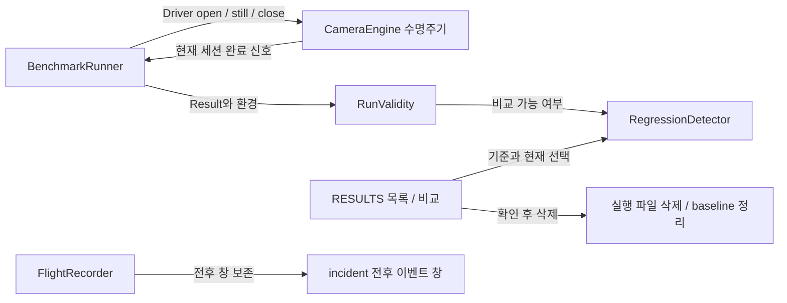

# 아키텍처 및 코드 구조

**수정할 기능과 연결된 코드부터 찾으세요.** 이 문서는 카메라 구동부터 이벤트 기록, 지표 계산, 결과 표시까지의 책임과 변경 시 지켜야 할 제약을 설명합니다.

| 지금 확인할 내용 | 이동할 절 |
| --- | --- |
| 앱의 전체 구조와 관측·비교 경로를 이해합니다. | [앱의 역할과 평가 경로](#앱의-역할과-평가-경로) |
| 수정할 패키지를 찾습니다. | [패키지별 역할](#패키지별-역할) |
| 측정값이 만들어지는 순서를 추적합니다. | [주요 실행 흐름](#주요-실행-흐름) |
| 카메라 종료와 스레드 제약을 확인합니다. | [생명주기와 스레드](#생명주기와-스레드) |
| 변경 후 지켜야 할 규칙과 검증 방법을 확인합니다. | [변경 시 지켜야 할 제약](#변경-시-지켜야-할-제약) |

아직 빌드하지 않았다면 [빠른 시작](getting-started.md)을 먼저 진행하세요. 아래의 `코드 확인`은 구현을 대조했다는 뜻이며, 기기 실측을 뜻하지 않습니다.

## 앱의 역할과 평가 경로

<!-- omm:begin id=overview -->

**LIVE, BENCHMARK, RESULTS 중 수정할 화면과 연결된 코드를 먼저 확인하세요.** 현재 앱은 카메라 성능을 관측하고, 저장된 실행을 비교하는 단일 Android 앱 모듈입니다. v0.2의 Home·Auto Check·건강 판정 화면은 제거되었습니다.

| 단계 | 담당 코드 | 책임 |
| --- | --- | --- |
| 카메라 구동 | `CameraEngine`, `Camera2Engine`, `CameraXEngine` | 엔진 수명주기와 카메라 요청을 처리합니다. |
| 콜백 기록 | `Telemetry`, `FlightRecorder` | 세션·프레임·시각·메타데이터를 이벤트로 기록합니다. |
| 지표 계산 | `BenchmarkRunner`, `RunAssembler`, `BenchmarkEvaluator`, `metrics/MetricExtractor` | 러너의 실행 시각과 콜백을 합쳐 측정값을 만듭니다. |
| 내부 점수 | `ScoreComposer` | 검토한 calibration의 범위에 맞는 적격 release run에 점수와 카테고리 평균을 계산합니다. |
| 저장·비교·표시 | `BenchmarkReport`, `BaselineManager`, `RegressionDetector`, 각 Activity | JSON 저장과 화면을 구성하고, 현재 기준에 따른 비교 결과를 계산합니다. |

`MainActivity`가 런처이며 LIVE에서는 관측한 수치만 표시합니다. `BenchmarkActivity`는 정해진 profile을 실행하고 결과를 저장합니다. `HistoryActivity`는 저장된 실행을 찾아 필터링하고 두 실행을 비교하거나 내보냅니다. 파일은 앱 내부에 저장하며 서버나 데이터베이스를 사용하지 않습니다.

baseline은 사용자가 명시적으로 지정합니다. baseline이 없으면 결과 화면은 이전의 비교 가능한 실행 대비 변화량만 표시합니다. 이력에서 임의로 선택한 실행도 실제 baseline이 아닌 한 회귀 판정의 기준이 되지 않습니다.

### 코드를 처음 읽는 순서

1. `camera/CameraEngine.kt`에서 열기·닫기 계약을 확인합니다.
2. `telemetry/Telemetry.kt`와 `FlightRecorder.kt`에서 이벤트와 보존 방식을 확인합니다.
3. `benchmark/BenchmarkRunner.kt`에서 실행 순서와 실패 처리를 읽습니다.
4. `benchmark/RunAssembler.kt`에서 러너 결과와 이벤트를 결합하는 지점을 확인합니다.
5. `MainActivity.kt`, `BenchmarkActivity.kt`, `HistoryActivity.kt`에서 화면과 실행 코드의 연결을 확인합니다.

LIVE의 사진·동영상은 MediaLibrary를 거쳐 DCIM/HALCamera 앨범에 저장하며 GalleryActivity에서 조회합니다. 측정 파일과 미디어 파일의 저장 경로를 구분하려면 아래 모듈 역할을 확인하세요.

근거와 검토 정보

- 근거 파일: `app/src/main/java/dev/halcamera/MainActivity.kt`, `app/src/main/java/dev/halcamera/camera/CameraEngine.kt`, `app/src/main/java/dev/halcamera/telemetry/Telemetry.kt`, `app/src/main/java/dev/halcamera/telemetry/FlightRecorder.kt`, `app/src/main/java/dev/halcamera/benchmark/BenchmarkRunner.kt`, `app/src/main/java/dev/halcamera/benchmark/RunAssembler.kt`, `app/src/main/java/dev/halcamera/benchmark/ScoreComposer.kt`, `app/src/main/java/dev/halcamera/benchmark/BenchmarkActivity.kt`, `app/src/main/java/dev/halcamera/benchmark/HistoryActivity.kt`, `app/src/main/java/dev/halcamera/benchmark/RegressionDetector.kt`
- 근거 수준: 코드 확인
- 검토 2026-09-12 @ `38b9b5c` · Codex

<!-- omm:end id=overview -->

## 전체 구조도

그림을 클릭하면 확대 화면이 열립니다. 키보드에서는 Tab으로 그림을 선택한 뒤 Enter 또는 Space를 누르세요.

```mermaid
graph LR
    live["MainActivity · LIVE"] -->|"엔진 선택"| engines["Camera2Engine / CameraXEngine"]
    live -->|"벤치마크 진입"| benchmark["BenchmarkActivity / BenchmarkRunner"]
    benchmark -->|"Driver 호출"| engines
    engines -->|"요청 실행"| platform["Android Camera API"]
    engines -->|"이벤트 기록"| telemetry["Telemetry / FlightRecorder"]
    telemetry -->|"관측 표본"| assemble["RunAssembler / BenchmarkEvaluator / RunValidity"]
    benchmark -->|"실행 시각"| assemble
    assemble -->|"적격 조건 확인"| score["ScoreComposer · 내부 초안"]
    score -->|"실행과 해당 점수 저장"| files["BenchmarkReport / BenchmarkStore · schema 4"]
    files -->|"기준 실행 읽기"| comparison["BaselineManager / RegressionDetector"]
    comparison -->|"비교 표시"| results["ResultPresenter / ComparePresenter"]
    benchmark -->|"이력 진입"| history["HistoryActivity / RunIndex"]
    files -->|"목록 읽기"| history
    history -->|"선택한 두 실행"| comparison
    history -->|"지표별 내보내기"| csv["BenchmarkCsv · CSV"]
```

<!-- omm:begin id=overall-diagram -->

근거와 검토 정보

- 근거: `.omm/overall-architecture/diagram`
- 근거 수준: 코드 확인

<!-- omm:end id=overall-diagram -->

## 패키지별 역할

<!-- omm:begin id=module-roles -->

**변경할 기능의 패키지부터 여세요.** 아래 경로는 `app/src/main/java/dev/halcamera/`를 기준으로 합니다.

| 영역 | 역할과 수정 시 확인할 내용 |
| --- | --- |
| `camera/` | 엔진 계약, Camera2·CameraX 구현, 엔드포인트 열거를 제공합니다. `close(done)` 완료 전에 다음 카메라를 열지 않습니다. |
| `metrics/` | `MetricExtractor`가 이벤트를 관측 표본과 통계로 바꿉니다. 화면과 회귀 판정을 담당하지 않습니다. |
| `benchmark/` | profile, 러너, 지표 계산, validity, 내부 점수, 저장, 비교와 이력 화면을 제공합니다. Android 의존성이 있는 Activity·저장 어댑터와 순수 계산 로직을 구분합니다. |
| `telemetry/` | `Telemetry`가 이벤트를 만들고 `FlightRecorder`가 보존합니다. `IncidentExporter`는 incident ZIP을 작성합니다. listener는 기록 스레드에서 동기 실행됩니다. |
| `ui/`와 `MainActivity.kt` | LIVE 관측값과 Canvas 그래프, 공통 `Look` 토큰, 카메라 선택과 권한 처리를 제공합니다. |

`BenchmarkActivity`는 실행 완료 후 별도 입출력 스레드에서 조립·저장·비교를 처리하고 `ResultPresenter`와 `ComparePresenter`의 결과를 표시합니다. 시작 카드와 진행률에는 `StartCardPresenter`와 `ProgressPresenter`를 사용합니다.

`HistoryActivity`는 같은 저장소를 읽습니다. `RunIndex`는 이벤트와 표본 배열을 제거한 목록 데이터를 유지하고, 결과를 열 때 원본 JSON을 다시 읽습니다. 파일 읽기·삭제·CSV 생성은 별도 스레드에서 처리합니다. `BenchmarkCsv`는 지표당 한 행을 작성하고 FileProvider로 공유합니다.

`BenchmarkReport`는 schema 4를 쓰고 schema 3·4를 읽습니다. `BenchmarkStore`는 실행 파일과 baseline 인덱스를 관리합니다. 삭제한 실행을 가리키는 포인터는 정리하며, 기존 실행 JSON은 비교 상태가 바뀌어도 다시 쓰지 않습니다.

`camera/MediaLibrary`는 사진 쌍과 동영상을 MediaStore에 저장합니다. `StillPair`와 `YuvPacking`은 버퍼 연결과 YUV 변환을 담당합니다. `GalleryActivity`는 HALCamera 앨범을 조회합니다. 미디어 저장은 벤치마크 지표 계산과 분리되어 있습니다.

`camera/RecentMediaThumbnail`은 저장 완료된 앨범 항목의 썸네일을 별도 작업 스레드에서 읽고 `ui/RecentMediaButton`에 전달합니다. 화면을 나가면 관찰을 중단하고 뒤늦은 조회 결과는 반영하지 않습니다.

근거와 검토 정보

- 근거 파일: `app/src/main/java/dev/halcamera/camera/CameraEngine.kt`, `app/src/main/java/dev/halcamera/benchmark/BenchmarkActivity.kt`, `app/src/main/java/dev/halcamera/benchmark/HistoryActivity.kt`, `app/src/main/java/dev/halcamera/benchmark/RunIndex.kt`, `app/src/main/java/dev/halcamera/benchmark/BenchmarkCsv.kt`, `app/src/main/java/dev/halcamera/benchmark/ScoreComposer.kt`, `app/src/main/java/dev/halcamera/benchmark/BenchmarkReport.kt`, `app/src/main/java/dev/halcamera/telemetry/FlightRecorder.kt`, `app/src/main/java/dev/halcamera/MainActivity.kt`, `app/src/main/java/dev/halcamera/camera/RecentMediaThumbnail.kt`, `app/src/main/java/dev/halcamera/ui/RecentMediaButton.kt`
- 근거 수준: 코드 확인
- 검토 2026-09-12 @ `38b9b5c` · Codex

<!-- omm:end id=module-roles -->

## 주요 실행 흐름

<!-- omm:begin id=runtime-flow -->

**실행 실패는 러너 결과에서, 측정값의 차이는 이벤트와 계산 규칙에서 확인하세요.** 벤치마크의 입력은 카메라 콜백 이벤트와 러너가 기록한 실행 시각입니다.

### 실행에서 저장까지

1. `BenchmarkActivity`가 선택한 카메라와 profile을 사전 확인합니다.
2. `BenchmarkRunner`가 열기·닫기 반복을 수행합니다. 각 사이클은 OPEN → CONFIGURE → FIRST_FRAME → CYCLE_CLOSE로 진행합니다.
3. 별도 관측 세션에서 WARMUP → OBSERVE → STILL → CLOSE를 진행합니다. profile은 반복 횟수와 관측·촬영 조건을 정합니다.
4. `RunAssembler`가 러너 결과와 이벤트를 결합해 `BenchmarkEvaluator`와 `RunValidityEvaluator`를 호출합니다. `ScoreComposer`는 calibration의 적용 범위와 적격 조건에 맞는 run에만 내부 점수를 채웁니다.
5. `BenchmarkReport`가 실행 JSON을 저장합니다. Activity는 baseline 또는 이전 실행을 찾아 비교 결과를 별도로 계산합니다.

`Telemetry.callback()`은 `capture_started`, `request_observed`, `capture_result`, `capture_failed`, `buffer_lost`를 기록합니다. 콜백의 `alive()`가 거짓이면 이미 닫힌 세션의 늦은 이벤트를 버립니다. `request_observed`는 요청 제출 시각이 아니라 `onCaptureStarted`에서 관측한 요청 내용입니다.

러너는 API 호출과 완료 신호 사이의 시각 차이를 기록합니다. `RunAssembler`는 관측 세션의 프레임 중 관측 시작 이전에 도착한 프레임 수를 워밍업으로 계산합니다. `MetricExtractor`가 이벤트를 표본으로 연결하고, `BenchmarkEvaluator`가 profile에 따라 초기 반복을 제외하고 통계를 계산합니다. 3A 수렴은 관측 세션의 첫 결과부터 계산합니다.

### 저장된 실행의 비교와 내보내기

`RegressionDetector`는 두 실행의 측정 계약·endpoint·validity·환경 조건을 확인합니다. baseline 비교에서만 회귀 판정을 표시하며, 이전 실행이나 임의 선택 실행과의 비교는 변화량과 비교 불가 사유를 표시합니다. 단위가 다르면 각 단위를 유지하고 백분율을 표시하지 않습니다.

RESULTS의 행은 저장된 결과로 연결됩니다. 길게 누르면 baseline, 비교, JSON·CSV 내보내기, 삭제 작업을 선택합니다. 삭제 확인 후 파일을 삭제하고 해당 baseline 포인터를 정리합니다. 측정값이 저장되는 단계와, 화면에서 비교 결과를 다시 계산하는 단계는 서로 다릅니다.

벤치마크 닫기와 결과·이력 복귀에는 기존 위치의 48dp 아이콘을 사용합니다. 접근성 이름과 길게 누르기 설명에 복귀 대상을 표시하며, 실행·비교·내보내기·필터의 구체적인 작업 이름은 글씨로 유지합니다.

### LIVE에서 선택과 촬영

LIVE 상단에는 배경·테두리 없는 현재 API 버튼과 `Benchmark` 메뉴를 두고, 두 메뉴 사이에 `Camera2 · LIVE`처럼 엔진과 상태를 같은 줄로 표시합니다. 하단은 핵심 측정값 2줄, 줌, 셔터 행, 사진·동영상 모드 순서입니다. MARK·벤치마크·일시정지·그래프는 측정 상세에서 제공합니다. 셔터 행의 왼쪽에는 최근 촬영물 썸네일, 오른쪽에는 카메라 선택 목록을 여는 아이콘을 둡니다.

일시정지·재개·갤러리·측정 패널 닫기처럼 익숙한 동작은 `IconButton`을 사용합니다. 아이콘은 24dp, 터치 영역은 48dp 이상이며 한국어 접근성 이름과 길게 누르기 설명을 제공합니다. API·카메라 ID·모드·줌·필터·선택과 MARK·벤치마크·측정 상세는 현재 값이나 동작의 의미를 확인할 수 있도록 글씨를 유지합니다.

API 버튼은 누를 때마다 Camera2와 CameraX를 전환합니다. 사진·동영상은 각각의 이름을 한 번 눌러 선택합니다. 카메라 버튼, 벤치마크 카메라, RESULTS 필터는 현재 항목이 표시된 목록을 사용합니다. 아래 공간이 부족하면 버튼 위에 열립니다. 바깥을 누르거나 뒤로 가면 값을 유지하고 닫으며, 화면을 나갈 때에도 목록을 닫습니다. 모드를 고른 뒤 중앙 셔터를 눌러야 촬영이나 녹화를 시작합니다.

줌은 현재 배율만 표시하다가 누르면 지원 배율로 펼쳐집니다. 선택 후 3초 동안 추가 조작이 없으면 선택한 배율을 유지한 채 접힙니다. 선택된 흰 원의 지름은 32dp이고 터치 영역은 48dp입니다. 펼침은 260ms, 접힘은 220ms 동안 폭과 투명도·크기가 부드럽게 바뀝니다. 좁은 창에서는 가로 스크롤을 제공하고, 드래그 중에는 자동 접기를 미룹니다. 시스템 접근성 시간 제한을 반영하며 TalkBack에서는 자동 접기 없이 선택을 기다린 뒤 접힙니다. 시스템 애니메이션 비활성화 설정도 따릅니다.

`ShutterButton`은 사진 모드에서 흰 원을, 동영상 모드에서 흰 테두리와 빨간 원을 표시합니다. 녹화 중에는 빨간 정지 사각형으로 바뀌며, 셔터 아래의 모드 위치에는 경과 시간을 표시합니다. 녹화 중에는 엔진·카메라·줌·모드 변경과 일시정지·갤러리·벤치마크를 비활성화합니다. 정지 셔터를 누르면 `저장 중…`을 표시하고, 녹화 종료 처리 동안 셔터를 비활성화해 중복 정지를 막습니다. 앨범 저장 완료는 별도 알림으로 표시합니다.

LIVE에서 사진을 촬영하면 Camera2의 같은 요청에 YUV와 JPEG 출력을 지정합니다. 센서 타임스탬프가 일치하는 버퍼를 연결해 별도 작업 스레드에서 사진 쌍을 저장합니다. 동영상은 프리뷰·인코더 세션으로 전환하고 종료 후 파일을 앨범에 공개합니다. CameraX 상태에서 미디어 작업을 요청하면 Camera2로 전환합니다.

### 갤러리에서 열람과 정리

촬영 화면의 최근 썸네일은 MediaStore에서 HALCamera의 저장 완료 항목만 조회합니다. 파일 저장과 화면 복귀 시 백그라운드에서 갱신하며 항목이 없거나 읽기에 실패하면 갤러리 아이콘을 표시합니다.

`GalleryActivity`는 HALCamera 앨범만 조회해 화면 폭에 따라 3–6열의 정사각형 격자로 표시합니다. 썸네일 간격은 2dp이며, YUV·JPEG와 동영상 재생 시간 표시로 항목을 구별합니다. 전체·사진·동영상 필터는 현재 값 버튼에 붙는 선택 목록을 사용합니다.

항목을 누르면 앱 내부 상세 화면을 엽니다. `GalleryImageView`는 사진 확대와 이동을 처리하며, 화면에 맞춘 크기에서는 좌우로 쓸어 항목을 넘길 수 있습니다. 이전·다음 아이콘도 제공하고, 동영상은 재생 아이콘을 눌러 시작합니다. 돋보기의 +·−와 접근성 설명은 버튼 클릭뿐 아니라 두 손가락·두 번 누르기로 바뀐 실제 확대 상태에도 맞춰 갱신합니다. 파일명·크기·해상도 등은 정보 아이콘을 펼쳤을 때 표시하며, 아이콘의 선택 상태와 설명도 함께 갱신합니다. 필터·격자 스크롤 위치·열어 둔 항목을 저장해 화면 복귀와 재생성 시 복원합니다.

선택 버튼이나 길게 누르기로 고른 항목은 공유·삭제 아이콘으로 함께 처리합니다. 공유 Intent에는 선택한 URI와 읽기 권한만 전달합니다. 삭제는 확인을 거치며 Android 11 이상에서는 `MediaStore.createDeleteRequest()`의 시스템 확인을 사용합니다.

갤러리 상단은 16dp 좌우 여백을 사용하고 제목·버튼 사이를 12dp 띄웁니다. 사진 상세의 탐색 버튼 사이에는 16dp, 공유·삭제 사이에는 24dp 간격을 둡니다. 탐색과 공유·삭제 행의 터치 영역 사이에는 패딩과 행 간격을 합쳐 28dp 여백을 확보합니다. 터치 영역은 48dp 이상을 유지합니다. 선택 체크 표시는 24dp 크기로 썸네일 가장자리에서 8dp 안쪽에 둡니다.

선택 모드에서는 상단 제목에 선택 개수를 크게 표시하고, 전체 선택 체크박스로 현재 필터의 모든 항목을 고르거나 해제합니다. 화면 밖의 항목도 포함합니다. 개별 항목을 해제하면 전체 선택 상태와 개수가 즉시 바뀝니다. 필터를 바꾸거나 선택을 취소하면 기존 선택을 해제합니다. 항목이 없거나 삭제 확인이 진행 중일 때에는 전체 선택을 비활성화합니다. 삭제는 기존 시스템 확인을 거칩니다. 2,000개를 넘는 선택은 2,000개 이하로 나누어 순서대로 시스템 확인을 요청하며, 중간에 취소하면 남은 요청을 중단합니다.

근거와 검토 정보

- 근거 파일: `app/src/main/java/dev/halcamera/MainActivity.kt`, `app/src/main/java/dev/halcamera/GalleryActivity.kt`, `app/src/main/java/dev/halcamera/ui/GalleryImageView.kt`, `app/src/main/java/dev/halcamera/ui/IconButton.kt`, `app/src/main/java/dev/halcamera/ui/ExpandingZoomControl.kt`, `app/src/main/java/dev/halcamera/ui/RecentMediaButton.kt`, `app/src/main/java/dev/halcamera/camera/RecentMediaThumbnail.kt`, `app/src/main/java/dev/halcamera/ui/SelectionPopup.kt`, `app/src/main/java/dev/halcamera/ui/ShutterButton.kt`, `app/src/main/java/dev/halcamera/telemetry/Telemetry.kt`, `app/src/main/java/dev/halcamera/telemetry/FlightRecorder.kt`, `app/src/main/java/dev/halcamera/metrics/MetricExtractor.kt`, `app/src/main/java/dev/halcamera/benchmark/BenchmarkRunner.kt`, `app/src/main/java/dev/halcamera/benchmark/RunAssembler.kt`, `app/src/main/java/dev/halcamera/benchmark/ScoreComposer.kt`, `app/src/main/java/dev/halcamera/benchmark/BenchmarkEvaluator.kt`, `app/src/main/java/dev/halcamera/benchmark/BenchmarkActivity.kt`, `app/src/main/java/dev/halcamera/benchmark/HistoryActivity.kt`, `app/src/main/java/dev/halcamera/benchmark/BaselineManager.kt`, `app/src/main/java/dev/halcamera/benchmark/RegressionDetector.kt`
- 근거 수준: 코드 확인
- 검토 2026-09-12 @ `38b9b5c` · Codex

<!-- omm:end id=runtime-flow -->

### 이벤트와 결과가 전달되는 경로

```mermaid
graph LR
    callbacks["Camera 콜백"] -->|"이벤트 기록"| events["Telemetry / FlightRecorder"]
    callbacks -->|"단계 완료 신호"| marks["BenchmarkRunner.Result"]
    events -->|"프레임 연결"| frames["metrics/MetricExtractor"]
    frames -->|"관측 표본"| assemble["RunAssembler / BenchmarkEvaluator"]
    marks -->|"실행 시각"| assemble
    assemble -->|"실패와 환경"| validity["RunValidityEvaluator"]
    validity -->|"측정값과 validity"| score["ScoreComposer · 해당하는 calibration만 적용"]
    score -->|"적격 내부 점수 또는 null"| json["BenchmarkReport · schema 4 JSON"]
    json -->|"저장 실행 읽기"| compare["BaselineManager / RegressionDetector"]
    compare -->|"다시 계산한 비교"| screen["결과 / COMPARE"]
    json -->|"목록 읽기"| history["HistoryActivity / RunIndex"]
    history -->|"두 실행 선택"| compare
    history -->|"필터 결과"| csv["CSV 내보내기"]
```

<!-- omm:begin id=runtime-diagram -->

근거와 검토 정보

- 근거: `.omm/data-flow/diagram`
- 근거 수준: 코드 확인

<!-- omm:end id=runtime-diagram -->

## 생명주기와 스레드

### 카메라 열기와 닫기

러너가 `Driver`를 통해 카메라를 열고 닫습니다. 다음 실행으로 넘어가기 전에 현재 엔진의 `close(done)` 완료 통지를 확인해야 합니다. incident 이벤트 보존은 러너와 별도로 동작합니다.

<!-- omm:begin id=lifecycle-diagram -->

근거와 검토 정보

- 근거: `.omm/state-transitions/diagram`
- 근거 수준: 코드 확인

<!-- omm:end id=lifecycle-diagram -->

### 스레드별 작업

| 실행 위치 | 현재 확인한 역할 |
| --- | --- |
| `MainActivity`의 메인 Handler | 화면 갱신을 처리합니다. 카메라 작업용 `cameraWorker`, 입출력용 `io`와 구분합니다. |
| `BenchmarkActivity`의 `io` 실행기 | `finishRun()`에서 결과 조립, 파일 저장, 기준 실행 읽기와 비교를 수행합니다. |
| `BenchmarkActivity`의 메인 Handler | 비교가 끝나면 결과 화면을 표시합니다. |

카메라 콜백 전체의 실행 스레드와 종료 순서는 아직 정리하지 않았습니다. 관련 코드를 바꿀 때는 콜백이 어느 스레드에서 호출되는지 별도로 확인해야 합니다.

### 아직 정리하지 않은 리소스 계약

세션, Surface, 버퍼의 소유권과 해제 시점은 **확인 필요**입니다. 구현을 수정하기 전에 `CameraEngine`의 단일 점유 규칙과 `close(done)` 완료 조건부터 확인하세요.

## 변경 시 지켜야 할 제약

<!-- omm:begin id=constraints -->

**카메라 점유, 시계, 계산 로직의 경계를 유지하세요.** 이 규칙을 바꾸면 실행 순서나 측정값의 의미가 달라질 수 있습니다.

### 실행과 측정의 제약

1. 카메라를 점유하는 `CameraEngine`은 하나만 유지합니다. `close(done)`은 기기를 실제로 반환한 뒤 완료 콜백을 호출해야 합니다.
2. 앱의 시각은 `elapsedRealtimeNanos`를 사용합니다. 센서 시각은 기기가 `SENSOR_INFO_TIMESTAMP_SOURCE_REALTIME`을 보고할 때만 앱 시각과 직접 비교합니다.
3. 카메라 열거에는 공개 Camera2 API만 사용합니다. 논리 카메라의 물리 endpoint를 독립적으로 열 수 있다고 가정하지 않습니다.
4. 벤치마크 JSON과 incident ZIP에는 관측 이벤트·메타데이터를 저장하며 이미지 픽셀을 저장하지 않습니다.

### 계산과 저장의 제약

1. `BenchmarkRunner`는 `Driver`, `Scheduler`, `clock`을 통해 카메라와 시계에 접근합니다. 지표·통계·회귀 계산은 JVM에서 테스트할 수 있으며 Activity와 파일 어댑터는 Android 의존성이 있습니다.
2. `org.json`은 파일 경계에서 사용합니다. `BenchmarkReportCodec`의 데이터 계약은 `Map<String, Any?>`로 전달합니다. schema 4를 쓰되 schema 3도 읽습니다.
3. `RunValidity`는 flag 규칙에서 measurement·comparison·scoring eligibility를 계산합니다. 알 수 없는 flag는 비교와 점수 산정을 막습니다. `ScoreComposer`는 release 빌드와 기록된 환경값도 확인하며, calibration과 모델·endpoint·계약이 다르거나 필수 지표가 누락되면 내부 점수를 계산하지 않습니다.
4. 회귀 임계값은 `RegressionRules`에서 관리합니다. baseline은 자동으로 지정하지 않으며 임의의 두 실행을 고르는 동작도 baseline을 바꾸지 않습니다.
5. 파일 삭제 실패 시 baseline 포인터를 먼저 없애지 않습니다. 포인터 정리 실패 후 남은 잘못된 참조는 `BaselineManager`가 이후 조회에서 정리합니다.

LIVE의 사진·동영상만 이미지 픽셀을 저장합니다. Android 8–9에서는 저장소 권한을, 녹화에는 마이크 권한을 요청합니다. 벤치마크의 StreamSpec과 메타데이터 전용 내보내기 계약은 유지합니다.

근거와 검토 정보

- 근거 파일: `app/src/main/java/dev/halcamera/camera/CameraEngine.kt`, `app/src/main/java/dev/halcamera/camera/CameraEndpointResolver.kt`, `app/src/main/java/dev/halcamera/telemetry/IncidentExporter.kt`, `app/src/main/java/dev/halcamera/benchmark/BenchmarkRunner.kt`, `app/src/main/java/dev/halcamera/benchmark/RunValidity.kt`, `app/src/main/java/dev/halcamera/benchmark/ScoreComposer.kt`, `app/src/main/java/dev/halcamera/benchmark/RegressionRules.kt`, `app/src/main/java/dev/halcamera/benchmark/BenchmarkReport.kt`, `app/src/main/java/dev/halcamera/benchmark/BenchmarkStore.kt`
- 근거 수준: 코드 확인
- 검토 2026-09-12 @ `38b9b5c` · Codex

<!-- omm:end id=constraints -->

## 변경 후 검증

Android 의존성이 없는 러너와 평가 로직은 JVM 단위 테스트로 확인할 수 있습니다. 저장소 루트에서 실행하세요.

~~~powershell
.\gradlew.bat :app:testDebugUnitTest
~~~

`BenchmarkRunnerTest`, `RunAssemblerTest`, `RegressionDetectorTest`, `MetricExtractorTest`에서 단계 전이와 계산 규칙을 확인합니다. 테스트가 통과해도 문서의 조건·예외가 코드와 맞는지 대조해야 합니다. 기기에서의 검증은 별도로 기록합니다.

## 미완성 기능과 추가 검증

<!-- omm:begin id=open-questions -->

다음 항목은 구조 스캔에서 확인한 제약이나 추가 검증이 필요한 사항입니다.

- 콜백과 파일 작업의 실행 스레드, close 완료와 늦은 신호 처리는 변경 시 함께 검증해야 합니다.
- RESULTS의 화면 배치·공유·삭제 동작은 기기 검증이 추가로 필요합니다.
- 촬영 중 프리뷰 stall 지표 2.7은 여전히 NOT_RUN입니다.

**후속 작업**

1. RESULTS의 필터·임의 비교·baseline·삭제·공유 동작을 기기에서 검증하고 근거를 남깁니다.
2. 촬영 중 프리뷰 stall 지표 2.7의 관측·계산 규칙을 구현합니다.

근거와 검토 정보

- 근거: `.omm/overall-architecture/concern.md`, `.omm/overall-architecture/todo.md`
- 근거 수준: 설계 의도 / 추정

<!-- omm:end id=open-questions -->

## 문서 검토 상태

기준 앱 버전과 검토 커밋 확인

<!-- omm:begin id=status -->

- 검증 기준 앱 버전: 0.5.1 (versionCode 8)

| 항목 | 최신성 | 검토 |
| --- | --- | --- |
| 구조 원본 `data-flow` | 최신 | 검토 2026-09-12 @ `38b9b5c` · Codex |
| 구조 원본 `overall-architecture` | 최신 | 검토 2026-09-12 @ `38b9b5c` · Codex |
| 구조 원본 `state-transitions` | 최신 | 검토 2026-09-12 @ `38b9b5c` · Codex |
| 원고 `overview` | 최신 | 검토 2026-09-12 @ `38b9b5c` · Codex |
| 원고 `module-roles` | 최신 | 검토 2026-09-12 @ `38b9b5c` · Codex |
| 원고 `runtime-flow` | 최신 | 검토 2026-09-12 @ `38b9b5c` · Codex |
| 원고 `constraints` | 최신 | 검토 2026-09-12 @ `38b9b5c` · Codex |

<!-- omm:end id=status -->

표의 `최신`은 기록된 근거와 원고가 검토 이후 바뀌지 않았다는 뜻입니다. 모든 기기에서 동작을 검증했다는 뜻은 아닙니다.

## 관련 설계 자료

- [v0.2 제품 정의](https://github.com/TTolsun/hal-camera/blob/main/docs/PRODUCT-v0.2.md)와 [v0.3 전환 계획](https://github.com/TTolsun/hal-camera/blob/main/docs/PLAN-BenchMarker-v0.3.md)을 확인할 수 있습니다.
- [지표 정의](https://github.com/TTolsun/hal-camera/blob/main/docs/METRICS.md)에서 측정값의 의미를 확인할 수 있습니다.
- [설계 결정 기록](_inputs/decisions.md)에서 확정한 선택과 아직 기록하지 않은 이유를 구분할 수 있습니다.
- 구조 원본은 저장소의 `.omm/`에 있으며 `omm view`로 열람할 수 있습니다.

**다음 단계:** [디버깅 절차](troubleshooting.md#앱과-프레임워크hal을-구분하세요)에 따라 원시 이벤트와 계산 결과를 대조하세요.
