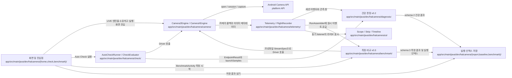
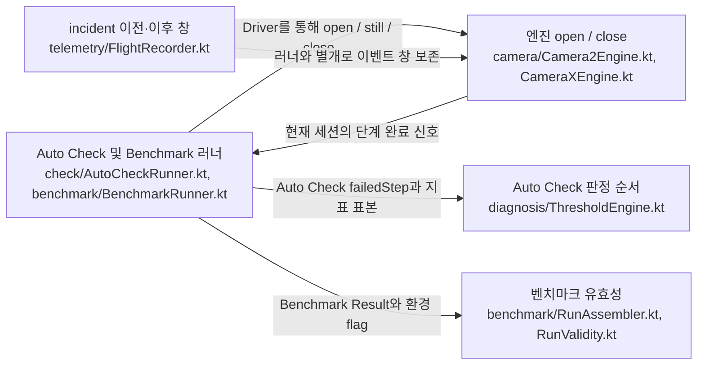

# 아키텍처 및 코드 구조

**수정할 기능과 연결된 코드부터 찾으세요.** 이 문서는 카메라 구동부터 이벤트 기록, 지표 계산, 결과 표시까지의 책임과 변경 시 지켜야 할 제약을 설명합니다.

| 지금 확인할 내용 | 이동할 절 |
| --- | --- |
| 앱의 전체 구조와 두 평가 경로를 이해합니다. | [앱의 역할과 평가 경로](#앱의-역할과-평가-경로) |
| 수정할 패키지를 찾습니다. | [패키지별 역할](#패키지별-역할) |
| 측정값이 만들어지는 순서를 추적합니다. | [주요 실행 흐름](#주요-실행-흐름) |
| 카메라 종료와 스레드 제약을 확인합니다. | [생명주기와 스레드](#생명주기와-스레드) |
| 변경 후 지켜야 할 규칙과 검증 방법을 확인합니다. | [변경 시 지켜야 할 제약](#변경-시-지켜야-할-제약) |

아직 빌드하지 않았다면 [빠른 시작](getting-started.md)을 먼저 진행하세요. 아래의 `코드 확인`은 구현을 대조했다는 뜻이며, 기기 실측을 뜻하지 않습니다.

## 앱의 역할과 평가 경로

<!-- omm:begin id=overview -->

**수정할 기능이 카메라 구동, 이벤트 기록, 지표 계산, 결과 표시 중 어디에 속하는지 먼저 확인하세요.** HALCamera는 이 네 책임을 나누어 구현한 단일 모듈 Android 앱입니다.

앱 모듈은 `:app`이며 `applicationId`는 `dev.halcamera`입니다. `minSdk`는 26, `compileSdk`는 36입니다. 카메라를 정해진 순서로 구동하고, 기록한 이벤트와 실행 시각을 측정값으로 바꿉니다. 결과는 기기 내부의 JSON 실행 파일에 저장합니다. 서버나 데이터베이스, 외부 서비스는 사용하지 않습니다.

### 네 단계의 책임

| 단계 | 담당 코드 | 확인할 내용 |
| --- | --- | --- |
| 카메라를 구동합니다. | `camera/CameraEngine.kt`와 두 엔진 구현 | 엔진은 하나만 카메라를 점유해야 합니다. 다음 카메라 열기는 `close(done)`으로 반환이 끝났음을 확인한 뒤 시작합니다. |
| 콜백을 기록합니다. | `telemetry/Telemetry.kt`, `FlightRecorder.kt` | 콜백을 `Event`로 바꾸어 메모리 링 버퍼에 저장합니다. |
| 지표를 계산합니다. | `check/`, `diagnosis/`, `benchmark/` | 러너가 기록한 실행 시각과 콜백 이벤트를 사용해 측정값·상태·비교 결과를 계산합니다. |
| 결과를 저장하고 표시합니다. | 실행 파일 작성 코드와 각 Activity | 측정값을 저장하는 과정과, 저장된 실행을 읽어 비교 상태를 계산하는 과정을 구분합니다. |

`Telemetry.callback()`은 `onCaptureStarted`, `onCaptureCompleted`, `onCaptureFailed`, `onCaptureBufferLost`를 이벤트로 기록합니다. 이벤트의 `atNs`는 `SystemClock.elapsedRealtimeNanos()`를 사용하고, 센서 타임스탬프는 별도의 `sensorNs` 필드에 담습니다.

러너와 지표 계산·비교 로직은 Android 의존성에서 분리되어 JVM 테스트로 확인할 수 있습니다. `AutoCheckRunner`와 `BenchmarkRunner`는 `Driver`, `Scheduler`, `clock`을 통해 카메라와 시계에 접근합니다. 같은 패키지에 있는 Activity, `ThermalTracker`, 파일 저장 어댑터까지 순수 Kotlin인 것은 아닙니다.

### 두 평가 경로의 차이

| 구분 | Auto Check·건강 표시 | 벤치마크 |
| --- | --- | --- |
| 평가 코드 | `check/`, `diagnosis/`를 사용합니다. | `benchmark/`를 사용합니다. |
| 결과의 의미 | v0.2 지표 상태인 PASS / WARN / FAIL / UNKNOWN과 종합 건강 수준을 판정합니다. | v0.3의 측정값과 IMPROVED / STABLE / REGRESSED / UNKNOWN 비교 상태를 제공합니다. |
| 화면 연결 | Home과 Auto Check는 건강 판정을 사용합니다. `MainActivity`의 LIVE에는 `HealthMonitor`가 연결됩니다. | LIVE에서 연 `BenchmarkActivity`가 실행·저장·비교 결과를 표시합니다. |

`HealthLevelV2`의 종합 건강 수준은 NORMAL / WARNING / ISSUE / INSUFFICIENT입니다. 지표별 상태와 종합 건강 수준은 서로 다른 값입니다.

2026-09-09의 [D-002 결정](_inputs/decisions.md)은 v0.2에서 v0.3으로 전환하고 M3까지 두 계층을 함께 유지하는 계획입니다. 전환 이유는 기록에 없어 **확인 필요**입니다.

`MainActivity`는 화면뿐 아니라 `FlightRecorder`, `Telemetry`, `HealthMonitor`, 권한 처리, 카메라 열기, incident 내보내기와 CPU 샘플링도 관리합니다. 이 클래스를 수정할 때는 화면 표시와 실행 동작을 함께 확인해야 합니다.

`BenchmarkActivity`는 `BenchmarkRunner`의 카메라 재열기 반복과 관측 세션을 실행합니다. 완료 후 `RunAssembler`로 결과를 조립하고 `BenchmarkReport`로 저장합니다. 이어서 기준 실행인 baseline 또는 이전 실행을 골라 `RegressionDetector`로 비교합니다. `RegressionDetector`는 두 실행의 저장된 측정값을 비교하는 순수 계산 로직입니다.

2026-09-08의 D-001 결정은 Camera2를 측정 경로로, CameraX를 비교 경로로 유지하는 것입니다. 두 엔진을 선택한 이유도 기록에 없어 **확인 필요**입니다.

### 코드를 처음 읽는 순서

아래 경로는 `app/src/main/java/dev/halcamera/`를 기준으로 합니다.

1. `camera/CameraEngine.kt`에서 엔진이 지켜야 할 열기·닫기 계약을 확인합니다.
2. `telemetry/Telemetry.kt`와 `FlightRecorder.kt`에서 이벤트 이름과 보존 방식을 확인합니다.
3. `check/AutoCheckRunner.kt`에서 엔드포인트별 실행 순서와 실패 처리를 읽습니다.
4. `check/CheckEvaluator.kt`에서 러너 결과와 이벤트가 지표로 바뀌는 지점을 확인합니다.
5. `MainActivity.kt`에서 화면과 실행 코드가 연결되는 방식을 확인합니다.

근거와 검토 정보

- 근거 파일: `app/src/main/java/dev/halcamera/diagnosis/Model.kt`, `app/build.gradle.kts`, `app/src/main/java/dev/halcamera/MainActivity.kt`, `app/src/main/java/dev/halcamera/camera/CameraEngine.kt`, `app/src/main/java/dev/halcamera/telemetry/Telemetry.kt`, `app/src/main/java/dev/halcamera/telemetry/FlightRecorder.kt`, `app/src/main/java/dev/halcamera/check/AutoCheckRunner.kt`, `app/src/main/java/dev/halcamera/check/CheckEvaluator.kt`, `app/src/main/java/dev/halcamera/benchmark/BenchmarkRunner.kt`, `app/src/main/java/dev/halcamera/benchmark/BenchmarkActivity.kt`, `app/src/main/java/dev/halcamera/benchmark/RunAssembler.kt`, `app/src/main/java/dev/halcamera/benchmark/RegressionDetector.kt`
- 설계 결정: `D-001`, `D-002`
- 근거 수준: 코드 확인
- 검토 2026-09-10 @ `4e9e8c1` · Codex

<!-- omm:end id=overview -->

## 전체 구조도

그림을 클릭하면 확대 화면이 열립니다. 키보드에서는 Tab으로 그림을 선택한 뒤 Enter 또는 Space를 누르세요.

<!-- omm:begin id=overall-diagram -->

근거와 검토 정보

- 근거: `.omm/overall-architecture/diagram`
- 근거 수준: 코드 확인

<!-- omm:end id=overall-diagram -->

## 패키지별 역할

<!-- omm:begin id=module-roles -->

**작업할 기능에 해당하는 패키지부터 여세요.** 아래 경로는 `app/src/main/java/dev/halcamera/`를 기준으로 합니다. 구조도에 표시한 영역은 실제 패키지와 항상 일대일로 대응하지는 않습니다.

### 카메라 실행과 평가

| 영역 | 역할과 수정 시 확인할 내용 |
| --- | --- |
| `camera/` | `CameraEngine`의 계약과 `Camera2Engine`·`CameraXEngine` 구현을 제공합니다. Camera2는 기본 크기 선택과 벤치마크용 `StreamSpec` 경로를 구분합니다. 세션 콜백과 `close(done)` 완료 통지를 러너에 전달합니다. |
| `check/` | 엔드포인트 열거, `AutoCheckRunner`의 상태 전이, `CheckEvaluator`의 평가와 `CheckActivity`를 담당합니다. 기본 관측 시간은 10초이며 촬영은 3회입니다. |
| `diagnosis/` | Auto Check와 LIVE 건강 표시에 사용하는 v0.2 지표·임계값·진단 로직입니다. `MetricExtractor`와 `UnknownReason`은 벤치마크도 사용합니다. 모든 화면이 이 건강 판정을 사용하는 것은 아닙니다. |
| `benchmark/` | 프로파일, 러너, 지표 계산, 유효성, schema 3 저장과 실행 비교를 담당합니다. 계산 로직과 Android 의존성이 있는 `BenchmarkActivity`·`ThermalTracker`를 구분합니다. |
| `home/`, `check/`, `benchmark/`, `MainActivity.kt` | `HomeActivity`, `CheckActivity`, `BenchmarkActivity`, `MainActivity`의 네 화면을 구성합니다. Home이 시작 화면이며, LIVE의 벤치마크 버튼은 `BenchmarkActivity`를 엽니다. 뷰는 Kotlin 코드로 생성합니다. |

벤치마크 결과가 잘못 표시되면 계산 코드와 표시 코드를 나누어 확인하세요. `BenchmarkActivity`는 `RunAssembler`, `BenchmarkReport`, `BaselineManager`, `RegressionDetector`를 입출력 실행기에서 호출합니다. 메인 스레드로 돌아온 뒤 `ResultPresenter`와 `ComparePresenter`의 결과를 표시합니다. 시작 카드와 진행률에는 `StartCardPresenter`와 `ProgressPresenter`를 사용합니다.

### 기록·저장·화면 지원

| 영역 | 역할과 수정 시 확인할 내용 |
| --- | --- |
| `telemetry/` | `Telemetry`가 콜백을 이벤트로 바꾸고, `FlightRecorder`가 링 버퍼와 incident 전후의 이벤트를 보존합니다. `IncidentExporter`는 이벤트와 환경 정보를 ZIP으로 내보냅니다. 라이브 listener는 기록 스레드에서 동기 실행됩니다. |
| `report/`, `baseline/`, `benchmark/` | 앱 내부 파일과 SharedPreferences를 사용합니다. `HealthReport`는 Auto Check 결과, `BenchmarkReport`는 schema 3 실행과 이벤트, `BenchmarkStore`는 실행 인덱스, `BaselineManager`는 비교 기준 포인터를 관리합니다. 공유는 사용자가 FileProvider를 통해 시작합니다. |
| `ui/` | `ScopeView`, `StripView`, `TimelineView`가 Canvas에 관측 데이터를 그립니다. `Look`은 공통 시각 설정을 제공합니다. |
| Android 카메라 스택 | 앱의 직접 측정 범위 밖에 있습니다. 앱이 기록한 API·콜백 시각을 HAL 내부 처리 시간이나 프리뷰 표시 완료 시각으로 해석하지 않습니다. |

근거와 검토 정보

- 근거 파일: `app/src/main/java/dev/halcamera/camera/CameraEngine.kt`, `app/src/main/java/dev/halcamera/check/AutoCheckRunner.kt`, `app/src/main/java/dev/halcamera/check/CheckEvaluator.kt`, `app/src/main/java/dev/halcamera/benchmark/BenchmarkActivity.kt`, `app/src/main/java/dev/halcamera/benchmark/RunAssembler.kt`, `app/src/main/java/dev/halcamera/telemetry/FlightRecorder.kt`, `app/src/main/java/dev/halcamera/MainActivity.kt`
- 근거 수준: 코드 확인
- 검토 2026-09-10 @ `4e9e8c1` · Codex

<!-- omm:end id=module-roles -->

## 주요 실행 흐름

<!-- omm:begin id=runtime-flow -->

**실행 실패는 러너 결과에서, 측정값의 차이는 이벤트와 계산 규칙에서 확인하세요.** Auto Check와 벤치마크는 서로 다른 실행 순서와 워밍업 기준을 사용합니다.

### Auto Check의 실행 순서

`AutoCheckRunner`는 엔드포인트마다 `Driver`를 호출해 다음 순서로 검사합니다.

1. OPEN과 CONFIGURE 단계에서 카메라를 열고 세션을 구성합니다.
2. FIRST_FRAME을 확인한 뒤 OBSERVE 단계에서 고정된 10초 동안 관측합니다.
3. STILL 촬영을 3회 실행합니다.
4. CLOSE로 카메라를 닫고 다음 엔드포인트로 이동합니다.

어느 단계에서든 타임아웃이 발생하면 해당 엔드포인트에 `hardFailure`와 실패 단계를 기록하고 CLOSE로 이동합니다. 다음 엔드포인트는 계속 검사하며, 실패한 단계를 자동으로 재시도하지 않습니다.

### 이벤트 기록과 러너 기록

| 기록 | 담당 코드 | 담는 내용 |
| --- | --- | --- |
| 콜백 이벤트 | `Telemetry.callback(sessionId, alive)`와 `FlightRecorder.record()` | 프레임워크가 보낸 프레임·요청·상태 정보를 담습니다. |
| 실행 시각 | `AutoCheckRunner`의 `EndpointResult` | 단계 시작·완료 시각에서 구한 지연과 관측 창의 범위를 담습니다. |

`onCaptureStarted`는 `capture_started`와 `request_observed`를 기록합니다. `onCaptureCompleted`는 AE/AF/AWB 상태, 노출, ISO, 프레임 길이, 센서 타임스탬프를 `capture_result`로 기록합니다. `onCaptureFailed`와 `onCaptureBufferLost`는 각각 `capture_failed`와 `buffer_lost`를 남깁니다.

각 콜백은 먼저 `alive()`를 확인합니다. 이미 닫힌 세션에서 늦게 도착한 콜백은 기록하지 않습니다.

러너 결과의 `openMs`, `configureMs`, `firstStartedMs`, `closeMs`, `stillLatenciesMs`는 대응하는 시각의 차이입니다. 실행 지연과 촬영 지연인 1.x·2.x 지표의 입력이 됩니다. 러너는 `observeStartNs`와 `observeEndNs`로 관측 창을 지정하고, 이벤트는 그 창에서 일어난 일을 제공합니다.

### Auto Check 지표를 계산하는 순서

`CheckEvaluator.evaluate(result, events, baseline, mediaPerformanceClass)`가 두 기록을 결합합니다.

1. 관측 창이 있으면 `MetricExtractor.observe()`로 H.x 지표를 계산합니다.
2. `EndpointResult.launchSamples()`로 1.x·2.x 지표를 만듭니다. 실패한 단계는 hard failure로, 실행하지 않은 단계는 `NOT_RUN`으로 표시합니다.
3. baseline이 있으면 아래의 장면 조건을 대조해 3A 수렴 지표를 비교할 수 있는지 판단합니다.
4. v0.2에서 실행하지 않는 2.1·2.4·2.6·2.7·3.x는 `NOT_RUN`으로, 1.5는 `NOT_MEASURABLE`로 표시합니다.
5. `ThresholdEngine`, `DiagnosisRules`, `HealthComposer` 순서로 상태·진단·건강 수준을 만듭니다. 기기 전체의 건강 수준은 엔드포인트 중 가장 나쁜 수준입니다.

#### 워밍업과 표본 수

Auto Check는 관측 창의 첫 결과 프레임 5개(`WARMUP_FRAMES = 5`)를 H.1~H.5의 간격·partial·버퍼·stall 통계에서 제외합니다. 3A 수렴 계산에는 제외 전 프레임도 사용합니다.

첫 5개를 제외한 steady 프레임이 15개 미만이면 H.1~H.8에서 측정 가능한 지표 값은 `null`이 됩니다. 이때 `unknownReason`은 `INSUFFICIENT_SAMPLES`입니다.

#### 장면 조건이 다른 경우

현재 실행과 baseline의 **ISO × 노출 시간 p50**이 모두 양수여야 비율을 비교합니다. 비율이 4를 초과하거나 1/4 미만이면, 다른 `unknownReason`이 없는 H.6·H.7·H.8에 `CONDITION_MISMATCH`를 지정합니다. 장면 조건이 달라 3A 수렴을 비교하기 어렵다는 뜻입니다.

평가가 끝나면 결과를 실행 파일에 저장하고 화면에서 읽습니다.

### 결과가 예상과 다를 때 확인하는 순서

1. `EndpointResult.hardFailure`와 `failedStep`에서 타임아웃이 난 단계를 확인합니다.
2. 이벤트의 `session`과 관측 창을 확인합니다. 계산 대상은 같은 세션에서 관측 창 안에 기록된 `capture_result`입니다.
3. 값이 `null`이면 `unknownReason`을 확인합니다. `NOT_RUN`, `INSUFFICIENT_SAMPLES`, `CONDITION_MISMATCH`, `NOT_MEASURABLE`은 각각 다른 원인입니다.
4. 상태 판정이 예상과 다르면 v0.2 임계값을 정의한 `ThresholdTable`을 확인합니다.

프레임 연결에 필요한 `capture_started`, `request_observed`, `image_available`은 관측 창 밖에서도 찾습니다. 첫 간격을 계산할 때는 창 직전 결과의 센서 타임스탬프도 사용합니다. H.9의 실패 이벤트 개수는 관측 창 안에서만 셉니다.

### 벤치마크의 실행과 중단 조건

`BenchmarkRunner`는 카메라를 닫았다가 다시 여는 warm reopen을 `launchIterations`만큼 반복합니다. 이후 관측 세션을 하나 더 열어 WARMUP, OBSERVE, STILL, CLOSE 순서로 진행합니다.

실패한 사이클에는 `failed = true`를 기록하고 다음 사이클을 실행합니다. 연속 실패가 `maxConsecutiveFailures`에 도달하거나 관측 세션이 실패하면 중단합니다. 기본 연속 실패 한도는 3회이며, 명시적인 abort로도 실행을 종료할 수 있습니다.

LIVE에서 전달한 카메라 ID와 엔진 이름은 시작 카드에 사용합니다. 실제 벤치마크는 프로파일에 맞춰 Camera2로 전환합니다. 시작 조건과 6단계 진행률의 표시 모델은 각각 `StartCardPresenter`와 `ProgressPresenter`가 만듭니다.

### 벤치마크의 저장과 비교

1. `MainActivity`가 LIVE에서 `BenchmarkActivity`를 엽니다.
2. 실행이 끝나면 `BenchmarkActivity.finishRun()`이 러너 결과와 기록된 이벤트를 `RunAssembler.assemble()`에 전달합니다.
3. `RunAssembler`는 `BenchmarkEvaluator`와 `RunValidityEvaluator`로 측정값과 유효성을 계산합니다. Activity는 `BenchmarkReport.write()`로 schema 3 실행 파일과 이벤트를 저장합니다.
4. `BaselineManager`에서 지정한 baseline을 선택합니다. baseline이 없으면 이전의 적격 실행을 reference로 선택하고, `RegressionDetector.compare()`로 비교합니다.
5. 메인 Handler에서 RESULT 화면으로 전환합니다. `renderResult()`는 `ResultPresenter`, `renderCompare()`는 `ComparePresenter`로 결과를 표시합니다.

조립·파일 저장·기준 실행 읽기·비교는 `io` 실행기에서 처리합니다. `toggleBaseline()`으로 기준을 설정하거나 해제하면 기준 선택과 비교 계산을 다시 수행합니다.

벤치마크의 워밍업 제외 수는 고정된 5개가 아닙니다. `RunAssembler.observe()`는 관측 세션의 첫 결과부터 프레임을 모으고, 관측 시작 전에 도착한 프레임 수를 계산해 간격·버퍼 통계에서 제외합니다. 3A 수렴은 세션의 첫 결과부터 계산합니다.

근거와 검토 정보

- 근거 파일: `app/src/main/java/dev/halcamera/telemetry/Telemetry.kt`, `app/src/main/java/dev/halcamera/telemetry/FlightRecorder.kt`, `app/src/main/java/dev/halcamera/check/AutoCheckRunner.kt`, `app/src/main/java/dev/halcamera/check/CheckEvaluator.kt`, `app/src/main/java/dev/halcamera/diagnosis/MetricExtractor.kt`, `app/src/main/java/dev/halcamera/benchmark/BenchmarkRunner.kt`, `app/src/main/java/dev/halcamera/benchmark/BenchmarkActivity.kt`, `app/src/main/java/dev/halcamera/benchmark/RunAssembler.kt`, `app/src/main/java/dev/halcamera/benchmark/RegressionDetector.kt`, `app/src/main/java/dev/halcamera/benchmark/ResultPresenter.kt`, `app/src/main/java/dev/halcamera/benchmark/ComparePresenter.kt`, `app/src/main/java/dev/halcamera/benchmark/BaselineManager.kt`, `app/src/main/java/dev/halcamera/MainActivity.kt`
- 근거 수준: 코드 확인
- 검토 2026-09-10 @ `4e9e8c1` · Codex

<!-- omm:end id=runtime-flow -->

### 이벤트와 결과가 전달되는 경로

```mermaid
graph LR
    framework-callbacks["Camera2 콜백\nplatform API"]
    event-record["Telemetry / FlightRecorder\ntelemetry/Telemetry.kt, FlightRecorder.kt"]
    runner-marks["AutoCheckRunner / BenchmarkRunner\ncheck/AutoCheckRunner.kt, benchmark/BenchmarkRunner.kt"]
    frame-observations["FrameObservation\ndiagnosis/MetricExtractor.kt"]
    metric-samples["Auto Check 표본\ncheck/CheckEvaluator.kt"]
    judged-states["상태·진단·건강 판정\ndiagnosis/ThresholdEngine.kt, DiagnosisRules.kt, HealthComposer.kt"]
    benchmark-metrics["RunAssembler / BenchmarkEvaluator\nbenchmark/RunAssembler.kt, BenchmarkEvaluator.kt"]
    run-json["실행 파일\nreport/HealthReport.kt, benchmark/BenchmarkReport.kt"]
    rendered-screens["저장 결과 및 실행 요약\ncheck/CheckActivity.kt, benchmark/BenchmarkActivity.kt"]
    framework-callbacks -->|"세션·프레임·센서 시각을 포함한 이벤트"| event-record
    framework-callbacks -->|"Driver의 단계 완료 신호"| runner-marks
    event-record -->|"관측 창 결과를 start/request/image에 연결"| frame-observations
    frame-observations -->|"Auto Check 워밍업 제외 후 H.1~H.8"| metric-samples
    runner-marks -->|"EndpointResult의 1.x·2.x 지연"| metric-samples
    metric-samples -->|"임계값과 baseline 적용"| judged-states
    runner-marks -->|"BenchmarkRunner.Result의 cycles·stills"| benchmark-metrics
    event-record -->|"RunAssembler의 관측 세션·H.9 입력"| benchmark-metrics
    judged-states -->|"schema 2 저장"| run-json
    benchmark-metrics -->|"유효성·측정값을 schema 3 저장"| run-json
    run-json -->|"저장 결과와 기준 실행을 비교해 결과·비교 테이블 표시"| rendered-screens
```

<!-- omm:begin id=runtime-diagram -->

근거와 검토 정보

- 근거: `.omm/data-flow/diagram`
- 근거 수준: 코드 확인

<!-- omm:end id=runtime-diagram -->

## 생명주기와 스레드

### 카메라 열기와 닫기

러너가 `Driver`를 통해 카메라를 열고 닫습니다. 다음 실행으로 넘어가기 전에 현재 엔진의 `close(done)` 완료 통지를 확인해야 합니다. incident 이벤트 보존은 러너와 별도로 동작합니다.

<!-- omm:begin id=lifecycle-diagram -->

근거와 검토 정보

- 근거: `.omm/state-transitions/diagram`
- 근거 수준: 코드 확인

<!-- omm:end id=lifecycle-diagram -->

### 스레드별 작업

| 실행 위치 | 현재 확인한 역할 |
| --- | --- |
| `MainActivity`의 메인 Handler | 화면 갱신을 처리합니다. 카메라 작업용 `cameraWorker`, 입출력용 `io`와 구분합니다. |
| `BenchmarkActivity`의 `io` 실행기 | `finishRun()`에서 결과 조립, 파일 저장, 기준 실행 읽기와 비교를 수행합니다. |
| `BenchmarkActivity`의 메인 Handler | 비교가 끝나면 결과 화면을 표시합니다. |

카메라 콜백 전체의 실행 스레드와 종료 순서는 아직 정리하지 않았습니다. 관련 코드를 바꿀 때는 콜백이 어느 스레드에서 호출되는지 별도로 확인해야 합니다.

### 아직 정리하지 않은 리소스 계약

세션, Surface, 버퍼의 소유권과 해제 시점은 **확인 필요**입니다. 구현을 수정하기 전에 `CameraEngine`의 단일 점유 규칙과 `close(done)` 완료 조건부터 확인하세요.

## 변경 시 지켜야 할 제약

<!-- omm:begin id=constraints -->

**카메라 점유, 시계, 계산 로직의 경계를 유지하세요.** 다음 규칙을 바꾸면 실행 순서나 측정값의 의미가 달라질 수 있습니다.

### 실행과 측정의 제약

1. 카메라를 점유하는 `CameraEngine`은 하나만 유지합니다. `close(done)`은 기기를 실제로 반환한 뒤 완료 콜백을 호출해야 합니다. 다음 open이 이 콜백에서 시작됩니다.
2. 앱의 시각은 `elapsedRealtimeNanos`를 사용합니다. 센서 시각은 기기가 `SENSOR_INFO_TIMESTAMP_SOURCE_REALTIME`을 보고할 때만 앱 시각과 직접 비교합니다.
3. 카메라 열거에는 공개 Camera2 API만 사용합니다. 숨겨진 ID는 탐색하지 않습니다. 논리 카메라에 속한 물리 카메라는 열지 않고 `independentlyOpenable = false`로 기록합니다.
4. 이미지 픽셀은 저장하지 않습니다. incident 번들에는 메타데이터와 이벤트만 담습니다.

### 계산과 저장의 제약

1. 지표 계산·평가·러너·모델 코드는 Android import가 없는 순수 Kotlin으로 유지합니다. `MetricExtractor`, `ThresholdEngine`, `AutoCheckRunner`, `BenchmarkEvaluator`, `RunValidityEvaluator`가 이 원칙을 따릅니다. `AutoCheckRunner`는 `Driver`, `Scheduler`, `clock`으로 카메라와 시계에 접근합니다.
2. `org.json`은 파일 입출력 경계에서 사용합니다. `BenchmarkReport`, `HealthReport`, `IncidentExporter`, `*Store` 등이 이에 해당합니다. 데이터 계약은 snake_case 키를 사용하는 `Map<String, Any?>`로 전달합니다.
3. 임계값은 평가 계층마다 한 곳에서 관리합니다. v0.2는 `ThresholdTable`, v0.3은 `RegressionRules`를 사용합니다. 값을 바꿀 때는 관련 문서도 함께 수정합니다.

근거와 검토 정보

- 근거 파일: `app/src/main/java/dev/halcamera/camera/CameraEngine.kt`, `app/src/main/java/dev/halcamera/check/AutoCheckRunner.kt`, `app/src/main/java/dev/halcamera/check/CameraEndpointResolver.kt`, `app/src/main/java/dev/halcamera/telemetry/IncidentExporter.kt`, `app/src/main/java/dev/halcamera/diagnosis/ThresholdTable.kt`, `app/src/main/java/dev/halcamera/benchmark/RegressionRules.kt`, `app/src/main/java/dev/halcamera/benchmark/BenchmarkReport.kt`
- 근거 수준: 코드 확인
- 검토 2026-09-10 @ `4e9e8c1` · Codex

<!-- omm:end id=constraints -->

## 변경 후 검증

Android 의존성이 없는 러너와 평가 로직은 JVM 단위 테스트로 확인할 수 있습니다. 저장소 루트에서 실행하세요.

~~~powershell
.\gradlew.bat :app:testDebugUnitTest
~~~

`CheckEvaluatorTest`, `AutoCheckRunnerTest`, `MetricExtractorTest`와 `BenchmarkRunner` 관련 테스트에서 단계 전이와 계산 규칙을 확인합니다. 테스트가 통과해도 문서의 조건·예외가 코드와 맞는지 대조해야 합니다. 기기에서의 검증은 별도로 기록합니다.

## 미완성 기능과 추가 검증

<!-- omm:begin id=open-questions -->

다음 항목은 구조 스캔에서 확인한 제약이나 추가 검증이 필요한 사항입니다.

- BenchmarkEvaluator는 촬영 중 프리뷰 stall 지표 2.7을 아직 NOT_RUN으로 반환합니다. H.9의 콜백 실패 수는 RunAssembler가 관측 창에서 수집합니다.
- 결과·비교 UI가 연결되어 있습니다. baseline 설정·해제와 이전 실행 선택 시 비교 결과가 다시 계산되므로 이 경로를 함께 검증해야 합니다.
- MainActivity는 화면 구성과 엔진 수명주기·권한·incident export를 함께 관리합니다. 콜백 실행 스레드는 변경 시 별도로 검증해야 합니다.
- HealthMonitor의 상태는 스레드 안전하지 않습니다. 호출 스레드 제약을 유지해야 합니다.
- 일부 v0.3 로직은 diagnosis의 MetricExtractor와 UnknownReason을 사용하므로 구 평가 계층을 삭제하기 전에 공통 의존성을 분리해야 합니다.

**후속 작업**

1. 연결된 결과·비교 화면에서 baseline 설정·해제와 이전 실행 선택, 앱 중단 시나리오를 함께 회귀 검증합니다.
2. 촬영 중 프리뷰 stall(2.7)의 관측 구간과 계산 규칙을 정의하고 구현합니다.
3. 스레드별 콜백과 리소스 소유권 설명을 보완합니다. 기기 검증 주장은 사람 입력에 근거 기록이 있을 때만 추가합니다.

근거와 검토 정보

- 근거: `.omm/overall-architecture/concern.md`, `.omm/overall-architecture/todo.md`
- 근거 수준: 설계 의도 / 추정

<!-- omm:end id=open-questions -->

## 문서 검토 상태

기준 앱 버전과 검토 커밋 확인

<!-- omm:begin id=status -->

- 검증 기준 앱 버전: 0.3.1 (versionCode 4)

| 항목 | 최신성 | 검토 |
| --- | --- | --- |
| 구조 원본 `data-flow` | 최신 | 검토 2026-09-10 @ `4373a38` · Codex |
| 구조 원본 `overall-architecture` | 최신 | 검토 2026-09-10 @ `4373a38` · Codex |
| 구조 원본 `state-transitions` | 최신 | 검토 2026-09-10 @ `4373a38` · Codex |
| 원고 `overview` | 최신 | 검토 2026-09-10 @ `4e9e8c1` · Codex |
| 원고 `module-roles` | 최신 | 검토 2026-09-10 @ `4e9e8c1` · Codex |
| 원고 `runtime-flow` | 최신 | 검토 2026-09-10 @ `4e9e8c1` · Codex |
| 원고 `constraints` | 최신 | 검토 2026-09-10 @ `4e9e8c1` · Codex |

<!-- omm:end id=status -->

표의 `최신`은 기록된 근거와 원고가 검토 이후 바뀌지 않았다는 뜻입니다. 모든 기기에서 동작을 검증했다는 뜻은 아닙니다.

## 관련 설계 자료

- [v0.2 제품 정의](https://github.com/TTolsun/hal-camera/blob/main/docs/PRODUCT-v0.2.md)와 [v0.3 전환 계획](https://github.com/TTolsun/hal-camera/blob/main/docs/PLAN-BenchMarker-v0.3.md)을 확인할 수 있습니다.
- [지표 정의](https://github.com/TTolsun/hal-camera/blob/main/docs/METRICS.md)에서 측정값의 의미를 확인할 수 있습니다.
- [설계 결정 기록](_inputs/decisions.md)에서 확정한 선택과 아직 기록하지 않은 이유를 구분할 수 있습니다.
- 구조 원본은 저장소의 `.omm/`에 있으며 `omm view`로 열람할 수 있습니다.

**다음 단계:** [디버깅 절차](troubleshooting.md#앱과-프레임워크hal을-구분하세요)에 따라 원시 이벤트와 계산 결과를 대조하세요.
