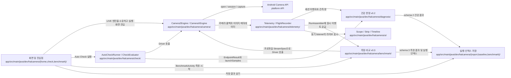
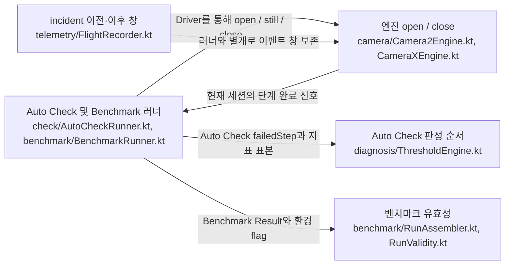

# 아키텍처 및 코드 구조

> 이 페이지는 HALCamera 앱이 카메라 콜백을 어떻게 기록하고 지표로 바꾸는지, 그 코드가 어디에 있는지 설명합니다. 읽고 나면 기능을 수정하기 전에 어느 파일을 열어야 하고 어떤 제약을 지켜야 하는지 판단할 수 있습니다.

- 대상: 코드를 처음 읽는 개발자, 기능을 수정하기 전에 영향 범위를 알아야 하는 개발자
- 선행 조건: [개발 환경 및 빠른 시작](getting-started.md)에 따라 빌드가 되는 상태
- 검증 기준: 아래 상태 표를 참고합니다. 자동 생성 블록은 표시된 커밋을 기준으로 검토되었습니다.

<!-- omm:begin id=status -->

- 검증 기준 앱 버전: 0.3.1 (versionCode 4)

| 항목 | 최신성 | 검토 |
| --- | --- | --- |
| 구조 원본 `data-flow` | 최신 | 검토 2026-09-10 @ `037db0d` · Codex |
| 구조 원본 `overall-architecture` | 최신 | 검토 2026-09-10 @ `037db0d` · Codex |
| 구조 원본 `state-transitions` | 최신 | 검토 2026-09-10 @ `037db0d` · Codex |
| 원고 `overview` | 최신 | 검토 2026-09-10 @ `037db0d` · Codex |
| 원고 `runtime-flow` | 최신 | 검토 2026-09-10 @ `037db0d` · Codex |

<!-- omm:end id=status -->

## 개요

<!-- omm:begin id=overview -->

HALCamera는 단일 모듈 Android 앱입니다(`:app`, applicationId `dev.halcamera`, minSdk 26, compileSdk 36). 기기 카메라를 정해진 순서로 구동하면서 프레임워크가 보내는 콜백을 전부 기록하고, 그 기록을 지표로 바꿔 기기 내부 저장소에 JSON 실행 파일로 남깁니다. 서버, 데이터베이스, 외부 서비스는 없습니다. 앱 바깥에 있는 것은 Android 카메라 스택뿐입니다.

### 네 단계의 책임

동작은 한 방향으로 흐르는 네 단계로 나뉩니다.

1. **카메라 구동** — `camera/` 패키지. `CameraEngine` 인터페이스 뒤에 `Camera2Engine`과 `CameraXEngine`이 있습니다. 카메라를 점유하는 엔진은 항상 하나뿐이어야 하며, `close(done)`은 기기를 실제로 반납한 뒤에만 콜백을 호출합니다. 다음 open이 그 콜백에서 시작되기 때문입니다.
2. **기록** — `telemetry/` 패키지. `Telemetry.callback()`이 만들어 주는 `CaptureCallback`이 `onCaptureStarted`, `onCaptureCompleted`, `onCaptureFailed`, `onCaptureBufferLost`를 각각 `Event`로 바꿔 `FlightRecorder` 링 버퍼에 넣습니다. 모든 `atNs`는 `SystemClock.elapsedRealtimeNanos()` 하나의 시계를 씁니다. 센서 타임스탬프는 `sensorNs`에 따로 담깁니다.
3. **평가** — `check/`, `diagnosis/`, `benchmark/` 패키지. 러너·지표 계산·비교 로직은 Android 의존성에서 분리돼 JVM 단위 테스트로 검증됩니다. 같은 패키지의 Activity, ThermalTracker, 파일 저장 어댑터는 Android 의존성이 있으므로 패키지 전체가 순수 Kotlin인 것은 아닙니다. 러너(`AutoCheckRunner`, `BenchmarkRunner`)는 카메라와 시계를 `Driver`, `Scheduler`, `clock` 파라미터를 통해서만 만집니다.
4. **저장과 표시** — 평가가 끝난 실행 결과는 파일로 기록되고, 화면은 그 파일을 다시 읽습니다. 측정값을 읽는 경로와 비교 상태를 계산하는 경로를 구분합니다. RegressionDetector는 저장된 측정값 두 개로 비교 결과를 계산하는 순수 로직입니다.

### 평가 계층이 두 개인 이유

`diagnosis/`는 v0.2의 건강 판정 계층(PASS / WARN / FAIL)이고, `benchmark/`는 v0.3 Camera BenchMarker의 측정 전용 데이터 계약(IMPROVED / STABLE / REGRESSED / UNKNOWN)입니다. 2026-09-09에 v0.2를 중단하고 v0.3으로 전환하기로 결정했기 때문에(D-002) 두 계층이 M3까지 공존합니다. 전환 이유 자체는 결정 기록에 아직 적혀 있지 않으므로 확인 필요입니다.

Home·Auto Check는 v0.2 건강 판정을 사용하고, LIVE에서 진입하는 BenchmarkActivity는 v0.3 측정 경로를 실행합니다. `MainActivity`가 `FlightRecorder`, `Telemetry`, `HealthMonitor`를 직접 들고 있고, 카메라 열기, 권한 처리, incident 내보내기, CPU 샘플링까지 한 클래스에서 처리합니다. `BenchmarkRunner`는 코드에 존재하며 warm reopen 반복과 관측 세션을 구동하는 상태 기계입니다. BenchmarkActivity가 러너를 구동하고, 완료 후 RunAssembler로 결과를 조립해 BenchmarkReport로 저장합니다.

Camera2 엔진과 CameraX 엔진을 둘 다 유지하는 것은 2026-09-08의 결정입니다(D-001). Camera2가 측정 경로, CameraX가 비교 경로입니다. 이 결정의 이유는 결정 기록에 아직 없으므로 확인 필요입니다.

### 코드를 처음 읽는 순서

1. `camera/CameraEngine.kt` — 엔진이 지켜야 할 계약을 봅니다.
2. `telemetry/Telemetry.kt`와 `telemetry/FlightRecorder.kt` — 무엇이 어떤 이름의 이벤트로 기록되는지 봅니다. 이 두 파일을 합쳐도 200줄이 되지 않습니다.
3. `check/AutoCheckRunner.kt` — 엔드포인트마다 OPEN, CONFIGURE, FIRST_FRAME, OBSERVE(10초), STILL 3회, CLOSE 순서로 진행하는 상태 기계입니다.
4. `check/CheckEvaluator.kt` — 러너 결과와 이벤트가 만나서 지표가 되는 지점입니다.
5. `MainActivity.kt` — 위 요소들을 조립하는 곳입니다. 566줄이므로 마지막에 읽습니다.

<sub>근거 파일: `app/build.gradle.kts`, `app/src/main/java/dev/halcamera/MainActivity.kt`, `app/src/main/java/dev/halcamera/camera/CameraEngine.kt`, `app/src/main/java/dev/halcamera/telemetry/Telemetry.kt`, `app/src/main/java/dev/halcamera/telemetry/FlightRecorder.kt`, `app/src/main/java/dev/halcamera/check/AutoCheckRunner.kt`, `app/src/main/java/dev/halcamera/check/CheckEvaluator.kt`, `app/src/main/java/dev/halcamera/benchmark/BenchmarkRunner.kt`, `app/src/main/java/dev/halcamera/benchmark/BenchmarkActivity.kt`, `app/src/main/java/dev/halcamera/benchmark/RunAssembler.kt`, `app/src/main/java/dev/halcamera/benchmark/RegressionDetector.kt` · 설계 결정: `D-001`, `D-002` · 근거 수준: 코드 확인 · 검토 2026-09-10 @ `037db0d` · Codex</sub>

<!-- omm:end id=overview -->

## 상세 내용

### 4.1 전체 구조

<!-- omm:begin id=overall-diagram -->



<sub>근거: `.omm/overall-architecture/diagram` · 근거 수준: 코드 확인</sub>

<!-- omm:end id=overall-diagram -->

### 4.2 모듈과 패키지 역할

패키지는 `app/src/main/java/dev/halcamera/` 아래에 있습니다. 아래 목록은 구조 스캔에서 인식한 영역이며, 실제 패키지 이름과 일대일로 대응하지는 않습니다.

<!-- omm:begin id=module-roles -->

- **benchmark** — benchmark/는 프로파일, 러너, 지표 계산, 유효성, schema 3 저장, baseline·비교 로직을 포함합니다. BenchmarkActivity와 ThermalTracker는 Android 의존성이 있고 순수 계산 로직과 분리됩니다. 실행 완료는 RunAssembler와 BenchmarkReport까지 연결되며, ResultPresenter 비교 UI는 Activity에서 아직 호출되지 않습니다. (하위: `benchmark-evaluator`, `benchmark-model`, `benchmark-profile`, `benchmark-runner`, `build-identity`, `comparison`, `metric-info`, `regression-rules`, `run-assembler`, `run-validity`)
- **camera-engines** — camera/는 CameraEngine 인터페이스와 Camera2Engine·CameraXEngine을 제공합니다. Camera2Engine은 기본 크기 선택 경로와 벤치마크용 명시적 StreamSpec 경로를 구분합니다. 세션별 콜백과 close(done) 완료 통지가 러너에 연결됩니다. (하위: `camera2-engine`, `camerax-engine`, `engine-interface`)
- **check-runner** — check/는 카메라 엔드포인트 열거, AutoCheckRunner 상태 기계, CheckEvaluator 평가 및 CheckActivity를 포함합니다. Auto Check는 기본 10초 관측과 3회 촬영을 수행합니다. (하위: `check-evaluator`, `check-result`, `check-state-machine`, `endpoint-model`, `endpoint-resolver`)
- **diagnosis** — diagnosis/는 Auto Check와 LIVE 건강 표시가 사용하는 v0.2 지표·임계값·진단 로직입니다. MetricExtractor와 UnknownReason은 benchmark/에서도 공유합니다. 모든 화면이 이 건강 판정을 사용하는 것은 아닙니다. (하위: `diagnosis-model`, `diagnosis-rules`, `health-composer`, `health-monitor`, `metric-catalog`, `metric-extractor`, `threshold-engine`, `threshold-table`)
- **persistence** — 앱 내부 파일과 SharedPreferences를 사용합니다. HealthReport는 Auto Check 결과, BenchmarkReport는 schema 3 실행과 이벤트, BenchmarkStore는 실행 인덱스, BaselineManager는 비교 기준 포인터를 다룹니다. 공유는 FileProvider를 통해 사용자가 시작합니다. (하위: `baseline-store`, `benchmark-report`, `benchmark-store`, `health-report`)
- **platform-camera** — 측정 경계 바깥의 Android Camera2·CameraX와 카메라 스택입니다. 앱이 관측하는 API·콜백 시각을 HAL 내부 실행 시간이나 프리뷰 렌더링 완료 시각과 동일시하지 않습니다.
- **screens** — 앱에는 HomeActivity, MainActivity, CheckActivity, BenchmarkActivity 네 Activity가 있습니다. Home이 런처이고 LIVE의 벤치마크 버튼은 BenchmarkActivity를 엽니다. 뷰는 Kotlin으로 생성합니다. (하위: `benchmark-screen`, `check-screen`, `expert-screen`, `home-screen`, `look-tokens`, `run-summary`)
- **telemetry** — Telemetry는 Camera2 콜백을 이벤트로 변환하고 FlightRecorder는 메모리 링 버퍼와 incident 창을 관리합니다. IncidentExporter는 이벤트·환경을 ZIP으로 내보냅니다. 라이브 listener는 기록 스레드에서 동기 실행됩니다. (하위: `capture-callbacks`, `flight-recorder`, `incident-exporter`)
- **ui-widgets** — ui/는 ScopeView, StripView, TimelineView 및 Look의 공통 시각 설정을 포함합니다. 커스텀 View는 Canvas에 관측 데이터를 그립니다.

<sub>근거: `.omm/overall-architecture/*/description.md` · 근거 수준: 코드 확인</sub>

<!-- omm:end id=module-roles -->

### 4.3 주요 실행 흐름

<!-- omm:begin id=runtime-flow -->

Auto Check 한 번은 다음 순서로 진행됩니다. 사용자가 검사를 시작하면 `AutoCheckRunner`가 엔드포인트마다 OPEN, CONFIGURE, FIRST_FRAME, OBSERVE(고정 10초), STILL 3회, CLOSE 순서로 `Driver`를 호출합니다. 어느 단계든 타임아웃이 나면 그 엔드포인트의 hard failure로 기록하고 CLOSE로 넘어가며, 다음 엔드포인트는 계속 실행됩니다. 자동 재시도는 없습니다.

### 두 갈래의 기록

기록은 두 갈래로 나뉘었다가 `CheckEvaluator.evaluate()`에서 다시 합쳐집니다.

- **이벤트 경로** — `Telemetry.callback(sessionId, alive)`가 만든 `CaptureCallback`이 프레임워크 콜백을 받을 때마다 `FlightRecorder.record()`를 호출합니다. `onCaptureStarted`는 `capture_started`와 `request_observed`를, `onCaptureCompleted`는 AE/AF/AWB 상태, 노출, ISO, 프레임 길이, 센서 타임스탬프를 담은 `capture_result`를, `onCaptureFailed`와 `onCaptureBufferLost`는 각각 `capture_failed`와 `buffer_lost`를 남깁니다. 콜백마다 `alive()`를 먼저 확인하므로 이미 닫힌 세션의 늦은 콜백은 기록되지 않습니다.
- **러너 경로** — `AutoCheckRunner`는 각 API 호출 전후의 타임스탬프만 기록합니다. `EndpointResult`의 `openMs`, `configureMs`, `firstStartedMs`, `closeMs`, `stillLatenciesMs`가 그 짝을 뺀 값입니다. 이것이 실행 지연과 촬영 지연(1.x, 2.x) 지표의 원천입니다.

두 갈래가 모두 필요한 이유는 서로 다른 것을 알기 때문입니다. 러너는 관측 창이 언제 열리고 닫혔는지(`observeStartNs`, `observeEndNs`)를 알고, 이벤트는 그 안에서 무슨 일이 있었는지를 압니다.

### 합류 지점에서 적용되는 규칙

`CheckEvaluator.evaluate(result, events, baseline, mediaPerformanceClass)`는 다음 순서로 지표를 만듭니다.

1. 관측 창이 있으면 `MetricExtractor.observe()`가 그 창 안의 이벤트에서 H.x 지표를 계산합니다. Auto Check 관측 창의 첫 `WARMUP_FRAMES = 5` 결과 프레임은 H.1~H.5의 간격·partial·버퍼·stall 통계에서 제외됩니다. 3A 수렴은 제외 전 결과를 사용합니다. 관측 창의 결과 프레임에서 첫 5개를 제외한 steady 프레임이 15개 미만이면 H.1~H.8의 측정 가능 지표 값은 null이 되고 `unknownReason`이 `INSUFFICIENT_SAMPLES`로 채워집니다.
2. `EndpointResult.launchSamples()`가 1.x, 2.x 지표를 만듭니다. 실패한 단계의 지표는 hard failure로, 실행되지 않은 단계는 `NOT_RUN`으로 표시됩니다.
3. baseline이 있고 현재와 baseline의 ISO × 노출 시간 p50이 모두 양수이며 그 비율이 4 초과 또는 1/4 미만이면, 기존 unknownReason이 없는 3A 수렴 지표(H.6, H.7, H.8)는 `CONDITION_MISMATCH`가 됩니다. 장면이 달라서 비교할 수 없다는 뜻입니다.
4. v0.2에서 실행하지 않는 지표(2.1, 2.4, 2.6, 2.7, 3.x)는 항상 `NOT_RUN`이고, 1.5는 `NOT_MEASURABLE`입니다.
5. `ThresholdEngine`이 상태를, `DiagnosisRules`가 진단을, `HealthComposer`가 건강 수준을 만듭니다. 기기 전체 수준은 엔드포인트 중 가장 나쁜 값입니다.

결과는 실행 파일로 저장되고 화면은 그 파일을 읽습니다.

### 결과가 예상과 다를 때 확인하는 순서

1. `EndpointResult.hardFailure`와 `failedStep` — 어느 단계에서 타임아웃이 났는지 먼저 봅니다. 이후 지표는 그 영향을 받습니다.
2. 이벤트의 `session`과 관측 창 — 같은 세션 ID의 capture_result 중 관측 창 안의 결과 프레임을 대상으로 삼습니다. 연결할 capture_started·request_observed·image_available은 창 밖에서도 찾으며, 첫 간격 계산에는 창 직전 결과의 센서 타임스탬프도 사용합니다. H.9 실패 이벤트 개수는 관측 창 안에서만 셉니다.
3. `unknownReason` — `NOT_RUN`, `INSUFFICIENT_SAMPLES`, `CONDITION_MISMATCH`, `NOT_MEASURABLE`은 각각 원인이 다릅니다. 값이 null인 이유가 여기 적혀 있습니다.
4. 임계값 — 상태 판정이 이상하면 `ThresholdTable`을 봅니다. v0.2의 임계값은 이 한 곳에만 있습니다.

### 벤치마크 갈래

`BenchmarkRunner`는 v0.3의 상태 기계입니다. warm reopen을 `launchIterations`만큼 반복한 뒤 관측 세션을 하나 더 열어 WARMUP, OBSERVE, STILL, CLOSE를 진행합니다. 실패한 사이클은 `failed = true`로 기록하고 다음 사이클로 넘어가며, 연속 실패가 `maxConsecutiveFailures`(기본 3회)에 이르거나 관측 세션이 실패하면 중단되며, 명시적인 abort도 실행을 종료할 수 있습니다.

LIVE의 벤치마크 진입은 `MainActivity`에서 `BenchmarkActivity`를 엽니다. `BenchmarkActivity.finishRun()`은 러너 결과와 recorder의 이벤트를 `RunAssembler.assemble()`에 넘깁니다. 조립기는 `BenchmarkEvaluator`와 `RunValidityEvaluator`로 측정값과 유효성을 만들고, Activity가 `BenchmarkReport.write()`로 schema 3 실행 파일과 이벤트를 저장합니다. 따라서 이 경로는 이미 코드로 연결돼 있습니다.

Auto Check와 달리 벤치마크의 워밍업 제외 수는 고정 5개가 아닙니다. `RunAssembler.observe()`가 관측 세션의 첫 결과부터 프레임을 모아 관측 시작 이전의 프레임 수를 계산하고, 이를 간격·버퍼 통계에서 제외합니다. 3A 수렴은 세션 첫 결과부터 계산합니다. `RegressionDetector`, `BaselineManager`, `ResultPresenter`는 별도의 비교·표시 로직이며 현재 `BenchmarkActivity.finishRun()`은 저장 경로와 표본 수·flag 요약을 표시합니다. 이 화면에서 비교 테이블을 구동하는 호출은 없습니다.

```mermaid
graph LR
    framework-callbacks["Camera2 콜백\nplatform API"]
    event-record["Telemetry / FlightRecorder\ntelemetry/Telemetry.kt, FlightRecorder.kt"]
    runner-marks["AutoCheckRunner / BenchmarkRunner\ncheck/AutoCheckRunner.kt, benchmark/BenchmarkRunner.kt"]
    frame-observations["FrameObservation\ndiagnosis/MetricExtractor.kt"]
    metric-samples["Auto Check 표본\ncheck/CheckEvaluator.kt"]
    judged-states["상태·진단·건강 판정\ndiagnosis/ThresholdEngine.kt, DiagnosisRules.kt, HealthComposer.kt"]
    benchmark-metrics["RunAssembler / BenchmarkEvaluator\nbenchmark/RunAssembler.kt, BenchmarkEvaluator.kt"]
    run-json["실행 파일\nreport/HealthReport.kt, benchmark/BenchmarkReport.kt"]
    rendered-screens["저장 결과 및 실행 요약\ncheck/CheckActivity.kt, benchmark/BenchmarkActivity.kt"]
    framework-callbacks -->|"세션·프레임·센서 시각을 포함한 이벤트"| event-record
    framework-callbacks -->|"Driver의 단계 완료 신호"| runner-marks
    event-record -->|"관측 창 결과를 start/request/image에 연결"| frame-observations
    frame-observations -->|"Auto Check 워밍업 제외 후 H.1~H.8"| metric-samples
    runner-marks -->|"EndpointResult의 1.x·2.x 지연"| metric-samples
    metric-samples -->|"임계값과 baseline 적용"| judged-states
    runner-marks -->|"BenchmarkRunner.Result의 cycles·stills"| benchmark-metrics
    event-record -->|"RunAssembler의 관측 세션·H.9 입력"| benchmark-metrics
    judged-states -->|"schema 2 저장"| run-json
    benchmark-metrics -->|"유효성·측정값을 schema 3 저장"| run-json
    run-json -->|"측정값 읽기; 비교 UI 연결은 별도 작업"| rendered-screens
```

<sub>근거 파일: `app/src/main/java/dev/halcamera/telemetry/Telemetry.kt`, `app/src/main/java/dev/halcamera/telemetry/FlightRecorder.kt`, `app/src/main/java/dev/halcamera/check/AutoCheckRunner.kt`, `app/src/main/java/dev/halcamera/check/CheckEvaluator.kt`, `app/src/main/java/dev/halcamera/diagnosis/MetricExtractor.kt`, `app/src/main/java/dev/halcamera/benchmark/BenchmarkRunner.kt`, `app/src/main/java/dev/halcamera/benchmark/BenchmarkActivity.kt`, `app/src/main/java/dev/halcamera/benchmark/RunAssembler.kt`, `app/src/main/java/dev/halcamera/benchmark/RegressionDetector.kt`, `app/src/main/java/dev/halcamera/MainActivity.kt` · 근거 수준: 코드 확인 · 검토 2026-09-10 @ `037db0d` · Codex</sub>

<!-- omm:end id=runtime-flow -->

<!-- omm:begin id=runtime-diagram -->



<sub>근거: `.omm/data-flow/diagram` · 근거 수준: 코드 확인</sub>

<!-- omm:end id=runtime-diagram -->

### 4.4 상태 및 생명주기 관리

<!-- omm:begin id=lifecycle-diagram -->



<sub>근거: `.omm/state-transitions/diagram` · 근거 수준: 코드 확인</sub>

<!-- omm:end id=lifecycle-diagram -->

### 4.5 스레드와 비동기 처리

확인 필요. `MainActivity`는 메인 `Handler`, 카메라 전용 단일 스레드 실행기(`cameraWorker`), 입출력 전용 단일 스레드 실행기(`io`)를 따로 둡니다. 각 콜백이 어느 스레드에서 실행되고 어떤 순서 보장이 있는지는 아직 정리하지 않았습니다.

### 4.6 리소스 및 오류 처리

확인 필요. 세션, Surface, 버퍼의 소유권과 해제 시점은 아직 정리하지 않았습니다. 아래 "제약"에 있는 `CameraEngine` 단일 점유 규칙과 `close(done)` 콜백 규칙이 출발점입니다.

## 확인 방법

평가 계층은 Android 의존성이 없는 순수 Kotlin이므로 기기 없이 JVM 단위 테스트로 확인합니다.

```bash
./gradlew :app:testDebugUnitTest
```

`CheckEvaluatorTest`, `AutoCheckRunnerTest`, `MetricExtractorTest`, `BenchmarkRunner` 관련 테스트로 단계 전이와 계산 규칙을 확인합니다. 테스트 통과와 별도로 문서의 조건·예외를 코드에 대조해야 합니다. 기기에서의 동작 확인은 [디버깅 및 문제 해결](troubleshooting.md)을 참고합니다.

## 제약 및 알려진 문제

<!-- omm:begin id=constraints -->

- 평가 코드는 Android import 없이 순수 Kotlin으로 유지해야 하며, 그래야 `testDebugUnitTest`로 JVM에서 실행됩니다. `MetricExtractor`, `ThresholdEngine`, `AutoCheckRunner`, `BenchmarkEvaluator`, `RunValidityEvaluator`와 모든 모델 파일이 이 규칙을 따릅니다. `AutoCheckRunner`는 카메라와 시계에 `Driver`, `Scheduler`, `clock` 파라미터를 통해서만 접근합니다.
- `org.json`은 파일 경계에서만 사용할 수 있습니다(`BenchmarkReport`, `HealthReport`, `IncidentExporter`, `*Store` 클래스들). 계약 자체는 snake_case 키를 가진 `Map<String, Any?>`로 이동합니다.
- 시계는 `elapsedRealtimeNanos` 하나뿐입니다. 센서 타임스탬프는 기기가 `SENSOR_INFO_TIMESTAMP_SOURCE_REALTIME`을 보고하지 않는 한 별도의 도메인에 머무릅니다.
- 카메라를 점유하는 `CameraEngine`은 항상 하나뿐이어야 합니다. `close(done)`은 기기를 실제로 반납한 뒤에만 콜백을 호출해야 하는데, 다음 open이 그 콜백에서 시작되기 때문입니다.
- 열거에는 공개 Camera2 API만 사용합니다. 숨겨진 카메라 ID는 절대 탐색하지 않으며, 논리 카메라 뒤의 물리 카메라는 열지 않고 `independentlyOpenable = false`로 기록만 합니다.
- 이미지 픽셀은 어떤 경우에도 저장하지 않습니다. incident 번들에는 메타데이터와 이벤트만 담깁니다.
- 임계값은 계층마다 정확히 한 곳에만 존재합니다. v0.2는 `ThresholdTable`, v0.3은 `RegressionRules`입니다. 여기의 숫자를 바꾸는 작업은 `docs/` 변경을 뒤따르는 것이 전제입니다.

<sub>근거: `.omm/overall-architecture/constraint` · 근거 수준: 코드 확인</sub>

<!-- omm:end id=constraints -->

<!-- omm:begin id=open-questions -->

**확인 필요** — 스캔 시점에 확신할 수 없었거나 현재 알려진 미완 사항입니다.

- BenchmarkEvaluator는 촬영 중 프리뷰 stall 지표 2.7을 아직 NOT_RUN으로 반환합니다. H.9의 콜백 실패 수는 RunAssembler가 관측 창에서 수집합니다.
- 비교 로직과 ResultPresenter는 구현됐지만 BenchmarkActivity의 완료 화면에는 아직 연결되지 않았습니다.
- MainActivity는 화면 구성과 엔진 수명주기·권한·incident export를 함께 관리합니다. 콜백 실행 스레드는 변경 시 별도로 검증해야 합니다.
- HealthMonitor의 상태는 스레드 안전하지 않습니다. 호출 스레드 제약을 유지해야 합니다.
- 일부 v0.3 로직은 diagnosis의 MetricExtractor와 UnknownReason을 사용하므로 구 평가 계층을 삭제하기 전에 공통 의존성을 분리해야 합니다.

**후속 작업**

1. 기존 비교·baseline·결과 표시 로직을 화면에 연결할 때 현재의 측정·저장 경로와 함께 회귀 검증합니다.
2. 촬영 중 프리뷰 stall(2.7)의 관측 구간과 계산 규칙을 정의하고 구현합니다.
3. 스레드별 콜백과 리소스 소유권 설명을 보완합니다. 기기 검증 주장은 사람 입력에 근거 기록이 있을 때만 추가합니다.

<sub>근거: `.omm/overall-architecture/concern.md`, `.omm/overall-architecture/todo.md` · 근거 수준: 설계 의도 / 추정</sub>

<!-- omm:end id=open-questions -->

## 관련 코드 및 문서

- 제품 정의: `docs/PRODUCT-v0.2.md`, `docs/PLAN-BenchMarker-v0.3.md`
- 지표 정의: `docs/METRICS.md`
- 설계 결정: [설계 결정 기록](_inputs/decisions.md)
- 구조 원본: `.omm/` (`omm view`로 열람)
