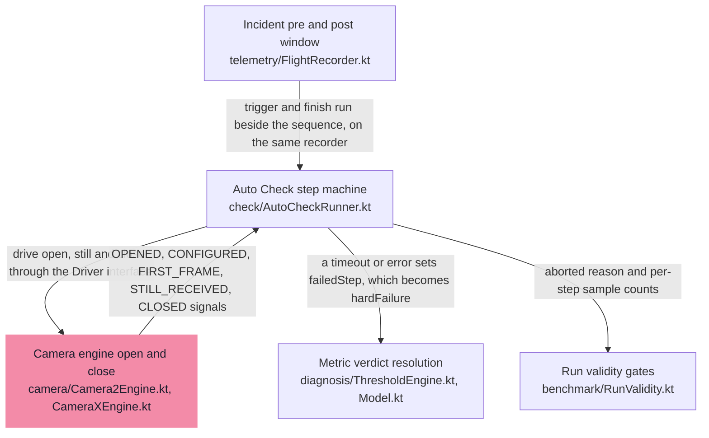

# 아키텍처 및 코드 구조

> 이 페이지는 HALCamera 앱이 카메라 콜백을 어떻게 기록하고 지표로 바꾸는지, 그 코드가 어디에 있는지 설명합니다. 읽고 나면 기능을 수정하기 전에 어느 파일을 열어야 하고 어떤 제약을 지켜야 하는지 판단할 수 있습니다.

- 대상: 코드를 처음 읽는 개발자, 기능을 수정하기 전에 영향 범위를 알아야 하는 개발자
- 선행 조건: [개발 환경 및 빠른 시작](getting-started.md)에 따라 빌드가 되는 상태
- 검증 기준: 아래 상태 표를 참고합니다. 자동 생성 블록은 표시된 커밋을 기준으로 검토되었습니다.

<!-- omm:begin id=status -->

- 검증 기준 앱 버전: 0.3.1 (versionCode 4)

| 항목 | 최신성 | 검토 |
| --- | --- | --- |
| 구조 원본 `data-flow` | 검증 정보 없음 | — |
| 구조 원본 `overall-architecture` | 검증 정보 없음 | — |
| 구조 원본 `state-transitions` | 검증 정보 없음 | — |
| 원고 `overview` | 검증 정보 없음 | — |
| 원고 `runtime-flow` | 검증 정보 없음 | — |

<!-- omm:end id=status -->

## 개요

<!-- omm:begin id=overview -->

HALCamera는 단일 모듈 Android 앱입니다(`:app`, applicationId `dev.halcamera`, minSdk 26, compileSdk 36). 기기 카메라를 정해진 순서로 구동하면서 프레임워크가 보내는 콜백을 전부 기록하고, 그 기록을 지표로 바꿔 기기 내부 저장소에 JSON 실행 파일로 남깁니다. 서버, 데이터베이스, 외부 서비스는 없습니다. 앱 바깥에 있는 것은 Android 카메라 스택뿐입니다.

### 네 단계의 책임

동작은 한 방향으로 흐르는 네 단계로 나뉩니다.

1. **카메라 구동** — `camera/` 패키지. `CameraEngine` 인터페이스 뒤에 `Camera2Engine`과 `CameraXEngine`이 있습니다. 카메라를 점유하는 엔진은 항상 하나뿐이어야 하며, `close(done)`은 기기를 실제로 반납한 뒤에만 콜백을 호출합니다. 다음 open이 그 콜백에서 시작되기 때문입니다.
2. **기록** — `telemetry/` 패키지. `Telemetry.callback()`이 만들어 주는 `CaptureCallback`이 `onCaptureStarted`, `onCaptureCompleted`, `onCaptureFailed`, `onCaptureBufferLost`를 각각 `Event`로 바꿔 `FlightRecorder` 링 버퍼에 넣습니다. 모든 `atNs`는 `SystemClock.elapsedRealtimeNanos()` 하나의 시계를 씁니다. 센서 타임스탬프는 `sensorNs`에 따로 담깁니다.
3. **평가** — `check/`, `diagnosis/`, `benchmark/` 패키지. 이 계층은 Android import가 없는 순수 Kotlin이라 JVM 단위 테스트로 검증됩니다. 러너(`AutoCheckRunner`, `BenchmarkRunner`)는 카메라와 시계를 `Driver`, `Scheduler`, `clock` 파라미터를 통해서만 만집니다.
4. **저장과 표시** — 평가가 끝난 실행 결과는 파일로 기록되고, 화면은 그 파일을 다시 읽습니다. 어떤 화면도 값을 다시 계산하지 않습니다.

### 평가 계층이 두 개인 이유

`diagnosis/`는 v0.2의 건강 판정 계층(PASS / WARN / FAIL)이고, `benchmark/`는 v0.3 Camera BenchMarker의 측정 전용 데이터 계약(IMPROVED / STABLE / REGRESSED / UNKNOWN)입니다. 2026-09-09에 v0.2를 중단하고 v0.3으로 전환하기로 결정했기 때문에(D-002) 두 계층이 M3까지 공존합니다. 전환 이유 자체는 결정 기록에 아직 적혀 있지 않으므로 확인 필요입니다.

지금 실제 화면을 구동하는 쪽은 v0.2입니다. `MainActivity`가 `FlightRecorder`, `Telemetry`, `HealthMonitor`를 직접 들고 있고, 카메라 열기, 권한 처리, incident 내보내기, CPU 샘플링까지 한 클래스에서 처리합니다. `BenchmarkRunner`는 코드에 존재하며 warm reopen 반복과 관측 세션을 구동하는 상태 기계입니다. 이 러너가 어느 화면에서 어떤 경로로 실행되는지는 이 원고에서 확인하지 않았으므로 확인 필요로 남깁니다.

Camera2 엔진과 CameraX 엔진을 둘 다 유지하는 것은 2026-09-08의 결정입니다(D-001). Camera2가 측정 경로, CameraX가 비교 경로입니다. 이 결정의 이유는 결정 기록에 아직 없으므로 확인 필요입니다.

### 코드를 처음 읽는 순서

1. `camera/CameraEngine.kt` — 엔진이 지켜야 할 계약을 봅니다.
2. `telemetry/Telemetry.kt`와 `telemetry/FlightRecorder.kt` — 무엇이 어떤 이름의 이벤트로 기록되는지 봅니다. 이 두 파일을 합쳐도 200줄이 되지 않습니다.
3. `check/AutoCheckRunner.kt` — 엔드포인트마다 OPEN, CONFIGURE, FIRST_FRAME, OBSERVE(10초), STILL 3회, CLOSE 순서로 진행하는 상태 기계입니다.
4. `check/CheckEvaluator.kt` — 러너 결과와 이벤트가 만나서 지표가 되는 지점입니다.
5. `MainActivity.kt` — 위 요소들을 조립하는 곳입니다. 566줄이므로 마지막에 읽습니다.

<sub>근거 파일: `app/build.gradle.kts`, `app/src/main/java/dev/halcamera/MainActivity.kt`, `app/src/main/java/dev/halcamera/camera/CameraEngine.kt`, `app/src/main/java/dev/halcamera/telemetry/Telemetry.kt`, `app/src/main/java/dev/halcamera/telemetry/FlightRecorder.kt`, `app/src/main/java/dev/halcamera/check/AutoCheckRunner.kt`, `app/src/main/java/dev/halcamera/check/CheckEvaluator.kt`, `app/src/main/java/dev/halcamera/benchmark/BenchmarkRunner.kt` · 설계 결정: `D-001`, `D-002` · 근거 수준: 코드 확인 · 검토 상태: 검증 정보 없음</sub>

<!-- omm:end id=overview -->

## 상세 내용

### 4.1 전체 구조

```mermaid
graph LR
    screens["Screens\napp/src/main/java/dev/halcamera/{home,check}/, MainActivity.kt"]
    camera-engines["Camera Engines\napp/src/main/java/dev/halcamera/camera/"]
    telemetry["Telemetry & Flight Recorder\napp/src/main/java/dev/halcamera/telemetry/"]
    check-runner["Auto Check Runner\napp/src/main/java/dev/halcamera/check/"]
    diagnosis["Diagnosis Engine v0.2\napp/src/main/java/dev/halcamera/diagnosis/"]
    benchmark["Benchmark Contract v0.3\napp/src/main/java/dev/halcamera/benchmark/"]
    persistence["Run Persistence\napp/src/main/java/dev/halcamera/{report,baseline}/"]
    ui-widgets["Custom Views\napp/src/main/java/dev/halcamera/ui/"]
    platform-camera["Android Camera2 / CameraX\nplatform API"]

    screens -->|"own the preview surface, start and close one engine at a time"| camera-engines
    camera-engines -->|"openCamera, createCaptureSession, capture"| platform-camera
    camera-engines -->|"push CaptureCallback and ImageReader events"| telemetry
    check-runner -->|"drive open / still / close through the Driver interface"| camera-engines
    telemetry -->|"ring-buffer Event list for one session and time window"| diagnosis
    check-runner -->|"per-endpoint EndpointResult with launch and still timings"| diagnosis
    diagnosis -->|"reuse MetricExtractor percentiles and MetricCatalog names"| benchmark
    diagnosis -->|"MetricState, Diagnosis, Health for the run JSON"| persistence
    benchmark -->|"BenchmarkMetric, RunValidity, schema 3 run JSON"| persistence
    screens -->|"read the newest stored run to render without touching the camera"| persistence
    screens -->|"draw live scope, strip and timeline"| ui-widgets
    telemetry -->|"synchronous live tap on each recorded event"| ui-widgets

    classDef external fill:#585b70,stroke:#585b70,color:#cdd6f4
    classDef store fill:#a6e3a1,stroke:#a6e3a1,color:#1e1e2e
    class platform-camera external
    class persistence store
```

<!-- omm:begin id=overall-diagram -->



<sub>근거: `.omm/overall-architecture/diagram` · 근거 수준: 코드 확인</sub>

<!-- omm:end id=overall-diagram -->

### 4.2 모듈과 패키지 역할

패키지는 `app/src/main/java/dev/halcamera/` 아래에 있습니다. 아래 목록은 구조 스캔에서 인식한 영역이며, 실제 패키지 이름과 일대일로 대응하지는 않습니다.

<!-- omm:begin id=module-roles -->

- **benchmark** — `app/src/main/java/dev/halcamera/benchmark/` — the Camera BenchMarker v0.3 data contract, milestone M1. Nine files, all pure Kotlin, implementing chapters 3 to 7 of `docs/PLAN-BenchMarker-v0.3.md`. (하위: `benchmark-evaluator`, `benchmark-model`, `benchmark-profile`, `build-identity`, `metric-info`, `regression-rules`, `run-validity`)
- **camera-engines** — `app/src/main/java/dev/halcamera/camera/` — two interchangeable implementations of one four-method interface, plus the characteristics helpers they share. (하위: `camera2-engine`, `camerax-engine`, `engine-interface`)
- **check-runner** — `app/src/main/java/dev/halcamera/check/` — enumerating what can be measured, driving the measurement, and evaluating one endpoint's result. (하위: `check-evaluator`, `check-result`, `check-state-machine`, `endpoint-model`, `endpoint-resolver`)
- **diagnosis** — `app/src/main/java/dev/halcamera/diagnosis/` — the v0.2 health layer, and still the one every shipped screen uses. Nine files, all pure Kotlin, implementing chapters 4 to 8 and 13.2 of `docs/PRODUCT-v0.2.md`. (하위: `diagnosis-model`, `diagnosis-rules`, `health-composer`, `health-monitor`, `metric-catalog`, `metric-extractor`, `threshold-engine`, `threshold-table`)
- **persistence** — Everything the app writes lives in app-internal storage under `Context.filesDir`, plus one `SharedPreferences` file. There is no database, no network and no external storage; sharing happens only through a `FileProvider` the user triggers explicitly. (하위: `baseline-store`, `benchmark-report`, `benchmark-store`, `health-report`)
- **platform-camera** — The Android camera stack — the only thing outside this codebase, and the subject under measurement rather than a dependency to be abstracted away.
- **screens** — The three Activities, all built in Kotlin without XML layouts or Compose. Covers `home/HomeActivity.kt` (112 lines), `check/CheckActivity.kt` (319 lines), `MainActivity.kt` (566 lines) and the shared visual tokens in `ui/Look.kt`. (하위: `check-screen`, `expert-screen`, `home-screen`, `look-tokens`, `run-summary`)
- **telemetry** — `app/src/main/java/dev/halcamera/telemetry/` — the recording layer every measurement is derived from. Three files: `Telemetry.kt` (the Camera2 callback adapter), `FlightRecorder.kt` (the ring buffer and incident windows) and `IncidentExporter.kt` (the ZIP bundle). (하위: `capture-callbacks`, `flight-recorder`, `incident-exporter`)
- **ui-widgets** — `app/src/main/java/dev/halcamera/ui/` — three custom `View` subclasses that draw telemetry directly onto a `Canvas`, plus the `Look` token file covered under Screens. No charting library is used.

<sub>근거: `.omm/overall-architecture/*/description.md` · 근거 수준: 코드 확인</sub>

<!-- omm:end id=module-roles -->

### 4.3 주요 실행 흐름

<!-- omm:begin id=runtime-flow -->

Auto Check 한 번은 다음 순서로 진행됩니다. 사용자가 검사를 시작하면 `AutoCheckRunner`가 엔드포인트마다 OPEN, CONFIGURE, FIRST_FRAME, OBSERVE(고정 10초), STILL 3회, CLOSE 순서로 `Driver`를 호출합니다. 어느 단계든 타임아웃이 나면 그 엔드포인트의 hard failure로 기록하고 CLOSE로 넘어가며, 다음 엔드포인트는 계속 실행됩니다. 자동 재시도는 없습니다.

### 두 갈래의 기록

기록은 두 갈래로 나뉘었다가 `CheckEvaluator.evaluate()`에서 다시 합쳐집니다.

- **이벤트 경로** — `Telemetry.callback(sessionId, alive)`가 만든 `CaptureCallback`이 프레임워크 콜백을 받을 때마다 `FlightRecorder.record()`를 호출합니다. `onCaptureStarted`는 `capture_started`와 `request_observed`를, `onCaptureCompleted`는 AE/AF/AWB 상태, 노출, ISO, 프레임 길이, 센서 타임스탬프를 담은 `capture_result`를, `onCaptureFailed`와 `onCaptureBufferLost`는 각각 `capture_failed`와 `buffer_lost`를 남깁니다. 콜백마다 `alive()`를 먼저 확인하므로 이미 닫힌 세션의 늦은 콜백은 기록되지 않습니다.
- **러너 경로** — `AutoCheckRunner`는 각 API 호출 전후의 타임스탬프만 기록합니다. `EndpointResult`의 `openMs`, `configureMs`, `firstStartedMs`, `closeMs`, `stillLatenciesMs`가 그 짝을 뺀 값입니다. 이것이 실행 지연과 촬영 지연(1.x, 2.x) 지표의 원천입니다.

두 갈래가 모두 필요한 이유는 서로 다른 것을 알기 때문입니다. 러너는 관측 창이 언제 열리고 닫혔는지(`observeStartNs`, `observeEndNs`)를 알고, 이벤트는 그 안에서 무슨 일이 있었는지를 압니다.

### 합류 지점에서 적용되는 규칙

`CheckEvaluator.evaluate(result, events, baseline, mediaPerformanceClass)`는 다음 순서로 지표를 만듭니다.

1. 관측 창이 있으면 `MetricExtractor.observe()`가 그 창 안의 이벤트에서 H.x 지표를 계산합니다. 스트림 시작 직후 `WARMUP_FRAMES = 5` 프레임은 간격 지표에서 제외됩니다. 관측 프레임이 15개 미만이면 값은 null이 되고 `unknownReason`이 `INSUFFICIENT_SAMPLES`로 채워집니다.
2. `EndpointResult.launchSamples()`가 1.x, 2.x 지표를 만듭니다. 실패한 단계의 지표는 hard failure로, 실행되지 않은 단계는 `NOT_RUN`으로 표시됩니다.
3. baseline이 있고 ISO × 노출 시간의 p50이 baseline과 4배 이상 다르면 3A 수렴 지표(H.6, H.7, H.8)는 `CONDITION_MISMATCH`가 됩니다. 장면이 달라서 비교할 수 없다는 뜻입니다.
4. v0.2에서 실행하지 않는 지표(2.1, 2.4, 2.6, 2.7, 3.x)는 항상 `NOT_RUN`이고, 1.5는 `NOT_MEASURABLE`입니다.
5. `ThresholdEngine`이 상태를, `DiagnosisRules`가 진단을, `HealthComposer`가 건강 수준을 만듭니다. 기기 전체 수준은 엔드포인트 중 가장 나쁜 값입니다.

결과는 실행 파일로 저장되고 화면은 그 파일을 읽습니다.

### 결과가 예상과 다를 때 확인하는 순서

1. `EndpointResult.hardFailure`와 `failedStep` — 어느 단계에서 타임아웃이 났는지 먼저 봅니다. 이후 지표는 그 영향을 받습니다.
2. 이벤트의 `session`과 관측 창 — 지표는 같은 세션 ID의 이벤트만, 그것도 창 안의 것만 씁니다. 기대한 이벤트가 다른 세션에 붙어 있거나 창 밖에 있으면 지표에 반영되지 않습니다.
3. `unknownReason` — `NOT_RUN`, `INSUFFICIENT_SAMPLES`, `CONDITION_MISMATCH`, `NOT_MEASURABLE`은 각각 원인이 다릅니다. 값이 null인 이유가 여기 적혀 있습니다.
4. 임계값 — 상태 판정이 이상하면 `ThresholdTable`을 봅니다. v0.2의 임계값은 이 한 곳에만 있습니다.

### 벤치마크 갈래

`BenchmarkRunner`는 v0.3의 상태 기계입니다. warm reopen을 `launchIterations`만큼 반복한 뒤 관측 세션을 하나 더 열어 WARMUP, OBSERVE, STILL, CLOSE를 진행합니다. 실패한 사이클은 `failed = true`로 기록하고 다음 사이클로 넘어가며, 연속 실패가 `maxConsecutiveFailures`(기본 3회)에 이르거나 관측 세션이 실패할 때만 실행이 중단됩니다. 이 러너의 출력이 `BenchmarkEvaluator`와 실행 파일까지 연결되어 있는지는 이 원고에서 확인하지 않았으므로 확인 필요입니다.

```mermaid
graph LR
    framework-callbacks["Camera2 callbacks\nCaptureCallback, ImageReader, CameraState"]
    event-record["Event records\ntelemetry/Telemetry.kt, FlightRecorder.kt"]
    runner-marks["Step marks and timings\ncheck/AutoCheckRunner.kt"]
    frame-observations["FrameObservation per result\ndiagnosis/MetricExtractor.kt"]
    metric-samples["MetricSample per metric id\ndiagnosis/MetricExtractor.kt, check/AutoCheckRunner.kt"]
    judged-states["MetricState, Diagnosis, Health\ndiagnosis/ThresholdEngine.kt, DiagnosisRules.kt, HealthComposer.kt"]
    benchmark-metrics["BenchmarkMetric statistics\nbenchmark/BenchmarkEvaluator.kt"]
    run-json["Run JSON on disk\nfiles/checks/, files/benchmarks/, files/incidents/"]
    rendered-screens["Rendered result\ncheck/CheckResult.kt, home/RunSummary.kt"]

    framework-callbacks -->|"one Event per callback, tagged with session and elapsedRealtimeNanos"| event-record
    framework-callbacks -->|"driver reports OPENED, CONFIGURED, FIRST_FRAME, STILL_RECEIVED, CLOSED"| runner-marks
    event-record -->|"join capture_started, request_observed and image_available by frame and sensor timestamp"| frame-observations
    frame-observations -->|"aggregate the steady window into H.1 to H.8"| metric-samples
    event-record -->|"count capture_failed and buffer_lost for H.9"| metric-samples
    runner-marks -->|"subtract mark pairs into 1.x and 2.x latencies"| metric-samples
    metric-samples -->|"judge absolutely and relatively against ThresholdTable and the baseline"| judged-states
    frame-observations -->|"same percentiles, no judgement, statistics only"| benchmark-metrics
    runner-marks -->|"LaunchCycle and StillSample, supplied by the missing M2 runner"| benchmark-metrics
    judged-states -->|"HealthReport writes schema 2"| run-json
    benchmark-metrics -->|"BenchmarkReport writes schema 3"| run-json
    event-record -->|"IncidentExporter writes events.jsonl into the incident ZIP"| run-json
    run-json -->|"read back on resume, never recomputed"| rendered-screens

    classDef store fill:#a6e3a1,stroke:#a6e3a1,color:#1e1e2e
    classDef external fill:#585b70,stroke:#585b70,color:#cdd6f4
    classDef concern fill:#f38ba8,stroke:#f38ba8,color:#1e1e2e
    class run-json store
    class framework-callbacks external
    class benchmark-metrics concern
```

<sub>근거 파일: `app/src/main/java/dev/halcamera/telemetry/Telemetry.kt`, `app/src/main/java/dev/halcamera/telemetry/FlightRecorder.kt`, `app/src/main/java/dev/halcamera/check/AutoCheckRunner.kt`, `app/src/main/java/dev/halcamera/check/CheckEvaluator.kt`, `app/src/main/java/dev/halcamera/diagnosis/MetricExtractor.kt`, `app/src/main/java/dev/halcamera/benchmark/BenchmarkRunner.kt` · 근거 수준: 코드 확인 · 검토 상태: 검증 정보 없음</sub>

<!-- omm:end id=runtime-flow -->

<!-- omm:begin id=runtime-diagram -->



<sub>근거: `.omm/data-flow/diagram` · 근거 수준: 코드 확인</sub>

<!-- omm:end id=runtime-diagram -->

### 4.4 상태 및 생명주기 관리

<!-- omm:begin id=lifecycle-diagram -->



<sub>근거: `.omm/state-transitions/diagram` · 근거 수준: 코드 확인</sub>

<!-- omm:end id=lifecycle-diagram -->

### 4.5 스레드와 비동기 처리

확인 필요. `MainActivity`는 메인 `Handler`, 카메라 전용 단일 스레드 실행기(`cameraWorker`), 입출력 전용 단일 스레드 실행기(`io`)를 따로 둡니다. 각 콜백이 어느 스레드에서 실행되고 어떤 순서 보장이 있는지는 아직 정리하지 않았습니다.

### 4.6 리소스 및 오류 처리

확인 필요. 세션, Surface, 버퍼의 소유권과 해제 시점은 아직 정리하지 않았습니다. 아래 "제약"에 있는 `CameraEngine` 단일 점유 규칙과 `close(done)` 콜백 규칙이 출발점입니다.

## 확인 방법

평가 계층은 Android 의존성이 없는 순수 Kotlin이므로 기기 없이 JVM 단위 테스트로 확인합니다.

```bash
./gradlew :app:testDebugUnitTest
```

`CheckEvaluatorTest`, `AutoCheckRunnerTest`, `MetricExtractorTest`, `BenchmarkRunner` 관련 테스트가 통과하면 4.3의 흐름이 코드와 일치하는 것입니다. 기기에서의 동작 확인은 [디버깅 및 문제 해결](troubleshooting.md)을 참고합니다.

## 제약 및 알려진 문제

<!-- omm:begin id=constraints -->

- 평가 코드는 Android import 없이 순수 Kotlin으로 유지해야 하며, 그래야 `testDebugUnitTest`로 JVM에서 실행됩니다. `MetricExtractor`, `ThresholdEngine`, `AutoCheckRunner`, `BenchmarkEvaluator`, `RunValidityEvaluator`와 모든 모델 파일이 이 규칙을 따릅니다. `AutoCheckRunner`는 카메라와 시계에 `Driver`, `Scheduler`, `clock` 파라미터를 통해서만 접근합니다.
- `org.json`은 파일 경계에서만 사용할 수 있습니다(`BenchmarkReport`, `HealthReport`, `IncidentExporter`, `*Store` 클래스들). 계약 자체는 snake_case 키를 가진 `Map<String, Any?>`로 이동합니다.
- 시계는 `elapsedRealtimeNanos` 하나뿐입니다. 센서 타임스탬프는 기기가 `SENSOR_INFO_TIMESTAMP_SOURCE_REALTIME`을 보고하지 않는 한 별도의 도메인에 머무릅니다.
- 카메라를 점유하는 `CameraEngine`은 항상 하나뿐이어야 합니다. `close(done)`은 기기를 실제로 반납한 뒤에만 콜백을 호출해야 하는데, 다음 open이 그 콜백에서 시작되기 때문입니다.
- 열거에는 공개 Camera2 API만 사용합니다. 숨겨진 카메라 ID는 절대 탐색하지 않으며, 논리 카메라 뒤의 물리 카메라는 열지 않고 `independentlyOpenable = false`로 기록만 합니다.
- 이미지 픽셀은 어떤 경우에도 저장하지 않습니다. incident 번들에는 메타데이터와 이벤트만 담깁니다.
- 임계값은 계층마다 정확히 한 곳에만 존재합니다. v0.2는 `ThresholdTable`, v0.3은 `RegressionRules`입니다. 여기의 숫자를 바꾸는 작업은 `docs/` 변경을 뒤따르는 것이 전제입니다.

<sub>근거: `.omm/overall-architecture/constraint` · 근거 수준: 코드 확인</sub>

<!-- omm:end id=constraints -->

<!-- omm:begin id=open-questions -->

**확인 필요** — 스캔 시점에 확신할 수 없었거나 현재 알려진 미완 사항입니다.

- 평가 스택이 두 개 공존합니다. `diagnosis/`(건강 판정, v0.2)는 살아 있고 출시된 화면을 구동합니다. `benchmark/`(측정, v0.3)는 이를 대체할 예정이지만 데이터 계약에서 멈춰 있습니다. 표시용 메타데이터를 `benchmark/MetricInfo.kt`로 옮겨서 명명 의존성은 끊었지만, `BenchmarkEvaluator`와 `BenchmarkModel`이 여전히 `diagnosis/`에서 `MetricExtractor`, `UnknownReason`, `jsonName`을 import합니다. 따라서 M3에서 삭제하려면 이것들을 중립적인 위치로 먼저 옮겨야 합니다.
- `MainActivity`는 566줄이며 뷰 생성, 권한 처리, 엔진 생명주기, incident export, CPU 샘플링을 한 클래스에 섞어 두었습니다. 가장 큰 파일이면서 가장 테스트하기 어려운 파일입니다.
- `HealthMonitor`는 스레드 안전하지 않다고 명시되어 있고 warning 유지 상태를 평범한 필드에 보관합니다. 모든 호출이 메인 스레드에서 올 때에만 안전합니다.
- `BenchmarkEvaluator`는 `notRun("2.7")`을 무조건 반환하고, H.9는 러너가 아직 제공하지 않는 콜백 실패 횟수로 계산합니다. M2 러너가 없기 때문이며, 지금 만들어지는 run JSON은 불완전합니다.
- 표준 프로파일 ID가 아직 `camera2-standard-v1-draft`입니다. 따라서 이 프로파일로 만든 실행은 모두 `PROFILE_DRAFT` validity flag를 달고 설계상 점수 대상에서 제외됩니다.
- `IncidentExporter`가 `device.json`에 `appVersion`을 `"0.1.0"`으로 하드코딩하는데, 모듈이 선언한 `versionName`은 `"0.3.0"`입니다.

**후속 작업**

`docs/PLAN-BenchMarker-v0.3.md`의 마일스톤을 계획된 순서대로 정리하면 다음과 같습니다.

1. M2 `BenchmarkRunner`: warm-reopen 실행 루프, 관측 창, 연속 촬영을 구동해서 `BenchmarkEvaluator`가 실제 입력을 받도록 합니다. 이 과정에서 Galaxy S25+가 1080p YUV 스트림을 감당하는지도 확인되며, 그 결과에 따라 프로파일 ID에서 `-draft` 접미사를 뗄 수 있습니다.
2. M3 결과 UI, 그리고 `diagnosis/`에서 공용 헬퍼를 분리한 뒤의 Doctor 코드 삭제.
3. M4 baseline, compare, regression: `RegressionRules`를 적용하고 각 지표의 `baseline_ref`, `reference_ref`, `delta_pct`, `regression`을 채웁니다.
4. M5 Score. 의도적으로 미뤄 둔 항목입니다. profile v1 실행이 충분히 쌓이기 전에는 점수를 계산하지도 표시하지도 않습니다.
5. M6 실행 이력과 빌드 관리.

독립적으로 처리할 수 있는 작은 항목도 있습니다. `IncidentExporter`의 하드코딩된 `appVersion`을 고치고, `2.7`(촬영 중 프리뷰 stall)에 무조건적인 `NOT_RUN` 대신 실제 계산 근거를 부여하는 일입니다.

<sub>근거: `.omm/overall-architecture/concern.md`, `.omm/overall-architecture/todo.md` · 근거 수준: 설계 의도 / 추정</sub>

<!-- omm:end id=open-questions -->

## 관련 코드 및 문서

- 제품 정의: `docs/PRODUCT-v0.2.md`, `docs/PLAN-BenchMarker-v0.3.md`
- 지표 정의: `docs/METRICS.md`
- 설계 결정: [설계 결정 기록](_inputs/decisions.md)
- 구조 원본: `.omm/` (`omm view`로 열람)
