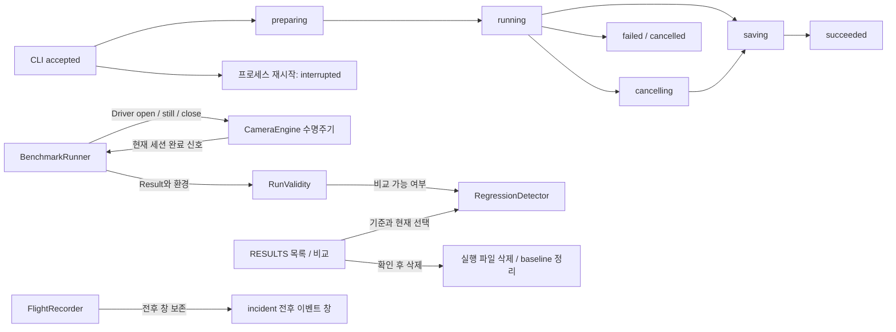

# 아키텍처 및 코드 구조

**수정할 기능과 연결된 코드부터 찾으세요.** 이 문서는 카메라 구동부터 이벤트 기록, 지표 계산, 결과 표시까지의 책임과 변경 시 지켜야 할 제약을 설명합니다.

| 지금 확인할 내용 | 이동할 절 |
| --- | --- |
| 앱의 전체 구조와 관측·비교 경로를 이해합니다. | [앱의 역할과 평가 경로](#앱의-역할과-평가-경로) |
| 수정할 패키지를 찾습니다. | [패키지별 역할](#패키지별-역할) |
| 측정값이 만들어지는 순서를 추적합니다. | [주요 실행 흐름](#주요-실행-흐름) |
| 카메라 종료와 스레드 제약을 확인합니다. | [생명주기와 스레드](#생명주기와-스레드) |
| 변경 후 지켜야 할 규칙과 검증 방법을 확인합니다. | [변경 시 지켜야 할 제약](#변경-시-지켜야-할-제약) |

아직 빌드하지 않았다면 [빠른 시작](getting-started.md)을 먼저 진행하세요. 아래의 `코드 확인`은 구현을 대조했다는 뜻이며, 기기 실측을 뜻하지 않습니다.

## 앱의 역할과 평가 경로

<!-- omm:begin id=overview -->

앱은 CLI 명령을 `CommandCoordinator`가 관리하고, 카메라 구동은 `CameraEngine`이 담당하며, 데이터 수집은 `Telemetry`와 `FlightRecorder`가 수행합니다. `BenchmarkRunner`는 실행 순서와 실패 처리를 주도하고, `RunAssembler`는 러너 결과와 이벤트를 결합하여 JSON 형식의 실행 결과를 만듭니다. 내부 점수는 `ScoreComposer`가 검토한 calibration 범위에 맞는 적격 release run에 계산하며, 저장·비교·표시는 `BenchmarkReport`, `BaselineManager`, `RegressionDetector` 및 각 Activity 가 담당합니다.

LIVE 관측은 `FlightRecorder`의 실시간 리스너를 통해 즉시 이벤트 처리하며, 데이터는 인메모리 또는 임시 저장소에 기록됩니다. 반면 벤치마크는 `ScoreComposer`가 정의된 엄격한 조건을 충족하는 '정상 실행'만 평가하며, `FlightRecorder`의 snapshot() 를 통해 특정 시간 창 데이터를 추출하여 분석합니다. 이력은 `HistoryActivity`와 `RunIndex`에서 관리되며, `BenchmarkStore`, `BenchmarkReport`, `StoreRunCatalog` 등을 통해 실행 기록을 로드하고 필터링합니다.

코드를 처음 읽을 때는 `MainActivity.kt`에서 앱의 핵심 로직이 시작되며, 벤치마크 관련 코드라면 `BenchmarkRunner.kt` 파일을 먼저 확인해야 합니다. 카메라 제어는 `CameraEngine.kt`와 UI 진입점인 `MainActivity`를 통해 이루어지며, 데이터 수집 구조는 `Telemetry.kt`와 `FlightRecorder.kt`에서 이해할 수 있습니다.

근거와 검토 정보

- 근거 파일: `app/src/main/java/dev/halcamera/MainActivity.kt`, `app/src/main/java/dev/halcamera/benchmark/BenchmarkActivity.kt`, `app/src/main/java/dev/halcamera/benchmark/BenchmarkRunner.kt`, `app/src/main/java/dev/halcamera/benchmark/HistoryActivity.kt`, `app/src/main/java/dev/halcamera/benchmark/RegressionDetector.kt`, `app/src/main/java/dev/halcamera/benchmark/RunAssembler.kt`, `app/src/main/java/dev/halcamera/benchmark/ScoreComposer.kt`, `app/src/main/java/dev/halcamera/camera/CameraEngine.kt`, `app/src/main/java/dev/halcamera/cli/CommandCoordinator.kt`, `app/src/main/java/dev/halcamera/telemetry/FlightRecorder.kt`, `app/src/main/java/dev/halcamera/telemetry/Telemetry.kt`, `tools/halcam/halcam/cli.py`
- 근거 수준: 코드 확인
- 검토 상태: 관련 소스 변경됨: 재검토 필요

<!-- omm:end id=overview -->

## 전체 구조도

그림을 클릭하면 확대 화면이 열립니다. 키보드에서는 Tab으로 그림을 선택한 뒤 Enter 또는 Space를 누르세요.

```mermaid
graph LR
    pc["PC · halcam"] -->|"ADB"| provider["CliProvider · shell 전용"]
    provider --> commands["CommandCoordinator / CommandStore"]
    commands -->|"LiveController"| live
    commands -->|"BenchmarkController"| benchmark
    live["MainActivity · LIVE"] -->|"엔진 선택"| engines["Camera2Engine / CameraXEngine"]
    live -->|"벤치마크 진입"| benchmark["BenchmarkActivity / BenchmarkRunner"]
    benchmark -->|"Driver 호출"| engines
    engines -->|"요청 실행"| platform["Android Camera API"]
    engines -->|"이벤트 기록"| telemetry["Telemetry / FlightRecorder"]
    telemetry -->|"관측 표본"| assemble["RunAssembler / BenchmarkEvaluator / RunValidity"]
    benchmark -->|"실행 시각"| assemble
    assemble -->|"적격 조건 확인"| score["ScoreComposer · 내부 초안"]
    score -->|"실행과 해당 점수 저장"| files["BenchmarkReport / BenchmarkStore · schema 4"]
    files -->|"기준 실행 읽기"| comparison["BaselineManager / RegressionDetector"]
    comparison -->|"비교 표시"| results["ResultPresenter / ComparePresenter"]
    benchmark -->|"이력 진입"| history["HistoryActivity / RunIndex"]
    files -->|"목록 읽기"| history
    history -->|"선택한 두 실행"| comparison
    history -->|"지표별 내보내기"| csv["BenchmarkCsv · CSV"]
```

<!-- omm:begin id=overall-diagram -->

근거와 검토 정보

- 근거: `.omm/overall-architecture/diagram`
- 근거 수준: 코드 확인

<!-- omm:end id=overall-diagram -->

## 패키지별 역할

<!-- omm:begin id=module-roles -->

각 패키지는 명확한 책임을 지며 변경 시 해당 클래스의 의존성을 확인해야 합니다. `cli/`와 `tools/halcam/`는 shell 호출자 검사, 영속 요청 상태, artifact 등록을 담당하며 `CommandCoordinator`와 `CommandStore`를 통해 요청 ID 와 진행 상태를 관리합니다. `camera/`는 엔진 계약과 구현 (`Camera2Engine`, `CameraXEngine`) 을 제공하며 `LiveController` 는 CLI 명령을 동기화하고 `RecentMediaThumbnail` 은 앨범 썸네일을 별도 스레드에서 읽습니다. `metrics/`는 `MetricExtractor` 가 이벤트를 관측 표본으로 재구성하는 순수 계산 로직만 담당합니다. `benchmark/`는 프로파일, 러너, 지표 계산, 저장 (`BenchmarkReport`, `BenchmarkStore`), 비교 (`RegressionDetector`) 와 이력 화면을 제공하며 `ScoreComposer` 는 최소 10 개 실행을 기반으로 스케일링 곡선을 계산합니다.

실행과 평가 영역은 카메라 하드웨어 제어와 실시간 측정을 담당합니다. `MainActivity` 의 `openCamera` 와 `tick` Runnable 이 센서 이벤트를 필터링하여 프레임 간격, ISO, 노출 등을 계산하며 `LiveReadout` 과 UI 컴포넌트에서 시각화합니다. 기록과 저장 영역은 벤치마크 결과를 영구적으로 관리합니다. `FlightRecorder` 는 30 초 순환 버퍼와 incident ZIP 을 생성하고 `Telemetry` 가 이벤트 로그를 기록합니다. `BenchmarkReport` 는 schema 4 JSON 파일을 쓰고 읽으며, `HistoryActivity` 와 `RunIndex` 는 실행 이력을 필터링하고 `BenchmarkCsv` 는 지표별 CSV 를 작성합니다. 각 영역은 별도 스레드에서 처리되며 파일 작업과 비교는 원본 JSON 을 다시 읽는 별도의 실행기에서 수행됩니다.

근거와 검토 정보

- 근거 파일: `app/src/main/java/dev/halcamera/MainActivity.kt`, `app/src/main/java/dev/halcamera/benchmark/BenchmarkActivity.kt`, `app/src/main/java/dev/halcamera/benchmark/BenchmarkController.kt`, `app/src/main/java/dev/halcamera/benchmark/BenchmarkCsv.kt`, `app/src/main/java/dev/halcamera/benchmark/BenchmarkReport.kt`, `app/src/main/java/dev/halcamera/benchmark/HistoryActivity.kt`, `app/src/main/java/dev/halcamera/benchmark/RunIndex.kt`, `app/src/main/java/dev/halcamera/benchmark/ScoreComposer.kt`, `app/src/main/java/dev/halcamera/camera/CameraEngine.kt`, `app/src/main/java/dev/halcamera/camera/LiveController.kt`, `app/src/main/java/dev/halcamera/camera/RecentMediaThumbnail.kt`, `app/src/main/java/dev/halcamera/cli/CommandCoordinator.kt`, `app/src/main/java/dev/halcamera/telemetry/FlightRecorder.kt`, `app/src/main/java/dev/halcamera/ui/RecentMediaButton.kt`
- 근거 수준: 코드 확인
- 검토 상태: 관련 소스 변경됨: 재검토 필요

<!-- omm:end id=module-roles -->

## 주요 실행 흐름

<!-- omm:begin id=runtime-flow -->

사용자 조작은 UI 계층에서 처리되어 HAL 요청으로 전달됩니다. LIVE 셔터 조작은 `MainActivity`의 LiveController를 통해 선택된 엔진의 촬영·녹화 동작으로 이어집니다. 벤치마크는 별도 화면인 `BenchmarkActivity`가 준비를 마친 뒤 `BenchmarkRunner.start()`를 호출하여 시작합니다. `Telemetry.callback(...)`이 반환한 Camera2 콜백의 `onCaptureStarted`는 프레임워크 신호를 기록하며, LIVE 셔터와 벤치마크 시작을 연결하는 메서드가 아닙니다.

이벤트 경로와 러너 경로는 UI 이벤트 처리 (클릭 등) 와 데이터 로드/처리 작업 (IO, 계산 등) 을 분리하기 위해 따로 존재합니다. UI 상태 변경은 메인 스레드 (`main = Handler(Looper.getMainLooper())`) 를 통해 즉시 반영되지만, 중대형 작업은 `queryIo`, `imageIo`, `thumbnailIo` 같은 별도의 스레드 풀에서 병렬 처리됩니다. 두 경로는 `main.post` 또는 `Runnable` 을 통해 합쳐져 최종 결과를 화면에 표시합니다.

결과가 예상과 다를 때는 먼저 데이터 로드 단계의 실패 메시지를 확인해야 합니다. `loadMedia` 함수는 `queryIo` 를 통해 미디어 목록을 조회하고, `showCurrent` 는 `imageIo` 를 통해 이미지 데이터를 로드하며, 각 단계에서 `result.fold` 로 성공/실패 처리가 이루어집니다. 실패 시 `empty.text` 나 `loading.text` 에 "불러오지 못했습니다" 등의 메시지가 표시됩니다.

근거와 검토 정보

- 근거 파일: `app/src/main/java/dev/halcamera/GalleryActivity.kt`, `app/src/main/java/dev/halcamera/MainActivity.kt`, `app/src/main/java/dev/halcamera/benchmark/BaselineManager.kt`, `app/src/main/java/dev/halcamera/benchmark/BenchmarkActivity.kt`, `app/src/main/java/dev/halcamera/benchmark/BenchmarkEvaluator.kt`, `app/src/main/java/dev/halcamera/benchmark/BenchmarkRunner.kt`, `app/src/main/java/dev/halcamera/benchmark/HistoryActivity.kt`, `app/src/main/java/dev/halcamera/benchmark/RegressionDetector.kt`, `app/src/main/java/dev/halcamera/benchmark/RunAssembler.kt`, `app/src/main/java/dev/halcamera/benchmark/ScoreComposer.kt`, `app/src/main/java/dev/halcamera/camera/RecentMediaThumbnail.kt`, `app/src/main/java/dev/halcamera/cli/CliProvider.kt`, `app/src/main/java/dev/halcamera/cli/CommandCoordinator.kt`, `app/src/main/java/dev/halcamera/metrics/MetricExtractor.kt`, `app/src/main/java/dev/halcamera/telemetry/FlightRecorder.kt`, `app/src/main/java/dev/halcamera/telemetry/Telemetry.kt`, `app/src/main/java/dev/halcamera/ui/ExpandingZoomControl.kt`, `app/src/main/java/dev/halcamera/ui/GalleryImageView.kt`, `app/src/main/java/dev/halcamera/ui/IconButton.kt`, `app/src/main/java/dev/halcamera/ui/RecentMediaButton.kt`, `app/src/main/java/dev/halcamera/ui/SelectionPopup.kt`, `app/src/main/java/dev/halcamera/ui/ShutterButton.kt`, `tools/halcam/halcam/cli.py`, `tools/halcam/halcam/download.py`
- 근거 수준: 코드 확인
- 검토 상태: 관련 소스 변경됨: 재검토 필요

<!-- omm:end id=runtime-flow -->

### 이벤트와 결과가 전달되는 경로

```mermaid
graph LR
    cli["CLI request JSON"] --> coordinator["CommandCoordinator"]
    coordinator --> request["CommandStore · 요청 기록"]
    photo["사진 한 쌍 저장 완료"] --> artifact["artifact 등록 · 크기와 SHA-256"]
    json --> artifact
    artifact -->|"읽기 전용 파일"| pc["Python CLI · 검증 후 저장"]
    callbacks["Camera 콜백"] -->|"이벤트 기록"| events["Telemetry / FlightRecorder"]
    callbacks -->|"단계 완료 신호"| marks["BenchmarkRunner.Result"]
    events -->|"프레임 연결"| frames["metrics/MetricExtractor"]
    frames -->|"관측 표본"| assemble["RunAssembler / BenchmarkEvaluator"]
    marks -->|"실행 시각"| assemble
    assemble -->|"실패와 환경"| validity["RunValidityEvaluator"]
    validity -->|"측정값과 validity"| score["ScoreComposer · 해당하는 calibration만 적용"]
    score -->|"적격 내부 점수 또는 null"| json["BenchmarkReport · schema 4 JSON"]
    json -->|"저장 실행 읽기"| compare["BaselineManager / RegressionDetector"]
    compare -->|"다시 계산한 비교"| screen["결과 / COMPARE"]
    json -->|"목록 읽기"| history["HistoryActivity / RunIndex"]
    history -->|"두 실행 선택"| compare
    history -->|"필터 결과"| csv["CSV 내보내기"]
```

<!-- omm:begin id=runtime-diagram -->

근거와 검토 정보

- 근거: `.omm/data-flow/diagram`
- 근거 수준: 코드 확인

<!-- omm:end id=runtime-diagram -->

## 생명주기와 스레드

### 카메라 열기와 닫기

러너가 `Driver`를 통해 카메라를 열고 닫습니다. 다음 실행으로 넘어가기 전에 현재 엔진의 `close(done)` 완료 통지를 확인해야 합니다. incident 이벤트 보존은 러너와 별도로 동작합니다.

<!-- omm:begin id=lifecycle-diagram -->

근거와 검토 정보

- 근거: `.omm/state-transitions/diagram`
- 근거 수준: 코드 확인

<!-- omm:end id=lifecycle-diagram -->

### 스레드별 작업

| 실행 위치 | 현재 확인한 역할 |
| --- | --- |
| `MainActivity`의 메인 Handler | 화면 갱신을 처리합니다. 카메라 작업용 `cameraWorker`, 입출력용 `io`와 구분합니다. |
| `BenchmarkActivity`의 `io` 실행기 | `finishRun()`에서 결과 조립, 파일 저장, 기준 실행 읽기와 비교를 수행합니다. |
| `BenchmarkActivity`의 메인 Handler | 비교가 끝나면 결과 화면을 표시합니다. |

카메라 콜백 전체의 실행 스레드와 종료 순서는 아직 정리하지 않았습니다. 관련 코드를 바꿀 때는 콜백이 어느 스레드에서 호출되는지 별도로 확인해야 합니다.

### 아직 정리하지 않은 리소스 계약

세션, Surface, 버퍼의 소유권과 해제 시점은 **확인 필요**입니다. 구현을 수정하기 전에 `CameraEngine`의 단일 점유 규칙과 `close(done)` 완료 조건부터 확인하세요.

## 변경 시 지켜야 할 제약

<!-- omm:begin id=constraints -->

카메라 점유와 시계 비교에서 지켜야 하는 제약은 카메라를 점유하는 `CameraEngine`이 항상 하나여야 한다는 점과, 완료 콜백 호출 전까지 기기를 실제로 반환하지 않는다는 것입니다. `BenchmarkRunner`는 `Driver`, `Scheduler`, `clock`을 주입받아 `elapsedRealtimeNanos` 기반의 절대 시간을 사용하며, 센서 시각은 기기에서 `SENSOR_INFO_TIMESTAMP_SOURCE_REALTIME`을 보고할 때만 앱 시각과 직접 비교합니다. 공개 Camera2 API로 카메라를 열거하며 논리 카메라의 물리 endpoint를 독립적으로 열 수 있다고 가정하지 않습니다. `close(done)` 완료 전에 다음 카메라를 열지 않으며, 벤치마크 JSON과 incident ZIP에는 이미지 픽셀을 저장하지 않고 관측 이벤트와 메타데이터만 저장합니다.

계산 로직과 저장 경계에서 지켜야 하는 규칙은 `BenchmarkRunner`가 JVM 테스트로 검증 가능한 지표·통계·회귀 계산을 수행하고, Activity와 파일 어댑터는 Android 의존성을 갖는다는 점입니다. 벤치마크의 `org.json`은 파일 경계에서 사용하며 `BenchmarkReportCodec`의 데이터 계약은 `Map<String, Any?>`로 전달합니다. `RunValidity`는 알 수 없는 flag가 존재하면 비교와 점수 산정을 막으며, `ScoreComposer`는 release 빌드와 기록된 환경값을 확인하여 필수 지표가 누락되면 내부 점수를 계산하지 않습니다. 회귀 임계값은 `RegressionRules`에서 관리하며 baseline은 명시적으로만 지정합니다. 파일 삭제 실패 시 baseline 포인터를 먼저 없애지 않으며, CLI 통신은 ADB shell UID 2000과 DUMP 권한을 검사하고 한 번에 하나의 변경 작업을 처리합니다.

근거와 검토 정보

- 근거 파일: `app/src/main/java/dev/halcamera/benchmark/BenchmarkReport.kt`, `app/src/main/java/dev/halcamera/benchmark/BenchmarkRunner.kt`, `app/src/main/java/dev/halcamera/benchmark/BenchmarkStore.kt`, `app/src/main/java/dev/halcamera/benchmark/RegressionRules.kt`, `app/src/main/java/dev/halcamera/benchmark/RunValidity.kt`, `app/src/main/java/dev/halcamera/benchmark/ScoreComposer.kt`, `app/src/main/java/dev/halcamera/camera/CameraEndpointResolver.kt`, `app/src/main/java/dev/halcamera/camera/CameraEngine.kt`, `app/src/main/java/dev/halcamera/cli/CliProvider.kt`, `app/src/main/java/dev/halcamera/cli/CommandCoordinator.kt`, `app/src/main/java/dev/halcamera/cli/CommandStore.kt`, `app/src/main/java/dev/halcamera/telemetry/IncidentExporter.kt`
- 근거 수준: 코드 확인
- 검토 상태: 관련 소스 변경됨: 재검토 필요

<!-- omm:end id=constraints -->

## 변경 후 검증

Android 의존성이 없는 러너와 평가 로직은 JVM 단위 테스트로 확인할 수 있습니다. 저장소 루트에서 실행하세요.

~~~powershell
.\gradlew.bat :app:testDebugUnitTest
~~~

`BenchmarkRunnerTest`, `RunAssemblerTest`, `RegressionDetectorTest`, `MetricExtractorTest`에서 단계 전이와 계산 규칙을 확인합니다. 테스트가 통과해도 문서의 조건·예외가 코드와 맞는지 대조해야 합니다. 기기에서의 검증은 별도로 기록합니다.

## 미완성 기능과 추가 검증

<!-- omm:begin id=open-questions -->

다음 항목은 구조 스캔에서 확인한 제약이나 추가 검증이 필요한 사항입니다.

- 콜백과 파일 작업의 실행 스레드, close 완료와 늦은 신호 처리는 변경 시 함께 검증해야 합니다.
- RESULTS의 화면 배치·공유·삭제 동작은 기기 검증이 추가로 필요합니다.
- 촬영 중 프리뷰 stall 지표 2.7은 여전히 NOT_RUN입니다.

**후속 작업**

1. RESULTS의 필터·임의 비교·baseline·삭제·공유 동작을 기기에서 검증하고 근거를 남깁니다.
2. 촬영 중 프리뷰 stall 지표 2.7의 관측·계산 규칙을 구현합니다.

근거와 검토 정보

- 근거: `.omm/overall-architecture/concern.md`, `.omm/overall-architecture/todo.md`
- 근거 수준: 설계 의도 / 추정

<!-- omm:end id=open-questions -->

## 문서 검토 상태

기준 앱 버전과 검토 커밋 확인

<!-- omm:begin id=status -->

- 검증 기준 앱 버전: 0.6.0 (versionCode 9)

| 항목 | 최신성 | 검토 |
| --- | --- | --- |
| 구조 원본 `data-flow` | 관련 소스 변경됨: 재검토 필요 | 검토 2026-09-14 @ `d2249fa` · Codex |
| 구조 원본 `overall-architecture` | 관련 소스 변경됨: 재검토 필요 | 검토 2026-09-14 @ `d2249fa` · Codex |
| 구조 원본 `state-transitions` | 관련 소스 변경됨: 재검토 필요 | 검토 2026-09-14 @ `d2249fa` · Codex |
| 원고 `overview` | 관련 소스 변경됨: 재검토 필요 | 검토 2026-09-14 @ `d2249fa` · Codex |
| 원고 `module-roles` | 관련 소스 변경됨: 재검토 필요 | 검토 2026-09-14 @ `d2249fa` · Codex |
| 원고 `runtime-flow` | 관련 소스 변경됨: 재검토 필요 | 검토 2026-09-14 @ `d2249fa` · Codex |
| 원고 `constraints` | 관련 소스 변경됨: 재검토 필요 | 검토 2026-09-14 @ `d2249fa` · Codex |

<!-- omm:end id=status -->

표의 `최신`은 기록된 근거와 원고가 검토 이후 바뀌지 않았다는 뜻입니다. 모든 기기에서 동작을 검증했다는 뜻은 아닙니다.

## 관련 설계 자료

- [v0.2 제품 정의](https://github.com/TTolsun/hal-camera/blob/main/docs/PRODUCT-v0.2.md)와 [v0.3 전환 계획](https://github.com/TTolsun/hal-camera/blob/main/docs/PLAN-BenchMarker-v0.3.md)을 확인할 수 있습니다.
- [지표 정의](https://github.com/TTolsun/hal-camera/blob/main/docs/METRICS.md)에서 측정값의 의미를 확인할 수 있습니다.
- [설계 결정 기록](_inputs/decisions.md)에서 확정한 선택과 아직 기록하지 않은 이유를 구분할 수 있습니다.
- 구조 원본은 저장소의 `.omm/`에 있으며 `omm view`로 열람할 수 있습니다.

**다음 단계:** [디버깅 절차](troubleshooting.md#앱과-프레임워크hal을-구분하세요)에 따라 원시 이벤트와 계산 결과를 대조하세요.
