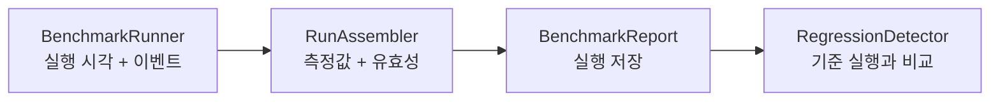

<h1 lang="en">Measurements with meaning.</h1>

**측정값을 비교하기 전에 실행 조건과 관측 범위를 확인하세요.** HALCamera의 벤치마크는 앱에서 관측한 실행 시각과 카메라 콜백을 바탕으로 결과를 저장하고 기준 실행과 비교합니다.

이 그림은 벤치마크 결과가 만들어지는 개념적 순서입니다. 실제 호출은 `BenchmarkActivity`가 조정합니다.

<h2 lang="en">Read the result in context.</h2>

| 확인할 항목 | 확인하는 이유 |
| --- | --- |
| 실행과 관측 창 | 카메라를 다시 여는 반복 측정과 관측 세션은 서로 다른 입력을 만듭니다. |
| 워밍업과 표본 | 관측 시작 전에 도착한 프레임 수를 기준으로 워밍업 표본을 제외합니다. |
| 기준 실행 | 지정한 baseline이 없으면 이전의 적격 실행을 reference로 선택합니다. |
| 유효성과 비교 상태 | 측정 불가와 성능 저하를 구분해야 합니다. 값이 없으면 원인을 먼저 확인합니다. |

A number is only useful when its context travels with it.

<h2 lang="en">Follow the implementation.</h2>

구체적인 실행 순서, 중단 조건, 저장·비교 과정은 [아키텍처의 벤치마크 설명](architecture.md#벤치마크의-실행과-중단-조건)에서 확인하세요. 이 페이지는 해당 설명으로 들어가는 요약이며 별도의 실측 결과를 주장하지 않습니다.

코드 근거를 확인하세요

저장소의 <code>app/src/main/java/dev/halcamera/benchmark/</code>에서 <code>BenchmarkRunner.kt</code>, <code>RunAssembler.kt</code>, <code>BenchmarkActivity.kt</code>, <code>RegressionDetector.kt</code>를 확인하세요. 원고의 검토 상태는 아키텍처 문서 끝에 있습니다.

**다음 단계:** [주요 실행 흐름](architecture.md#주요-실행-흐름)을 읽고 측정값이 만들어지는 과정을 확인하세요.
