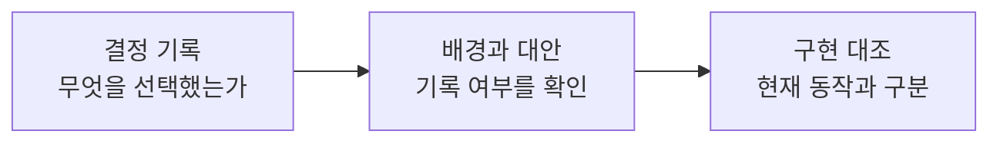

<h1 lang="en">Make the reasoning visible.</h1>

**결정 번호를 따라 구현과 설계 의도를 구분하세요.** 선택한 방식은 기록에 근거해 설명하고, 기록되지 않은 이유는 확인이 필요한 상태로 남깁니다.

<h2 lang="en">The decision register.</h2>

| 기록 | 선택한 방식 | 이유의 기록 상태 |
| --- | --- | --- |
| [D-001](_inputs/decisions.md#d-001-camera2-엔진과-camerax-엔진을-모두-유지합니다) | Camera2를 측정 경로로, CameraX를 비교 경로로 유지합니다. | 배경·대안·선택 이유는 보완이 필요합니다. |
| [D-002](_inputs/decisions.md#d-002-v02-건강-판정-제품을-중단하고-v03-camera-benchmarker로-전환합니다) | v0.2 건강 판정에서 v0.3 측정·비교 계약으로 전환합니다. | 배경·대안·전환 이유는 보완이 필요합니다. |

Clarity includes knowing what has not been explained.

이 목록은 기존 결정 기록의 요약입니다. 결정일과 상태, 전환 당시의 계획은 원문에서 확인하세요. 과거의 결정은 현재 구현 전체에 대한 보증이 아닙니다.

**다음 단계:** [설계 결정 원문](_inputs/decisions.md)을 열어 결정의 상태와 아직 기록되지 않은 내용을 확인하세요.
