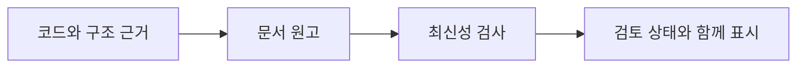

# Trust starts with a trace.

**설명의 근거 수준과 검토 상태를 함께 확인하세요.** 코드를 읽어 확인한 동작과 실제 기기에서 확인한 결과는 서로 다른 근거입니다.

## Know what each claim means.

| 근거 수준 | 의미 | 확인할 자료 |
| --- | --- | --- |
| 코드 확인 | 구현을 읽고 동작을 대조했습니다. 기기 실측을 의미하지 않습니다. | 아키텍처의 코드 근거와 검토 상태를 확인합니다. |
| 기기 검증 | 해당 기기에서 관찰한 동작입니다. 다른 환경의 결과까지 보장하지 않습니다. | 해당 설명에 연결된 기기 검증 기록을 확인합니다. |
| 설계 의도 | 결정 기록에 명시된 선택입니다. | D-번호가 있는 설계 결정 원문을 확인합니다. |

## Check freshness before relying on it.

[아키텍처](architecture.md)와 [디버깅](troubleshooting.md) 문서 끝의 **문서 검토 상태**를 펼치면 기준 앱 버전과 검토 커밋을 확인할 수 있습니다. 관련 소스가 바뀌었거나 원고 검토가 끝나지 않았다면 표시된 상태를 따라 재검토해야 합니다.

Architecture is useful only when developers can trust it.

문서를 유지하는 방법을 확인하세요

사실 정보는 추출기로, 구조 근거는 <code>.omm/</code>로, 원고는 <code>_content/</code>로 관리합니다. <code>verify.mjs</code>는 최신성을 검사하고 <code>generate.mjs</code>는 페이지의 마커 블록을 갱신합니다. 검사를 통과했다는 사실만으로 사람의 검토나 기기 검증이 완료되지는 않습니다.

**다음 단계:** [아키텍처 문서](architecture.md)에서 설명과 코드 근거를 대조하세요.
