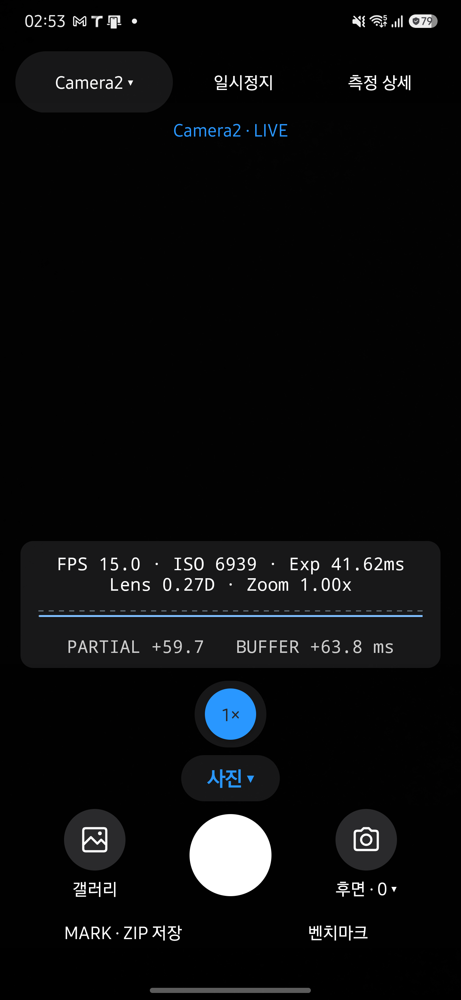
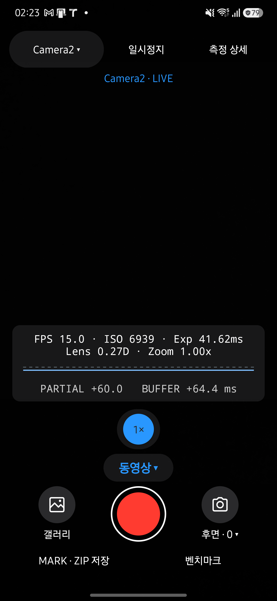
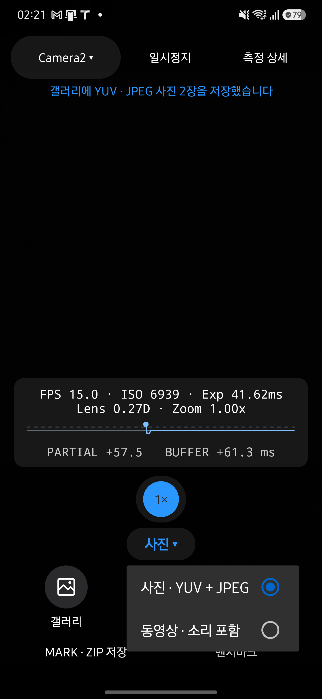
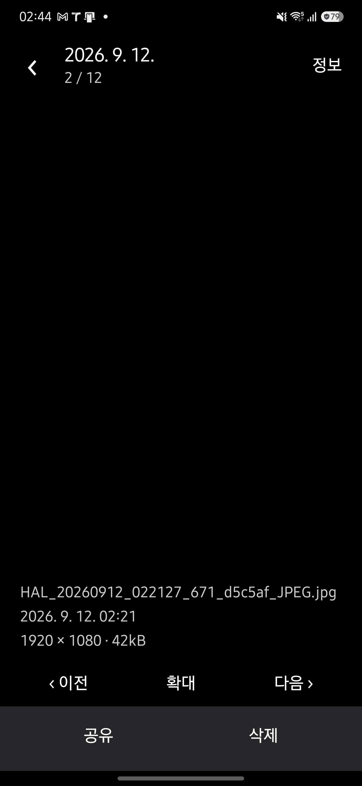

# 카메라·녹화·갤러리 UI 검토

2026-09-12에 main `30809d8`에서 변경했습니다. Galaxy S25+의 삼성 카메라와 갤러리를 직접 확인하고, [앱 UI·UX 기준](../../design/APP-UI.md)에 맞춰 촬영과 미디어 확인 흐름을 정리했습니다.

## 변경 결과

- LIVE 상단을 한 줄로 정리하고 하단에 측정값, 기존 위치의 접히는 줌, 모드, 셔터를 배치했습니다. 갤러리와 카메라 선택은 원형 아이콘과 이름을 함께 표시합니다.
- 사진은 흰 셔터, 동영상 대기는 빨간 원, 녹화 중에는 정지 사각형과 경과 시간을 표시합니다. 종료 처리 중에는 `저장 중…`을 표시하고 중복 정지를 막습니다. 앨범 저장 완료는 별도로 알립니다.
- 갤러리는 3–6열의 정사각형 격자, 버튼에 붙는 필터 목록, 앱 안의 사진 확대와 동영상 재생을 제공합니다. 여러 항목 선택과 공유·삭제, 필터·현재 항목·스크롤 위치 복원을 지원합니다.

## 리뷰와 검증

독립 코드 리뷰에서 발견한 동영상 간 재생 위치 혼입과 재생 완료 후 끝 위치가 다시 저장되는 문제를 수정했습니다. 최종 재검토에서 녹화 상태 복구, 공유·삭제 대상 유지, 비동기 이미지 결과 검증과 자원 해제에 추가 차단 사항은 없었습니다.

- JDK 17에서 Debug·Release 빌드, JVM 테스트 250개와 Android lint가 통과했습니다.
- 문서 추출·최신성·생성·디자인 검사가 통과했습니다. 문서 도구 테스트 30개가 통과했고 외부 Qwen 통합 테스트 1개는 생략했습니다.
- Galaxy S25+ SM-S936N / Android 16에서 엔진·카메라·모드의 현재 선택 표시, 모드 선택과 촬영 실행의 분리, YUV·JPEG 저장, 줌 3배 선택·자동 접기·일시정지 후 유지 동작을 확인했습니다.
- LIVE를 글꼴 200%와 화면 폭 240dp에서 확인했습니다. 확인 후 기기 설정을 원래 글꼴 1.15, 1440×3120, 밀도 640으로 복원했습니다.
- 사용자에게 허용받은 최신 설치본의 테스트 녹화는 시작 입력으로부터 3,083ms 뒤 중지했습니다. 정지 셔터와 경과 시간, LIVE 복귀를 확인했습니다. 저장된 MP4는 1,584,739바이트이며 완료된 `moov`와 영상·음성 트랙을 모두 확인했습니다. 준비 시간이 포함되므로 실제 영상 길이는 약 2초입니다.
- 갤러리의 사진 필터·정보·확대 버튼·이전/다음과 공유 취소 후 복귀를 확인했습니다. 1개·2개 선택, 공유 취소와 삭제 취소 후 선택 유지도 확인했습니다.
- 테스트 동영상의 앱 내 재생·재생 완료·다시 재생, 일시정지 후 공유 취소·복귀를 확인했습니다. 이번 작업에서 직접 만든 YUV 사진 한 장을 삭제하고 다음 JPEG로 이동하는 것도 확인했습니다.
- 기본 사용자에 설치된 HAL CAM 패키지는 `dev.halcamera` 하나입니다. 기존 앱을 Release APK로 업데이트했습니다.

Android 26–29의 사진 회전 보정·삭제 경로와 프로세스 재생성 복원은 코드로 검토했으며 해당 환경의 실기기 검증은 수행하지 않았습니다. TalkBack과 갤러리의 두 손가락 제스처는 기기에서 직접 검증하지 않았습니다. 전체 벤치마크 성능 측정은 다시 실행하지 않았습니다.

## 화면

개인 미디어가 보이는 참고 화면과 갤러리 격자 화면, 테스트 영상은 로컬에만 보관했습니다. 아래는 촬영 내용이 없는 검토용 화면입니다.

| 사진 모드 | 동영상 대기 |
| --- | --- |
|  |  |

| 버튼에 붙는 모드 목록 | 갤러리 사진 상세 |
| --- | --- |
|  |  |
