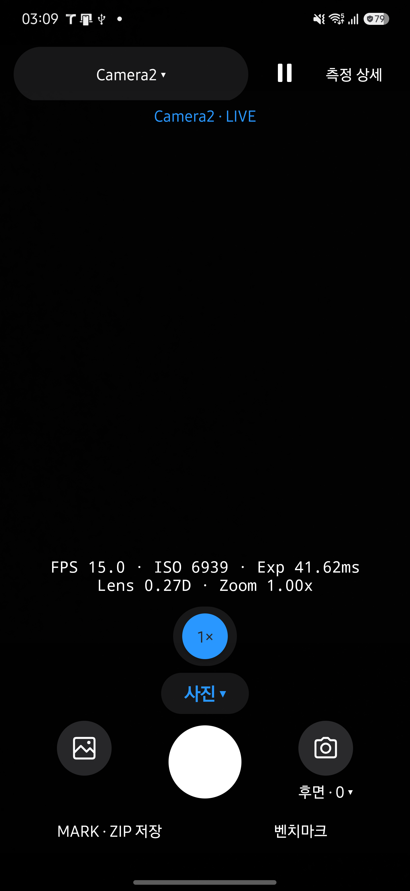
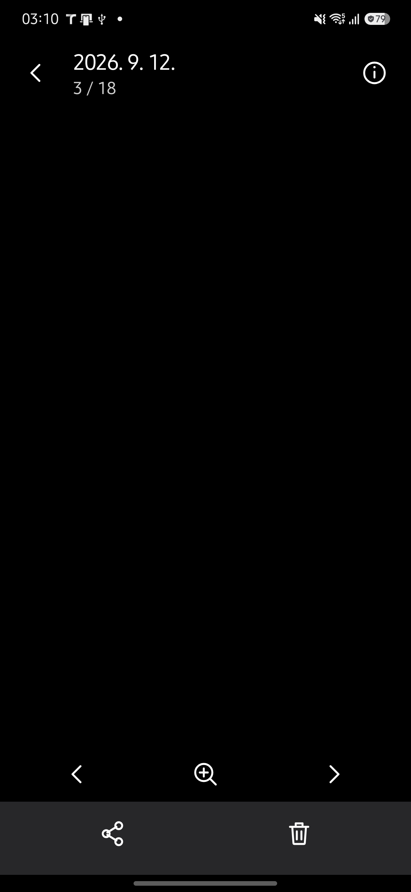
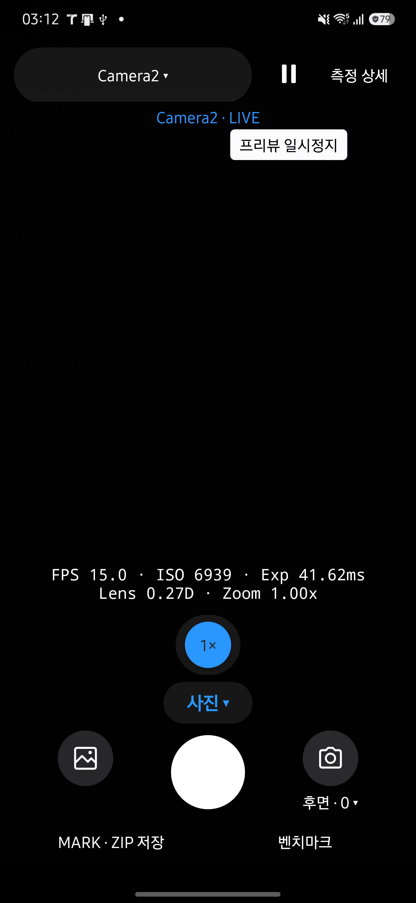

# 직관적인 아이콘과 프리뷰 공간 검토

2026-09-12에 main `7994fe2`에서 변경했습니다. 의미가 익숙한 행동만 아이콘으로 바꾸고, 설정값이나 대상이 모호해지는 작업은 글씨를 유지했습니다.

## 변경 결과

- 일시정지·재개, 갤러리, 뒤로·닫기, 정보, 공유·삭제, 재생, 사진 확대·축소를 공통 아이콘으로 표시합니다. 24dp 크기의 둥근 선과 48dp 이상 터치 영역, 한국어 접근성 이름과 길게 누르기 설명을 사용합니다.
- API·카메라 ID·촬영 모드·줌·필터·선택·MARK·벤치마크·측정 상세는 글씨를 유지합니다. 목적과 대상이 다른 내보내기 작업도 기존 이름을 사용합니다.
- LIVE의 큰 측정 타일을 없애고 핵심 수치만 남겼습니다. 프레임 간격 그래프와 PARTIAL·BUFFER 관측값은 측정 상세에서 계속 갱신합니다.
- Galaxy S25+의 같은 설정에서 줌 터치 영역 `[624,2132][816,2324]`와 셔터 `[576,2524][864,2812]`는 변경 전후 동일합니다. 핵심 수치의 시작 위치는 y=1720에서 y=1946으로 내려갔으며 배경 타일도 없어져 프리뷰를 덜 가립니다. 이는 가리는 UI의 감소이며 카메라의 촬영 화각 변경은 아닙니다.
- 갤러리의 정보와 확대 아이콘은 실제 상태에 맞춰 강조와 설명을 바꿉니다. 확대 상태는 버튼·더블탭·핀치·사진 교체·화면 크기 변경과 함께 갱신됩니다.

## 리뷰와 검증

별도 리뷰 에이전트가 Main·공통 버튼·벡터·Benchmark·History와 갤러리·확대 상태 연결을 나누어 검토했습니다. 기존 동작, 비활성화, 상태 초기화, 접근성 설명과 레이아웃에서 차단 사항은 없었습니다.

- Debug·Release 빌드, JVM 테스트 250개, Android lint가 통과했습니다.
- 문서 추출·최신성·생성·디자인 검사가 통과했습니다. 문서 도구 테스트 30개가 통과했고 외부 Qwen 통합 테스트 1개는 생략했습니다.
- Galaxy S25+ SM-S936N / Android 16에 기존 앱을 업데이트했습니다. 설치 APK와 최종 Release APK의 SHA256이 일치합니다.
- 일시정지·재개 아이콘, 길게 누르기 설명, 측정 상세의 그래프·콜백 값과 닫기 동작을 확인했습니다.
- 기존 테스트 사진으로 확대·원래 크기·더블탭의 아이콘 갱신, 정보 펼침·접힘, 공유·삭제 취소 후 현재 항목 유지를 확인했습니다. 기존 테스트 동영상의 재생·다시 재생 아이콘과 카메라 복귀도 확인했습니다.
- 벤치마크 닫기와 실행 이력의 벤치마크 복귀를 확인했습니다. 글꼴 200% 화면을 시각적으로 확인하고, 240dp 너비에서 주요 아이콘과 셔터에 접근할 수 있음을 확인했습니다. 글꼴 1.15와 원래 화면 크기·밀도로 복원했습니다.

TalkBack, 실제 두 손가락 조작, 벤치마크 비교 화면의 복귀는 코드로 검토했으며 실기기에서 직접 실행하지 않았습니다. 이번 아이콘 변경에서는 새 촬영·녹화·전체 벤치마크를 실행하지 않았습니다. 기본 사용자에 설치된 HAL CAM 패키지는 `dev.halcamera` 하나입니다.

## 화면

| 촬영 화면 | 갤러리 상세 |
| --- | --- |
|  |  |

촬영 내용이 없는 화면만 첨부했습니다. 개인 미디어와 갤러리 격자 화면은 업로드하지 않았습니다.
