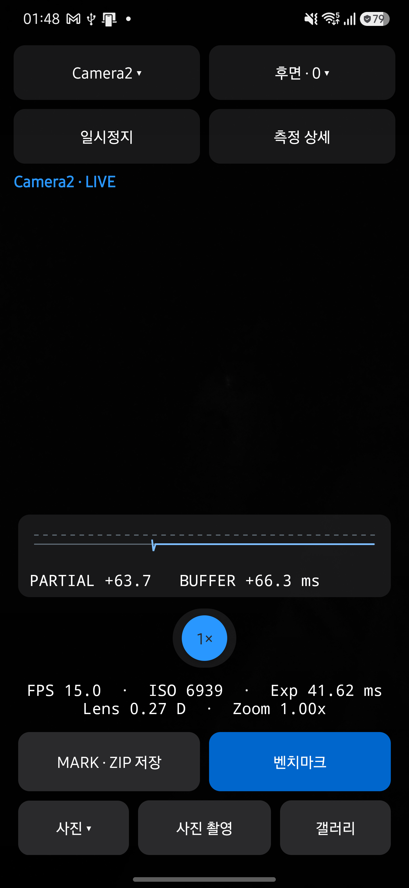
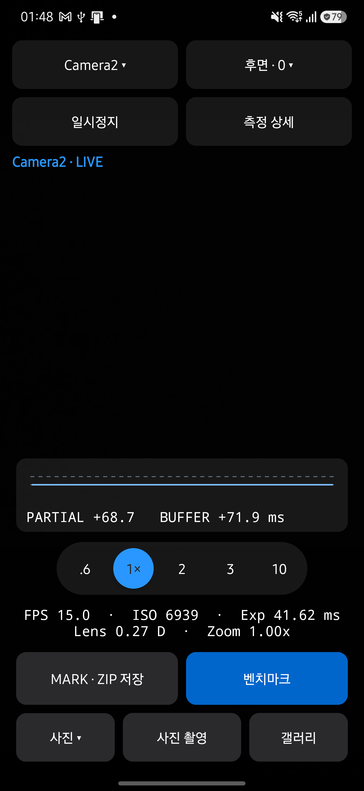
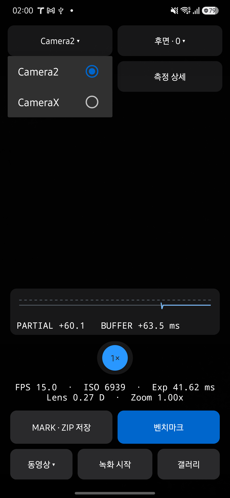
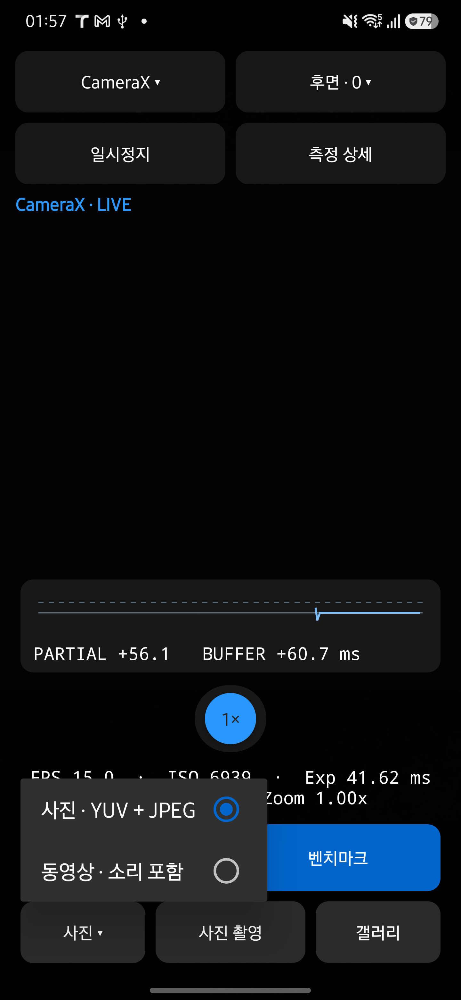

# 줌 펼침과 버튼 드롭다운 검토

2026-09-12에 main `a467cb0`에서 변경했습니다. 줌을 하단 그래프와 측정값 사이로 복원하고, 다른 설정 목록은 해당 버튼에 붙는 드롭다운으로 바꿨습니다.

## 동작

- 줌은 현재 배율 하나만 표시합니다. 누르면 배율들이 220ms 동안 가로로 펼쳐지고, 마지막 터치나 선택 후 기본 3초가 지나면 선택한 버튼 하나로 접힙니다. 원형 표시는 40dp이며 터치 영역은 48dp입니다.
- 행 높이는 고정되어 측정값과 하단 작업 버튼이 움직이지 않습니다. 좁은 창에서는 목록을 가로로 스크롤할 수 있습니다. 스크롤하는 동안 자동 접기를 미룹니다.
- 일시정지, 녹화 시작, 카메라 전환, 화면 이탈, 측정 상세 진입 시 줌을 접습니다. 시스템 애니메이션 비활성화와 접근성 대기 시간을 반영하며, TalkBack 사용 중에는 배율을 고르기 전까지 자동으로 접지 않습니다.
- 엔진·카메라·촬영 모드·벤치마크 카메라·RESULTS 필터는 버튼에 붙는 목록으로 선택합니다. 아래 공간이 부족하면 위에 열립니다. 현재 항목에 체크를 표시하고, 바깥 터치나 뒤로 가기는 값을 유지한 채 닫습니다. 화면이 중단되면 목록을 닫습니다.

## 리뷰와 검증

별도 리뷰 에이전트가 구현을 검토했습니다. 초기 구현에서 발견한 빈 여백 터치 후 타이머 중단과 좁은 창의 옵션 잘림을 수정하고 재검토했습니다. 최종 코드의 선택 상태, 기존 미디어 동작, 타이머 정리, 드롭다운 수명주기에서 추가 차단 사항을 발견하지 못했습니다.

- JDK 17에서 Debug·Release 빌드, JVM 테스트 250개, Android lint가 통과했습니다.
- 문서 추출·최신성·생성·디자인 검사가 통과했습니다. 문서 도구 테스트는 30개 통과, 외부 Qwen 통합 테스트 1개 생략입니다.
- Galaxy S25+ SM-S936N / Android 16에서 줌 펼침, 3배·10배 선택 및 실제 적용 배율, 자동 접기, 선택 시 타이머 재시작, 빈 여백 터치, 일시정지·재개 후 선택 유지, 주변 UI 위치 유지를 확인했습니다.
- 같은 기기에서 화면 폭을 일시적으로 240dp로 줄여 배율 목록을 가로로 스크롤하고 10배에 접근할 수 있음을 확인했습니다. 기기의 원래 크기와 밀도 설정을 복원했습니다.
- 엔진 변경, 카메라 목록 취소, 촬영 모드 선택과 실행 분리, 벤치마크 카메라 변경, 현재 실행 기록이 없는 카메라 필터 표시, Profile·실행 상태 필터 변경을 확인했습니다. 실제 백그라운드 전환 후 목록이 닫히는 것도 확인했습니다.

TalkBack과 시스템 애니메이션 비활성화 경로는 코드로 검토했으며 해당 설정을 바꾼 실기기 검증은 수행하지 않았습니다. 이번 변경에서 전체 벤치마크 성능 측정은 다시 실행하지 않았습니다. 설치된 앱은 `dev.halcamera` 하나입니다.

## 화면

| 현재 줌 하나 | 펼친 줌 |
| --- | --- |
|  |  |

| 엔진 버튼 아래 목록 | 촬영 모드 버튼 위 목록 |
| --- | --- |
|  |  |
