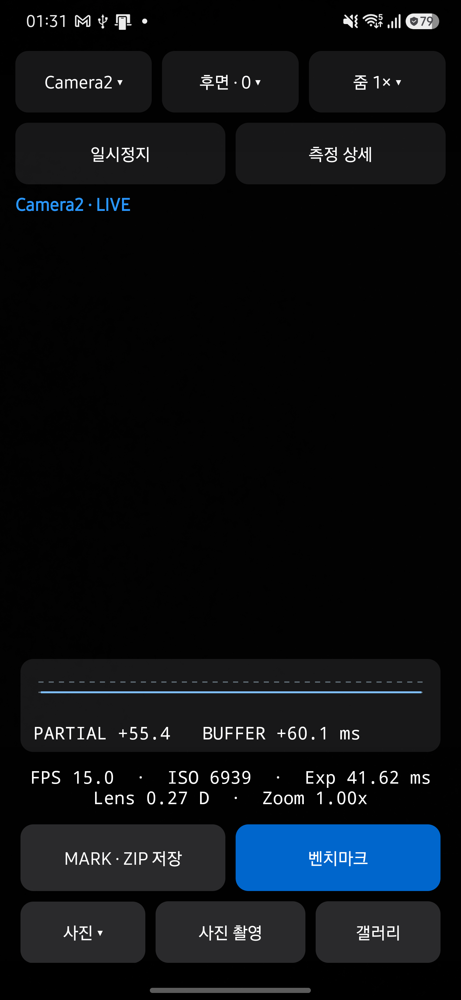
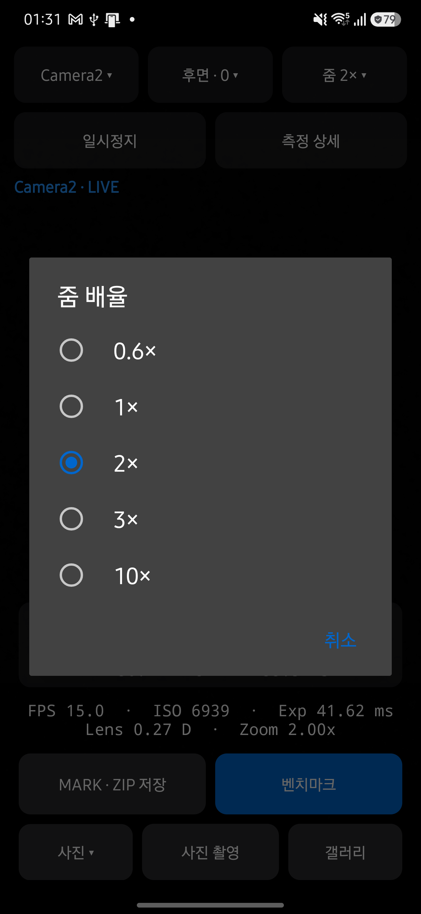
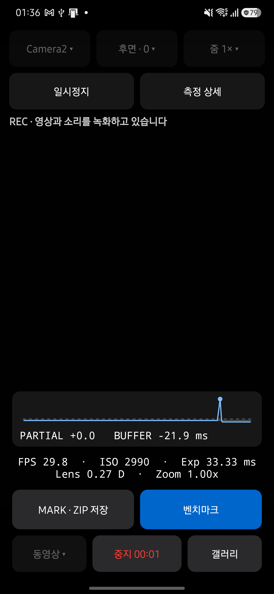
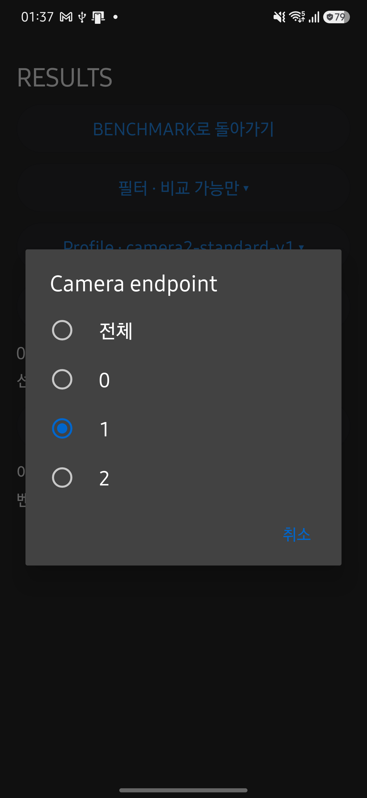

# 선택 메뉴 UI 검토

2026-09-12에 최신 main `0790812`에서 다시 검토했습니다. LIVE에서 펼쳐 놓았던 엔진·줌 옵션을 현재 값 버튼으로 통합했습니다. 카메라와 촬영 모드도 같은 방식으로 선택하며 목록에는 현재 항목이 표시됩니다.

사진·동영상 선택은 촬영을 실행하지 않습니다. 실행 버튼은 선택 모드에 따라 사진 촬영·녹화 시작으로 바뀌며, 녹화 중에는 중지와 경과 시간을 표시합니다. 이때 엔진·카메라·줌·모드 선택을 비활성화합니다. 기존 줌 버튼 행을 제거해 프리뷰 공간을 늘렸습니다.

코드 리뷰에서 RESULTS의 현재 카메라에 실행 기록이 없으면 선택 표시가 전체로 잘못 보일 수 있음을 확인했습니다. 목록에 현재 필터를 포함해 수정했습니다. 미디어 전환 시 Camera2 선택 표시, 일시정지와 화면 이탈 시 대기 작업 취소, 모드 상태 저장, 빈 카메라 목록 처리를 함께 검토했으며 추가 차단 사항은 발견하지 못했습니다. 이 리뷰는 구현 에이전트의 자체 리뷰입니다.

## 검증

- JDK 17에서 Debug·Release 빌드, JVM 테스트 250개, Android lint가 통과했습니다.
- 문서 추출·검토·생성·디자인 일치 검사가 통과했습니다. 문서 도구 테스트는 30개 통과, 외부 Qwen 통합 테스트 1개 생략입니다.
- Galaxy S25+ SM-S936N, Android 16, 세로 화면에서 선택 메뉴와 취소, Camera2→CameraX 전환, 요청 줌 2×와 관측 줌 2.00×, 전면 카메라 전환과 줌 초기화, 백그라운드 복귀 후 선택값 유지를 확인했습니다.
- CameraX에서 동영상 모드를 선택해도 녹화가 시작되지 않았으며, 녹화 시작을 눌렀을 때 Camera2로 전환했습니다. 녹화 중 모드 선택이 차단되고 중지 후 동영상 선택값이 유지되었습니다. YUV·JPEG 사진 쌍과 MP4 파일 저장을 확인했습니다.
- 벤치마크의 선택 카메라 표시와 RESULTS의 기록 없는 카메라 필터 선택 표시를 확인했습니다. 이번 검토에서 전체 벤치마크 성능 측정은 다시 실행하지 않았습니다.

## 화면

| LIVE | 현재 줌 선택 |
| --- | --- |
|  |  |

| 녹화 중 | 기록 없는 카메라 필터 |
| --- | --- |
|  |  |
