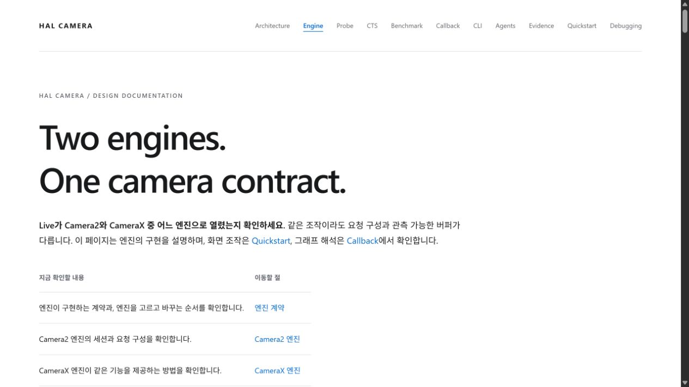
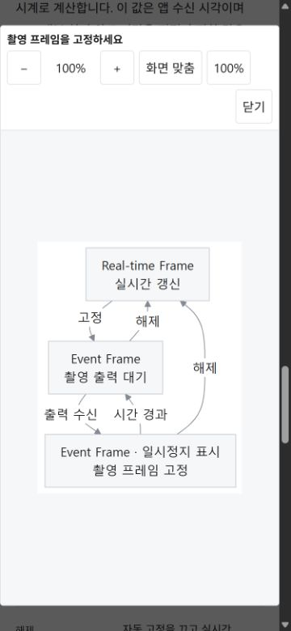

# 문서 탐색과 가독성 검증

2026-09-27에 Codex 브라우저로 배포 사이트를 확인하고, 수정한 문서를 로컬 사이트에서 검증했습니다. 앱 코드는 바꾸지 않았으며 기기 테스트는 이번 검증에 포함하지 않았습니다.

## 검토한 내용

- 상단 탭·브라우저 제목은 같은 영어 이름, 대표 제목은 영어 문장, 절 제목·본문은 한국어로 통일했습니다. 한국어는 fluent-korean과 저장소의 공통 집필 규칙을 적용했습니다.
- Architecture의 반복 도입, Engine의 중복 Benchmark 설명, Evidence의 반복 검증 조건과 CLI의 중복 파일 회수 설명을 줄였습니다. Quickstart의 사진 쌍 구현은 Engine으로 연결합니다.
- 폭이 약 6,100px였던 구조도를 역할 중심으로 다시 그렸습니다. 실행 흐름·카메라 종료·카메라 이름·도구 전환을 각각 분리하고, schema 5와 Shutter 명칭을 현재 코드와 대조했습니다.
- Callback 자동 고정과 문서 검토 순서에 Mermaid를 추가했습니다. 본문 그림의 글자 크기를 약 14px 이상으로 유지하고, 큰 그림만 내부에서 스크롤하도록 했습니다.

## 직접 조작한 결과

| 대상 | 확인한 결과 |
| --- | --- |
| 상단 탭 11개 | 데스크톱과 375×812 모바일 화면에서 각각 클릭했습니다. 주소·본문·현재 탭 표시가 해당 문서로 바뀌었습니다. |
| Evidence | Engine의 상단 메뉴, 홈의 목차 행과 하단 근거 링크에서 Evidence 본문으로 이동했습니다. |
| 홈 목차 8개 | 각 행을 클릭해 대상 문서로 이동하고 브랜드 링크로 홈에 돌아왔습니다. |
| 본문 그림 11개 | 각 그림을 열고 닫았습니다. 닫은 뒤 그림이 원래 위치에 돌아왔습니다. |
| 근거·검토 펼침 26개 | 각각 열어 내용을 표시하고 다시 닫았습니다. |
| 그림 조작 | 데스크톱과 모바일에서 확대·축소·100%·화면 맞춤 버튼의 비율 변경을 확인했습니다. Enter로 열기, Esc로 닫기와 원래 그림으로 포커스 복귀도 확인했습니다. |
| 모바일 배치 | 상단 메뉴에 있는 모든 페이지에서 문서 전체의 가로 넘침이 없었습니다. Mermaid 글자는 본문에서 약 14~16px로 표시됐습니다. |

기존 Decisions 주소와 결정 원문은 이력으로 보존합니다. 상단 메뉴에는 Decisions를 다시 넣지 않았습니다. 외부 사이트의 모든 링크나 CDN 장애 상황까지 조작한 결과는 아닙니다.

## 회귀 방지

`tools/docgen/site-contract.test.mjs`가 탭·브라우저 제목의 일치, 현재 탭 표시, 제목 언어 규칙과 배포 HTML의 내부 파일·절 링크를 검사합니다. 기존 회귀 검사는 `.omm` 그림과 `APP-UI.md` 사본이 같은지도 검사합니다. 실제 렌더링과 버튼 동작은 위 브라우저 검증으로 확인했습니다.

## 화면 기록

