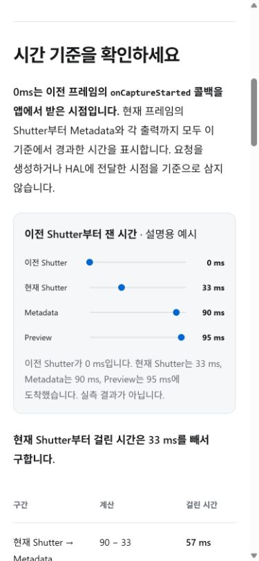
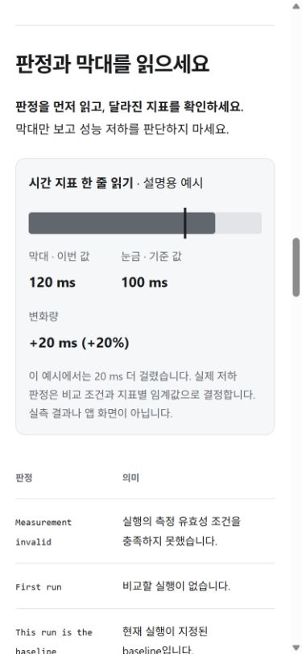
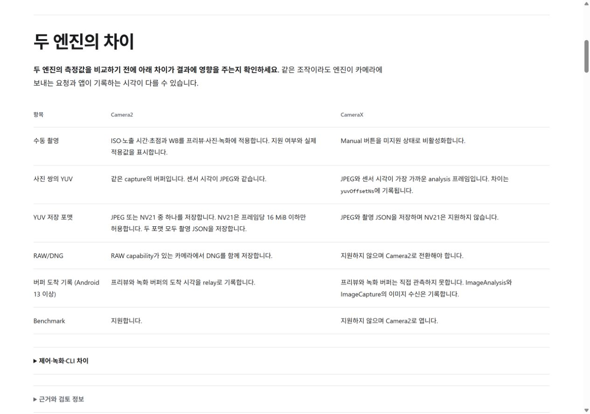

# 문서 가독성 개선 검증

2026-10-09에 `2745af7`을 기준으로 문서 원고와 사이트를 수정했습니다. 앱 코드와 측정 규칙은 변경하지 않았습니다. 기기 검증을 새로 수행한 기록이 아닙니다.

## 읽는 순서와 설명

| 문서 | 변경 내용 |
| --- | --- |
| Architecture | 패키지의 역할을 한 문장으로 요약하고 구현 세부를 펼침 영역으로 옮겼습니다. UI 조작과 YUV 저장 설명은 담당 페이지로 연결했습니다. |
| Engine | 엔진 비교를 앞에 배치했습니다. 두 사진의 연결 방식을 그림으로 설명하고 저장 파일·폴더·지원 조건을 표로 정리했습니다. 세부 구현과 제어 차이는 펼쳐 읽습니다. |
| CTS | 검사 방식과 판정을 짧은 표로 설명합니다. 실행 절차는 한 단계에 한 행동을 배치하고, SKIP 진단과 검사 조건은 펼쳐 읽습니다. 현재 코드에 맞게 진입 경로를 `Lab → CTS`로 수정했습니다. |
| Benchmark | 비교 기준 네 가지를 구분합니다. 현재 값·기준 값·변화량을 그림으로 설명합니다. |
| Callback | 이전 Shutter를 0 ms로 삼는 그림과 90−33, 95−33 계산을 함께 표시합니다. |
| Quickstart·Evidence | 첫 촬영과 추가 설정을 구분하고 문서 편집 절차를 `contributing.md`로 옮겼습니다. |

그림의 숫자는 설명용 예시이며 실측 결과가 아님을 명시했습니다. 기존 기기 관찰의 날짜·조건·한계와 타임아웃·용량 제한·판정 예외를 유지했습니다.

## 자동 검사

- `npm test --prefix tools/docgen`: 29개 통과했습니다. 접힌 본문과 중첩된 펼침 영역을 검색했을 때 정확한 링크를 반환하는 회귀 검사를 추가했습니다.
- `docflow.mjs coverage --check`, `generate --check`, `site check`: 통과했습니다.
- 초안의 `docflow.mjs check`는 수정 원고 7개의 검토 기록 대기로 멈췄습니다. 후속 리뷰·머지 요청에 따라 검토를 마치고 기록을 갱신합니다. 최종 전체 검사 결과는 PR의 CI에서 확인합니다.

## 브라우저 확인

로컬 `/hal-camera/` 경로를 Codex 내장 브라우저에서 확인했습니다.

- 1280×900에서 Engine 비교표를 확인했습니다.
- 390×844에서 Callback 시간 그림과 Benchmark 막대 예시를 확인했습니다. 페이지 가로 넘침이 없었습니다.
- 320×740에서 엔진 연결 그림과 Quickstart 추가 설정을 확인했습니다. 엔진 그림의 페이지 가로 넘침이 없었습니다.
- `SkipDiagnosis`로 검색하면 접힌 설명이 결과에 나옵니다. 결과를 누르면 해당 내용이 펼쳐집니다. 같은 해시의 결과를 다시 눌러도 열립니다.
- 기존 `#screen-benchmark-result` 링크가 해당 화면을 펼치는 것을 확인했습니다.

## 후속 리뷰

사용자가 2026-10-09에 PR의 리뷰와 머지를 명시적으로 요청했습니다. Codex가 Architecture의 overview·module-roles·runtime-flow, Engine의 camera2·camerax·comparison, Debugging의 layer-isolation을 대조했습니다. 검토자는 Codex로 기록하며 사용자가 원고를 직접 읽었다거나 기기 실측을 새로 수행했다는 의미로 기록하지 않습니다.

리뷰에서 접힌 설명 앞뒤의 본문이 같은 검색 링크로 중복되는 문제를 수정하고 회귀 검사에 추가했습니다. Camera2 사진 설명도 실제 촬영 조건에 맞춰 RAW 단독 촬영 예외를 반영했습니다. 사진 절차의 보충 문단은 각 단계 안으로 들여써 번호 목록이 끊어지지 않게 고쳤습니다. 수치·타임아웃·판정 예외와 코드 확인·기기 관찰의 구분도 대조했습니다.
