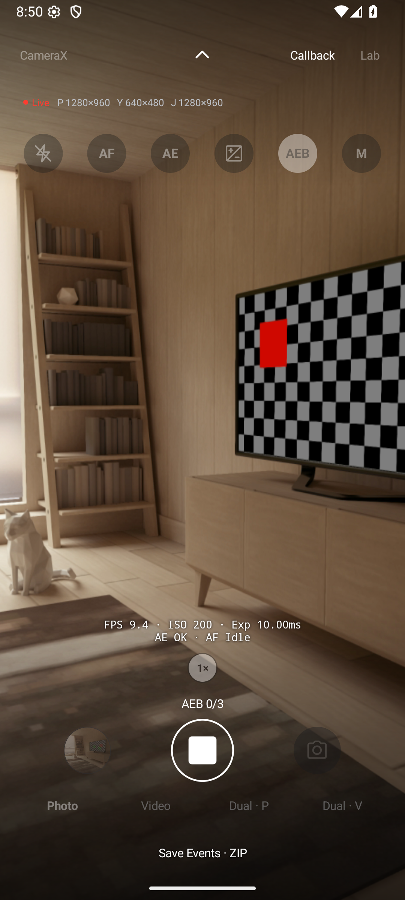
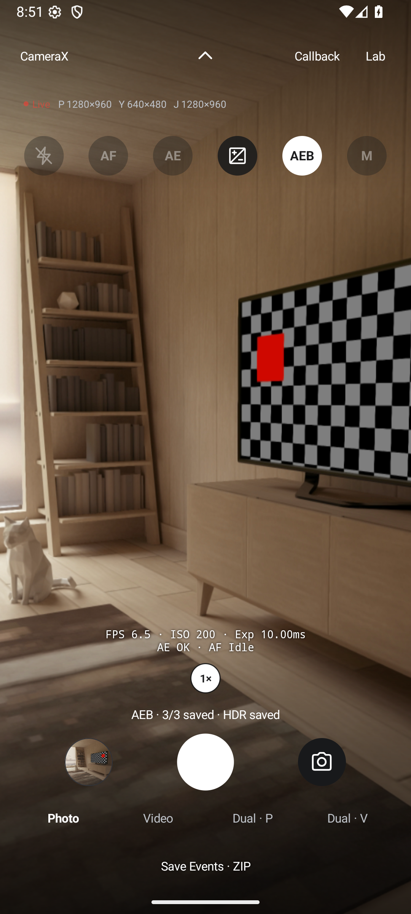

# 연사·AEB 조작 검증

2026-10-09에 에뮬레이터와 Galaxy S25+에서 연사·AEB의 진행 표시, 중단, 설정 잠금과 HDR 저장 흐름을 확인했습니다. 실제 노출 변화와 저장 결과를 확인했으며, 노출 정확도의 정량 판정과 HDR 화질 평가는 포함하지 않았습니다.

## JVM·빌드

- 앱 JVM 테스트 685개가 통과했습니다. 추가한 7개는 설정 잠금과 EV 복원, AEB에서 손떼기와 명시적 중단의 구분, EV 대기 중 취소, 연사 중 손떼기, 화면 소멸 후 콜백 차단, 수동 노출 상태의 오래된 요청 거부를 검사합니다.
- `testDebugUnitTest lintDebug assembleDebug`와 서명된 검증용 `assembleRelease`를 실행했습니다. 검증 APK만 versionCode 656을 사용하며 저장소의 버전은 바꾸지 않았습니다.

## Android 에뮬레이터

기기는 `medium_phone` AVD, `sdk_gphone64_x86_64`, Android 16입니다. 카메라는 에뮬레이터의 가상 장면을 사용했습니다.

| 시나리오 | 관찰 결과 |
| --- | --- |
| Camera2 AEB 완료 | 원본 세 장의 YUV·JPEG와 HDR JPEG를 저장했습니다. |
| CameraX AEB 완료 | 같은 원본·HDR 파일 구성을 저장하고 `AEB · 3/3 saved · HDR saved`를 표시했습니다. |
| AEB 중단 | 첫 장 촬영 중 정지 셔터를 누르자 첫 장만 저장하고 두 번째·세 번째 장과 HDR은 만들지 않았습니다. |
| 연사 손떼기 | AEB를 끄고 길게 누른 뒤 손을 떼자 진행 중인 사진 저장을 마치고 멈췄습니다. |
| 진행 중 UI | 셔터는 흰 정지 사각형으로, 설정·줌·카메라·엔진·모드·갤러리는 비활성 상태로 표시됐습니다. |
| HDR 합성 중 | `HDR…`를 표시하고 다음 AEB 셔터를 잠갔습니다. 완료 뒤 셔터가 복구됐습니다. |
| 글자 크기 | 200%에서 대기 화면의 셔터와 모드 조작부가 겹치지 않았습니다. 확인 후 100%로 복원했습니다. |

진행 표시와 완료 결과는 셔터 위 같은 위치에 나타납니다. 정상 촬영의 상단 안내는 중복 표시하지 않습니다.

## Galaxy S25+ 실기기

같은 날 무선 ADB를 재연결한 뒤 `SM-S936N`, Android 16, 후면 논리 카메라 `0`에서 검증했습니다. PR #252의 `b6717192`를 서명 release APK(versionCode 656)로 빌드하여 기존 데이터 위에 업데이트했습니다.

| 시나리오 | 관찰 결과 |
| --- | --- |
| Camera2 AEB 완료 | JPEG 1920×1080·YUV 640×480 원본 세 장과 HDR을 저장했습니다. 합성 메타데이터의 소스 세 개가 요청 ID와 일치했고, 합성 시간은 273ms였습니다. |
| CameraX AEB 완료 | JPEG 4080×3060·YUV 640×480 원본 세 장과 HDR을 저장했습니다. 첫 합성 시간은 1,193ms였습니다. |
| AEB 중단 | Camera2에서 시작 약 0.7초 뒤 정지 셔터를 누르자 첫 장만 남고 `AEB · 1/3 saved (Stopped) · HDR skipped`를 표시했습니다. |
| 설정 잠금 | Camera2 촬영 중 EV 버튼과 프리뷰 측광 지점을 눌러도 패널·측광 표시가 열리지 않았습니다. 촬영 후 조작부가 복구됐습니다. |
| 연사 손떼기 | CameraX에서 AEB를 끄고 약 1.7초 길게 눌렀다가 떼자 두 장을 저장하고 `Burst · 2 saved`를 표시했습니다. 추가 일반 사진은 생기지 않았습니다. |
| AEB 길게 누르기 | CameraX에서 AEB를 켜고 약 1.3초 눌렀다가 떼어도 일반 연사로 바뀌지 않았습니다. 원본 세 장과 HDR을 저장했습니다. |
| HDR 대기·갤러리 | 합성 중 `HDR…`와 비활성 셔터를 확인했습니다. 갤러리의 EV·HDR 태그, 합성 사진 열기와 세로 방향을 확인했습니다. |
| 화면 이탈·복귀 | CameraX AEB 첫 장 촬영 중 홈으로 나가자 첫 장만 저장했습니다. 복귀 시 촬영·설정 조작이 복구됐습니다. |
| JPEG 없는 출력 | Camera2의 JPEG를 끄고 NV21만 저장하자 원본 세 개와 JSON만 생성하고 `AEB · 3/3 saved · HDR skipped: no JPEG output`을 표시했습니다. |

Camera2의 `bracket-182138_433` 메타데이터에서 EV 0/−2/+2 요청에 대해 각각 33.33ms·ISO 513, 8.33ms·ISO 448, 33.33ms·ISO 3199를 확인했습니다. CameraX의 `bracket-182242_729`에서는 JPEG의 직접 노출 필드가 null이었고, 별도 `yuvCapture` 표본은 각각 33.33ms·ISO 509, 8.33ms·ISO 420, 41.62ms·ISO 2654였습니다. 이 표본은 노출이 바뀌었다는 근거이며, 요청한 ±2EV의 정확한 달성이나 JPEG와 YUV의 동일 노출을 보증하지 않습니다.

검증 후 Camera2의 JPEG 1920×1080·YUV JPEG 저장 설정과 AEB Off를 복원하고 일반 사진 저장을 확인했습니다. 앱 프로세스의 crash 로그는 비어 있었습니다. 화면 캡처와 원본 메타데이터는 로컬 검증 자료에 보관했습니다.

## 검증 범위의 한계

정지 장면에서 저장·표시·중단 동작을 확인했습니다. 움직이는 피사체의 합성 품질, 정량 AE 오차, 장시간 메모리 누수 및 TalkBack 전체 조작은 검증하지 않았습니다.
