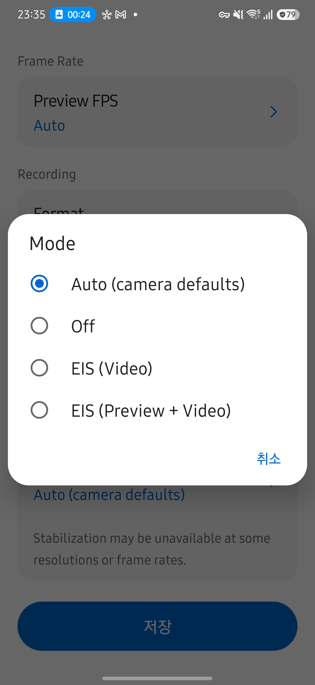
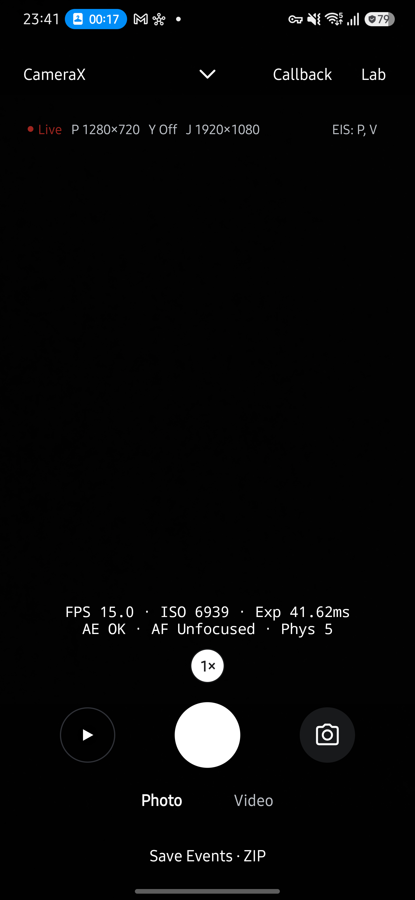
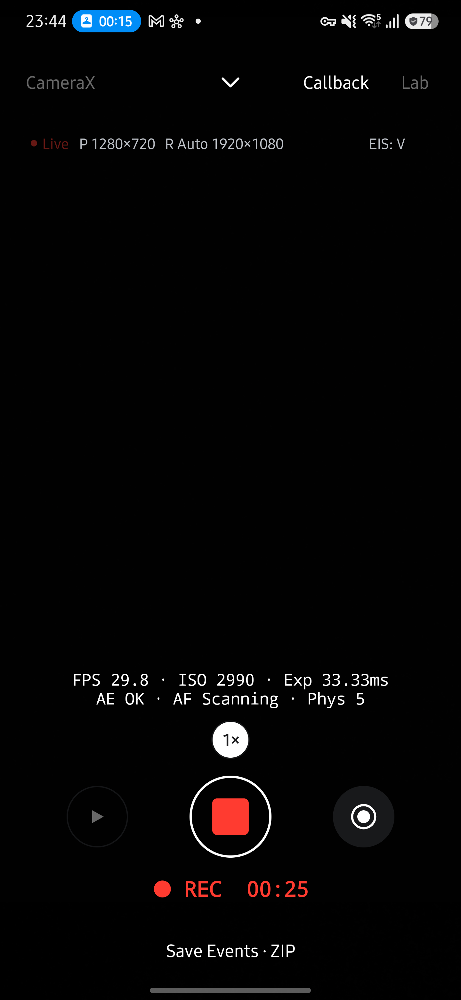
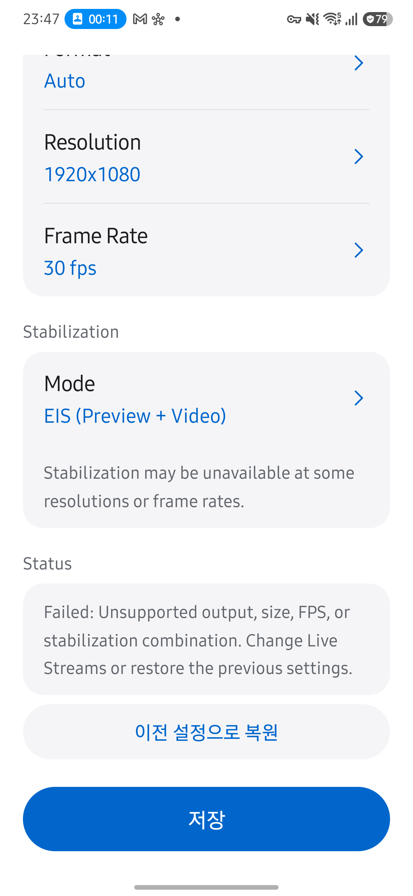

# CameraX 손떨림 보정 검증 — 2026-10-05

CameraX에도 Camera2와 같은 보정 모드 선택과 Live EIS 표시를 제공합니다. 모드별 출력 조합은 CameraX capability와 실제 bind 결과를 따르며, 지원하지 않는 조합을 자동으로 낮추지 않습니다.

## 자동 검증

- `assembleRelease testDebugUnitTest lintDebug`를 통과했습니다.
- JVM 테스트는 app 624개와 ctsvendor 12개이며 실패·오류는 0개입니다.
- 신규 테스트는 하드웨어와 CameraX capability의 교집합, builder 옵션의 Off 간섭 방지, 녹화 전용 EIS의 비교 시점을 확인합니다.
- 기존 EIS 결과 누락·오래된 결과·불일치 지속 시간 테스트도 통과했습니다.

## 기기 검증

Galaxy S25+ SM-S936N, Android 16/API 36, 후면 논리 카메라 0에서 서명된 release 빌드를 덮어 설치했습니다. 프리뷰 1280×720, JPEG 1920×1080, 녹화 1920×1080/30fps를 사용했습니다.

| 시나리오 | 결과 |
| --- | --- |
| 모드 목록 | Auto, Off, EIS (Video), EIS (Preview + Video)를 표시했습니다. 하드웨어가 OIS On을 보고하지 않아 OIS는 없었습니다. |
| Preview + Video, YUV Off | 프리뷰와 녹화 모두 `EIS: P, V`를 표시했습니다. 녹화 중 사진 저장과 녹화 종료 후 프리뷰 복귀도 정상입니다. |
| Video, YUV Off | 녹화 전에는 EIS 표시와 불일치 경고가 없었습니다. 녹화 중에는 `EIS: V`, 종료 후에는 다시 표시가 없었습니다. |
| Off | YUV 640×480을 포함한 세 출력으로 프리뷰가 재개됐고 EIS 표시와 경고가 없었습니다. |
| Preview + Video, YUV 640×480 | CameraX가 세 출력 조합을 `No supported surface combination`으로 거절했습니다. 크기나 출력을 몰래 바꾸지 않고 실패를 표시했습니다. |
| 실패 후 복원 | Lab → Live Streams에 짧은 오류 안내와 `이전 설정으로 복원`이 표시됐습니다. 복원 후 직전 정상 Off 설정과 세 출력의 프리뷰가 재개됐습니다. 이전 검증에서는 기본 Auto 구성 복원도 확인했습니다. |
| EIS 표시 누르기 | `EIS: P, V`를 누르면 Live Streams가 열렸습니다. 정상 설정 화면에는 복원 버튼이 없었습니다. |

최종 빌드에서는 Off, 조합 실패 안내, 이전 Off 설정 복원을 다시 확인했습니다. EIS 적용 표시는 capture result의 보정 모드이며 보정 효과의 크기를 측정한 결과는 아닙니다. OIS On, 모든 해상도·FPS, 다른 기기에서의 동작은 실기 검증하지 않았습니다. 불일치 경고의 시간·초기화 규칙은 JVM 테스트로 검증했습니다.

## API 적용 근거

Preview 보정은 `Preview.Builder.setPreviewStabilizationEnabled(true)`, 녹화 전용 보정은 `VideoCapture.Builder.setVideoStabilizationEnabled(true)`로 요청합니다. 반대 use case에는 옵션을 지정하지 않습니다. 명시적인 false는 다른 use case의 보정도 취소하므로 Off·OIS에서만 두 옵션을 false로 지정합니다. Auto는 두 옵션과 광학 보정 키 모두 지정하지 않습니다. OIS는 하드웨어 지원 시 Camera2Interop으로 요청합니다.

CameraX는 VideoCapture를 녹화 시에만 bind하므로 Video 모드의 결과 대조도 녹화 중에만 수행합니다. 사진 결과는 `captureIntent`로 제외합니다. 공통 Live 표시, 불일치 경고, 설정 복원 경로는 그대로 사용합니다.

- [Preview.Builder API](https://developer.android.com/reference/androidx/camera/core/Preview.Builder)
- [VideoCapture.Builder API](https://developer.android.com/reference/androidx/camera/video/VideoCapture.Builder)

## 화면

