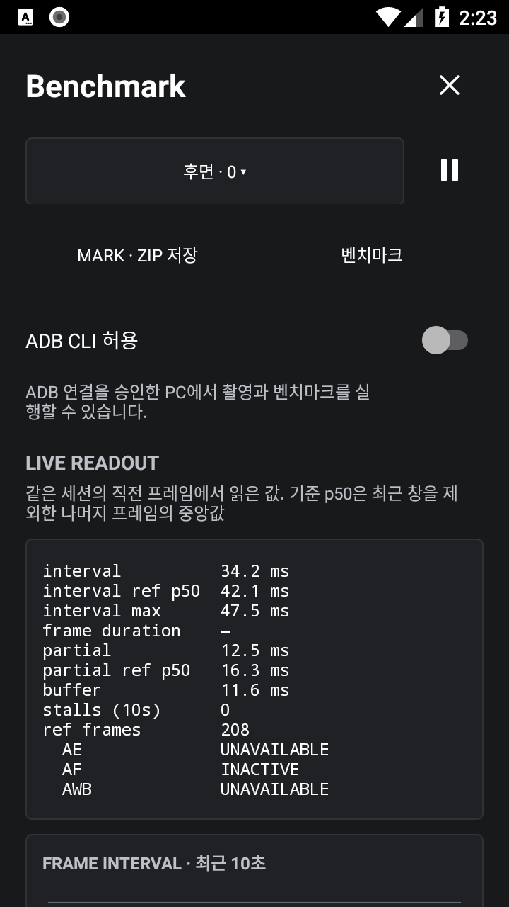

# CLI 기능 검증 기록

2026-09-12, Windows PC와 Galaxy S25+ SM-S936N / Android 16(API 36)에서 `dev.halcamera.cliprobe` release 시험 앱을 사용했다. 기존 앱과 다른 package를 사용했으며 시험용 debug key로 서명했다. 최종 배포 APK의 서명·설치 결과는 릴리스 검토 기록에 별도로 남긴다.

## 실기기 결과

| 시나리오 | 관측 결과 |
|---|---|
| 초기 비활성화 | `/v1/hello`가 `CLI_DISABLED`를 반환했다. UI의 ADB CLI 허용 스위치를 켠 뒤 명령을 받았다. |
| 사진 촬영 | 요청 `ebe9632a-5807-40a7-b78e-5777c7cc2675`가 성공하고 YUV 변환 JPEG 12,533 bytes와 원본 JPEG 362,310 bytes를 수집했다. 두 파일의 크기·해시 검증을 통과했다. |
| 같은 ID 재제출 | 같은 capture ID `HAL_20260912_225023_413_fc33d2`와 센서 시각·파일 해시가 반환되었다. 새 촬영이 아니라 기존 파일을 다시 받았다. |
| 정상 벤치마크 | 요청 `2aa8cdbb-8f1c-469b-adfb-0f1f5f583c7a`, run `20260912-225123-218`이 성공했고 schema 4 JSON 894,700 bytes를 수집했다. |
| 기존 CSV 도구 호환 | `tools/aggregate.py --eligibility all`이 해당 run 한 개를 읽고 오류 없이 CSV로 변환했다. |
| 잘못된 카메라 | `UNSUPPORTED_CAMERA`, 종료 코드 4를 반환했다. |
| 잘못된 profile | `UNSUPPORTED_PROFILE`, 종료 코드 4를 반환했다. |
| 같은 ID에 다른 camera | `REQUEST_CONFLICT`, 종료 코드 2를 반환했다. |
| 실행 중 다른 요청 | benchmark의 `--no-wait` 접수 직후 capture가 `BUSY`, 종료 코드 4로 거부되었다. |
| 실행 취소 | 요청 `3bb1a03a-3abf-4ce7-9b7d-2946605184c8`이 `cancelled`로 종료되었고 partial JSON 63,473 bytes를 `fetch`로 수집했다. 종료 코드는 130이었다. |
| 프로세스 종료 | 요청 `eb3dde7f-ceae-4698-a070-194f6393b2e3` 실행 중 시험 package를 force-stop했다. 이후 Provider 조회가 `interrupted`, 종료 코드 5를 반환했으며 자동 재실행하지 않았다. |

## 통합 후 추가 검증

0.5.1 UI 통합 이후 아래 경계 조건을 재검증했다.

| 시나리오 | 결과 |
|---|---|
| 반복 실행 | 투명한 CliLaunchActivity를 새 task에서 실행하고 유휴 상태일 때만 LIVE로 이동한다. 반복 benchmark·취소·프로세스 종료 복구가 통과했다. |
| 실행 중 직접 launch | PC의 사전 검사를 건너뛰어 launch gate를 열어도 활성 request와 benchmark 화면을 유지했다. |
| Activity 종료 | `d7eeafc7-2790-40f7-b1dd-54171ed5ded4` 실행 중 뒤로 가기로 화면을 닫았다. `cancelled`와 partial JSON 62,686 bytes를 회수했다. |
| 앱 실행 시간 초과 | `18824759-e50f-4ee2-80ef-729c02cdf90b`에 2초 제한을 지정했다. `EXECUTION_TIMEOUT`, 종료 코드 6, partial JSON 29,169 bytes를 반환했다. |
| PC 대기 시간 초과 | `cc833466-187b-4930-a276-e26874fce9ba`에서 PC만 1초 후 대기를 끝냈다. 앱은 정상 완료했고 `fetch`로 JSON 898,005 bytes를 회수했다. |
| 무선 ADB 사진 | `2f627e3d-0d3d-4964-a1bd-90a5563c7974`가 성공했고 JPEG 두 장의 크기·SHA-256 검증을 통과했다. |
| API 26 release 사진 | `8e33eeb1-7d80-4fa8-ae34-cb5e1961aab8`에서 두 파일 22,449 / 128,610 bytes를 회수했다. |
| API 26 debug 사진 | `06e71178-97fc-4981-a698-55f881dcba45`에서 두 파일 24,765 / 111,401 bytes를 회수했다. |
| 권한 미허용 | API 26 시험 앱의 카메라 권한을 회수한 뒤 `PERMISSION_REQUIRED`를 확인하고 권한을 복구했다. |
| 앱 미설치 | 존재하지 않는 package의 `doctor`가 `APP_NOT_INSTALLED`, 종료 코드 4를 반환했다. |
| UI 회귀 | Camera2↔CameraX 프리뷰, UI 사진 저장, 22초 동영상 녹화·종료, 갤러리 사진 6개·동영상 1개 표시를 확인했다. 녹화 중 CLI preview는 `BUSY`로 거부되었다. |

API 26의 최초 사진 저장 실패는 시험 harness가 저장소 그룹의 WRITE만 허용한 상태에서 발생했다. READ와 WRITE를 모두 허용한 뒤 통과했고, 최종 앱은 두 권한을 함께 검사한다. 저장 실패가 성공으로 보고되지 않는 것도 확인했다.

## UI·CLI 교대 측정

Galaxy S25+ / API 36에서 동일한 release 시험 앱·후면 camera 0·`camera2-standard-v1`로 UI와 CLI를 번갈아 각각 5회 실행했다. 10개 보고서 모두 기존 BenchmarkReport codec으로 읽혔고 measurement_valid와 comparison_eligible이 true였다. profile, `camera2-standard-v1|metrics-0.3|nearest_rank|elapsedRealtimeNanos` 계약, 20개 metric ID와 정상 관측 표본 구성을 유지했다.

| 지표 | UI 5회 p50의 중앙값 | CLI 5회 p50의 중앙값 |
|---|---:|---:|
| 1.1 (ms) | 5.215 | 4.797 |
| 1.2 (ms) | 176.082 | 175.929 |
| 1.3 (ms) | 176.334 | 176.934 |

10회 모두 충전 상태를 숨기지 않고 `CHARGING`, `LABEL_MISSING`을 기록했으며 scoring_eligible은 false였다. thermal은 0이었다. 이 작은 탐색 표본으로 성능 동등성이나 우위를 주장하지 않는다. 코드 비교에서도 profile·runner 순서·warm-up·통계·baseline 계산의 변경이 없음을 확인했다. 원본 요약은 [교대 측정 데이터](cli-alternating.json)에 보관한다.

## 자동 검사

- Python 테스트 18개가 통과했다. JSON 계약·기기 선택·미설치·대기 종료·파일 무결성·경로와 덮어쓰기 거부를 포함한다.
- JVM 테스트 267개와 `lintDebug`가 통과했다. 신규 CLI 모델·상태 규칙 테스트 6개를 포함한다.
- 실제 Android AtomicFile·JSONObject를 사용하는 instrumentation 검사 15개가 API 26과 API 36에서 각각 통과했다. backup 복구, terminal 보존, 만료, 보존 상한, 손상 파일·쓰기 오류, 영속화 실패 후 재시작을 포함한다.
- GitHub CI에서 Windows·Ubuntu·macOS의 Python 검사, Android 빌드·테스트·lint, Windows·Ubuntu 문서 검사와 Pages 빌드가 통과했다. 최종 PR의 CI 결과를 병합 전에 다시 확인한다.
- 문서 회귀·디자인·동기화 검사 31개가 통과했고 실제 Qwen 호출 검사 1개는 기본 설정대로 생략했다.

재현: `assembleDebugAndroidTest`로 시험 APK를 빌드하고 `adb shell am instrument -w dev.halcamera.test/dev.halcamera.cli.CliStoreInstrumentation`을 실행한다. target과 test APK는 같은 키로 서명해야 한다. 별도 package의 시험 빌드는 설치한 test package 이름을 사용한다.

## Probe·CTS 명령 (2026-09-17)

release 서명 로컬 빌드(versionCode 105, 0.9.0 소스 + 이 변경)를 Galaxy S25+ SM-S936N / Android 16에 설치하고, uv가 관리하는 Python 3.14로 `python -m halcam`을 USB ADB로 실행했다.

| 시나리오 | 관측 결과 |
|---|---|
| `hello` | `commands`에 `probe`, `cts.cases`, `cts.run`이 추가되어 반환되었다. |
| `probe --output` | 요청 `e8c41892-e070-4239-b595-165ec0931846`이 화면을 띄우지 않고 성공했다. 카메라 6대, `errors` 없음. `camera-probe-SM-S936N-20260917_230809.json` 363,721 bytes와 같은 이름의 `.txt` 260,299 bytes를 받았고 크기·SHA-256 검증을 통과했다. |
| `cts cases` | custom 5개와 vendored `RecordingTest` 19개 메서드가 키·종류·오디오 필요 여부·예상 시간(측정되지 않은 vendored 메서드는 `null`)과 함께 반환되었다. |
| `cts run` 2개 항목 | 요청 `48edcf47-9f55-47ab-a6c6-cdfd6a3aaf0f`: Live에서 `CtsSuiteRunActivity`로 넘어가 `status`가 `screen:"cts", busy:true`를 보였고, `custom:fast_on_off`(34.5초 PASS)와 `vendored:…RecordingTest#testBasicRecording`(118.0초 PASS)이 차례로 끝나 2분 32초 뒤 `succeeded`로 돌아왔다. `cts-suite.json` 6,290 bytes(`cts_suite/1`, `passed: 2`)와 `cts-suite.txt` 5,962 bytes(화면의 공유 텍스트와 같은 내용)를 받았다. |
| `cts run` 취소 | `custom:still_preview_combination`을 `--no-wait`로 시작해 15초 뒤 `cancel`을 보냈다. 요청은 `cancelled`, `cancel_effective: true`, 오류 `CANCELLED`로 끝났고 `fetch`가 중단 시점까지의 보고서 두 파일을 받았다(종료 코드 130). |

vendored 항목은 RECORD_AUDIO 권한이 이미 허용된 상태에서 실행했다. 권한이 없는 기기에서 `PERMISSION_REQUIRED`로 끝나는 경로와 API 33 이하 기기의 `cts.cases`(vendored 항목 없음)는 실기기로 확인하지 않았다.

## CTS 원문 24개 메서드 (2026-09-17)

PR #108 빌드(versionCode 106, release 서명 로컬 빌드)를 같은 Galaxy S25+에 설치하고 `halcam cts cases`가 돌려준 43개 중 `StillCaptureTest` 21개와 `BurstCaptureTest` 3개를 `halcam cts run --case … ×24 --timeout 3600 --wait-timeout 3600`으로 한 번에 실행했다. 카메라·마이크 권한은 이미 허용된 상태였다.

| 항목 | 관측 결과 |
|---|---|
| 요청 | `c6891837-3ad9-4cf9-910f-9d95a59c2d21`, `succeeded`, `passed: 23, failed: 1, skipped: 0, not_run: 0`, 총 24분 33초. `cts-suite.json`·`cts-suite.txt` 수집과 해시 검증 통과. |
| PASS 23 | `testAePrecaptureTriggerCancelJpegCapture` 11초, `testAeRegions` 63초, `testAfRegions` 44초, `testAllocateBitmap` 19초, `testAwbRegions` 1초, `testBasicRawCapture` 2초, `testBasicRawZslCapture` 2초, `testDynamicDepthCapture` 0초, `testFocalLengths` 8초, `testFullRawCapture` 16초, `testFullRawZSLCapture` 16초, `testHeicExif` 0초, `testHeicUltraHdrCapture` 0초, `testJpegExif` 14초, `testJpegRCapture` 14초, `testPreviewPersistence` 20초, `testStillPreviewCombination` 1,109초, `testTakePicture` 21초, `testTakePictureZsl` 19초, `testTouchForFocus` 27초, `testJpegBurst` 10초, `testYuvBurst` 22초, `testYuvBurstWithStillBokeh` 0초. |
| FAIL 1 | `StillCaptureTest#testAeCompensation` 36초. JUnit 실패 6건: 카메라 0 "Exposure setting out of bound, value 288808119 is out of range [1246, 213334400]" ×5, 카메라 2 "Exposure compensation ratio exceeds error tolerence: expected(2.000000) observed(1.000000) … value 0.5 is out of range [0.8, 1.2]". CTS assertion 문구 그대로이며 앱 쪽 오류가 아니다. |
| 직전 단독 실행 | 요청 `9c710619-f083-4c3f-8ff8-a0ad7c098879`: `testTakePicture` 11.6초 PASS, `testJpegBurst` 8.3초 PASS(2개 19초). |

0초로 끝난 메서드는 기기에 검사할 출력 형식(HEIC UltraHDR, DynamicDepth, bokeh)이 없어 본문이 바로 돌아온 경우다. 테스트가 assumption이 아니라 `continue`로 건너뛰므로 SKIP이 아닌 PASS로 기록된다.

## 검증 범위

PC의 실제 장치 연결은 Windows에서 USB와 무선 ADB로 확인했다. Linux·macOS는 단위 테스트와 wheel 설치 CI 범위다. 다른 OEM, 보조 사용자·업무 프로필, root adbd, 비밀번호 잠금 상태의 전체 조합, 저장 매체의 모든 장애를 검증한 것으로 확대하지 않는다. 연결 끊김·손상 전송·중복 파일은 fake ADB 시험을 포함한다. 실제 사용자 파일 삭제로 오류를 만들지는 않았다.

