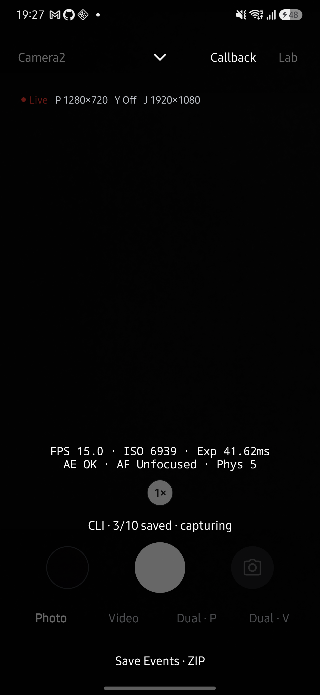

# 전체 CLI 연동 검토 — 2026-10-09

현재 구현된 기능을 CLI 명령에 연결하고 Galaxy S25+에서 촬영·저장·회수 경로를 검증했습니다. 자동 검사와 실기기 검증 범위를 아래에 구분합니다. 이 기록은 해당 기기의 실행 결과이며 다른 기기나 모든 스트림 조합을 보장하지 않습니다.

## 검토 기준

작업은 main `445e08c3`에서 시작했고 PR #252의 `7768ad86`을 작업 브랜치에 통합했습니다. 작업 중 #252가 main `acd7c432`에 병합된 사실도 확인했습니다. 최근 PR 목록과 현재 화면·엔진·CLI 구현을 대조했습니다. 주요 기능 근거는 #238·#245(Dual), #244(연사), #247(AEB), #249·#250(HDR와 생략 이유), #252(취소·진행·접근성)이며 #253의 가이드 구성도 유지합니다. 기존 PR을 원격에서 수정하거나 대신 승인하지 않았습니다.

## 기능과 명령 대응

| 앱 기능 | CLI 경로 | 구현 근거·제약 |
| --- | --- | --- |
| 엔진·카메라·출력 선택 | `cameras`, `streams`, `preview`, `capture`, `record start` | Camera2/CameraX, 명시적 크기·FPS·코덱·보정 모드를 검증합니다. |
| RAW·NV21 | `capture --raw-size … --yuv-format NV21` | 기존 MediaLibrary를 사용합니다. RAW만 켜는 구성도 허용합니다. |
| 줌·플래시·EV·잠금·수동 노출/초점/WB | 촬영 옵션, `live set`, `live reset` | 지원 범위 밖의 요청을 자동 보정하지 않습니다. 수동 노출 시간은 선택 FPS 제약을 따릅니다. |
| 터치 초점·노출 측광 | `meter --x … --y … --meter focus|exposure` | 정규화한 좌표를 현재 프리뷰 좌표로 바꿉니다. 결과는 접수 사실이며 초점 성공을 보장하지 않습니다. |
| 연사·AEB·HDR | `burst`, `bracket`, `cancel` | 기존 BurstRun·BracketFusion을 사용합니다. 부분 저장과 HDR 실패·생략을 구분합니다. |
| 녹화와 녹화 중 사진 | `record start`, `record snapshot`, `record stop` | 스냅샷은 원래 녹화 요청의 파일 목록에 등록합니다. 사진 저장 중 정지를 지연합니다. |
| 듀얼 프리뷰·사진·영상 | `dual cameras`, `dual preview|capture|record` | 두 물리 ID를 명시합니다. 두 프리뷰의 업데이트 후 실행하며 영상은 무음 MP4 두 개입니다. CameraX 듀얼 사진은 앱과 동일하게 미지원입니다. |
| 듀얼 제어·보고서·진단 | `live set/reset/info`, `meter`, `events` | 현재 Dual 화면을 유지합니다. 엔진별 지원 제약을 따릅니다. |
| 벤치마크·측정 라벨 | `benchmark run --build … --commit … --branch … --note …` | 고정 Camera2 표준 v2를 그대로 사용합니다. 생략한 라벨은 빈 값입니다. |
| 저장 결과·비교·baseline | `results list/show/compare/export/delete`, `baseline add/remove` | 기존 Presenter·RegressionDetector·BaselineManager를 재사용합니다. 비교용으로 고른 참조를 영구 baseline으로 자동 등록하지 않습니다. JSON/CSV는 실행별로 회수하고 여러 실행의 집계에는 기존 aggregate.py를 사용합니다. |
| 갤러리 파일 관리 | `gallery list/export/delete` | HALCamera 경로에 있는 파일 ID만 사용합니다. Android가 삭제 승인을 요구하면 앱에서 처리합니다. |
| 진단·카메라 사양·CTS | `live info`, `events`, `incidents list/export/delete`, `probe`, `cts cases/run` | 화면 보고서·이벤트·기존 CTS 실행 경로에 연결합니다. 진단 ZIP에 픽셀을 넣지 않습니다. |
| 결과 보관 한도 | `settings show/limit` | 먼저 삭제 예정 목록을 반환하고 `--confirm true`일 때 적용합니다. baseline을 보호합니다. |
| 작업 상태·파일 회수 | `status`, `cancel`, `fetch` | UUID 중복 방지·24시간/200개 기록·크기/SHA-256 검증을 유지합니다. Python 다운로드에 MP4/DNG/NV21/CSV를 추가했습니다. |

권한 허용·잠금 해제·ADB 접근 재허용은 Android 화면에서 수행합니다. 갤러리 확대·재생·공유 대상 선택은 회수한 파일을 PC 도구로 열어 수행합니다. PiP 위치·메뉴 펼침·내비게이션 같은 화면 배치 조작은 데이터/촬영 기능의 CLI 명령으로 대체하지 않습니다.

## 사용 흐름 개선

기본 `help`에는 시작 작업 다섯 개만 표시합니다. 상세 명령과 수동 옵션은 `help all`·`help controls`에 둡니다. CLI는 상태가 바뀔 때 진행 상황을 출력하고 마지막 UUID를 기억하며 저장 후 실행할 `adb pull` 한 줄을 제공합니다. 실패·취소 후에도 같은 요청의 `fetch`를 안내합니다. 삭제에는 대상 ID와 확인이 필요하고 보관 한도는 영향을 먼저 보여 줍니다. 이는 인지 부담을 줄이는 설계이며 ADHD 사용자를 대상으로 한 사용성 평가 결과는 아닙니다.

## 자동 검증

- JVM 테스트 693개: 실패·오류·건너뜀 0개입니다.
- `testDebugUnitTest lintDebug assembleRelease assembleDebugAndroidTest --offline`: 통과했습니다. 계측 테스트 APK의 빌드는 실행 결과가 아닙니다.
- Python/셸 CLI 테스트 58개: 통과했습니다. 새 미디어 형식 다운로드, 명령 옵션 전달, 듀얼 화면 유지, 녹화 제한, 실패 후 회수 경로를 검사합니다.
- 문서 회귀 검사 33개와 coverage 검사는 통과했습니다. CLI 어댑터·파일 전달·요청 작업의 문서 근거를 별도 요소로 나눠 기존 60,000자 입력 한도를 유지했습니다.
- `CommandStore.update`의 취소 중 갱신·terminal 이후 갱신 금지 검사를 Android 계측 코드에 추가했습니다. 실제 Android 계측 실행에서 총 20개 검사가 통과했습니다. 기존 테스트의 trailing lambda가 시계가 아니라 만료 콜백으로 전달되던 오류도 발견하여 `now = { clock }`로 수정했습니다.

## 실기기 검증

기기는 Galaxy S25+ (SM-S936N), Android 16 (API 36)입니다. 기존 버전 코드 656을 동일 서명으로 657에 업데이트한 뒤, 발견한 듀얼 줌 문제를 고친 658을 설치했습니다. 버전 이름은 0.22.0이며 검증용 버전 코드는 로컬 Gradle init script에서만 지정했습니다. 앱 삭제나 데이터 초기화는 하지 않았습니다.

| 시나리오 | 실제 결과 |
| --- | --- |
| 기본 shell doctor·사진 | 기본 사진 요청 성공, JPEG 두 개와 메타데이터를 회수했습니다. |
| NV21 640×480 | NV21와 메타데이터 두 파일을 회수했습니다. |
| RAW만 4080×3060 | DNG와 메타데이터 두 파일을 회수했습니다. |
| ISO 100·10 ms·수동 초점·WB·30 FPS | 저장 성공. 캡처 결과의 노출은 10,000,000 ns, HAL이 보고한 ISO는 99였습니다. 요청 ISO와 실제 보고값을 동일하다고 단정하지 않습니다. |
| JPEG 3장 연사 | 3/3 저장, JPEG·메타데이터 총 여섯 파일을 회수했습니다. |
| AEB·HDR | 3/3 저장, 세 원본·메타데이터·HDR 총 일곱 파일을 회수했습니다. |
| 10장 연사 중 취소 | 4/10 저장 후 cancelled. 저장된 JPEG·메타데이터 여덟 파일을 같은 요청으로 회수했습니다. |
| Camera2 녹화·줌·스냅샷·정지 | 1280×720 H264 무음 녹화 중 줌 1.2와 사진 저장 후 정상 정지했습니다. MP4와 스냅샷 두 파일을 회수했습니다. |
| CameraX 사진·녹화 스냅샷 | JPEG·메타데이터 저장과 무음 녹화 중 스냅샷·정지·MP4 회수가 성공했습니다. |
| Dual Camera2 (물리 5·6) | 1440×1080 프리뷰·보고서·측광·진단 ZIP, 두 센서 사진 두 개, 무음 영상 두 개를 저장·회수했습니다. |
| Dual 줌 회귀 | 최초 빌드에서 CLI 범위가 1..1에 남아 1.2배 요청을 거부했습니다. 화면과 같은 mainControls.maxZoom으로 초기화하여 수정했습니다. 658에서 1.2배 시작·2배/EV −1 변경·초기화·live.info 조회가 성공했습니다. 보고 범위는 1..10이며 실제 메인 결과의 EV −1과 2배 crop도 확인했습니다. |
| Dual CameraX (물리 5·6) | 1280×720 무음 녹화 중 줌 1.2 변경·정지·MP4 두 개 회수가 성공했습니다. |
| 벤치마크·결과·baseline | 검증 라벨을 지정한 표준 v2 실행이 성공했습니다. 조회·비교·JSON/CSV 회수·baseline 추가/해제 후 이번 실행만 삭제했습니다. |
| 보관 한도 | 적용 전 영향 목록과 명시 적용을 확인했습니다. 원래 한도 0을 유지했고 기존 실행을 자동 삭제하지 않았습니다. |
| 갤러리·저장된 ZIP | 목록·기존 파일 회수·명시 삭제가 성공했습니다. 삭제 대상은 이번 NV21 및 events 요청에서 생성한 파일 이름과 대조했습니다. |
| Probe·CTS | Probe JSON/TXT, CTS 목록과 `custom:fast_on_off` 실행·보고서 회수가 성공했습니다. CTS 결과는 PASS 1, FAIL/SKIP/NOT RUN 0입니다. |
| 저장 중 취소 | 녹화 스냅샷 직후 취소는 cancelled로 끝나며 MP4·사진 두 파일을 보존했습니다. events 취소도 ZIP 하나를 보존했습니다. |
| Live/Dual 진단 ZIP | 각 화면의 events 요청으로 ZIP을 저장하고 회수했습니다. |

회수 파일은 Python collect 또는 기본 shell이 크기와 SHA-256을 대조했습니다. 촬영·녹화 저장 성공과 화질·HAL 적합성 판정은 다릅니다. 촬영물은 검증 PC에 보관하며 저장소에 올리지 않습니다.

위 화면은 검증용 657의 실제 연사 중 캡처이며 3/10 저장 상태를 표시합니다. 캡처 후 취소 명령이 처리될 때 네 번째 촬영의 저장까지 완료되었습니다.

기존 벤치마크 31개의 ID와 baseline 등록을 검증 전후에 대조하여 모두 유지됨을 확인했습니다. 보관 한도는 원래 값 0이며 검증 종료 시 프리뷰를 정지했습니다. [요청별 결과 요약](cli-parity-20261009/results.json)에 상태와 파일 수·회수 검증 여부를 기록했습니다.

## 남은 검증과 검토

기능군별 단일 기기 검증이며 모든 카메라·크기·FPS 조합을 전수 검사한 결과가 아닙니다. Android 8–9 권한 경로, 다른 제조사, 오디오 포함 녹화, 모든 vendored CTS 항목, ADHD 사용자 사용성 평가는 이 기록의 통과 범위에 포함하지 않습니다.

## 병합 전 리뷰

사용자가 PR 리뷰와 병합을 요청하여 Codex가 코드와 문서 근거를 대조했습니다. 검토 범위는 명령별 입력 검증, shell 호출자 제한, 요청 상태·취소·파일 등록, Live/Dual 화면 인계, 삭제 대상 제한과 기존 비교 규칙 재사용입니다. 위 기기 검증 결과는 코드 리뷰와 별도로 유지합니다.

최신 main의 사용자 가이드 개선(#255)을 통합하고 생성물 충돌은 사이트 재생성으로 해결했습니다. 문서에서 `cli/`가 benchmark 결과 타입을 사용하지 않는다는 낡은 설명과 CLI의 NV21 지정 설명을 수정했고, 실행 흐름의 깨진 Live 링크도 복구했습니다. 문서 최신성 검토자는 사용자 요청으로 검토한 Codex임을 명시하며, 별도 사람의 승인이나 다른 기기의 실측을 뜻하지 않습니다.
