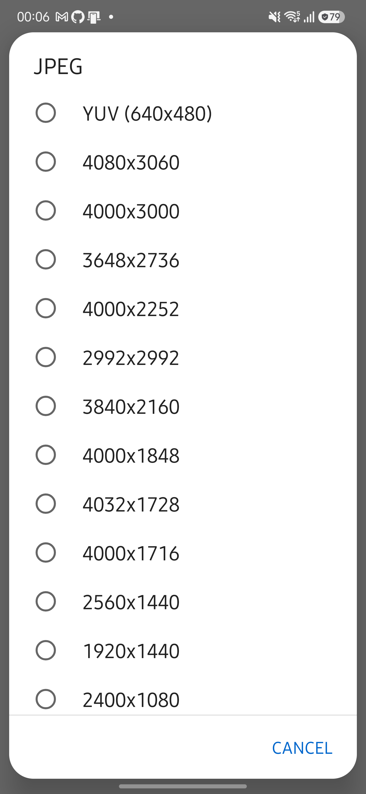
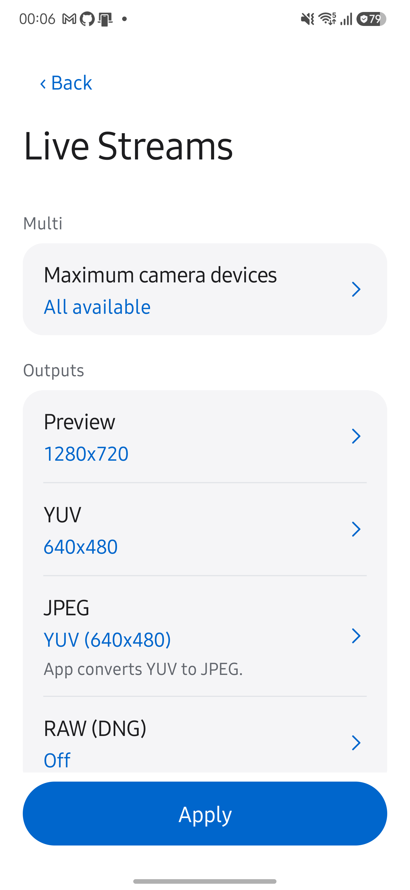

# JPEG 소스 선택과 PIP DNG 검증

2026-10-11, Galaxy S25+ (SM-S936N), Android 16 / API 36에서 검증했습니다.

JPEG 목록 맨 위에서 `YUV (현재 크기)`를 고르면 앱이 YUV를 JPEG로 변환합니다. 해상도를 고르면 카메라가 생성한 JPEG를 저장합니다. YUV Save Format과 새 NV21 파일 저장은 제거했습니다. 기존 NV21 파일의 갤러리 조회·내보내기는 유지합니다.

| 실기기 시나리오 | 결과 |
|---|---|
| Camera2, JPEG 소스를 YUV 640×480으로 선택 | JPEG 한 개와 JSON을 저장했습니다. JPEG 픽셀은 화면 회전을 반영한 480×640입니다. |
| CameraX, 같은 YUV 선택 | JPEG 한 개와 JSON을 저장했습니다. 픽셀 크기는 480×640이며 JSON의 jpegSource는 YUV입니다. |
| 두 엔진, JPEG 1920×1080 선택 | 1920×1080 JPEG 한 개와 JSON을 저장했습니다. 별도 YUV JPEG는 생성하지 않았습니다. |
| Camera2, YUV JPEG와 RAW 4080×3060 | 앱 변환 JPEG, DNG, JSON을 저장했습니다. |
| Camera2, Service 0 + Physical 6 PIP와 RAW | 같은 이름 그룹에 합성 JPEG, 메인 DNG, JSON을 저장했습니다. |
| Camera2, Service 0 + Service 1 전면 PIP와 RAW | 같은 이름 그룹에 합성 JPEG, 메인 DNG, JSON을 저장했습니다. Callback에 YUV·RAW·Jpeg 행이 표시됩니다. |
| JPEG 선택 UI | 목록 첫 화면에 YUV가 보이며, YUV 선택 때만 JPEG 값 아래에 `App converts YUV to JPEG.`가 표시됩니다. |

Physical PIP에서 받은 DNG의 TIFF 헤더를 읽어 4080×3060, 16비트, DNG 1.4, CFA 패턴과 색 변환 행렬 태그를 확인했습니다. 외부 RAW 현상 프로그램으로 화질을 평가한 검증은 아닙니다.

DNG는 메인 센서의 원본이며 PIP 합성이 들어가지 않습니다. 원본 촬영 후 합성 프리뷰를 저장하므로 두 이미지가 같은 순간이라고 보장하지 않습니다. 합성 실패 시 이번에 저장한 원본 파일 삭제를 시도하지만 저장 전체가 원자적이지는 않습니다. CameraX RAW는 지원하지 않으며, 다른 기기의 동시 출력 조합은 별도 검증이 필요합니다.

JVM 테스트 741개와 Android lint를 통과했습니다. 릴리스 APK와 계측 테스트 APK를 빌드했습니다. 계측 테스트 APK는 실행하지 않았으며, 위 결과는 앱 UI와 ADB CLI로 확인한 별도 실기기 검증입니다.

