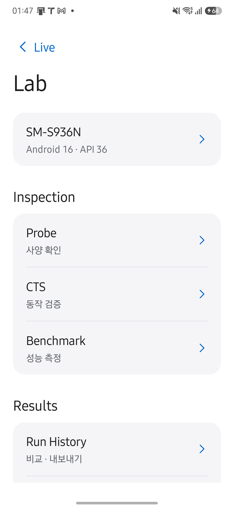
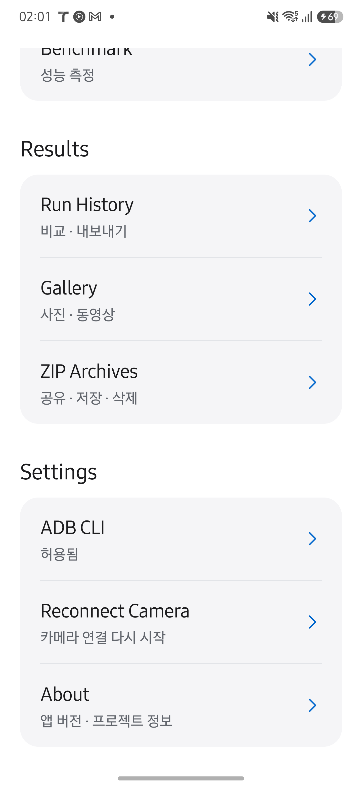
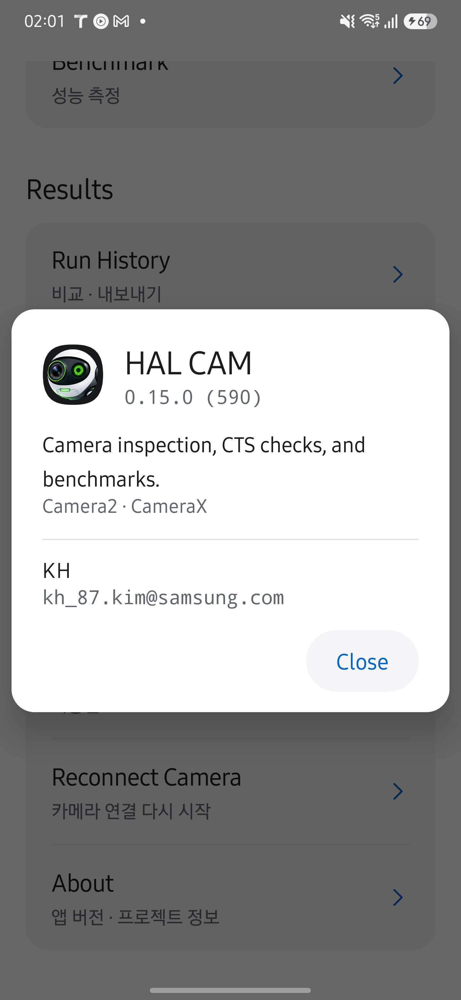

# Lab UI/UX 및 코드 검토

Lab 통합을 검토하고 기존 앱 데이터를 유지한 업데이트 설치를 확인했습니다. 검토자는 사용자의 리뷰·머지 요청을 받은 Codex이며, 독립적인 사람의 승인이나 다른 기기의 검증을 뜻하지 않습니다.

## 검토 및 보완

- Live 상단 버튼은 Callback, Lab 순서이며 Lab은 메뉴 없이 기능 페이지를 엽니다.
- 사용자가 지정한 `npx getdesign@latest add apple`의 참고안을 적용했습니다. 흰 배경, 밝은 회색 18dp 그룹, 파란색 이동 표시, 큰 Lab 제목으로 검사 도구·저장된 결과·설정을 구분합니다. 큰 Live 복귀 버튼과 반복 브랜드 표시는 상단의 작은 Live 링크로 통합했습니다. Lab 소개와 중복 기능 설명, 측정 안내 버튼·대화상자는 사용자의 요청으로 제거했습니다.
- Lab·권한 설정 복귀에서는 onStart의 자동 재시작을 건너뛰고 onResume에서 한 번만 적용합니다. 복귀 대기 상태도 화면 재생성 시 복구합니다.
- 사용자 요청으로 Lab의 프리뷰 일시정지·재개 항목과 Activity Result 계약을 삭제했습니다. CLI 내부 중지 상태는 Reconnect Camera로 해제할 수 있습니다. Live 복귀 버튼은 기존 Activity로 돌아갑니다.
- 카메라 close(done) 완료 후 Lab을 열고, 기존 카메라·엔진 선택을 Probe/Benchmark로 전달하는 경로를 코드로 대조했습니다.
- ZIP 저장 대상은 화면 재생성 시 복구하며, 파일 쓰기는 IO 실행기에서 수행합니다. 실제 파일 삭제나 외부 공유 전송은 이번 검증에서 실행하지 않았습니다.

## 검증 범위

Galaxy S25+ (SM-S936N), Android 16/API 36, 세로 화면에서 검증했습니다. 기존 서명으로 adb install -r을 사용했으며 앱 제거·데이터 초기화는 하지 않았습니다. 기기의 기존 versionCode 590을 유지하려고 저장소 밖 Gradle init script로 설치 빌드에만 590을 적용했습니다. 저장소의 버전은 바꾸지 않았습니다.

- Callback → Lab 순서와 Lab 직접 진입, 설명 및 측정 안내 삭제를 화면과 UI 트리로 확인했습니다.
- 이전 빌드에서 일시정지·재개를 검증했으며, 최종 빌드에서는 해당 기능을 제거했습니다.
- 기존 Incident ZIP 7개가 Lab 목록에 남아 있음을 확인했습니다.
- 화면의 주요 버튼은 48dp 이상이며 기능 행은 최소 56dp입니다. 설정 영역은 세로 스크롤로 접근합니다. 기기 기본 115%와 150% 글자 크기에서 버튼 문구가 잘리지 않았습니다. 검증 뒤 115%로 복구했습니다. ADB 설정 대화상자를 닫은 뒤 같은 스크롤 위치가 유지됨을 확인했습니다.
- assembleRelease, JVM 테스트 578개, lintDebug를 통과했습니다. 카메라 품질·CTS suite 전체 실행·장시간 성능 시험은 포함하지 않았습니다.
- 가로 화면·TalkBack의 실제 사용은 이번 기기 검증 범위에 포함하지 않았습니다.

동작 규칙은 [앱 UI 설계](../design/APP-UI.md)를 참고합니다.

Lab의 섹션은 Inspection·Results·Settings이며, 결과 항목은 Run History·Gallery·ZIP Archives, 설정 항목은 Reconnect Camera·About으로 표시합니다. 보조 설명은 한글을 유지합니다.

About 소개는 현재 핵심 기능에 맞춰 'Camera inspection, CTS checks, and benchmarks.'로 갱신했습니다. 최종 기기에서 영어 메뉴와 한글 보조 설명, 일시정지 항목 제거, 영어 About 소개를 확인했습니다.

Reconnect Camera 선택 후 Live 표시와 FPS 갱신도 최종 빌드에서 확인했습니다.

About의 닫기 버튼도 Close로 표시합니다.

## Lab 연결 화면과 최종 디자인 검증

Lab의 Apple 참고안을 다시 검토하고 제목을 34sp로 정리했습니다. Probe, CTS 목록·선택·상세·실행, Benchmark 설정·실행·결과, Run History·Comparison과 설정 대화상자에 흰 배경, 밝은 회색 그룹, 파란 동작, 캡슐 버튼을 공통 적용했습니다. 화면 제목은 영어, 부가 설명은 한글로 표시합니다. About 소개는 사용자가 따로 요청한 간결한 영어 문구를 유지합니다. 갤러리의 화면과 테마는 변경하지 않았습니다.

- Probe, CTS, Custom Checks, Test Details, AOSP CTS, Benchmark, Run History, 저장 결과, About을 최종 설치 빌드에서 직접 열어 확인했습니다.
- Benchmark의 미리보기를 실행 중 160dp 영역으로 옮긴 뒤 1080p/30fps 실제 측정을 완료했습니다. 저장 결과와 기존 baseline 비교가 표시됐습니다. 충전 중 측정이어서 점수 제외 상태이며 성능 품질의 증명으로 해석하지 않습니다.
- 결과 화면의 150% 글자 크기에서 줄바꿈과 하단 동작을 확인하고 115%로 복구했습니다.
- 기존 가이드의 Probe, CTS 선택·실행·결과, Benchmark 설정·실행·결과·기록, ZIP 목록과 CLI 설정 스크린샷을 같은 파일 경로에서 교체했습니다. 별도 스크린샷 모음 절을 만들지 않습니다.

코드 리뷰에서는 공통 토큰 변경의 갤러리 영향, 화면 테마·시스템 바 대비, 스크롤과 inset 처리, Benchmark TextureView 생명주기를 대조했습니다. 측정·판정 알고리즘은 변경하지 않았습니다.
기존 가이드 이미지 교체 과정에서 최종 빌드의 Rapid Open / Close 한 건을 실행해 35초 PASS를 확인했습니다. Benchmark 진행 이미지 촬영용 추가 실행은 Stop으로 종료했으며 완료 결과 이미지는 앞서 완료한 실행을 사용합니다.
