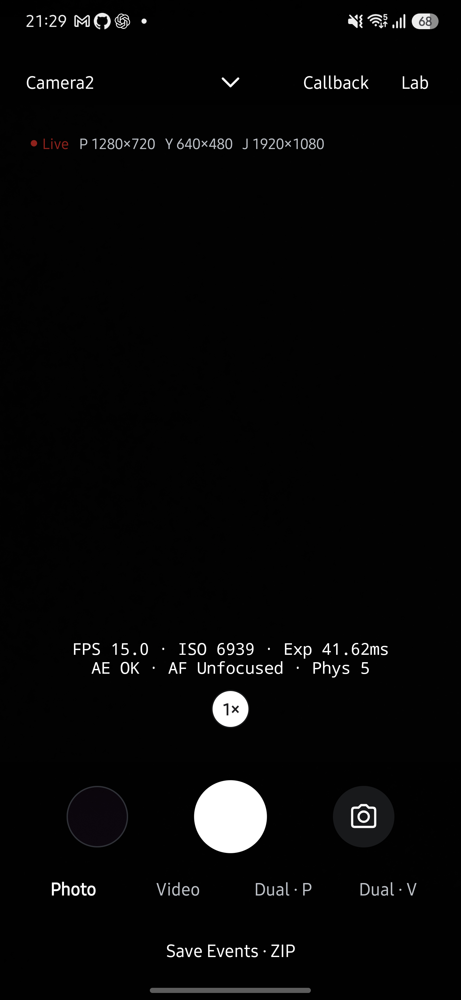

# Live 문구 제거·영어 통일 검증

사용자 요청에 따라 셔터 사용법과 사진·영상 라벨을 제거했습니다. Live와 Dual의 갤러리는 48dp 썸네일을 64dp 슬롯 가운데에 배치하는 기존 구조로 복원했습니다. 셔터 사용법 대신 새 도움말을 추가하지 않았으며, 진행·결과·오류만 필요한 시점에 표시합니다.

Live의 촬영 결과, 수동 제어, 터치 초점·노출, 스트림 설정, 진단 ZIP 팝업과 접근성 문구를 영어로 통일했습니다. Dual의 저장·선택·진단 문구도 영어로 변경했습니다. Lab과 Gallery의 별도 화면은 이번 언어 변경 대상이 아닙니다.

## 검증

- Galaxy S25+ SM-S936N, Android 16/API 36에 기존 데이터를 보존하는 업데이트 설치를 했습니다.
- 기본 Live에서 상시 설명과 썸네일 라벨이 없고, 갤러리·셔터 중심선이 일치하는 것을 확인했습니다. 줌·셔터·갤러리 배치 코드는 라벨 추가 전 `fb96f0aa`와 대조했습니다.
- 펼친 제어의 Flash·AF·AE·EV·AEB·Manual 접근성 설명을 기기 UI 트리에서 영어로 확인했습니다.
- JVM 테스트 693개, Android lint와 release APK 빌드가 통과했습니다. 번역된 동기화 상태의 기존 테스트 기대값을 영어로 갱신했습니다.
- 저장·카메라 수명주기 로직은 변경하지 않았습니다. 모든 오류 조건을 실기기에서 새로 발생시킨 검증은 아닙니다.

[이전 사용성 검증](usability-20261009.md)의 상시 안내·갤러리 라벨 제안은 이번 사용자 피드백으로 대체했습니다. 해당 문서는 당시 관찰 기록으로 보존합니다.
