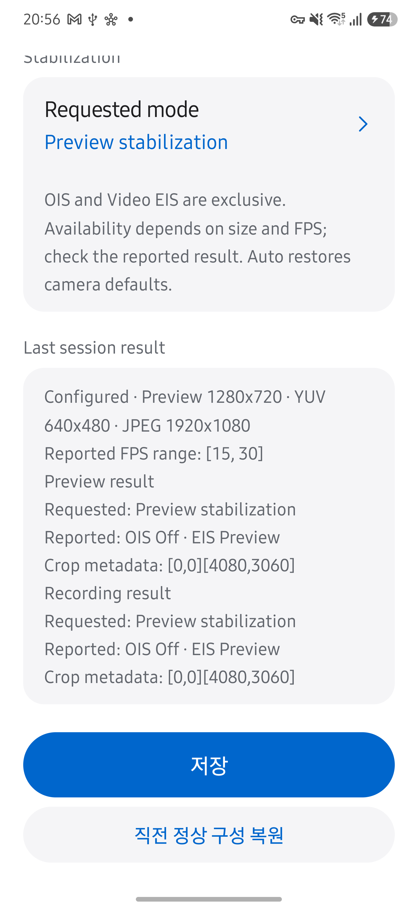
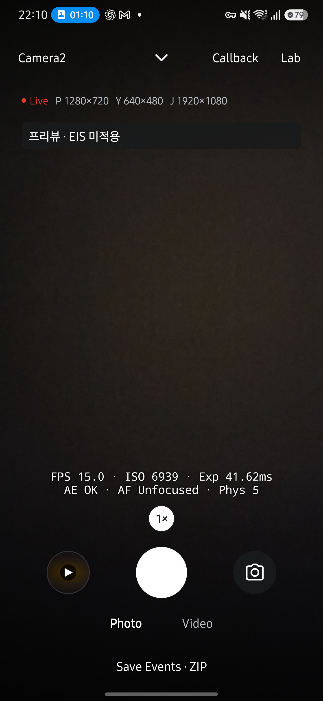
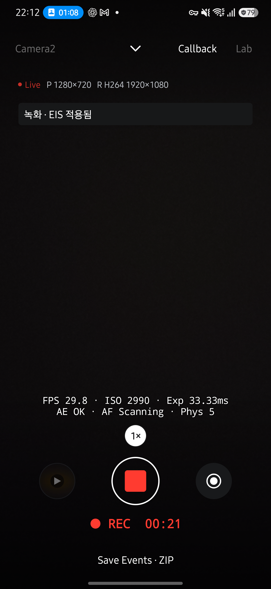
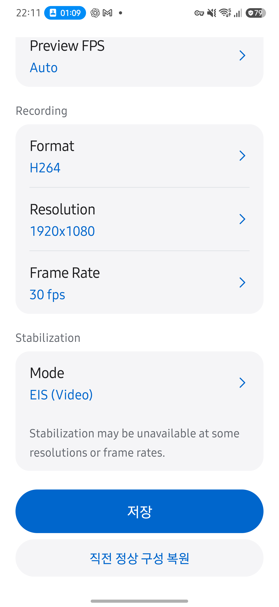
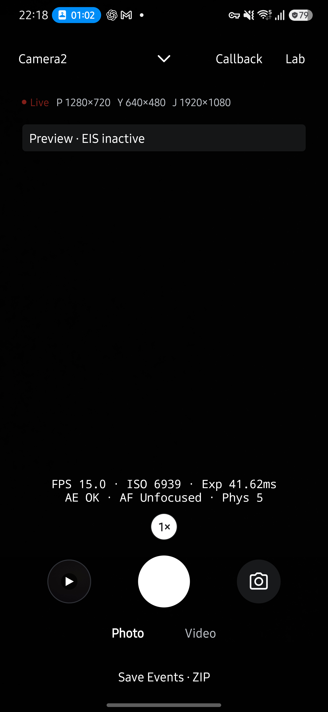
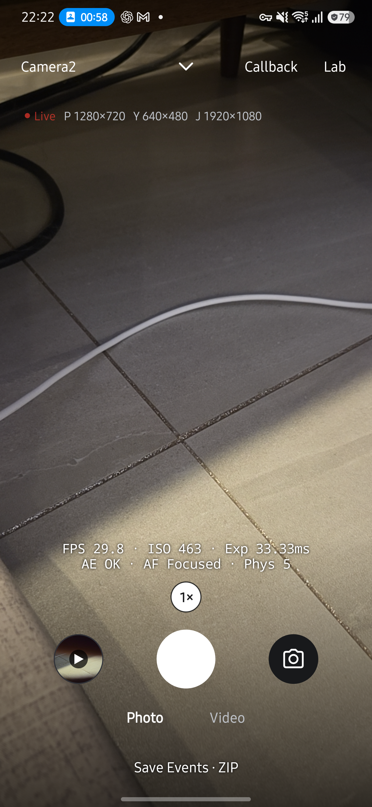
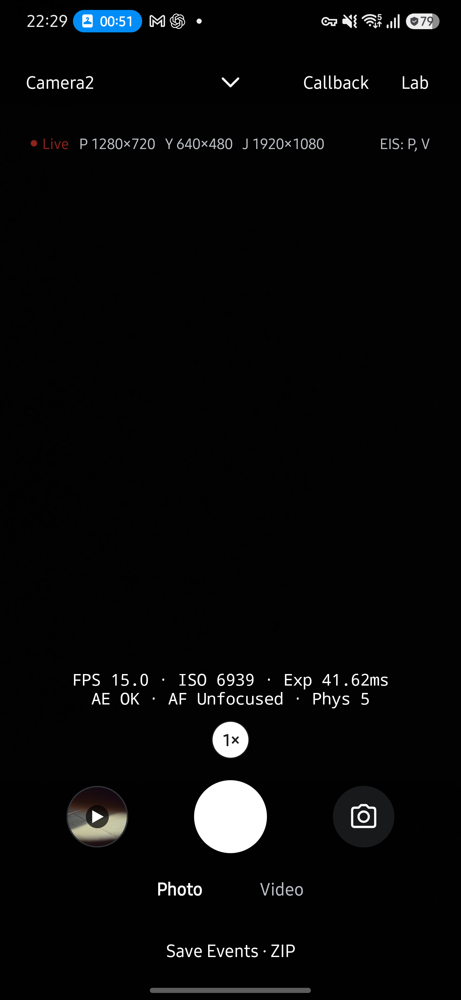

# Live 스트림·손떨림 보정 검증

2026-10-05에 Galaxy S25+ (SM-S936N), Android 16 / API 36에서 #173의 기존 구현과 #179의 추가 기능을 확인했습니다. 기반 코드는 main `85b9498`이며, 기존 0.18.0 / 627과 같은 서명의 release APK로 업데이트했습니다. 최초 설치 시각 `2026-09-16 02:33:27`은 유지됐습니다.

## #173: 이미 구현된 기능과 추가 검증

#173의 스트림 선택은 PR #207에서, CameraX·CLI 크기 선택은 PR #209에서 구현됐습니다. 이번 작업은 이를 다시 구현하지 않고 아래 누락된 검증을 보완했습니다. 이전 기록은 [스트림 설정](live-stream-settings-20260929.md)과 [CameraX·CLI 검증](live-streams-camerax-cli.md)에 있습니다.

| 시나리오 | 관찰 결과 |
| --- | --- |
| Camera2 Preview only | YUV·JPEG를 Off로 요청한 `edf77b76-1f1b-4b83-b779-d0c0ff005c36`이 성공했습니다. |
| Camera2 Preview+JPEG | `2add4133-1286-44ad-8aa3-3394c2815859`가 JPEG artifact 한 개를 반환했습니다. |
| Camera2 Preview+YUV | `861e304d-b8d5-4fe0-8d43-4380179b8a16`이 YUV 변환 JPEG artifact 한 개를 반환했습니다. 원본 YUV 저장을 뜻하지 않습니다. |
| Camera2 Preview+YUV+JPEG | `f583e888-5d17-40dc-9ed5-c4a846a964f7`이 사진 artifact 두 개를 반환했습니다. |
| 큰 출력 조합 | Preview·YUV·JPEG 모두 4080×3060인 `aa91a786-93d4-411d-a488-a7e6aa88ef8a`가 성공했습니다. 이 기기에서 출력 조합 거부를 재현한 결과가 아닙니다. |
| FPS 조합 거부와 복원 | 설정 화면에서 Preview 4080×3060과 고정 60fps를 저장하자 최소 요청 FPS를 충족하지 못한다는 오류를 표시했습니다. 작은 크기로 대체하지 않았습니다. Lab → Live Streams → 직전 정상 구성 복원 → Live 복귀 후 Preview 1280×720, YUV 640×480, JPEG 1920×1080으로 정상 재개했습니다. |
| HEVC 720p·60fps 요청 | `f7e85495-eb33-43a0-80eb-fe4e63e18ce9`가 저장됐습니다. MP4 sample table의 실제 코덱은 hvc1, 크기는 1280×720, 238프레임/4.0347초, 평균 58.99fps입니다. 요청한 60fps가 모든 프레임에서 보장됐다고 해석하지 않습니다. |
| 녹화 중 설정 진입 | 녹화 중 크기 표시를 눌러도 설정으로 이동하거나 녹화를 중단하지 않았습니다. 정지·저장 후 설정 진입과 프리뷰 재개를 확인했습니다. |

Benchmark는 `StreamSpec`을 그대로 사용하며 `Camera2Engine.buildRequest`의 보정 적용은 `spec == null`일 때만 실행됩니다. 기존 profile·비교 규칙은 바꾸지 않았으며 전체 JVM 회귀 검사로 확인했습니다. 이번 검증에서 벤치마크 실측은 새로 실행하지 않았습니다.

## #179: 지원 모드와 실제 결과

Camera2 Live Streams에서 Auto·Off 및 기기가 광고한 보정 모드를 선택합니다. 요청 키도 확인하며 Preview stabilization은 API 33 이상에서 제공합니다. OIS와 Video EIS를 동시에 켜는 조합은 제공하지 않습니다. Auto는 새 요청 템플릿의 기본값을 유지하며, Preview stabilization은 플랫폼이 OIS를 제어합니다. 사진·녹화·저장 중 설정 변경은 기존 진입 차단을 따르고, 적용 시 `close(done)` 뒤 새 엔진을 엽니다.

후면 논리 카메라 0의 Probe는 OIS OFF만 지원한다고 보고했습니다. 따라서 수동 OIS On 검증은 **미지원 SKIP**입니다. Auto의 실제 결과에서 OIS On이 관찰돼도 지원 목록을 임의로 확장하지 않습니다. Video stabilization 목록에는 OFF·ON·PREVIEW_STABILIZATION이 있었습니다.

| 요청 | 프리뷰 실제 결과 | 녹화 실제 결과 |
| --- | --- | --- |
| Auto | OIS On / EIS Off | OIS On / EIS Off |
| Off | OIS Off / EIS Off | OIS Off / EIS Off |
| Video EIS | OIS Off / EIS On | OIS Off / EIS On |
| Preview stabilization | OIS Off / EIS Preview | OIS Off / EIS Preview |

명시적으로 선택한 보정 모드의 녹화는 HEVC 1280×720·30fps로 수행하고 저장 완료와 프리뷰 복귀를 확인했습니다. Preview stabilization 녹화 중 JPEG 사진 저장도 성공했습니다. 해당 MP4 `HAL_20261005_205615_480_1fb6aa.mp4`의 sample table은 hvc1, 1280×720, 979프레임/32.8405초, 평균 29.81fps였습니다. crop metadata는 위 모드에서 `[0,0][4080,3060]`으로 같았습니다. 이 값만으로 실제 화각이나 전자식 보정 변환이 같다고 판단하지 않습니다.

Off가 적용된 상태에서 Auto를 선택하고 저장하지 않은 채 시스템 뒤로 가기로 나갔습니다. 다시 설정을 열었을 때 요청·실제 결과는 Off로 유지됐습니다. CameraX로 전환하면 Auto만 선택할 수 있었고 Camera2 전환 안내가 표시됐습니다. Camera2의 Off 설정이 CameraX로 전달되지 않았으며, CameraX 결과는 OIS On / EIS Off였습니다.

전면 카메라 1로 전환했을 때에는 Auto와 OIS Off / EIS Off, crop `[0,0][4000,3000]`이 표시됐습니다. 후면으로 돌아가면 기존 Off 설정이 유지됐고, 그 상태에서 Auto를 저장하자 OIS On / EIS Off로 복귀했습니다. 전면으로 후면의 설정이나 결과가 섞이지 않았습니다.

선택값은 `live_streams_requested.stabilization`에, 요청과 실제 결과 키는 `request_observed`와 `capture_result`의 `opticalStabilization`·`videoStabilization`·`cropRegion`에 기록합니다. 결과 키 누락은 Off가 아닌 Unavailable로 표시합니다. Last session result는 마지막 프리뷰와 녹화 결과를 구분하며 새 엔진 세션에서 이전 결과를 지웁니다.

## 자동 검증과 한계

문서 최신성은 Codex가 변경 코드와 원고를 직접 대조했습니다. `overall-architecture`, `data-flow`, `state-transitions`, `ui-tool-handoff`와 architecture의 overview·module-roles·runtime-flow·constraints, engine의 contract·camera2·camerax·comparison, troubleshooting의 layer-isolation, evidence의 device-notes를 확인했습니다. 엔진 원고와 사용 절차에는 보정 정책·요청/결과·CameraX 제약을 추가했습니다. 나머지 항목은 기존 계층·수명주기·측정·저장 계약이 유지되며 과거 V-002 기기 기록을 새 검증으로 바꾸지 않았습니다. 이 검토는 사람의 독립 리뷰를 뜻하지 않습니다.

JDK 17, Android SDK 36에서 `assembleRelease`, `testDebugUnitTest`, `lintDebug`가 통과했습니다. JVM 테스트 628개는 실패·오류·SKIP이 모두 0개입니다. 새 테스트는 API·capability별 후보, OIS/EIS 배타 요청, Auto의 기본값 보존, 미지원 설정 거부, 직렬화, 알 수 없는 결과값 표시를 검증합니다. 문서 회귀 테스트 23개도 통과했습니다.

이 기록은 한 기기의 지원 범위에서 요청·결과·저장·복귀를 확인한 결과입니다. 흔들림 감소량을 정량 평가하지 않았으며, 미연결 기기나 다른 해상도·FPS 조합을 검증한 것으로 확대하지 않습니다. 공식 API의 보정 제약은 [CaptureRequest 문서](https://developer.android.com/reference/android/hardware/camera2/CaptureRequest#CONTROL_VIDEO_STABILIZATION_MODE)에 있습니다. 사용 절차는 [빠른 시작](../../guide/getting-started.md#손떨림-보정을-선택하세요)을 확인하세요.

## 후속 변경: Live EIS 상태 표시

2026-10-05 Galaxy S25+ (SM-S936N), Android 16/API 36에서 후속 APK를 기존 데이터 유지 방식으로 설치하고 UI를 확인했습니다. 아래 내용은 앞선 설정 결과 화면을 대체한 후속 구현의 검증입니다.

- Camera2 후면 0, Preview 1280×720, YUV 640×480, JPEG 1920×1080, Auto FPS에서 Auto는 `프리뷰 · EIS 미적용`으로 표시됐습니다.
- EIS (Video)를 저장하면 `프리뷰 · EIS 적용됨`으로 바뀌었습니다. H264 1920×1080, 30fps 녹화에서는 `녹화 · EIS 적용됨`이 표시됐고, 녹화 종료·저장 후 프리뷰 상태로 돌아왔습니다.
- Live Streams의 Mode와 한 문장 안내를 확인했습니다. 정상 구성에서 Last session result 영역은 사라졌고 저장·직전 정상 구성 복원 버튼은 유지됐습니다.
- 상태 영역은 테두리 없는 어두운 배경과 밝은 글자로 표시합니다. 요청과 다른 결과가 1초 이상 이어지면 요청·결과를 주황색 텍스트로 함께 보여 줍니다. 실제 기기에서 불일치 조합은 이번에 재현하지 않았습니다.

JVM 테스트 633개가 실패·오류·SKIP 없이 통과했습니다. 추가 테스트는 결과 누락·미지원 값·1.5초 이상 오래된 결과, 세션·프리뷰/녹화·요청 변경, 1초 불일치와 정상 복귀를 검증합니다. 같은 프레임을 반복 조회하는 것만으로 경고가 확정되지 않는 것도 확인했습니다. 최종 UI 조정 후 assembleRelease와 lintDebug를 다시 통과했습니다. Camera2 사진 결과는 상태 판정에서 제외합니다. 이 표시는 결과 메타데이터에 대한 판정이며 흔들림 감소량의 실측값은 아닙니다.

문서 최신성 검토에서는 앞선 14개 바인딩의 코드 변경을 다시 대조했습니다. 엔진 계약·Camera2·CameraX·빠른 시작·화면 설계를 현재 상태 표시로 수정했고, 나머지 계층·수명주기·도구 전환 계약과 과거 기기 기록은 여전히 유효합니다.

| EIS 미적용 | 녹화 중 EIS 적용 | 설정 결과 영역 삭제 |
| --- | --- | --- |
|  |  |  |

### Live 상태 문구 영어 적용

Live에 추가한 문구를 `Preview`·`Recording`, `EIS active`·`EIS inactive`·`EIS status unknown`으로 변경했습니다. 불일치는 `Mode mismatch` 아래 `Requested`와 `Reported`를 각각 한 줄에 표시합니다. 색상만으로 상태를 구분하지 않으며, 기존 12sp 글자 크기·어두운 배경·접근성 알림 정책을 유지합니다. Galaxy S25+에서 최종 APK의 `Preview · EIS inactive`가 한 줄에 잘림 없이 표시되는 것을 확인했습니다. 기존 LiveStabilizationTest 9개, assembleRelease, lintDebug가 통과했습니다. 문구 변경은 상태 판정이나 기존 수명주기 계약을 바꾸지 않습니다.

### 정상적인 EIS inactive 숨김

EIS inactive이며 불일치 경고가 없으면 Live 상태 뷰를 GONE으로 처리합니다. 배경과 레이아웃 공간도 함께 사라집니다. EIS 적용 요청과 실제 결과가 다른 경우에는 기존 inactive 상태와 경고를 계속 표시합니다. Active·unknown 표시는 유지합니다. Galaxy S25+ (Android 16/API 36)의 Auto 프리뷰에서 영역 숨김을 확인했고 assembleRelease·lintDebug가 통과했습니다.

### 스트림 정보 행에 EIS 약어 통합

정상 EIS 상태 카드를 없애고 P·Y·J 크기 행 오른쪽에 같은 10sp·색상으로 표시합니다. 결과 모드 1은 `EIS: V`, 2는 `EIS: P, V`, 확인 불가는 `EIS: ?`입니다. 미적용은 숨기되 불일치 경고가 있으면 `EIS: Off`와 다음 줄의 경고를 표시합니다. 접근성 설명에는 전체 모드명과 프리뷰·녹화 단계를 유지합니다. Galaxy S25+ (Android 16/API 36)에서 Auto의 숨김 및 Preview + Video의 `EIS: P, V`가 기존 크기와 함께 한 줄에 들어가는 것을 확인했습니다. assembleRelease·lintDebug가 통과했습니다. 변경은 표시 방식에 한정되며 판정·엔진·계층 계약은 유지됩니다.

### EIS 표시에서 Live Streams 진입

EIS 표시도 기존 크기 표시와 같은 onSizesClick을 호출합니다. 최소 48×48dp 터치 영역·리플·포커스와 설정 진입 접근성 설명을 추가했으며 setSizesEnabled는 두 진입점을 함께 제어합니다. Galaxy S25+ (Android 16/API 36)에서 `EIS: P, V`를 눌러 Live Streams가 열리고 뒤로 가기로 Live가 재개되는 것을 확인했습니다. assembleRelease·lintDebug가 통과했습니다. 기존 카메라 수명주기·진입 차단 계약은 변경하지 않았습니다.

### 0.19.0 릴리스 전 전체 리뷰

PR #217의 전체 소스·테스트·문서 변경을 검토했습니다. 결과 최신성·세션/녹화 전환·사진 결과 제외·경고 지연·Auto 처리와 UI 약어·미적용 숨김·48dp 설정 진입·녹화/저장 중 차단을 대조했고 병합을 막는 결함은 발견하지 못했습니다. 독립 리뷰를 뜻하지 않으며 Sourcery 리뷰는 사용량 제한으로 수행되지 않았습니다.

0.19.0(628) 후보에서 JVM 테스트 633개가 실패·오류·SKIP 없이 통과했고 assembleRelease·lintDebug도 통과했습니다. APK 서명 인증서 SHA-256은 기존 0.18.0과 동일한 `f2432413635645cc35e674e498e88ff518abb878065c21f17bb3c2128487b5c1`입니다. Galaxy S25+에서 기존 앱 위에 설치하고 versionName 0.19.0·versionCode 628 및 MainActivity 실행을 확인했습니다. 버전 변경은 엔진·측정·문서 아키텍처 계약에 영향을 주지 않습니다.
