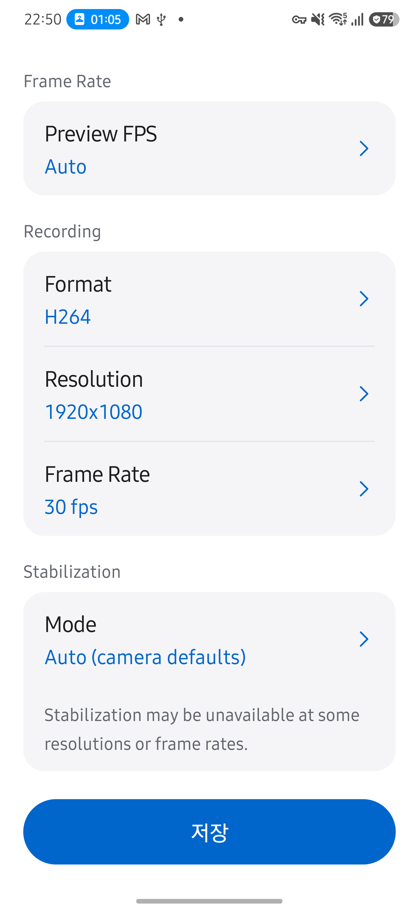
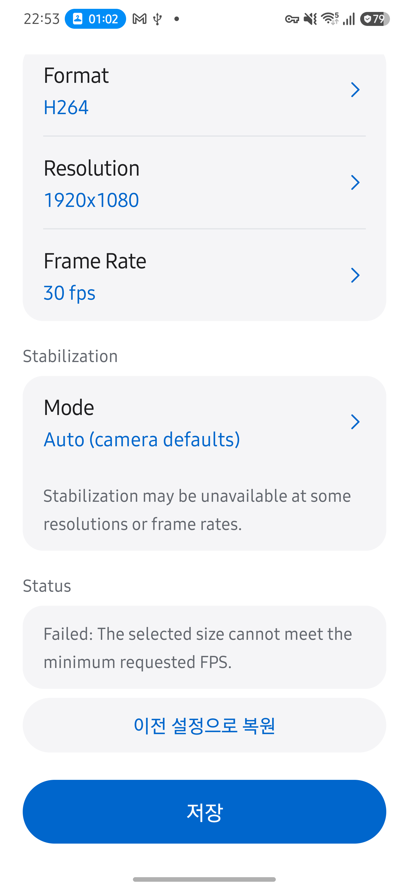

# Live Streams 복원 버튼 조건부 표시

2026-10-05, Galaxy S25+ (SM-S936N), Android 16/API 36에서 확인했습니다.

- 정상 구성에서는 저장 버튼만 표시하고 복원 버튼을 숨깁니다.
- Preview 4080×3060·고정 60fps를 적용하여 최소 요청 FPS를 충족하지 못하는 실패를 재현했습니다.
- Lab → Live Streams에서 Status 오류 바로 아래에 `이전 설정으로 복원` 버튼이 나타났습니다.
- 버튼을 누르고 Live로 복귀하자 Preview 1280×720, YUV 640×480, JPEG 1920×1080과 Auto FPS의 정상 구성이 복구됐습니다.

복원 콜백이 없는 경우에는 실패 상태에서도 버튼을 만들지 않습니다. 기존 구성 저장·복구·카메라 수명주기는 바꾸지 않고 오류 판정과 버튼 표시 위치만 공유합니다. assembleRelease·lintDebug가 통과했습니다. 문서 최신성 검토에서는 UI 표시 변경이 계층·엔진·측정 계약을 바꾸지 않음을 확인하고 빠른 시작·Camera2 원고·화면 설계를 갱신했습니다.

| 정상 | 실패 |
| --- | --- |
|  |  |
