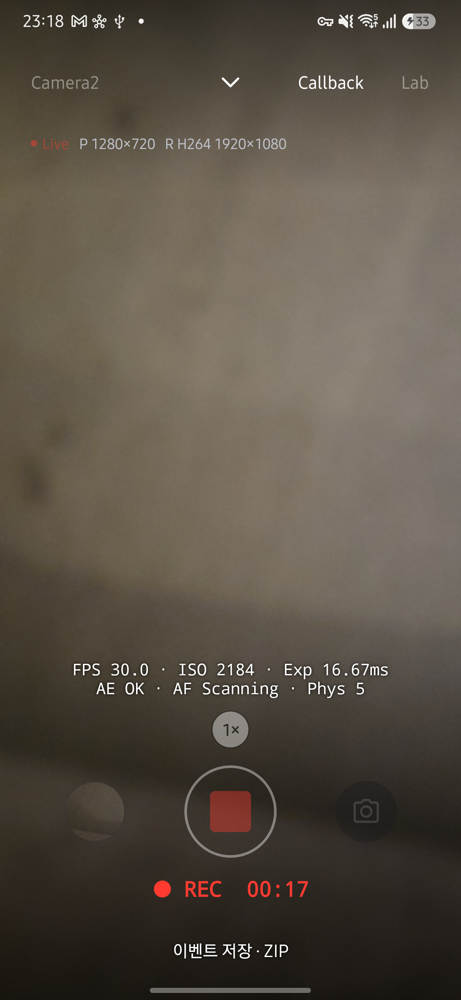

# Live 스트림 표시·CameraX·CLI 변경 검토

검토일은 2026-09-29이며 검토자는 Codex입니다. `docflow verify --changes`의 근거 코드 diff와 원고를 대조했습니다. 이 기록은 코드 대조 검토이며 사람의 독립 리뷰나 모든 기기의 동작 보장을 뜻하지 않습니다.

## 최신성 재검토 14개 항목

| 항목 | 대조 결과와 조치 |
| --- | --- |
| omm:overall-architecture | MainActivity·CameraXEngine·CLI 변경을 대조했습니다. 엔진별 크기 설정, 직접 설정 진입, CLI 지원과 단일 출력 설명을 갱신했습니다. 오래된 CLI benchmark 연결 설명도 현재 명령 목록에 맞췄습니다. |
| omm:data-flow | Telemetry·MediaLibrary·CommandCoordinator의 경계를 확인했습니다. 기존 측정 데이터 흐름은 유지하며 CLI bridge의 크기 적용과 결과 등록 설명을 갱신했습니다. |
| omm:state-transitions | close(done) 순서, 요청 취소, 녹화 Start/Finalize와 저장 완료를 확인했습니다. streams 조회와 엔진별 정상 구성 보관을 반영했습니다. |
| omm:ui-tool-handoff | Lab과 크기 표시에서 여는 두 경로, Activity Result와 onResume을 대조하고 설명·시퀀스 그림을 갱신했습니다. |
| architecture/overview | Camera2·CameraX 및 CLI 스트림 조회·설정 책임을 반영했습니다. |
| architecture/module-roles | CliStreams의 순수 검증, coordinator 지원 조회와 기존 의존 방향을 확인하고 역할 표를 갱신했습니다. |
| architecture/runtime-flow | 켜진 출력만 저장하는 경로, 크기 표시·직접 설정 복귀, 화면 없는 streams 조회를 반영했습니다. |
| architecture/constraints | 카메라 점유·시각 도메인·메타데이터 저장·shell UID·artifact 접근 경계가 유지됨을 확인했습니다. 본문 변경은 필요하지 않았습니다. |
| engine/contract | CLI가 Camera2 전용이라는 설명을 두 엔진 선택과 요청별 크기 옵션으로 수정했습니다. Benchmark는 Camera2 전용으로 유지합니다. |
| engine/camera2 | 기존 정확한 크기와 사진 타임스탬프 계약을 확인했습니다. 엔진별 설정 분리와 CLI 기본값 적용 설명을 수정했습니다. |
| engine/camerax | ResolutionSelector 필터, 선택적 use case, JPEG·YUV 단독 촬영, Quality와 bind 후 해상도 검사, Auto 코덱을 반영했습니다. |
| engine/comparison | 출력 선택과 CLI 지원을 수정하고 Benchmark와 CLI 행을 분리했습니다. |
| troubleshooting/layer-isolation | CameraX 단일 출력에서 기다리는 버퍼를 수정했습니다. 시계와 표본·보존 규칙은 변경하지 않았습니다. |
| evidence/device-notes | V-002의 과거 조건과 관찰값을 확인했습니다. 이 기록을 신규 크기 지원의 실측으로 바꾸지 않았습니다. 아래 신규 검증을 별도로 기록합니다. |

## 코드 리뷰

MainActivity의 비동기 CLI 준비가 끝나기 전 기존 프리뷰 콜백으로 촬영하지 않도록 prepared 검사를 확인했습니다. 세션 실패는 PREFLIGHT_FAILED로 전달하고 streams 조회 취소는 Live 카메라를 멈추지 않습니다. 출력이 하나인 촬영의 artifact 개수·파일 이름과 녹화 종료 후의 크기·포맷 보존을 확인했습니다. 공개 API로 확인할 수 없는 CameraX 코덱은 Auto로 표시합니다. 이번 변경에서 미해결 차단 결함은 발견하지 않았습니다.

## 자동 검증

- assembleRelease, testDebugUnitTest(JVM 592개, 실패 0), lintDebug가 통과했습니다.
- Python 및 셸 전송 테스트 39개가 통과했습니다. 잘못된 값과 옵션, Off 보존, 지원하지 않는 크기·코덱 거부를 포함합니다.
- 문서 생성은 원고에서 generate와 site build로 수행하며 생성된 HTML을 직접 수정하지 않았습니다.

## 기기 검증

기기는 Galaxy S25+ SM-S936N, Android 16입니다. 기존 앱을 삭제하지 않고 서명된 release APK를 업데이트했습니다.

| 시나리오 | 관찰 결과 |
| --- | --- |
| 크기 표시·설정 진입 | P·Y·J를 한 줄로 표시하고 Live만 깜빡였습니다. 크기 영역에서 연 설정의 상단·시스템 뒤로 가기와 저장은 Live로 복귀했습니다. |
| CameraX 크기·출력 | 1280×720 프리뷰, 640×480 YUV, 1920×1080 JPEG 적용과 JPEG 단독·YUV 단독·프리뷰 단독 구성을 확인했습니다. |
| CameraX CLI JPEG 단독 | 요청 90fc0770-a73a-4a80-bfc4-35938f39c516은 JPEG artifact 한 개를 반환했습니다. |
| CameraX CLI 녹화 | 요청 91aa73fc-67f5-4c9f-bc36-0db4985d9940의 파일은 MediaStore에서 1280×720, 20.100초로 확인했습니다. 표시 포맷은 Auto입니다. |
| Camera2 CLI HEVC 녹화 | 요청 d5d1d8db-5117-46b2-9367-c8cf5b0e2791은 1280×720, 49.570초로 저장됐습니다. 요청 fca8fde3-1682-4c69-bffa-9f9542b47390은 최종 성공 결과에도 1280×720과 HEVC를 유지했습니다. |
| 오류와 중복 요청 | 123×456 프리뷰는 PREFLIGHT_FAILED, YUV·JPEG 모두 Off인 capture는 INVALID_ARGUMENT로 거부했습니다. Python JSON 전송에서 같은 ID에 다른 크기를 보내면 REQUEST_CONFLICT를 반환했습니다. |

개별 크기 지원은 임의의 출력 조합이나 모든 기기의 세션 성공을 보장하지 않습니다. CameraX의 실제 녹화 코덱은 이번 CLI 결과에서 판별하지 않았습니다. 설정한 FPS는 요청값이며 파일 FPS의 실측값으로 보고하지 않습니다.

사용법은 [CLI 가이드](../../guide/cli.md)를 확인하세요.
