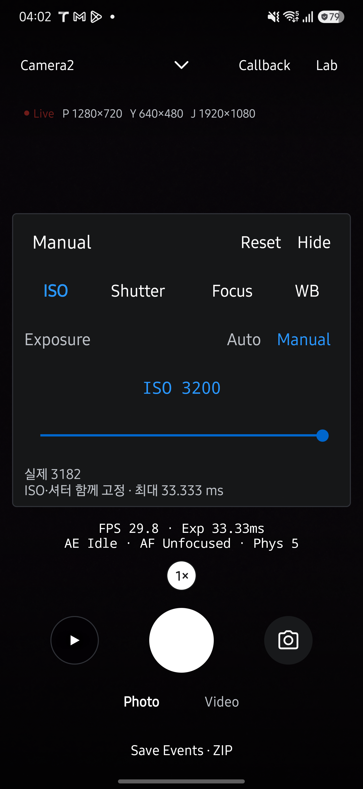
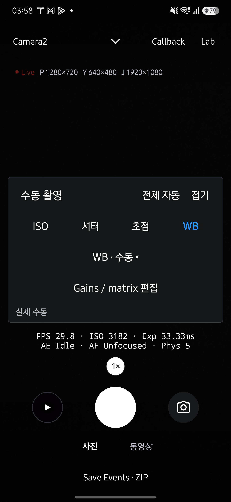
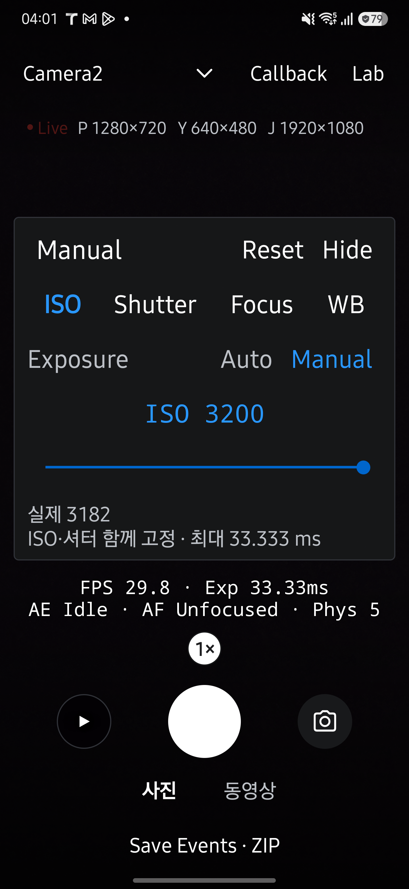
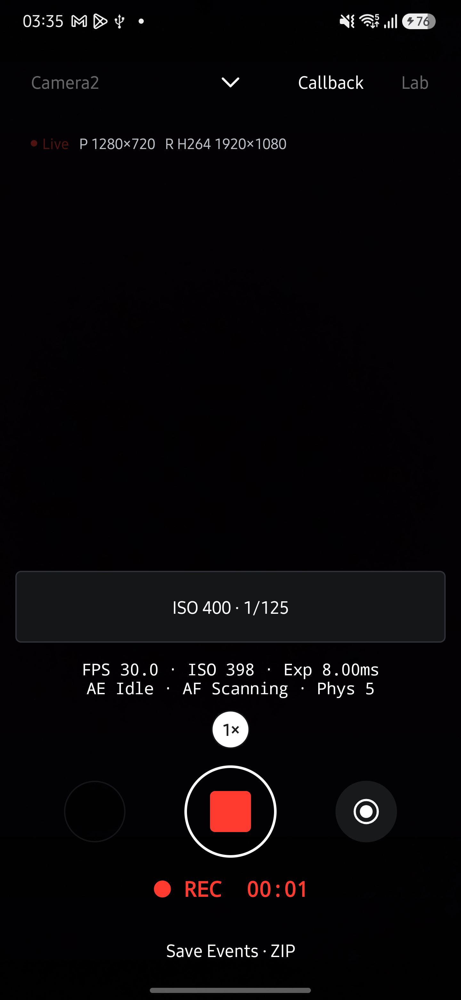

# LIVE 수동 촬영 검증 — 2026-10-01

이슈 #172의 Camera2 수동 ISO·노출 시간·초점·화이트밸런스를 Galaxy S25+에서 검증했습니다. 아래 결과는 제어 요청과 카메라 결과 메타데이터, 파일 생성, UI 동작을 확인한 범위입니다. 색 정확도와 초점 해상력을 측정한 결과는 아닙니다.

## 환경

- 기기: Samsung Galaxy S25+ (SM-S936N), Android 16.
- 소스: `codex/manual-capture`, 기준 커밋 `6e0c456` 이후의 작업 변경 사항.
- 설치: 기존 서명으로 만든 release APK를 `adb install -r`로 업데이트했습니다. 기기 데이터 보존을 위해 로컬 init script에서만 versionCode를 626으로 설정했습니다.
- Camera2 후면 camera 0, preview 1280×720, YUV 640×480, JPEG 1920×1080, 기본 수동 프레임 정책 30 fps.
- 촬영 대상은 어두운 표면이었습니다. 선명도·색 재현의 육안 비교와 다른 제조사 검증은 수행하지 않았습니다.

## 실기기 결과

| 시나리오 | 관측 결과 |
|---|---|
| Auto에서 수동 노출로 전환 | 자동 ISO 6939, 41.62 ms에서 기기 지원 범위에 맞춘 ISO 3200, 33.333 ms로 시작하며 조정 사유를 표시했습니다. 결과는 ISO 3182, 33.33 ms, 약 29.8 fps였습니다. |
| ISO·Shutter 직접 입력 | ISO 400, `1/125`를 입력했습니다. 실제 결과는 ISO 398, 8.00 ms였습니다. |
| 범위 밖 값 입력 | ISO 999999에 지원 범위 25–3200을 표시했습니다. 대화상자와 입력 내용을 유지하고 기존 요청은 변경하지 않았습니다. |
| 패널 접기·사진 촬영 | 접힌 패널에 요청값을 유지했습니다. JPEG와 YUV JPEG 파일이 생성되었습니다. |
| 동영상·녹화 중 사진 | ISO 400, 8 ms 요청을 유지하며 약 30 fps로 녹화했습니다. 녹화 중 JPEG와 종료 후 MP4가 생성되었습니다. 프리뷰 복귀 후 수동 노출이 유지되었습니다. |
| 수동 초점 | 2 D 요청에 실제 2 D, AF Idle을 표시했습니다. 프리뷰 터치로 수동 초점이 해제되지 않았습니다. |
| WB 프리셋 | 주광 요청과 실제 주광 모드가 일치했습니다. |
| 수동 WB | 기본 gains 1/1/1/1과 identity 행렬을 요청했습니다. 실제 AWB OFF와 gains 1/1/1/1을 확인했습니다. 고급 행렬 편집을 별도 대화상자로 분리했습니다. |
| 전체 자동 | 수동 노출을 해제한 뒤 AE OK, ISO 6939, 41.62 ms로 자동 측광이 돌아왔습니다. |
| CameraX | M 패널에 미지원 사유와 Camera2 전환 버튼을 표시했습니다. 버튼으로 Camera2 전환과 자동 설정 초기화를 확인했습니다. |

사진 파일은 `HAL_20261001_033529_461_69a774_JPEG.jpg` 및 `_YUV.jpg`, 녹화 중 사진은 `HAL_20261001_033608_459_6b1f18_JPEG.jpg`, 동영상은 `HAL_20261001_033610_376_9e4591.mp4`입니다. 파일 생성과 크기를 확인했으며 미디어 픽셀을 benchmark JSON에 저장하지 않았습니다.

## 자동 검사

- `assembleRelease testDebugUnitTest lintDebug --offline -I build/manual-device.gradle`: 성공했습니다. 앱 JVM 테스트 612개가 모두 통과했습니다.
- 수동 설정 테스트 7개가 지원 범위, FPS 제한, 독립 모드, 충돌하는 잠금·플래시, WB 입력, 셔터 분수 입력을 검증합니다.
- 문서 회귀 테스트 23개와 coverage, generate 일치, site 검사가 통과했습니다.
- `docflow check --build`는 최신성 검사에서 재검토 대상 14개로 실패했습니다. 원고와 생성물은 갱신했으며, `tools/docgen/README.md`의 사람 전용 `verify --accept --reviewer=이름` 기록은 수행하지 않았습니다.

## 화면

최종 표기는 제목·탭·모드·버튼 이름을 영어로 통일했습니다. `Manual`, `Exposure`, `Auto`, `Shutter`, `Focus`, `Reset`, `Hide`, `Photo`, `Video`를 사용하고 안내·오류 설명은 한글로 유지합니다. 영어 Shutter 탭에 너비를 더 배분해 글꼴 배율 1.5에서도 한 줄로 표시되는 것을 확인했습니다. 아래 WB·녹화 화면은 동작 검증 당시 표기이며, ISO 화면은 최종 표기입니다.

ISO 조절 화면은 셔터 위치를 유지하고 요청과 실제 적용값을 함께 표시합니다.

수동 WB의 gains·행렬 설명과 실제값은 고급 편집창에서만 표시합니다.

중복 조작을 정리한 뒤 S25+의 글꼴 배율 1.15와 1.5에서 ISO 패널을 확인했습니다. 요청값은 입력 숫자에만 표시하고, 실제 ISO는 패널에 표시하는 동안 하단 측정줄에서 제외합니다. ± 버튼과 패널 제목의 접기 동작을 제거했습니다. ISO 편집에 스크롤이 필요하지 않았으며 탭·제목·실제값이 모두 보였습니다. 확대 시 잘렸던 상단 Lab과 하단 상태줄도 수정했습니다. 기기 글꼴 배율은 원래 값 1.15로 복구했습니다.

녹화 화면은 패널을 접어도 요청 요약을 유지합니다.

