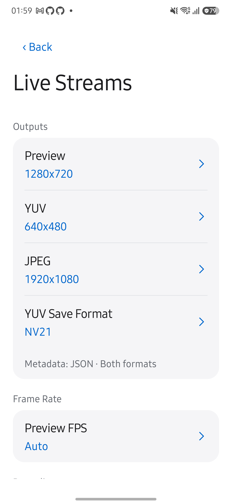

# YUV 저장 포맷 검증

Camera2의 YUV 저장 포맷 선택과 포맷 공통 촬영 JSON을 검증했습니다. RAW/DNG는 포함하지 않으며 #177 전체를 완료 처리하지 않습니다.

## 환경

- Samsung Galaxy S25+ SM-S936N, Android 16, 카메라 ID 0을 사용했습니다.
- 기존 앱을 삭제하지 않고 같은 인증서로 서명한 debug APK와 instrumentation APK를 설치했습니다.
- Camera2 하드웨어 검사는 YUV·JPEG 640×480, CameraX CLI 검사는 YUV 640×480·JPEG 1920×1080으로 실행했습니다.

## 결과

| 검사 | 결과 |
| --- | --- |
| JVM·빌드·lint | testDebugUnitTest, lintDebug, assembleDebug, assembleDebugAndroidTest가 통과했습니다. 샘플 복원·crop·stride·크기 제한과 포맷 기본값·지원 조건을 검사했습니다. |
| Camera2 실기기 | NV21+카메라 JPEG 2회, JPEG+카메라 JPEG 1회, NV21 단독·YUV 변환 JPEG 단독·카메라 JPEG 단독 각 1회가 성공했습니다. |
| 포맷 배타성 | 각 촬영에서 선택한 YUV 파일 하나만 생성했습니다. NV21은 460,800바이트였으며 JSON의 크기·plane 배치와 일치했습니다. ZIP은 생성하지 않았습니다. |
| 공통 메타데이터 | 6회 모두 JSON을 저장했습니다. sensorTimestampNs와 exposureTimeNs가 해당 촬영의 최종 CaptureResult와 일치했고 outputs는 실제 이미지 목록과 일치했습니다. |
| CameraX CLI | 요청 d42c7ed8-4246-4c0a-9e24-8d6fc3d501b8에서 JPEG 2개와 JSON 1개를 저장하고 PC로 회수했습니다. JPEG의 일치 결과는 unavailable, 선택한 YUV 프레임의 결과는 matched로 기록했습니다. 두 프레임의 시각 차이도 JSON에 기록했습니다. |
| UI | YUV Save Format 대화상자는 JPEG·NV21 두 항목을 제공하며 선택한 포맷과 Metadata: JSON 안내를 표시합니다. NV21 선택 후 UI 셔터로 HAL_20261008_020020_222_4fe30e 촬영을 저장했고, 설정을 다시 열어 선택값 유지를 확인했습니다. |

Camera2 검사는 `am instrument -w -e original_yuv true dev.halcamera.test/dev.halcamera.cli.CliStoreInstrumentation`으로 실행합니다. 검사 파일은 기기에 남겨 두며 기존 미디어를 지우지 않습니다.

## 검증 범위

저장 공간 부족·프로세스 강제 종료·전원 차단·카메라 변경 경합은 실측하지 않았습니다. Android 10 미만의 파일 저장과 다른 해상도·카메라 조합은 별도 검증이 필요합니다. CameraX는 일치하는 CaptureResult를 얻지 못할 수 있으며 다른 프레임의 값으로 대체하지 않습니다. [형식 계약](../design/ORIGINAL-YUV.md)에 저장과 실패 처리의 범위가 있습니다.

