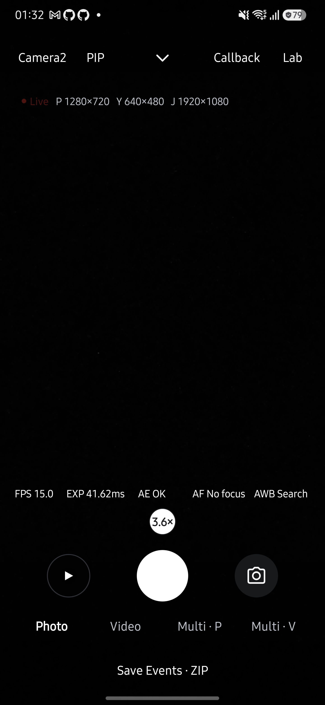

# Live pinch zoom device validation

On 2026-10-11, the signed release build based on main `102ac1dd` plus the pinch-zoom change was updated in place on a Samsung Galaxy S25+ (SM-S936N), Android 16. App version: 0.23.0 (660). Existing app data was retained.

## Results

The opt-in `PinchZoomChecks` instrumentation injects two-pointer MotionEvents through the real Live window. It checks the selected button text against the continuous UI ratio and waits for new `capture_result.zoomRatio` values within 0.03 of the requested ratio.

| Scenario | Camera2 | CameraX |
| --- | --- | --- |
| Pinch out increases zoom; pinch in decreases zoom | PASS | PASS |
| Exactly one selected, visible circle displays the continuous ratio | PASS | PASS |
| Refreshing camera choices preserves the intermediate ratio | PASS | PASS |
| Pinch does not produce touch-metering events | PASS | PASS |
| Select 1x and 2x presets after pinching | PASS | PASS |
| Repeated pinches clamp at the camera's reported minimum and maximum | PASS | PASS |
| Fresh capture results reflect the requested zoom | PASS | PASS |



The scene was dark. These checks establish gesture delivery, UI synchronization and capture-result metadata, not optical image quality. Recording, front cameras, physical endpoints, accessibility services, and other device models were not exercised. Burst/CLI/paused/closing guards were reviewed in code.

An initial run collided with the Android CLI UI automation service. After ending that service, one input-injection run lost window focus. The harness now waits for the Live window before each pinch; the full rerun passed on both engines. Those aborted runs are not counted as passes.

## Reproduction

Build and install matching, identically signed app and instrumentation APKs without uninstalling the app. On a release-signed installation, select the release test build type locally and use the existing release signing configuration. Do not commit signing material.

```sh
adb -s DEVICE shell am instrument -w -e pinch_zoom true dev.halcamera.test/dev.halcamera.cli.CliStoreInstrumentation
```

Keep the device unlocked on Live and avoid concurrent UI automation. The test temporarily changes zoom and engine, returns to 1x, and restores the starting engine. Screenshots are written under the app's external-files `pinch-validation` directory.

## Code review

Reviewed the three production-file changes against `102ac1dd`, including pointer cancellation through the final finger-up, continuous selection/drawing order, preset callbacks, range clamping, camera refresh, and operation guards. Rebase conflicts were resolved by retaining the newer burst lock and `internal updateCameraChoices` entry point. No remaining blocking findings were identified. This is Codex's own review, not an independent reviewer approval.
