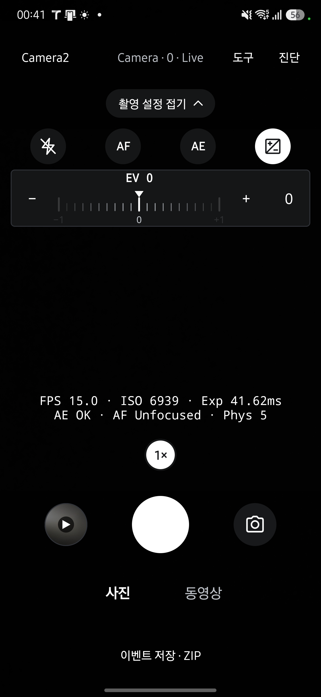
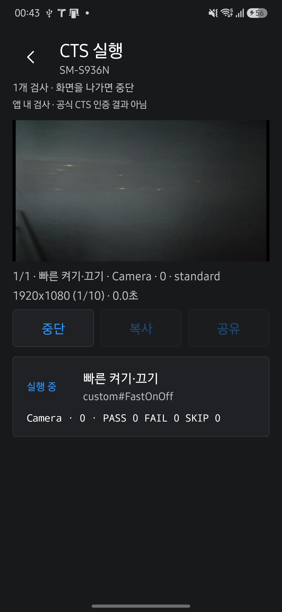

# 개발자용 UI/UX 검증

앱을 켜면 바로 Live 프리뷰가 나오는 동작과 Flash·AF/AE 잠금·EV 제어를 유지했습니다. 프리뷰에는 상시 설명을 추가하지 않고 EV 눈금과 한 단계 조절·초기화를 한 줄로 배치했습니다.

## 검증 환경과 범위

Galaxy S25+ SM-S936N, Android 16/API 36, QTI SM8750에서 서명된 검증 APK를 데이터 유지 방식으로 설치했습니다. 검증 버전은 0.13.2-ux-review(512)이며 버전 번호는 저장소 밖의 Gradle init script에서만 지정했습니다. Exynos 기기에서 수행한 검증은 아닙니다.

| 화면 | 직접 확인한 내용 |
| --- | --- |
| Live | 직접 프리뷰 시작, 도구 메뉴와 복귀, 카메라·API 전환, 진단 패널과 일시정지·재개를 확인했습니다. |
| Flash·AF·AE·EV | Auto·On 사진 저장, Torch, 동영상의 Off·Torch 제한, 전면 Flash 미지원 안내를 확인했습니다. 잠금 요청과 AE Locked·AF No focus 상태, EV 0.1 단위 조절과 0 복귀를 확인했습니다. CameraX에서 AE 잠금을 누르면 Camera2 전환 후 적용됐습니다. |
| 녹화·갤러리 | 44초 녹화 저장, 녹화 중 잠금·EV, 줌 목록 펼치기를 확인했습니다. 사진 정보·확대·선택·단일 및 일괄 삭제와 시스템 확인창을 확인했습니다. 시험 사진 4장과 동영상 1개는 정리했습니다. |
| 작업실·Probe | 기기 정보와 별칭 저장·공통 제목 반영, 도구 진입, Probe 섹션 접기·카메라 목록·복사를 확인했습니다. 시험 별칭은 원래대로 복원했습니다. |
| Benchmark·기록 | 측정 카드, 보관 설정, 기록 목록과 필터, baseline 구분을 확인했습니다. 큰 글씨에서도 카메라·시작 버튼에 접근할 수 있었습니다. |
| CTS | 빠른 켜기·끄기 1개 항목이 34초에 PASS했습니다. 카메라 0·1·2·3 각각 11개 단계가 PASS했습니다. 결과 복사와 공유 선택창, 실행 중 복사·공유 비활성, 중단 후 활성과 카메라 종료를 확인했습니다. |

글자 배율 2.0에서 작업실의 아래쪽 도구까지 스크롤할 수 있었으며, 검증 후 원래 값 1.15로 복원했습니다. 기존 촬영물과 benchmark 기록은 유지했습니다.

## 자동 검사와 리뷰

`assembleRelease`, `testDebugUnitTest`, `lintDebug`가 통과했습니다. JVM 테스트는 492개이며 실패·오류는 0개입니다. 문서 회귀 테스트 21개와 coverage·생성 결과·사이트 일치 검사를 확인했습니다. 코드 리뷰에서는 런처, 카메라 종료 후 화면 전환, 제어 초기화, CTS 결과 버튼 상태, 측정 계층 격리를 확인했습니다.

문서 대조에서는 기본 기록 필터와 EV 초기화 설명을 수정하고 기존 원고에 남아 있던 schema 4·RECORD 누락·제거된 비교 화면 설명을 현재 코드에 맞췄습니다. 사용자의 리뷰·머지 요청에 따라 검토자를 Codex로 기록합니다.

모든 버튼의 모든 상태를 실기기에서 실행한 것은 아닙니다. Exynos와 추가 기기, API 26, 태블릿, TalkBack 실제 조작, 모든 AOSP CTS 항목, 녹화 중 줌 적용값 변화, 공유 대상 앱으로 실제 전송은 미검증입니다. 기존 실행이 보관 한도에 도달해 있어 새 benchmark 저장과 자동 삭제는 실행하지 않았습니다. 카메라 엔진과 측정·판정 로직은 이번 변경에서 수정하지 않았습니다.

## 최종 화면

화면 배치와 조작 원칙은 [앱 UI·UX](../design/APP-UI.md)를 참고하세요.
