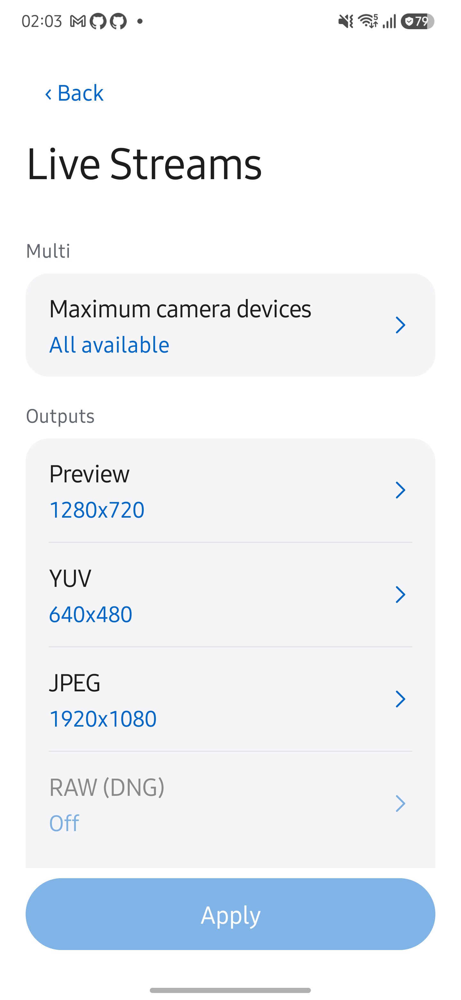
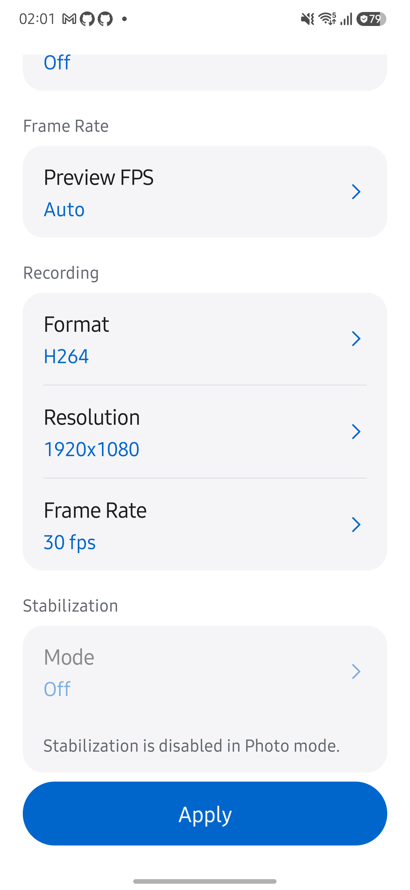
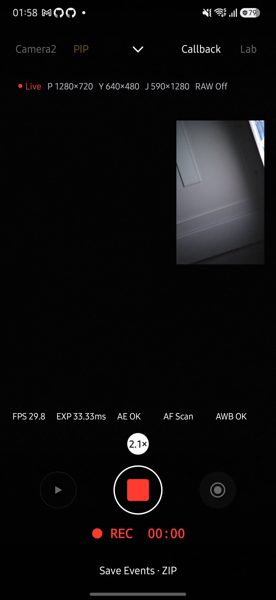
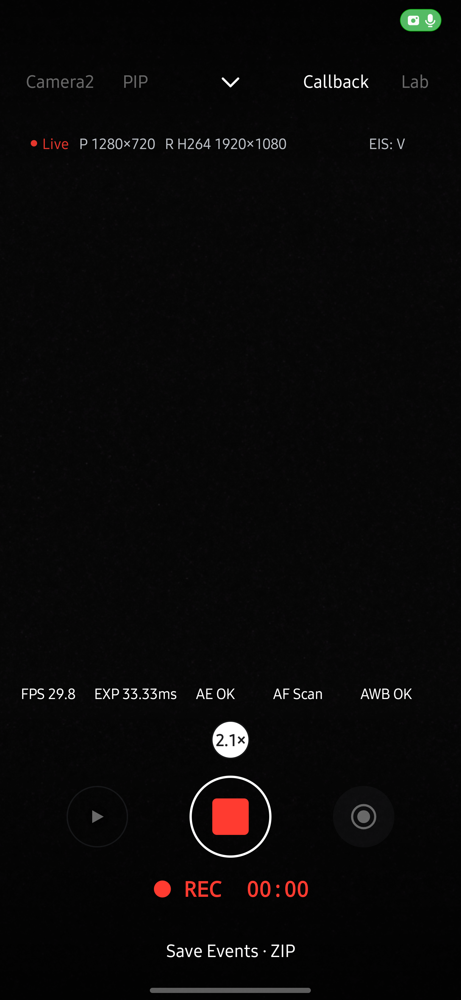

# VIDEO 사전 준비와 촬영 동작 검증

2026-10-11, `codex/video-ready` 작업본에서 Galaxy S25+ (SM-S936N), Android 16/API 36으로 확인했습니다. 기존 앱을 삭제하지 않고 같은 서명의 release APK를 덮어 설치했습니다.

## 결과

VIDEO 진입 시 녹화 출력을 구성하고 녹화 버튼에서는 준비된 출력을 사용합니다. 아래 모든 녹화 조합에서 버튼 이후 카메라 재개방, 세션 재구성, CameraX 재바인딩 이벤트가 발생하지 않았습니다. 실제 두 손가락 터치로 줌 비율이 증가했고, 녹화 중 스냅샷을 저장했으며, 저장한 MP4에서 프레임을 디코딩했습니다.

| 엔진 | 구성 | 스냅샷 크기 | 결과 |
| --- | --- | --- | --- |
| Camera2 | JPEG | 1920×1080 | 통과 |
| Camera2 | YUV 640×480 → JPEG | 480×640 | 통과 |
| Camera2 | 서비스 PIP | 590×1280 | 통과 |
| Camera2 | 물리 카메라 PIP | 590×1280 | 통과 |
| CameraX | 기본 JPEG | 4080×3060 | 통과 |
| CameraX | YUV 640×480 → JPEG | 480×640 | 통과 |
| CameraX | 서비스 PIP | 590×1280 | 통과 |

세로 방향 YUV 스냅샷은 픽셀을 회전한 JPEG이므로 너비와 높이가 바뀝니다. PIP 스냅샷은 PHOTO와 동일하게 합성 프리뷰 해상도로 저장하며, 단일 카메라의 JPEG/YUV 크기 선택을 적용하지 않습니다.

Camera2 단일 JPEG/YUV 실행의 최대 프리뷰 콜백 간격은 각각 58ms와 56ms였습니다. 다른 경로에는 동일한 콜백 지표가 없어 간격을 비교하지 않았습니다. 세션 유지 검증은 디스플레이 프레임 누락이 전혀 없다는 보장은 아닙니다.

PHOTO는 Camera2와 CameraX 각각 EIS 설정을 전달해도 실제 capture result의 OIS/EIS가 모두 OFF인 것을 확인했습니다. 설정 화면에서도 PHOTO의 Stabilization과 VIDEO의 RAW/DNG가 회색으로 표시되고, 눌러도 선택창이 열리지 않았습니다.

## 자동 검사

- `testDebugUnitTest`: 앱 JVM 테스트 749개가 통과했습니다.
- `lintDebug`, `assembleRelease`, `assembleReleaseAndroidTest`가 통과했습니다.
- `CliStoreInstrumentation -e video_mode true`: PHOTO 보정 2개와 VIDEO 조합 7개가 통과했습니다.
- `CliStoreInstrumentation -e snapshot_failures true`: 타임아웃·저장 실패·종료 중 완료·중복 콜백·Camera2 스냅샷 출력 제거 후 녹화 복구 등 기존 실패 경로 11개가 통과했습니다.
- 문서 테스트 33개, coverage, generate 및 site 검사가 통과했습니다. 문서 최신성 검사는 소스 변경에 따른 15개 검토 대기 항목으로 실패합니다. `tools/docgen/README.md`의 사람 검토 규칙에 따라 `verify --accept`는 실행하지 않았습니다.

기기 검사는 `app/src/androidTest/java/dev/halcamera/ui/VideoModeChecks.kt`에 있습니다. release 서명 기기에 맞춰 Gradle init script에서 `android.testBuildType = 'release'`를 적용하고 테스트 APK도 같은 서명으로 빌드했습니다.

## 범위와 제한

짧은 무음 녹화와 기본 후면 카메라를 기준으로 검사했습니다. 장시간 녹화, 오디오 전환, 모든 렌즈·해상도·기기 조합은 이번 결과에 포함하지 않습니다. 어두운 후면 장면에서 실행했으므로 영상 화질을 평가한 결과도 아닙니다. VIDEO 진입과 녹화 종료 후에는 출력 준비를 위해 세션이 바뀔 수 있습니다. 이번 변경의 세션 유지 범위는 준비 완료 후 녹화 시작입니다.

## 화면

## 후속: 실제 버튼별 점검

사용자 요청에 따라 ADB 터치 입력으로 화면의 버튼을 직접 눌렀습니다. UI 계층의 문구·선택 상태, 실제 캡처 결과 표시, 갤러리 재생을 함께 확인했습니다. 자동 검사에서 엔진 메서드를 호출한 결과와 구분합니다.

| 버튼 또는 흐름 | 확인한 결과 |
| --- | --- |
| Camera2 ↔ CameraX | VIDEO 상태로 전환되고 녹화 준비 후 시작 버튼을 사용할 수 있습니다. |
| 컨트롤 펼치기·접기 | 동일한 Flash·AF·AE·EV·AEB·Manual 구성으로 열고 닫힙니다. |
| Flash | 두 엔진에서 Torch 적용·해제가 되고 실제 Flash Fired 표시가 따라옵니다. VIDEO에서는 Off·Torch를 제공합니다. |
| AF·AE | 두 엔진에서 잠금 상태가 표시되고, AE는 실제 결과가 Locked로 바뀝니다. 녹화 중 AE 잠금도 적용됩니다. |
| EV | 증가·감소·0 초기화를 확인했습니다. CameraX에서도 증가와 초기화를 확인했습니다. |
| Manual | Camera2의 ISO·Shutter·Focus·WB 탭, 값 입력창, Auto/Manual 및 Reset을 확인했습니다. ISO 200 요청의 실제 값은 199였고, 수동 초점과 Daylight WB도 적용됐습니다. CameraX는 PHOTO와 같은 기존 수동 제어 제한을 표시합니다. |
| AEB | VIDEO에서는 활성화되지 않으며 PHOTO 전용 안내를 유지합니다. |
| Callback | 표시·숨기기와 현재 프레임 타이밍 표시를 확인했습니다. |
| 줌 | 녹화 중 줌 목록을 펼쳐 2배를 선택했고 선택 표시가 바뀝니다. 두 손가락 핀치는 별도 기기 검사로 확인했습니다. |
| 카메라 선택 | 후면 → 전면 → 후면 전환 후에도 VIDEO가 유지됩니다. |
| PIP | Camera2·CameraX 모두 선택 → 녹화 → 스냅샷 → 정지 → 해제를 버튼으로 확인했습니다. |
| 녹화·스냅샷·정지 | 오디오 포함 녹화에서 스냅샷 저장 후 녹화가 계속되고 정지 후 저장됩니다. Camera2의 27초 영상은 갤러리 재생 화면에서 재생했습니다. |
| 녹화 중 화면 전환 | 엔진·PIP 선택·Lab·갤러리 버튼을 눌러도 녹화를 벗어나지 않습니다. 정지 후에는 다시 사용할 수 있습니다. |
| Lab·Live Streams | Lab 경유와 헤더 경유 모두 VIDEO 설정으로 열립니다. 최대 카메라 수, Preview·YUV·JPEG 크기, Preview FPS, 녹화 포맷·해상도·FPS, 보정 선택창과 취소를 확인했습니다. YUV와 EIS는 선택·Apply 후 실제 녹화까지 확인했습니다. 모든 크기·포맷 조합을 녹화한 검사는 아닙니다. |
| Photo·Video | 왕복 전환 후 PHOTO의 Stabilization은 Off 및 비활성화 안내를 표시합니다. VIDEO의 DNG는 비활성화됩니다. |
| Multi P·Multi V | 각 화면으로 진입하고 Live 버튼으로 원래 VIDEO 화면에 복귀합니다. 별도 Multi 화면 내부 기능 전체는 이번 범위에 포함하지 않습니다. |
| 갤러리 | 녹화 후 목록·상세·재생과 Live 복귀를 확인했습니다. 공유·삭제는 실행하지 않았습니다. |
| Save Events · ZIP | 5초 카운트다운 후 앱 내부에 ZIP이 저장되고 완료 대화상자가 나타납니다. |

### 발견한 문제와 수정

1. Camera2에서 YUV와 EIS를 적용한 뒤 녹화 버튼을 누르면 인코더가 첫 프레임을 거부했습니다. EIS (Video)와 EIS (Preview + Video)는 카메라에서 persistent encoder Surface로 직접 전달하도록 바꿨습니다. 세션은 녹화 버튼에서 재생성하지 않습니다. 직결 경로에서는 녹화 버퍼 도착 시각을 측정하지 않으며 Callback에서 추정값을 만들지 않습니다.
2. 위 오류의 콜백이 Kotlin `MediaRecorder.apply` 안에서 앱의 종료 함수 대신 `MediaRecorder.stop()`을 직접 호출하여 앱이 종료됐습니다. 종료 함수의 수신 객체를 명시하고 이미 해제한 recorder의 콜백은 무시하도록 수정했습니다. 수정 후 동일한 실패 조합에서 앱 종료 없이 복구되는 것을 먼저 확인하고, 직결 수정 후 정상 저장까지 확인했습니다.

최종 기기 검사는 PHOTO 보정 2개와 VIDEO 10개, 총 12개가 통과했습니다. 기존 조합에 Camera2의 두 EIS+YUV 조합과 CameraX EIS+YUV를 추가했으며 이 세 조합은 오디오 트랙 존재, MP4 프레임 디코딩, 스냅샷 크기, 핀치줌, 시작 시 세션 유지까지 검사합니다. [기기 결과](assets/video-mode-ready/eis-device-results.txt)를 남깁니다. 실제 버튼으로 실패 순서를 다시 수행한 검사도 통과했습니다. JVM 749개, lint, 문서 테스트 33개도 통과했습니다.

### 녹화 중 줌 추가 확인

녹화 중 줌 버튼으로 1배 → 2배 → 1배를 변경해도 녹화가 계속되는 것을 실제 UI에서 다시 확인했습니다. 기기 검사에는 핀치 입력 후 실제 `capture_result.zoomRatio`가 요청값과 0.05 이내로 일치하는 조건을 추가했습니다. Camera2·CameraX의 일반 녹화, YUV 스냅샷, EIS, 서비스 PIP 및 Camera2 물리 PIP를 포함한 VIDEO 10개 조합 모두 통과했습니다. 화면 숫자만 바뀌는 것이 아니라 카메라 캡처 결과에도 줌이 적용됩니다. PIP의 줌은 주 카메라에 적용됩니다.

### 상태·자원 수명 검토 후 수정 및 WB 목록

- `LiveRecorderState`에서 준비·대기·시작·녹화·종료를 구분하고 `busy`, `prepared`, `recording`을 유도합니다. 준비 완료 상태의 인코더 오류도 종료 절차로 전달하며, 오류 처리와 종료 상태 전환은 같은 카메라 스레드 작업에서 수행합니다.
- PIP는 기존 인코더의 정지·저장·해제 완료 후 GL 스레드에서 다음 인코더를 준비합니다. 종료 중 시작 요청은 거부하고 재준비 오류는 전달합니다. 저장 중 합성기를 닫은 경우에는 다시 준비하지 않습니다.
- `LiveModePolicy`가 PHOTO의 보정 OFF와 VIDEO의 RAW/DNG 비활성화 정책을 정의합니다. 설정 UI와 두 엔진, PIP가 같은 사용 가능 여부와 적용값을 사용합니다.
- WB 프리셋은 값 버튼 바로 아래에 이어진 목록으로 표시합니다. 기존 선택창의 색상 토큰을 재사용하고 선택 표시·스크롤·선택 후 접기·뒤로가기 순서를 지원합니다. Gains / Matrix 편집은 기존 고급 편집창을 사용합니다.

Galaxy S25+ (SM-S936N), Android 16 (API 36)에서 준비된 Camera2 인코더에 오류를 주입한 뒤 준비 상태 해제, 인코더 및 Surface 해제, 프리뷰 복구를 확인했습니다. 스냅샷 실패 검사 11개 묶음도 통과했습니다. [오류 경로 결과](assets/video-mode-ready/review-error-results.txt)를 남깁니다. 실제 하드웨어 고장을 발생시킨 검사는 아니며, 실제 인코더와 세션을 사용한 오류 콜백 주입 검사입니다.

공통 정책과 PIP 해제 순서 수정 후 기존 PHOTO 2개 및 VIDEO 10개 조합이 다시 통과했습니다. [회귀 결과](assets/video-mode-ready/review-device-results.txt)를 남깁니다. 최종 APK에서는 추가로 PIP 녹화 → 정지·저장 → 재녹화 → 스냅샷 → 정지·저장을 실제 버튼으로 확인했습니다. WB는 PHOTO·VIDEO에서 목록 표시, Incandescent·Daylight 적용과 Actual 값, 재열기 선택 표시, 뒤로가기, 하단 항목까지 스크롤을 확인했습니다.

최종 빌드, JVM 테스트 752개와 lint가 통과했습니다. 문서 테스트 33개, 생성·사이트 빌드·coverage도 통과했습니다. 전체 `check --build`는 사람의 재검토 기록이 필요한 15개 항목에서 중단됩니다. 검토 승인 기록은 자동으로 갱신하지 않았습니다.

