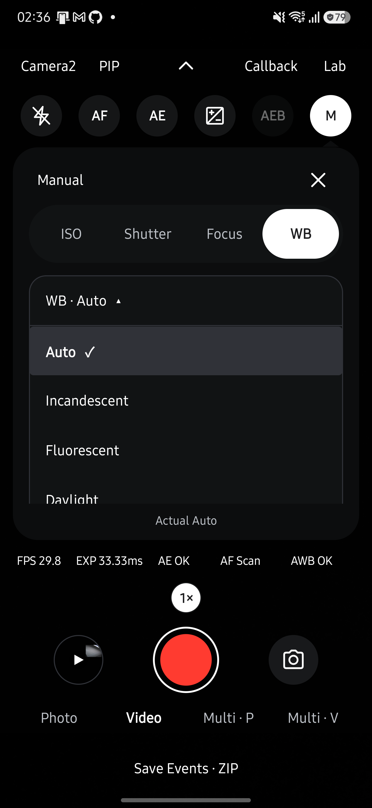

# VIDEO 사전 준비와 촬영 동작 검증

**PHOTO 2개·VIDEO 10개 조합과 인코더 오류 복구를 확인했습니다.** 2026-10-11, Galaxy S25+ (SM-S936N), Android 16/API 36에서 같은 서명의 0.24.0(versionCode 670) release APK를 데이터 보존 업데이트로 설치했습니다.

## 결과

| 엔진 | VIDEO 구성 | 스냅샷 크기 | 결과 |
| --- | --- | --- | --- |
| Camera2 | JPEG | 1920×1080 | 통과 |
| Camera2 | YUV | 480×640 | 통과 |
| Camera2 | EIS Video + YUV + 오디오 | 480×640 | 통과 |
| Camera2 | EIS Preview + Video + YUV + 오디오 | 480×640 | 통과 |
| Camera2 | 서비스 PIP | 590×1280 | 통과 |
| Camera2 | 물리 PIP | 590×1280 | 통과 |
| CameraX | JPEG | 4080×3060 | 통과 |
| CameraX | YUV | 480×640 | 통과 |
| CameraX | EIS Video + YUV + 오디오 | 480×640 | 통과 |
| CameraX | 서비스 PIP | 590×1280 | 통과 |

각 VIDEO 조합은 시작 시 세션 유지, 실제 두 손가락 핀치, 스냅샷 저장, MP4 프레임 디코딩을 검사합니다. 핀치 후 `capture_result.zoomRatio`가 요청값과 0.05 이내로 일치해야 통과합니다. 오디오 조합은 트랙 존재도 확인합니다. [결과 로그](assets/video-mode-ready/release024-device-results.txt)를 남깁니다.

두 엔진의 PHOTO에서는 EIS 설정을 전달해도 실제 OIS/EIS 결과가 OFF였습니다. 설정 화면의 PHOTO Stabilization과 VIDEO DNG도 비활성화됐습니다. 기기 검사는 `VideoModeChecks.kt`에서 재현할 수 있습니다.

## 오류와 자원 해제

1. **준비된 Camera2 인코더 오류:** 실제 인코더·세션에 오류 콜백을 주입했습니다. `prepared` 해제, 인코더·Surface 해제와 프리뷰 복구를 확인했습니다. 실제 하드웨어 고장을 일으킨 검사는 아닙니다.
2. **PIP 재녹화:** 버튼으로 녹화 → 정지·저장 → 재녹화 → 스냅샷 → 정지·저장을 확인했습니다. 구현은 기존 인코더의 정지·저장·해제 완료 후 GL 스레드에서 다음 인코더를 준비합니다.
3. **스냅샷 실패:** 시간 초과, 저장 열기·쓰기·공개 실패, 카메라 종료 중 완료, 중복 콜백, 출력 조합 거부 후 녹화 복구를 포함한 11개 묶음이 통과했습니다. [오류 경로 로그](assets/video-mode-ready/release024-error-results.txt)를 확인하세요.

검사 중 발견한 EIS + YUV + 오디오의 relay 버퍼 거부는 명시적 EIS 녹화를 인코더에 직접 연결하여 수정했습니다. 이 경로는 녹화 버퍼 도착 시각을 관측하지 않습니다. MediaRecorder 오류 콜백의 잘못된 `stop()` 수신 객체도 앱 종료 절차로 연결했습니다.

## 화면에서 확인한 동작

- 녹화 중 줌 버튼 1배 → 2배 → 1배와 핀치를 확인했습니다. PIP는 메인 카메라를 확대합니다.
- Camera2·CameraX 모두 PIP 선택·녹화·스냅샷·정지·해제를 확인했습니다.
- WB 목록은 PHOTO·VIDEO에서 버튼 아래로 열립니다. Incandescent·Daylight 선택, Actual 값 반영, 재열기 시 선택 표시, 뒤로가기와 하단 항목 스크롤을 확인했습니다.
- 녹화 중 엔진·PIP 선택·Lab·갤러리 진입은 제한됐고 정지 후 다시 사용할 수 있었습니다.

## 자동 검사와 한계

앱 JVM 752개, lint, release·테스트 APK 빌드가 통과했습니다. 문서 테스트 33개와 생성·사이트·coverage 검사도 통과했습니다. 문서 검토 기록은 2026-10-11 사용자의 명시적 승인에 따라 반영합니다. 자동 동기화의 결과를 사람의 승인으로 간주하지 않습니다.

- YUV 640×480 스냅샷은 세로 회전 후 480×640 JPEG입니다. PIP는 합성 해상도를 사용하므로 일반 JPEG/YUV 크기 선택을 적용하지 않습니다.
- 녹화 시작 후 재개방·세션 재구성·재바인딩 이벤트가 없는지 검사했습니다. 이 결과가 디스플레이 프레임 누락이 전혀 없다는 보장은 아닙니다.
- 동일한 프리뷰 콜백 지표가 없는 CameraX·PIP에는 프레임 간격 수치를 만들지 않았습니다. CameraX 스냅샷 시 영상 간격 증가는 기기별 추가 확인이 필요합니다.
- 모든 출력 크기·코덱 조합, 다른 제조사 기기, 전체 CTS와 장시간 Benchmark는 이번 검사에 포함하지 않았습니다.

release 서명 기기 검증에는 Gradle init script의 `android.testBuildType = 'release'`를 사용해 같은 서명의 테스트 APK를 빌드했습니다. `CliStoreInstrumentation`의 `video_mode`와 `snapshot_failures` 인자로 실행합니다.

버튼별 확인 기록

| 버튼 또는 흐름 | 확인한 결과 |
| --- | --- |
| Camera2 ↔ CameraX | VIDEO 상태로 전환되고 녹화 준비 후 시작 버튼을 사용할 수 있습니다. |
| 컨트롤 펼치기·접기 | 동일한 Flash·AF·AE·EV·AEB·Manual 구성으로 열고 닫힙니다. |
| Flash | 두 엔진에서 Torch 적용·해제가 되고 실제 Flash Fired 표시가 따라옵니다. VIDEO에서는 Off·Torch를 제공합니다. |
| AF·AE | 두 엔진에서 잠금 상태가 표시되고, AE는 실제 결과가 Locked로 바뀝니다. 녹화 중 AE 잠금도 적용됩니다. |
| EV | 증가·감소·0 초기화를 확인했습니다. CameraX에서도 증가와 초기화를 확인했습니다. |
| Manual | Camera2의 ISO·Shutter·Focus·WB 탭, 값 입력창, Auto/Manual 및 Reset을 확인했습니다. ISO 200 요청의 실제 값은 199였고, 수동 초점과 Daylight WB도 적용됐습니다. CameraX는 PHOTO와 같은 기존 수동 제어 제한을 표시합니다. |
| AEB | VIDEO에서는 활성화되지 않으며 PHOTO 전용 안내를 유지합니다. |
| Callback | 표시·숨기기와 현재 프레임 타이밍 표시를 확인했습니다. |
| 줌 | 녹화 중 줌 목록을 펼쳐 2배를 선택했고 선택 표시가 바뀝니다. 두 손가락 핀치는 별도 기기 검사로 확인했습니다. |
| 카메라 선택 | 후면 → 전면 → 후면 전환 후에도 VIDEO가 유지됩니다. |
| PIP | Camera2·CameraX 모두 선택 → 녹화 → 스냅샷 → 정지 → 해제를 버튼으로 확인했습니다. |
| 녹화·스냅샷·정지 | 오디오 포함 녹화에서 스냅샷 저장 후 녹화가 계속되고 정지 후 저장됩니다. Camera2의 27초 영상은 갤러리 재생 화면에서 재생했습니다. |
| 녹화 중 화면 전환 | 엔진·PIP 선택·Lab·갤러리 버튼을 눌러도 녹화를 벗어나지 않습니다. 정지 후에는 다시 사용할 수 있습니다. |
| Lab·Live Streams | Lab 경유와 헤더 경유 모두 VIDEO 설정으로 열립니다. 최대 카메라 수, Preview·YUV·JPEG 크기, Preview FPS, 녹화 포맷·해상도·FPS, 보정 선택창과 취소를 확인했습니다. YUV와 EIS는 선택·Apply 후 실제 녹화까지 확인했습니다. 모든 크기·포맷 조합을 녹화한 검사는 아닙니다. |
| Photo·Video | 왕복 전환 후 PHOTO의 Stabilization은 Off 및 비활성화 안내를 표시합니다. VIDEO의 DNG는 비활성화됩니다. |
| Multi P·Multi V | 각 화면으로 진입하고 Live 버튼으로 원래 VIDEO 화면에 복귀합니다. 별도 Multi 화면 내부 기능 전체는 이번 범위에 포함하지 않습니다. |
| 갤러리 | 녹화 후 목록·상세·재생과 Live 복귀를 확인했습니다. 공유·삭제는 실행하지 않았습니다. |
| Save Events · ZIP | 5초 카운트다운 후 앱 내부에 ZIP이 저장되고 완료 대화상자가 나타납니다. |

