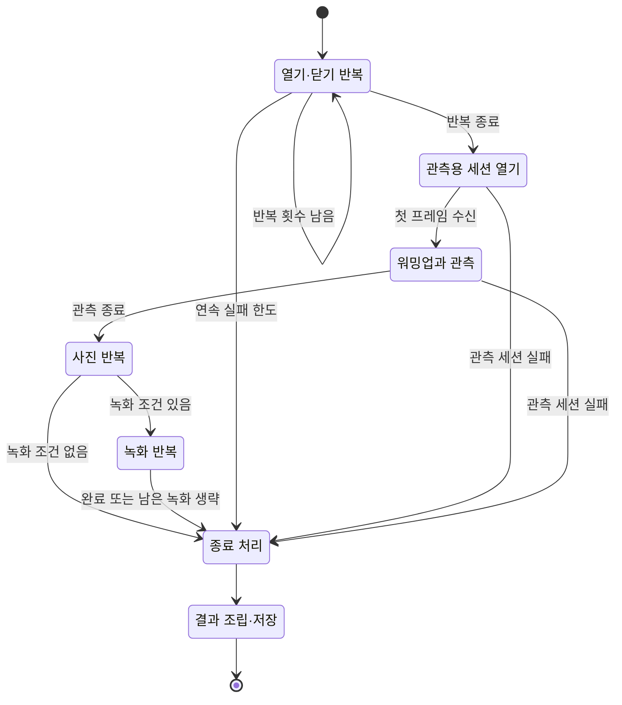
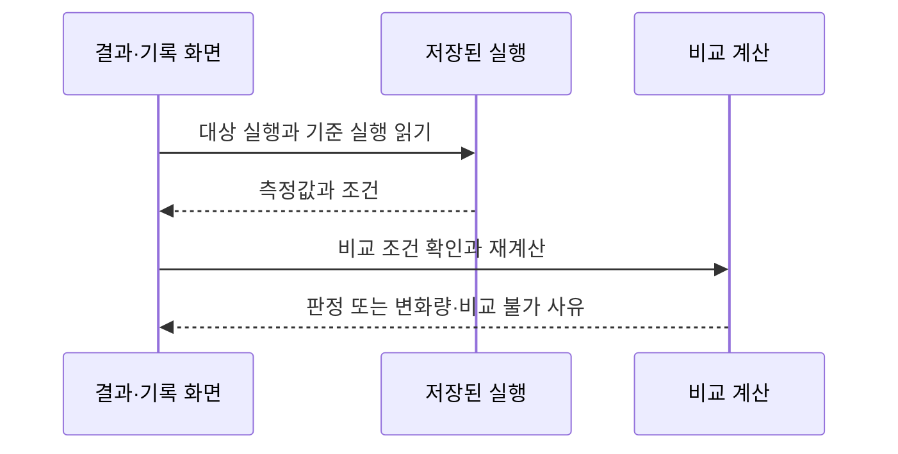

**실행 실패는 러너 결과에서, 측정값의 차이는 이벤트와 계산 규칙에서 확인하세요.** 벤치마크의 입력은 카메라 콜백 이벤트와 러너가 기록한 실행 시각입니다.

이 절은 데이터가 지나가는 경로만 설명합니다.

각 화면을 어떻게 읽고 조작하는지는 해당 화면을 담당하는 문서에 있습니다.

결과 화면과 실행 기록은 [Benchmark](benchmark.md), 사양 표는 [Probe](probe.md), 케이스 실행과 판정은 [CTS](cts.md), 프레임별 그래프는 [Callback](callback.md), ADB 명령의 사용법은 [CLI](cli.md)에서 확인하세요. Live 조작은 [Live](live.md에 있습니다.

배치·간격·애니메이션·접근성 문구 같은 앱의 조작 규칙은 [APP-UI.md](https://github.com/TTolsun/hal-camera/blob/main/docs/design/APP-UI.md)가 관리합니다.

Live 셔터 조작은 `MainActivity`에서 선택한 엔진의 촬영·녹화 동작으로 이어집니다. 벤치마크는 별도 화면인 `BenchmarkActivity`가 준비를 마친 뒤 `BenchmarkRunner.start()`를 호출하여 시작합니다. `Telemetry.callback(...)`이 반환한 Camera2 콜백의 `onCaptureStarted`는 프레임워크 신호를 기록하며, Live 셔터와 벤치마크 시작을 연결하는 메서드가 아닙니다.

### 실행에서 저장까지

**사전 확인이 끝나면 열기·닫기를 반복한 뒤, 별도 세션에서 관측·촬영합니다.** 아래는 세부 Step을 묶은 상태도이며 화면의 Phase와 일대일 대응하지 않습니다.

| 조건 | 처리 |
| --- | --- |
| 열기·닫기 한 사이클 | OPEN → CONFIGURE → FIRST_FRAME → CYCLE_CLOSE를 수행합니다. 프로세스를 새로 시작하는 cold launch가 아닙니다. |
| 열기 사이클이 한 번 실패합니다. | 실패를 기록하고 다음 사이클로 진행합니다. 연속 실패 한도에 이르면 조기 종료합니다. |
| 사진이나 녹화의 한 반복이 실패합니다. | 실패 표본을 남깁니다. 녹화 미지원 또는 녹화 연속 실패 한도에 이르면 남은 녹화를 생략합니다. |
| 실행 중 중단을 요청합니다. | 진행 중인 단계의 정리와 종료 처리를 거쳐 결과를 남깁니다. 그림의 각 단계에서 가능한 경로입니다. |
| 닫기 콜백이 오지 않습니다. | 기본 5초 뒤 종료 실패를 기록하고 진행합니다. 실제 종료 통지를 받은 경우와 구분하여 `close_completed=false`를 남깁니다. |

관측용 추가 열기는 시작 지표의 반복 횟수에 포함하지 않습니다. 녹화는 RECORD_PREPARE → RECORD_START → RECORD_RUN → RECORD_STOP을 반복합니다.

`RunAssembler`는 러너 결과와 이벤트로 측정값·validity를 계산하고, `BenchmarkReport`가 실행 JSON을 저장합니다. 저장 직후 `RunRetention`이 보관 정책을 적용하며 baseline 집합의 실행은 보호합니다. 비교는 아래처럼 따로 계산합니다.

이벤트·표본·진단 정보

`Telemetry.callback()`은 `capture_started`, `request_observed`, `capture_result`, `capture_failed`, `buffer_lost`를 기록합니다.

콜백의 `alive()`가 거짓이면 이미 닫힌 세션의 늦은 이벤트를 버립니다.

`request_observed`는 요청 제출 시각이 아니라 `onCaptureStarted`에서 관측한 요청 내용입니다.

Live 제어를 확인할 수 있도록 `request_observed`에는 요청한 줌·EV·AE 잠금·플래시 모드·AF/precapture trigger를, `capture_result`에는 적용된 AE 잠금·EV·플래시 상태와 논리 카메라가 알려 주는 물리 카메라 ID(API 29 이상)를 함께 기록합니다.

Live 제어, AE 재잠금, 터치 측광이 남기는 이벤트는 [Engine Comparison](engine.md#두-엔진이-함께-남기는-기록)에 있습니다.

러너는 API 호출과 완료 신호 사이의 시각 차이를 기록합니다. `RunAssembler`는 관측 세션의 프레임 중 관측 시작 이전에 도착한 프레임 수를 워밍업으로 계산합니다. `MetricExtractor`가 이벤트를 표본으로 연결하고, `BenchmarkEvaluator`가 profile에 따라 초기 반복을 제외하고 통계를 계산합니다. 3A 수렴은 관측 세션의 첫 결과부터 계산합니다.

`RunAssembler.ObservationInput.observedFrames`는 워밍업을 제외한 `steadyFrames`의 수입니다. 이 값은 `RunValidityEvaluator`의 표본 수 검사에 전달됩니다. `RunAssembler`가 구성한 `BenchmarkRun`은 `BenchmarkReportCodec`에서 schema 5로 직렬화하며, 파일 쓰기는 조립기 밖에서 처리합니다.

`BenchmarkActivity`는 `LaunchDiagnostics`의 조회 함수를 러너에 주입합니다.

러너는 launch 사이클의 열기 전과 닫기 처리 후에 CPU 주파수 정책·thermal 상태·조회 시작과 종료 시각을 수집하여 `raw.launch_cycles[].diagnostics`에 보존합니다.

닫기 타임아웃은 `close_completed=false`로 구분합니다.

읽지 못한 값은 미확인 상태로 남으며, 이 선택적 진단 정보는 지표·validity·baseline 판정의 입력이 아닙니다.

조회 시간은 측정 구간 밖에 있지만 사이클 간 간격과 기기 상태에는 영향을 줄 수 있습니다.

수집·분석 절차와 기기별 검증 결과는 [launch 진단 기록](https://github.com/TTolsun/hal-camera/blob/main/docs/validation/launch-diagnostics.md)에 있습니다.

### 저장된 실행을 다시 계산하는 경로

`RegressionDetector`는 두 실행의 측정 계약·endpoint·validity·환경 조건을 확인합니다. baseline 집합이나 두 실행 비교에서 먼저 선택한 실행을 기준으로 삼으면 회귀 판정을 표시합니다. 집합이면 집합 값의 범위를 벗어난 지표만 저하나 개선으로 판정합니다. 이전 실행을 자동 선택한 reference 비교에서는 변화량과 비교 불가 사유만 표시합니다. 단위가 다르면 각 단위를 유지하고 백분율을 표시하지 않습니다.

**실행 JSON에는 비교 결과를 저장하지 않습니다.** 결과 화면과 실행 기록은 저장된 측정값으로 비교를 다시 계산합니다.

기준 선택과 판정의 의미는 [Benchmark](benchmark.md)에서 확인하세요.

### Live에서 촬영과 저장

Live 셔터는 현재 엔진의 `MediaCapture`로 사진이나 동영상을 저장하며, 촬영을 위해 엔진을 바꾸지 않습니다. 기본 사진은 YUV·JPEG 쌍이며 두 엔진 모두 Live 스트림에서 켠 출력만 저장할 수도 있습니다. 저장은 별도 작업 스레드에서 처리하고, 완료된 파일만 앨범에 공개합니다. 엔진별 요청 구성과 저장 순서는 [Engine Comparison](engine.md)에 있습니다.

Lab은 `WorkbenchActivity`가 담당하며 카메라를 직접 열지 않습니다. Live의 `close(done)`이 끝나면 Lab을 엽니다. 선택한 카메라 ID는 Probe와 Benchmark에, 엔진은 Benchmark에 전달합니다.

녹화·저장·세션 종료·CLI 작업 중에는 Lab 버튼을 비활성화합니다. Live Streams도 카메라를 닫은 뒤 열며, 저장하거나 뒤로 가면 진입한 화면으로 돌아갑니다. 화면 조작은 [Live](live.md#추가-설정)를 확인하세요.

### 갤러리 항목의 조회 경로

촬영 화면의 최근 썸네일은 MediaStore에서 HALCamera의 저장 완료 항목만 조회합니다. 파일 저장과 화면 복귀 시 백그라운드에서 갱신하며 항목이 없거나 읽기에 실패하면 갤러리 아이콘을 표시합니다. 촬영 화면을 벗어나면 변경 감시를 중단하므로 뒤늦게 도착한 조회 결과는 반영하지 않습니다.

`GalleryActivity`도 HALCamera 앨범만 조회합니다. 공유 Intent에는 선택한 URI와 읽기 권한만 전달하며, 삭제는 Android 11 이상에서 `MediaStore.createDeleteRequest()`의 시스템 확인을 거칩니다. 2,000개를 넘는 선택은 2,000개 이하로 나누어 순서대로 시스템 확인을 요청합니다. 격자 열 수, 필터, 상세 화면의 확대와 탐색 같은 조작 규칙은 `APP-UI.md`에 있습니다.

### CLI 요청과 결과 수집

CLI 명령은 ADB와 `CliProvider`를 거쳐 `CommandCoordinator`에 접수됩니다.

요청 ID와 내용을 먼저 저장하고 `LiveController`, `CtsController`가 화면의 카메라·CTS suite 동작을 실행합니다.

사진은 켜진 출력 이미지의 저장 완료, CTS suite는 보고서 JSON·텍스트 쓰기 완료 후 artifact를 등록합니다.

`benchmark.run`은 Live 카메라 종료 뒤 벤치마크 화면으로 인계하며, `BenchmarkController`가 기존 Runner 실행과 JSON 저장 완료를 요청 결과에 연결합니다.

`cameras`·`streams`·`probe`·`cts.cases`는 화면을 거치지 않고 coordinator가 처리합니다.

스트림 지원 조회와 probe 파일 작업은 IO 스레드에서 실행하며, probe 파일은 요청별 `files/cli/artifacts/<request_id>/`에 두었다가 기록 정리와 함께 지웁니다.

접수·완료·파일 회수의 순서는 [CLI 요청 흐름](cli.md#요청과-완료를-구분하세요)에 있습니다.

PC는 요청 상태를 조회하고 완료된 artifact의 크기와 SHA-256을 확인합니다. 같은 요청 ID와 같은 내용은 기존 결과를 반환하며 새로운 촬영을 시작하지 않습니다. 명령 사용법과 전송 실패 대응은 [CLI](cli.md)에 있습니다.

앱을 열 때는 투명한 `CliLaunchActivity`가 main thread에서 작업 상태를 다시 확인합니다. 실행 중인 작업이 있으면 Live로 전환하지 않습니다. 상태 조회는 `CommandStore`의 메모리 snapshot을 읽으며 파일 기록은 상태 전환 때만 수행합니다.
