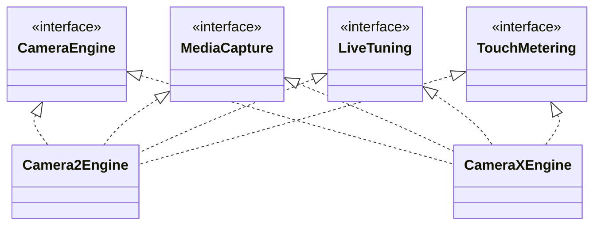

**화면은 엔진 클래스가 아니라 엔진이 구현한 인터페이스로 기능을 확인합니다.** 그래서 Live의 셔터, 상단 제어, 프리뷰 터치는 Camera2와 CameraX에서 같은 코드로 동작하고, 엔진을 바꾸지 않습니다.

점선 화살표는 인터페이스 구현을 뜻합니다. 실제로 사용할 수 있는 기능은 엔진의 실행 모드와 아래 조건에 따라 달라집니다.

| 인터페이스 | 담당하는 동작 | 구현 |
| --- | --- | --- |
| `CameraEngine` | 카메라 열기(`start`), 촬영(`capture`), 줌(`setZoom`), 닫기(`close(done)`) | 두 엔진 |
| `MediaCapture` | 선택한 JPEG 출처·RAW 저장(`capturePhoto`), 녹화 시작·정지, 녹화 중 사진(`snapshot`, `captureSnapshot`), 촬영·녹화 진행 상태(`mediaBusy`) | 두 엔진. 벤치마크용 Camera2Engine은 이 사진 저장과 Live 녹화를 제공하지 않습니다 |
| `LiveTuning` | EV, AE·AF 잠금, 플래시와 수동 촬영(`setControls`) | 기본 제어는 두 엔진, 수동 노출·초점·WB는 Camera2 |
| `TouchMetering` | 짧게 터치한 지점의 초점, 길게 누른 지점의 노출(`meterAt`) | 두 엔진 |

`MainActivity`는 `engine as? MediaCapture`처럼 인터페이스로 확인한 뒤 호출합니다. 카메라가 다시 열리는 중이라 엔진이 없으면 셔터와 제어 버튼이 비활성화되어 있으므로, 엔진이 없을 때 다른 엔진으로 바꾸는 경로는 없습니다. CLI의 촬영 요청이 이 상태에 도착하면 `Media capture unavailable; camera not ready`로 실패합니다.

### 엔진을 고르고 바꾸는 순서

1. Live 상단의 API 버튼을 누를 때마다 Camera2와 CameraX가 번갈아 선택됩니다. 저장된 화면 상태가 없으면 Camera2로 시작합니다.
2. 엔진이나 카메라를 바꾸면 기존 엔진의 `close(done)` 완료 콜백을 받은 뒤에 새 엔진을 엽니다. 단일 카메라의 기본 엔진은 한 번에 하나만 유지합니다. PIP의 추가 Service ID와 Multi의 독립 CameraDevice는 별도로 관리합니다.
3. 엔진이나 카메라를 바꾸면 EV, AE·AF 잠금, 플래시는 기본값으로 돌아가고 상단 제어 줄이 접힙니다. 일시정지 후 재개처럼 같은 카메라를 다시 여는 경우에는 이전 제어 값을 `setControls(controls, restore = true)`로 다시 적용합니다.
4. 녹화 중에는 API 버튼과 카메라 선택이 비활성화되어 엔진을 바꿀 수 없습니다.

종료 통지와 다음 엔진의 대기 순서는 [엔진 전환 그림](architecture.md#카메라-열기와-닫기)을 확인하세요.

Photo·Video·Multi · P·Multi · V 사이에서 모드를 바꾸면 기존 세션을 닫고 스트림을 다시 구성합니다. 같은 모드를 다시 누르면 유지합니다. 단일 카메라는 새 프리뷰의 첫 화면 갱신 뒤, Multi는 모든 장치의 합성 프리뷰가 준비된 뒤에 촬영 버튼을 활성화합니다. CLI 호환용 Dual도 두 프리뷰가 모두 갱신된 뒤에 촬영할 수 있습니다. 모드 선택 자체로 사진이나 녹화를 시작하지는 않습니다.

### Benchmark와 CLI가 쓰는 엔진

Benchmark는 Camera2 전용입니다. CameraX가 선택된 상태에서 Benchmark로 들어가면 `StartCardPresenter`가 Camera2로 전환한다고 알립니다. Live와 다른 스트림 크기 및 저장 방식은 [Camera2 엔진](#camera2-엔진)에서 설명합니다.

CLI의 `preview`·`capture`·`record.start`는 `LiveController`를 통해 Camera2 또는 CameraX를 엽니다. 기본 엔진은 Camera2이며 `--engine CameraX`로 바꿉니다. 크기 옵션을 생략하면 기본 스트림을 사용하고 카메라 JPEG를 저장합니다. 명시한 옵션은 지원 검사 후 적용하며 이전 UI 설정은 이어받지 않습니다. `streams`는 화면 없이 지원 크기와 녹화 후보를 조회합니다. 인자와 예제는 [CLI](cli.md)에 있습니다.

### 두 엔진이 함께 남기는 기록

두 엔진은 세션을 열 때 `Telemetry.registerSession`에 엔진 이름(`Camera2` 또는 `CameraX`)을 남기고, 같은 `Telemetry.callback`으로 capture 콜백을 기록합니다. 그래서 `capture_started`, `capture_result` 같은 이벤트 종류가 엔진과 관계없이 같습니다. 엔진별로 요청을 만드는 방법이 다르므로, 같은 이벤트라도 요청에 들어간 키는 엔진마다 다를 수 있습니다.

Live 제어와 터치 측광은 다음 이벤트를 추가로 남깁니다.

| 이벤트 | 기록하는 내용 |
| --- | --- |
| `controls_set` | 요청한 EV, AE·AF 잠금, 플래시 모드와 Camera2 수동 ISO·노출 시간·초점·WB |
| `live_streams_requested` | Camera2 Live의 출력·FPS·녹화 설정과 요청한 `stabilization` 모드 |
| `ae_relock_wait`, `ae_relock`, `ae_relocked` | AE 잠금을 켠 채 세션을 새로 만들었을 때 잠금을 풀고 기다린 시점, 다시 잠근 이유(수렴 또는 2초 timeout), 잠금 전후의 노출 시간·ISO와 EV 차이 |
| `touch_meter`, `touch_meter_result` | 터치 종류(AF·AE), 정규화 좌표, 결과(FOCUSED·FAILED·METERED) |
| `media_saved`, `video_saved` | 저장한 사진의 센서 시각·파일 URI와 동영상 URI |

`request_observed`의 `afRegions`·`aeRegions`와 `capture_result`의 `afRegions`·`aeRegions`를 비교하면, 요청한 영역과 HAL이 적용한 영역을 대조할 수 있습니다.

손떨림 보정은 두 이벤트의 `opticalStabilization`·`videoStabilization`·`cropRegion`으로 요청과 실제 결과를 대조합니다.

| 조건 | Live 표시와 판정 |
| --- | --- |
| 세션·촬영 단계·요청 모드가 바뀝니다. | 이전 결과를 제외합니다. |
| 결과 키가 없거나 1.5초 이상 오래됐습니다. | 적용 여부를 확인할 수 없다고 표시합니다. |
| 명시적으로 요청한 EIS 모드와 다른 결과가 1초 이상 이어집니다. | 경고합니다. 같은 프레임을 반복 조회한 것만으로는 경고하지 않습니다. |
| 요청과 일치하는 새 결과가 옵니다. | 불일치 경고를 해제합니다. |
| CameraX에서 EIS (Video)를 선택합니다. | VideoCapture가 연결된 녹화 중에 대조합니다. 녹화 전에는 실제 결과만 표시합니다. |

사진 결과는 Camera2의 요청 태그와 CameraX의 `captureIntent`로 제외합니다. 설정 화면은 구성 실패 오류만 표시하며 이전 세션 결과 목록을 제공하지 않습니다.
