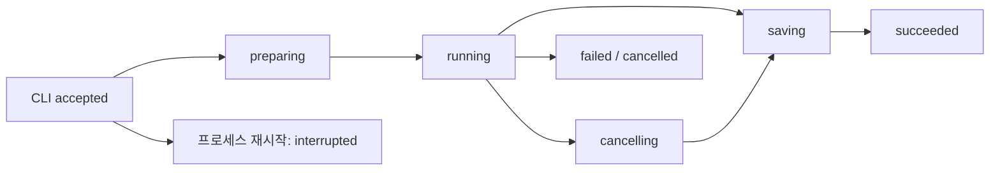

# 아키텍처 및 코드 구조

**수정할 기능과 연결된 코드부터 찾으세요.** 이 문서는 카메라 구동부터 이벤트 기록, 지표 계산, 결과 표시까지의 책임과 변경 시 지켜야 할 제약을 설명합니다.

| 지금 확인할 내용 | 이동할 절 |
| --- | --- |
| 앱의 전체 구조와 관측·비교 경로를 이해합니다. | [앱의 역할과 평가 경로](#앱의-역할과-평가-경로) |
| 수정할 패키지를 찾습니다. | [패키지별 역할](#패키지별-역할) |
| 측정값이 만들어지는 순서를 추적합니다. | [주요 실행 흐름](#주요-실행-흐름) |
| 카메라 종료와 스레드 제약을 확인합니다. | [생명주기와 스레드](#생명주기와-스레드) |
| 변경 후 지켜야 할 규칙과 검증 방법을 확인합니다. | [변경 시 지켜야 할 제약](#변경-시-지켜야-할-제약) |

아직 빌드하지 않았다면 [빠른 시작](getting-started.md)을 먼저 진행하세요. 아래의 `코드 확인`은 구현을 대조했다는 뜻이며, 기기 실측을 뜻하지 않습니다.

## 앱의 역할과 평가 경로

<!-- omm:begin id=overview -->

앱은 CLI 명령어를 통해 시작되며, Live 관측과 벤치마크 실행, 결과 저장 및 비교의 세 가지 주요 단계로 동작합니다. `MainActivity`는 카메라 엔진을 제어하고 실시간 데이터를 수집하는 역할을 하며, `Telemetry`와 `FlightRecorder`는 이벤트와 시스템 상태를 기록합니다. `BenchmarkRunner`가 실행 순서를 관리하고, `RunAssembler`는 러너 결과와 이벤트를 결합하여 표준화된 실행 객체를 생성합니다. 저장된 실행은 `BenchmarkReport`로 JSON 파일로 기록되며, `BaselineManager`와 `RegressionDetector`가 기준 실행과 비교 결과를 산출합니다.

Live 관측은 현재 카메라 상태를 실시간으로 모니터링하는 과정이며, `MainActivity`에서 수집된 데이터를 UI에 표시합니다. 반면 벤치마크 비교는 저장된 실행 기록을 기반으로 반복 측정을 수행하고 회귀 여부를 분석하는 과정입니다. Live 관측은 `Telemetry`를 통해 데이터를 수집하고, 벤치마크 비교는 `FlightRecorder`와 `RunAssembler`를 사용하여 실행 이력을 기록하고 분석합니다. 이력은 `HistoryActivity`에서 관리되며, `ProfileComparisonActivity`에서 직접 선택된 파일들을 기반으로 분석됩니다.

코드를 처음 읽을 때는 `MainActivity.kt` 파일을 열어야 합니다. 여기서는 앱의 전체 흐름과 각 단계의 책임 (카메라 연결, 데이터 수집, 저장)을 파악할 수 있습니다. 개발자는 먼저 카메라 엔진 관리, 데이터 기록 (`Telemetry`, `FlightRecorder`), 그리고 UI 업데이트가 어떻게 처리되는지 확인해야 하며, 이후 벤치마크 실행과 결과 분석 로직으로 넘어갈 수 있습니다.

근거와 검토 정보

- 근거 파일: `app/src/main/java/dev/halcamera/MainActivity.kt`, `app/src/main/java/dev/halcamera/benchmark/BenchmarkActivity.kt`, `app/src/main/java/dev/halcamera/benchmark/HistoryActivity.kt`, `app/src/main/java/dev/halcamera/benchmark/ProfileComparisonActivity.kt`, `app/src/main/java/dev/halcamera/benchmark/domain/BenchmarkRunner.kt`, `app/src/main/java/dev/halcamera/benchmark/domain/ProfileArchive.kt`, `app/src/main/java/dev/halcamera/benchmark/domain/ProfileComparison.kt`, `app/src/main/java/dev/halcamera/benchmark/domain/RegressionDetector.kt`, `app/src/main/java/dev/halcamera/benchmark/domain/RepeatStatistics.kt`, `app/src/main/java/dev/halcamera/benchmark/domain/RunAssembler.kt`, `app/src/main/java/dev/halcamera/benchmark/domain/ScoreComposer.kt`, `app/src/main/java/dev/halcamera/benchmark/platform/ProfileLibrary.kt`, `app/src/main/java/dev/halcamera/camera/CameraEngine.kt`, `app/src/main/java/dev/halcamera/cli/CommandCoordinator.kt`, `app/src/main/java/dev/halcamera/telemetry/FlightRecorder.kt`, `app/src/main/java/dev/halcamera/telemetry/Telemetry.kt`, `tools/halcam/halcam/cli.py`
- 근거 수준: 코드 확인
- 검토 상태: 원본이 갱신됨: 검토 대기

<!-- omm:end id=overview -->

## 전체 구조도

그림을 클릭하면 확대 화면이 열립니다. 키보드에서는 Tab으로 그림을 선택한 뒤 Enter 또는 Space를 누르세요.

```mermaid
graph LR
    pc["PC · halcam"] -->|"ADB"| provider["CliProvider · shell 전용"]
    provider --> commands["CommandCoordinator / CommandStore"]
    commands -->|"LiveController"| live
    commands -->|"BenchmarkController"| benchmark
    live["MainActivity · Live"] -->|"엔진 선택"| engines["Camera2Engine / CameraXEngine"]
    live -->|"벤치마크 진입"| benchmark["BenchmarkActivity / BenchmarkRunner"]
    benchmark -->|"Driver 호출"| engines
    engines -->|"요청 실행"| platform["Android Camera API"]
    engines -->|"이벤트 기록"| telemetry["Telemetry / FlightRecorder"]
    telemetry -->|"관측 표본"| assemble["RunAssembler / BenchmarkEvaluator / RunValidity"]
    benchmark -->|"실행 시각"| assemble
    assemble -->|"적격 조건 확인"| score["ScoreComposer · 내부 초안"]
    score -->|"실행과 해당 점수 저장"| files["BenchmarkReport / BenchmarkStore · schema 4"]
    files -->|"기준 실행 읽기"| comparison["BaselineManager / RegressionDetector"]
    comparison -->|"비교 표시"| results["ResultPresenter / ComparePresenter"]
    benchmark -->|"이력 진입"| history["HistoryActivity / RunIndex"]
    files -->|"목록 읽기"| history
    history -->|"선택한 두 실행"| comparison
    history -->|"지표별 내보내기"| csv["BenchmarkCsv · CSV"]
```

<!-- omm:begin id=overall-diagram -->

근거와 검토 정보

- 근거: `.omm/overall-architecture/diagram`
- 근거 수준: 코드 확인

<!-- omm:end id=overall-diagram -->

## 패키지별 역할

<!-- omm:begin id=module-roles -->

각 패키지는 명확한 역할을 수행하며 변경 시 해당 패키지 내의 클래스와 외부 의존성을 확인해야 합니다. `cli/`와 `tools/halcam/`는 shell 호출자 검사, 영속 요청 상태, artifact 등록 및 PC 파일 수집을 담당합니다. 이 영역은 화면 어댑터인 `LiveController`, `BenchmarkController`, `CtsController`를 포함하며, `camera/`와 `benchmark/`가 `cli/`를 import하지 않도록 설계되어 있습니다. 변경 시에는 `CommandCoordinator`의 요청 ID·진행 상태·결과 파일 등록 관리 로직과 `LiveController`의 실제 카메라 사용, `BenchmarkController`의 실행·보고서 저장 경로 연결을 확인해야 합니다.

`camera/`는 엔진 계약인 `CameraEngine` 인터페이스와 `Camera2Engine`, `CameraXEngine` 구현을 제공합니다. 이 패키지는 기본 크기 선택 경로와 벤치마크용 명시적 StreamSpec 경로를 구분하며, 세션별 콜백과 `close(done)` 완료 통지를 러너에 연결합니다. 변경 시에는 `CameraEngine` 인터페이스의 `busy()` 상태와 `mediaBusy` 속성을 확인해야 합니다.

`metrics/`는 `MetricExtractor`와 `MetricModel`을 포함하며, 한 세션의 이벤트를 관측 창 안에서 FrameObservation으로 재구성하고 H.1~H.10 표본을 계산합니다. 이 패키지는 Android import가 없는 순수 Kotlin 로직이며, `benchmark/`의 `RunAssembler`, `BenchmarkEvaluator`와 `ui/LiveReadout`이 사용합니다.

`benchmark/`는 루트에는 `BenchmarkActivity`, `HistoryActivity`, `ProfileComparisonActivity` 세 화면만 둡니다. `benchmark/domain/`은 profile, 러너, 지표 계산, validity, 내부 점수, 비교 규칙, presenter를 담는 순수 Kotlin 층이며 `android.*`, `org.json`, `benchmark/platform/`을 import하지 않습니다. `benchmark/platform/`는 `BenchmarkStore`, `BenchmarkReport`, `ProfileLibrary`, `SubjectPrefs`, `ThermalTracker`, `ProfileCompatibilityChecker` 같은 파일·기기 어댑터입니다.

`telemetry/`는 `Telemetry`가 이벤트를 만들고 `FlightRecorder`가 보존합니다. `IncidentExporter`는 incident ZIP을 작성하며, listener는 기록 스레드에서 동기 실행됩니다.

`cts/`는 CTS 스타일 카메라 검사를 앱 안에서 실행합니다. 커스텀 케이스는 `CtsCatalog`가 목록을 순수 Kotlin으로 정의하고, `CtsRunner` 계약과 `CameraCaseRunner` 기반 클래스, 공통 Camera2 호출 `Camera2Ops` 위에 케이스별 하위 패키지가 놓입니다. 각 패키지는 판정을 순수 Kotlin `…Rules`에, 카메라 호출을 `…Runner`에 둡니다.

`ctsvendor/`는 AOSP CTS 테스트를 JUnit으로 실행하는 별도 Gradle 모듈입니다. `ui/`와 `MainActivity.kt`는 Live 관측값과 Canvas 그래프, 공통 `Look` 토큰, 카메라 선택과 권한 처리를 제공합니다.

실행 영역은 `Camera2Engine` 또는 `CameraXEngine` 클래스로, 카메라 하드웨어 제어 및 녹화/촬영을 수행합니다. 이 영역은 `BenchmarkActivity`의 `start()` 호출 시 시작되며, `onEvent()` 함수가 `FlightRecorder`를 통해 카메라 상태, 오류, 프레임 데이터 등을 기록합니다. 평가 영역은 `RegressionDetector.compare()` 함수가 `BaselineManager`와 `BenchmarkStore`를 통해 기준 실행과 현재 실행을 비교하며, `ResultPresenter`와 `ComparePresenter`가 결과를 표시합니다.

기록과 저장 영역은 `FlightRecorder`의 30 초 순환 버퍼와 10 초 사전 기록 관리, `IncidentExporter`의 ZIP 파일 생성, `Telemetry`의 세션별 이벤트 흐름 추적, `Incident` 객체의 저장된 데이터 핵심으로 구성됩니다. `BenchmarkReport`는 schema 4를 쓰고 schema 3·4를 읽으며, `BenchmarkStore`는 실행 파일과 baseline 인덱스를 관리합니다.

`HistoryActivity`는 같은 저장소를 읽으며, `RunIndex`는 이벤트와 표본 배열을 제거한 목록 데이터를 유지하고, 결과를 열 때 원본 JSON을 다시 읽습니다. 파일 읽기·삭제·CSV 생성은 별도 스레드에서 처리하며, `BenchmarkCsv`는 지표당 한 행을 작성하고 FileProvider로 공유합니다.

`camera/MediaLibrary`는 사진 쌍과 동영상을 MediaStore에 저장하며, `StillPair`와 `YuvPacking`은 버퍼 연결과 YUV 변환을 담당합니다. `GalleryActivity`는 HALCamera 앨범을 조회합니다. 미디어 저장은 벤치마크 지표 계산과 분리되어 있습니다.

`camera/RecentMediaThumbnail`은 저장 완료된 앨범 항목의 썸네일을 별도 작업 스레드에서 읽고 `ui/RecentMediaButton`에 전달하며, 화면을 나가면 관찰을 중단하고 뒤늦은 조회 결과는 반영하지 않습니다. `CameraProbeActivity`는 HAL에서 공개된 카메라 사양을 읽지 않고 열지 않으며, 실행과 평가 영역은 `CameraProbeReader`와 `CameraProbeSnapshot` 클래스를 통해 처리합니다.

기록과 저장 영역은 `CameraProbeText`, `CameraProbeEntry`, `CameraProbeRow`, `CameraProbeSection`, `CameraProbeFormat` 클래스가 담당하며, `CameraProbeActivity`는 이를 화면에 렌더링하고 필터링합니다. `ProfileLibrary`와 `ProfileArchive`는 외부 JSON의 검증·출처·별도 파일 보관을 담당하며, `ProfileComparison`은 기기·빌드·계약·환경·중복 검사를 수행합니다.

`RepeatStatistics`는 실행 단위 기술 통계와 순열검정을 담당하며, `ProfileComparisonActivity`가 시스템 파일 선택기와 묶음 선택·결과 공유를 연결합니다. `CameraProbeReader`는 `CameraManager`를 통해 `CameraCharacteristics` 데이터를 읽으며, `ScoreComposer`는 `BenchmarkRun`을 평가하여 점수를 계산합니다.

`CtsCatalog#cases`는 각 패키지의 역할과 의존성을 정의하며, `CtsRunner#run`은 CaseEnvironment#manager와 previewHost를 통해 카메라를 열고 닫는 사이클을 실행합니다. `FlightRecorder`는 이벤트 기록을 관리하며, 실행 전 카메라 및 마이크 권한이 필요하고, surface가 생성되지 않으면 실행이 지연됩니다.

중단 시 CANCELLED 결과로 표시되며, 실행 안 함 항목은 NOT_RUN으로 분류됩니다. `VendoredCtsListActivity`는 `:ctsvendor` 모듈의 `VendoredCatalog`에서 `@Test` 메서드를 체크리스트로 나열하고, `VendoredCaseActivity`가 그 메서드 하나를 실행합니다. 이 Activity는 가져온 `Camera2SurfaceViewCtsActivity`를 상속해 테스트의 `ActivityTestRule` 이 돌려받는 인스턴스가 됩니다.

`VendoredRun`은 작업 스레드에서 JUnit runner를 돌리고 `RunListener`로 결과를 받으며, 중단은 실행 중인 테스트가 쥔 `mCamera`를 닫아 테스트를 실패시키는 방식입니다. JUnit 이 실행 중인 본문을 멈출 수단이 없기 때문입니다.

필수 심볼인 `CameraEngine`, `BenchmarkActivity`, `FlightRecorder`는 각각 카메라 하드웨어 제어, 벤치마크 실행 관리, 이벤트 기록 관리를 수행하며, 변경 시에는 해당 클래스의 의존성과 동작을 확인해야 합니다.

근거와 검토 정보

- 근거 파일: `app/src/main/java/dev/halcamera/CameraProbeActivity.kt`, `app/src/main/java/dev/halcamera/MainActivity.kt`, `app/src/main/java/dev/halcamera/benchmark/BenchmarkActivity.kt`, `app/src/main/java/dev/halcamera/benchmark/HistoryActivity.kt`, `app/src/main/java/dev/halcamera/benchmark/ProfileComparisonActivity.kt`, `app/src/main/java/dev/halcamera/benchmark/domain/BenchmarkCsv.kt`, `app/src/main/java/dev/halcamera/benchmark/domain/BenchmarkReportCodec.kt`, `app/src/main/java/dev/halcamera/benchmark/domain/ProfileArchive.kt`, `app/src/main/java/dev/halcamera/benchmark/domain/ProfileComparison.kt`, `app/src/main/java/dev/halcamera/benchmark/domain/RepeatStatistics.kt`, `app/src/main/java/dev/halcamera/benchmark/domain/RunIndex.kt`, `app/src/main/java/dev/halcamera/benchmark/domain/ScoreComposer.kt`, `app/src/main/java/dev/halcamera/benchmark/platform/BenchmarkReport.kt`, `app/src/main/java/dev/halcamera/benchmark/platform/ProfileLibrary.kt`, `app/src/main/java/dev/halcamera/camera/CameraEngine.kt`, `app/src/main/java/dev/halcamera/camera/CameraProbe.kt`, `app/src/main/java/dev/halcamera/camera/CameraProbeReader.kt`, `app/src/main/java/dev/halcamera/camera/RecentMediaThumbnail.kt`, `app/src/main/java/dev/halcamera/cli/BenchmarkController.kt`, `app/src/main/java/dev/halcamera/cli/CommandCoordinator.kt`, `app/src/main/java/dev/halcamera/cli/LiveController.kt`, `app/src/main/java/dev/halcamera/cts/Camera2Ops.kt`, `app/src/main/java/dev/halcamera/cts/CameraCaseRunner.kt`, `app/src/main/java/dev/halcamera/cts/CtsCaseActivity.kt`, `app/src/main/java/dev/halcamera/cts/CtsCaseListActivity.kt`, `app/src/main/java/dev/halcamera/cts/CtsCatalog.kt`, `app/src/main/java/dev/halcamera/cts/CtsEntryActivity.kt`, `app/src/main/java/dev/halcamera/cts/CtsRunner.kt`, `app/src/main/java/dev/halcamera/cts/combination/StillPreviewCombinationRules.kt`, `app/src/main/java/dev/halcamera/cts/onoff/FastOnOffRules.kt`, `app/src/main/java/dev/halcamera/cts/recording/BasicRecordingRules.kt`, `app/src/main/java/dev/halcamera/cts/sizes/AllSizeOnOffRules.kt`, `app/src/main/java/dev/halcamera/cts/snapshot/VideoSnapshotRules.kt`, `app/src/main/java/dev/halcamera/cts/suite/CtsChecklistActivity.kt`, `app/src/main/java/dev/halcamera/cts/suite/CtsSuiteRunActivity.kt`, `app/src/main/java/dev/halcamera/cts/suite/SuitePlan.kt`, `app/src/main/java/dev/halcamera/cts/suite/SuiteReport.kt`, `app/src/main/java/dev/halcamera/cts/switching/SwitchingRules.kt`, `app/src/main/java/dev/halcamera/cts/vendored/VendoredCaseActivity.kt`, `app/src/main/java/dev/halcamera/cts/vendored/VendoredCtsListActivity.kt`, `app/src/main/java/dev/halcamera/telemetry/FlightRecorder.kt`, `app/src/main/java/dev/halcamera/ui/RecentMediaButton.kt`
- 근거 수준: 코드 확인
- 검토 상태: 원본이 갱신됨: 검토 대기

<!-- omm:end id=module-roles -->

## 주요 실행 흐름

<!-- omm:begin id=runtime-flow -->

사용자 조작이 카메라 호출, 콜백 기록, 지표 계산, 화면 표시로 이어지는 과정은 앱의 역할과 평가 경로를 따라 진행됩니다. Live 셔터 조작은 MainActivity에서 선택된 엔진의 촬영·녹화 동작으로 이어집니다. 벤치마크는 별도 화면인 BenchmarkActivity가 준비를 마친 뒤 BenchmarkRunner.start()를 호출하여 시작합니다. Telemetry.callback(...) 이 반환한 Camera2 콜백의 onCaptureStarted는 프레임워크 신호를 기록하며, Live 셔터와 벤치마크 시작을 연결하는 메서드가 아닙니다.

실행에서 저장까지의 과정은 다음과 같습니다. 먼저 BenchmarkActivity가 선택한 카메라와 profile을 사전 확인합니다. BenchmarkRunner가 열기·닫기 반복을 수행하며 각 사이클은 OPEN → CONFIGURE → FIRST_FRAME → CYCLE_CLOSE로 진행합니다. 별도 관측 세션에서 WARMUP → OBSERVE → STILL → CLOSE를 진행하며 profile은 반복 횟수와 관측·촬영 조건을 정합니다. RunAssembler가 러너 결과와 이벤트를 결합해 BenchmarkEvaluator와 RunValidityEvaluator를 호출합니다. ScoreComposer는 calibration의 적용 범위와 적격 조건에 맞는 run 에만 내부 점수를 채웁니다.

BenchmarkReport가 실행 JSON을 저장합니다. Activity는 baseline 또는 이전 실행을 찾아 비교 결과를 별도로 계산합니다. Telemetry.callback()은 capture_started, request_observed, capture_result, capture_failed, buffer_lost를 기록합니다. 콜백의 alive()가 거짓이면 이미 닫힌 세션의 늦은 이벤트를 버립니다. request_observed는 요청 제출 시각이 아니라 onCaptureStarted에서 관측한 요청 내용입니다.

러너는 API 호출과 완료 신호 사이의 시각 차이를 기록합니다. RunAssembler는 관측 세션의 프레임 중 관측 시작 이전에 도착한 프레임 수를 워밍업으로 계산합니다. MetricExtractor가 이벤트를 표본으로 연결하고, BenchmarkEvaluator가 profile에 따라 초기 반복을 제외하고 통계를 계산합니다. 3A 수렴은 관측 세션의 첫 결과부터 계산합니다. RunAssembler.ObservationInput.observedFrames는 워밍업을 제외한 steadyFrames의 수입니다. 이 값은 RunValidityEvaluator의 표본 수 검사에 전달됩니다.

RunAssembler가 구성한 BenchmarkRun은 BenchmarkReportCodec에서 schema 4로 직렬화하며, 파일 쓰기는 조립기 밖에서 처리합니다.

이벤트 경로와 러너 경로는 UI 이벤트 처리와 데이터 처리/비동기 작업이 분리되어 있습니다. 이는 UI 응답성을 보장하기 위한 것으로, 이벤트가 발생하면 메인 스레드가 UI 상태만 업데이트하고, 실제 데이터 조회나 이미지 디코딩은 별도의 스레드에서 처리한 후 결과를 메인 스레드로 전달합니다.

벤치마크의 경우 FlightRecorder는 모든 시스템 이벤트를 원본으로 저장하며, MetricExtractor(외부 모듈)가 이를 분석하여 메트릭을 추출합니다. 반면 BenchmarkRunner는 직접적인 실행 흐름을 관리합니다. 두 경로는 RunAssembler에서 합쳐집니다. RunAssembler.assemble() 함수는 FlightRecorder의 이벤트 로그와 BenchmarkRunner의 결과 데이터를 결합하여 최종 BenchmarkRun 객체를 생성합니다.

CLI 요청과 결과 수집의 경우 CLI 명령은 ADB와 CliProvider를 거쳐 CommandCoordinator에 접수됩니다. 요청 ID와 내용을 먼저 저장하고 LiveController, BenchmarkController, CtsController가 화면의 카메라·벤치마크·CTS suite 동작을 실행합니다. 사진은 두 이미지의 저장 완료, 벤치마크는 report 파일 쓰기 완료, CTS suite는 보고서 JSON·텍스트 쓰기 완료 후 artifact를 등록합니다.

PC는 요청 상태를 조회하고 완료된 artifact의 크기와 SHA-256을 확인합니다. 같은 요청 ID와 같은 내용은 기존 결과를 반환하며 새로운 촬영을 시작하지 않습니다. 원본 파일이 삭제되거나 전송이 끊긴 경우에는 요청 ID로 상태를 확인한 다음 파일 수집을 재시도합니다.

결과가 예상과 다를 때 먼저 확인해야 할 출력은 해당 단계의 실패 여부입니다. 갤러리 화면에서 이미지/동영상 데이터를 로드할 때 showCurrent 또는 startVideo 함수 내부의 runCatching 블록에서 예외가 발생하면 loading.text에 오류 메시지가 표시됩니다.

LoadMedia 함수에서 데이터 조회 실패 시 "앨범을 불러오지 못했습니다"라는 알림이 표시되며, 이 경우 queryIo 스레드의 실행 결과를 먼저 확인해야 합니다. 이미지 디코딩 실패 시 failedThumbnails 세트로 기록되고, 그리드 아이템의 badge에 "YUV" 또는 "JPEG" 라벨이 표시됩니다.

벤치마크 실행에서 BenchmarkRunner의 step과 marks (시간 마크)를 확인한 후, MetricExtractor가 생성한 Observation 데이터를 검증하고, RunValidityEvaluator가 validity를 판단하는지 확인합니다. ProfileArchive는 SHA-256 해시를 사용하여 파일 무결성을 검증하며, ProfileComparison는 조건 불일치 (발열, 절전 등)를 ConditionMismatch으로 분류하여 지표 비교를 제한합니다.

RegressionDetector는 deltaPct와 noiseFloor을 기반으로 REGRESSED/IMPROVED/STABLE 상태를 판정하며, RunAssembler는 모든 데이터를 BenchmarkRun으로 통합합니다. 유효하지 않은 데이터는 ScoreComposer.evaluate() 함수에서 점수 계산이 차단됩니다. 정상적인 경우, ScoreCalibration 객체가 생성되어 각 지표에 대해 중앙값과 범위를 계산한 후 최종 점수를 산출합니다.

결과가 예상과 다를 경우 우선 validity.flags 목록을 확인하여 측정 자체의 유효성을 검증한 후, ScoreComposer의 점수 계산 단계로 넘어갑니다. ProfileLibrary는 JSON 파싱 시 필수 필드 누락이나 형식 오류를 즉시 감지하며, BenchmarkReport.write()는 파일 생성 중 프로세스 종료 시 데이터 손상을 방지합니다.

근거와 검토 정보

- 근거 파일: `app/src/main/java/dev/halcamera/GalleryActivity.kt`, `app/src/main/java/dev/halcamera/MainActivity.kt`, `app/src/main/java/dev/halcamera/benchmark/BenchmarkActivity.kt`, `app/src/main/java/dev/halcamera/benchmark/HistoryActivity.kt`, `app/src/main/java/dev/halcamera/benchmark/ProfileComparisonActivity.kt`, `app/src/main/java/dev/halcamera/benchmark/domain/BaselineManager.kt`, `app/src/main/java/dev/halcamera/benchmark/domain/BenchmarkEvaluator.kt`, `app/src/main/java/dev/halcamera/benchmark/domain/BenchmarkReportCodec.kt`, `app/src/main/java/dev/halcamera/benchmark/domain/BenchmarkRunner.kt`, `app/src/main/java/dev/halcamera/benchmark/domain/ProfileArchive.kt`, `app/src/main/java/dev/halcamera/benchmark/domain/ProfileComparison.kt`, `app/src/main/java/dev/halcamera/benchmark/domain/RegressionDetector.kt`, `app/src/main/java/dev/halcamera/benchmark/domain/RepeatStatistics.kt`, `app/src/main/java/dev/halcamera/benchmark/domain/RunAssembler.kt`, `app/src/main/java/dev/halcamera/benchmark/domain/RunValidity.kt`, `app/src/main/java/dev/halcamera/benchmark/domain/ScoreComposer.kt`, `app/src/main/java/dev/halcamera/benchmark/platform/BenchmarkReport.kt`, `app/src/main/java/dev/halcamera/benchmark/platform/ProfileLibrary.kt`, `app/src/main/java/dev/halcamera/benchmark/platform/StoreRunCatalog.kt`, `app/src/main/java/dev/halcamera/camera/RecentMediaThumbnail.kt`, `app/src/main/java/dev/halcamera/cli/CliProvider.kt`, `app/src/main/java/dev/halcamera/cli/CommandCoordinator.kt`, `app/src/main/java/dev/halcamera/metrics/MetricExtractor.kt`, `app/src/main/java/dev/halcamera/telemetry/FlightRecorder.kt`, `app/src/main/java/dev/halcamera/telemetry/Telemetry.kt`, `app/src/main/java/dev/halcamera/ui/ExpandingZoomControl.kt`, `app/src/main/java/dev/halcamera/ui/GalleryImageView.kt`, `app/src/main/java/dev/halcamera/ui/IconButton.kt`, `app/src/main/java/dev/halcamera/ui/RecentMediaButton.kt`, `app/src/main/java/dev/halcamera/ui/SelectionPopup.kt`, `app/src/main/java/dev/halcamera/ui/ShutterButton.kt`, `tools/halcam/halcam/cli.py`
- 근거 수준: 코드 확인
- 검토 상태: 원본이 갱신됨: 검토 대기

<!-- omm:end id=runtime-flow -->

### 이벤트와 결과가 전달되는 경로

```mermaid
graph LR
    cli["CLI request JSON"] --> coordinator["CommandCoordinator"]
    coordinator --> request["CommandStore · 요청 기록"]
    photo["사진 한 쌍 저장 완료"] --> artifact["artifact 등록 · 크기와 SHA-256"]
    json --> artifact
    artifact -->|"읽기 전용 파일"| pc["Python CLI · 검증 후 저장"]
    callbacks["Camera 콜백"] -->|"이벤트 기록"| events["Telemetry / FlightRecorder"]
    callbacks -->|"단계 완료 신호"| marks["BenchmarkRunner.Result"]
    events -->|"프레임 연결"| frames["metrics/MetricExtractor"]
    frames -->|"관측 표본"| assemble["RunAssembler / BenchmarkEvaluator"]
    marks -->|"실행 시각"| assemble
    assemble -->|"실패와 환경"| validity["RunValidityEvaluator"]
    validity -->|"측정값과 validity"| score["ScoreComposer · 해당하는 calibration 만 적용"]
    score -->|"적격 내부 점수 또는 null"| json["BenchmarkReport · schema 4 JSON"]
    json -->|"저장 실행 읽기"| compare["BaselineManager / RegressionDetector"]
    compare -->|"다시 계산한 비교"| screen["결과 / Compare"]
    json -->|"목록 읽기"| history["HistoryActivity / RunIndex"]
    history -->|"두 실행 선택"| compare
    history -->|"필터 결과"| csv["CSV 내보내기"]
```

<!-- omm:begin id=runtime-diagram -->

근거와 검토 정보

- 근거: `.omm/data-flow/diagram`
- 근거 수준: 코드 확인

<!-- omm:end id=runtime-diagram -->

## 생명주기와 스레드

### 카메라 열기와 닫기

러너가 `Driver`를 통해 카메라를 열고 닫습니다. 다음 실행으로 넘어가기 전에 현재 엔진의 `close(done)` 완료 통지를 확인해야 합니다. incident 이벤트 보존은 러너와 별도로 동작합니다.

<!-- omm:begin id=lifecycle-diagram -->

근거와 검토 정보

- 근거: `.omm/state-transitions/diagram`
- 근거 수준: 코드 확인

<!-- omm:end id=lifecycle-diagram -->

### 스레드별 작업

| 실행 위치 | 현재 확인한 역할 |
| --- | --- |
| `MainActivity`의 메인 Handler | 화면 갱신을 처리합니다. 카메라 작업용 `cameraWorker`, 입출력용 `io`와 구분합니다. |
| `BenchmarkActivity`의 `io` 실행기 | `finishRun()`에서 결과 조립, 파일 저장, 기준 실행 읽기와 비교를 수행합니다. |
| `BenchmarkActivity`의 메인 Handler | 비교가 끝나면 결과 화면을 표시합니다. |

카메라 콜백 전체의 실행 스레드와 종료 순서는 아직 정리하지 않았습니다. 관련 코드를 바꿀 때는 콜백이 어느 스레드에서 호출되는지 별도로 확인해야 합니다.

### 아직 정리하지 않은 리소스 계약

세션, Surface, 버퍼의 소유권과 해제 시점은 **확인 필요**입니다. 구현을 수정하기 전에 `CameraEngine`의 단일 점유 규칙과 `close(done)` 완료 조건부터 확인하세요.

## 변경 시 지켜야 할 제약

<!-- omm:begin id=constraints -->

카메라 점유와 시계 비교에서 지켜야 하는 제약은 카메라를 점유하는 `CameraEngine`이 항상 하나여야 한다는 점과, `close(done)` 완료 콜백을 호출하기 전에 기기를 실제로 반환해야 한다는 것입니다. 두 엔진을 유지하더라도 이 제약은 그대로 적용됩니다.

앱의 시각은 `elapsedRealtimeNanos`를 사용합니다. 센서 시각은 기기가 `SENSOR_INFO_TIMESTAMP_SOURCE_REALTIME`을 보고할 때만 앱 시각과 직접 비교합니다. 카메라 열거에는 공개 Camera2 API만 사용하며, 논리 카메라의 물리 endpoint를 독립적으로 열 수 있다고 가정하지 않습니다.

벤치마크 JSON과 incident ZIP에는 관측 이벤트와 메타데이터를 저장하며 이미지 픽셀은 저장하지 않습니다. `BenchmarkRunner`는 `Driver`, `Scheduler`, `clock`을 통해 카메라와 시계에 접근합니다. 지표·통계·회귀 계산은 JVM에서 수행되며, Activity와 파일 어댑터만 Android 의존성을 가집니다.

`RunValidity`는 flag 규칙에서 measurement·comparison·scoring eligibility를 계산합니다. 알 수 없는 flag는 비교와 점수 산정을 막습니다. `ScoreComposer`는 release 빌드와 기록된 환경값도 확인하며, calibration과 모델·endpoint·계약이 다르거나 필수 지표가 누락되면 내부 점수를 계산하지 않습니다.

회귀 임계값은 `RegressionRules`에서 관리합니다. baseline은 자동으로 지정하지 않으며 임의의 두 실행을 고르는 동작도 baseline을 바꾸지 않습니다. 파일 삭제 실패 시 baseline 포인터를 먼저 없애지 않습니다. 포인터 정리 실패 후 남은 잘못된 참조는 `BaselineManager`가 이후 조회에서 정리합니다.

계산 로직과 저장 경계에서 지켜야 하는 규칙은 `BenchmarkRunner`가 `Driver`, `Scheduler`, `clock`을 통해 카메라와 시계에 접근한다는 점입니다. 지표·통계·회귀 계산은 JVM 테스트로 검증하며, Activity와 파일 어댑터는 Android 의존성이 있습니다.

벤치마크의 `org.json`은 파일 경계에서 사용하고 측정 데이터 계약은 `Map`으로 전달합니다. CLI의 `org.json`은 별도의 명령 전송·상태 저장 경계에서 사용합니다. 앱 시각은 `elapsedRealtimeNanos`이며 센서 시각과의 차이는 REALTIME 소스가 확인될 때만 해석합니다.

`RunValidity`는 flag 규칙에서 measurement·comparison·scoring eligibility를 계산합니다. 알 수 없는 flag는 비교와 점수 산정을 막습니다. `ScoreComposer`는 release 빌드와 기록된 환경값도 확인하며, calibration과 모델·endpoint·계약이 다르거나 필수 지표가 누락되면 내부 점수를 계산하지 않습니다.

회귀 임계값은 `RegressionRules`에서 관리합니다. baseline은 명시적으로만 지정합니다. 파일 삭제 실패 시 baseline 포인터를 먼저 없애지 않습니다. 포인터 정리 실패 후 남은 잘못된 참조는 `BaselineManager`가 이후 조회에서 정리합니다.

CLI 실행 시 카메라 권한 및 저장소 권한을 필수로 검증하며, UI가 전방위 상태가 아니면 명령을 실행하지 않습니다. 요청 ID는 중복 사용이 금지되며, 상태 전이는 'accepted' → 'preparing' → 'saving' → 'succeeded/failed/cancelled' 순서로 제한됩니다.

프로브와 CTS 실행 시에는 화면 접근 없이 카메라 특성만 읽으며, 결과 파일은 요청 ID 기반 디렉토리에 저장 후 SHA-256 해시를 생성합니다. 명령 실행 중 취소는 코드를 통해 처리되며, 완료된 요청은 24 시간 유지됩니다.

Incident Export 시에는 앱 버전과 기기 정보를 포함하고, 센서 타임스탬프가 REALTIME 이 아니면 클록 도메인 차이를 고려해야 합니다. 모든 기록은 AtomicFile을 사용하여 디스크 실패 시에도 마지막 상태를 보존합니다.

근거와 검토 정보

- 근거 파일: `app/src/main/java/dev/halcamera/benchmark/ProfileComparisonActivity.kt`, `app/src/main/java/dev/halcamera/benchmark/domain/AtomicFiles.kt`, `app/src/main/java/dev/halcamera/benchmark/domain/BenchmarkIndex.kt`, `app/src/main/java/dev/halcamera/benchmark/domain/BenchmarkReportCodec.kt`, `app/src/main/java/dev/halcamera/benchmark/domain/BenchmarkRunner.kt`, `app/src/main/java/dev/halcamera/benchmark/domain/ProfileArchive.kt`, `app/src/main/java/dev/halcamera/benchmark/domain/ProfileComparison.kt`, `app/src/main/java/dev/halcamera/benchmark/domain/RegressionRules.kt`, `app/src/main/java/dev/halcamera/benchmark/domain/RepeatStatistics.kt`, `app/src/main/java/dev/halcamera/benchmark/domain/RunValidity.kt`, `app/src/main/java/dev/halcamera/benchmark/domain/ScoreComposer.kt`, `app/src/main/java/dev/halcamera/benchmark/platform/BenchmarkReport.kt`, `app/src/main/java/dev/halcamera/benchmark/platform/BenchmarkStore.kt`, `app/src/main/java/dev/halcamera/benchmark/platform/ProfileLibrary.kt`, `app/src/main/java/dev/halcamera/camera/CameraEndpointResolver.kt`, `app/src/main/java/dev/halcamera/camera/CameraEngine.kt`, `app/src/main/java/dev/halcamera/cli/CliProvider.kt`, `app/src/main/java/dev/halcamera/cli/CommandCoordinator.kt`, `app/src/main/java/dev/halcamera/cli/CommandStore.kt`, `app/src/main/java/dev/halcamera/telemetry/IncidentExporter.kt`
- 근거 수준: 코드 확인
- 검토 상태: 원본이 갱신됨: 검토 대기

<!-- omm:end id=constraints -->

## 변경 후 검증

Android 의존성이 없는 러너와 평가 로직은 JVM 단위 테스트로 확인할 수 있습니다. 저장소 루트에서 실행하세요.

~~~powershell
.\gradlew.bat :app:testDebugUnitTest
~~~

`BenchmarkRunnerTest`, `RunAssemblerTest`, `RegressionDetectorTest`, `MetricExtractorTest`에서 단계 전이와 계산 규칙을 확인합니다. 테스트가 통과해도 문서의 조건·예외가 코드와 맞는지 대조해야 합니다. 기기에서의 검증은 별도로 기록합니다.

## 미완성 기능과 추가 검증

<!-- omm:begin id=open-questions -->

다음 항목은 구조 스캔에서 확인한 제약이나 추가 검증이 필요한 사항입니다.

- 콜백과 파일 작업의 실행 스레드, close 완료와 늦은 신호 처리는 변경 시 함께 검증해야 합니다.
- Results의 화면 배치·공유·삭제 동작은 기기 검증이 추가로 필요합니다.
- 촬영 중 프리뷰 stall 지표 2.7은 여전히 NOT_RUN입니다.

**후속 작업**

1. Results의 필터·임의 비교·baseline·삭제·공유 동작을 기기에서 검증하고 근거를 남깁니다.
2. 촬영 중 프리뷰 stall 지표 2.7의 관측·계산 규칙을 구현합니다.

근거와 검토 정보

- 근거: `.omm/overall-architecture/concern.md`, `.omm/overall-architecture/todo.md`
- 근거 수준: 설계 의도 / 추정

<!-- omm:end id=open-questions -->

## 문서 검토 상태

기준 앱 버전과 검토 커밋 확인

<!-- omm:begin id=status -->

- 검증 기준 앱 버전: 0.10.0 (versionCode 14)

| 항목 | 최신성 | 검토 |
| --- | --- | --- |
| 구조 원본 `data-flow` | 원본이 갱신됨: 검토 대기 | 검토 2026-09-19 @ `260e49c` · Claude |
| 구조 원본 `overall-architecture` | 원본이 갱신됨: 검토 대기 | 검토 2026-09-19 @ `260e49c` · Claude |
| 구조 원본 `state-transitions` | 원본이 갱신됨: 검토 대기 | 검토 2026-09-19 @ `260e49c` · Claude |
| 원고 `overview` | 원본이 갱신됨: 검토 대기 | 검토 2026-09-19 @ `260e49c` · Claude |
| 원고 `module-roles` | 원본이 갱신됨: 검토 대기 | 검토 2026-09-19 @ `260e49c` · Claude |
| 원고 `runtime-flow` | 원본이 갱신됨: 검토 대기 | 검토 2026-09-19 @ `260e49c` · Claude |
| 원고 `constraints` | 원본이 갱신됨: 검토 대기 | 검토 2026-09-19 @ `260e49c` · Claude |

<!-- omm:end id=status -->

표의 `최신`은 기록된 근거와 원고가 검토 이후 바뀌지 않았다는 뜻입니다. 모든 기기에서 동작을 검증했다는 뜻은 아닙니다.

## 관련 설계 자료

- [v0.2 제품 정의](https://github.com/TTolsun/hal-camera/blob/main/docs/PRODUCT-v0.2.md)와 [v0.3 전환 계획](https://github.com/TTolsun/hal-camera/blob/main/docs/PLAN-BenchMarker-v0.3.md)을 확인할 수 있습니다.
- [지표 정의](https://github.com/TTolsun/hal-camera/blob/main/docs/METRICS.md)에서 측정값의 의미를 확인할 수 있습니다.
- [설계 결정 기록](_inputs/decisions.md)에서 확정한 선택과 아직 기록하지 않은 이유를 구분할 수 있습니다.
- 구조 원본은 저장소의 `.omm/`에 있으며 `omm view`로 열람할 수 있습니다.

**다음 단계:** [디버깅 절차](troubleshooting.md#앱과-프레임워크hal을-구분하세요)에 따라 원시 이벤트와 계산 결과를 대조하세요.
