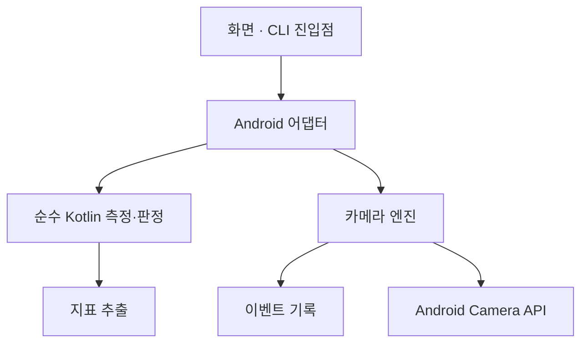
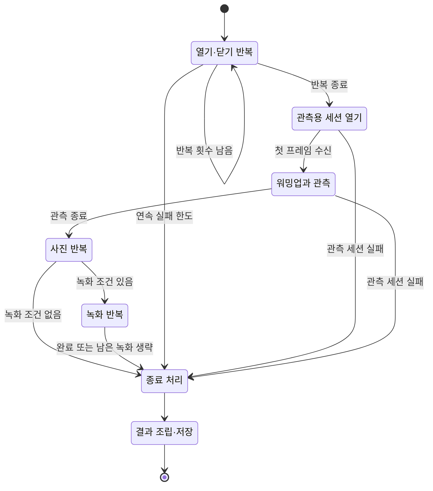
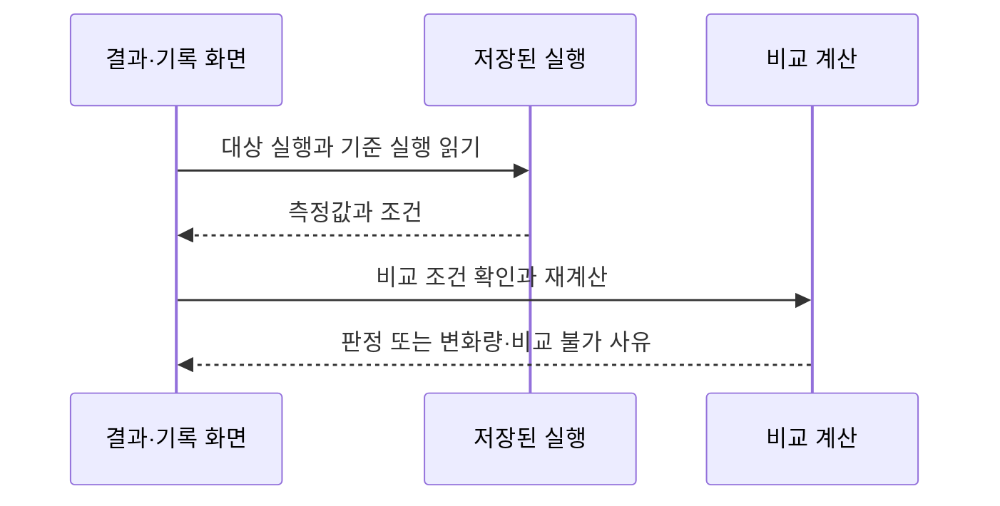
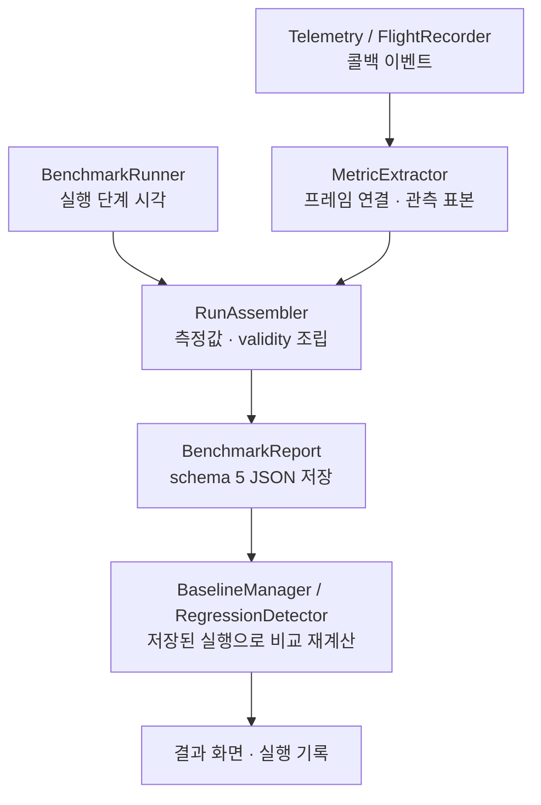
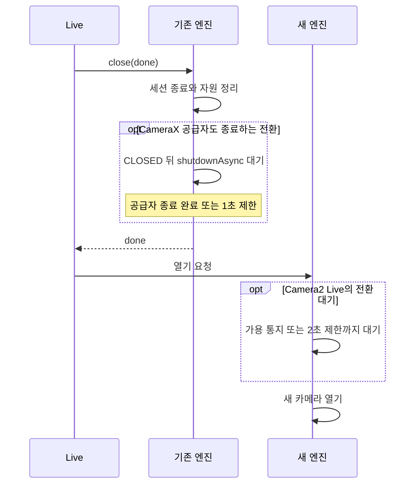
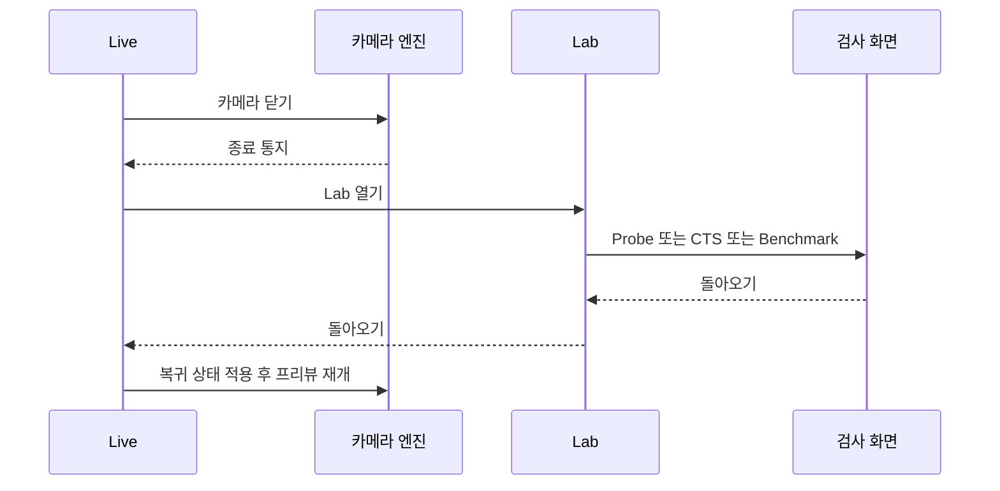
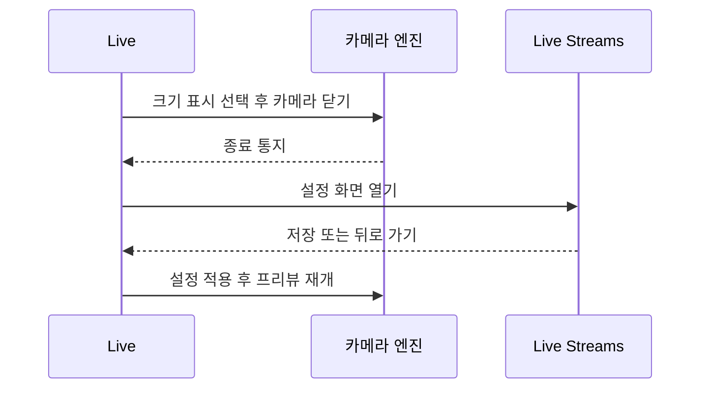

<h1 lang="en">One system. Clear responsibilities.</h1>

**수정할 기능과 연결된 코드부터 찾으세요.** 이 문서는 카메라 구동부터 이벤트 기록, 지표 계산, 결과 표시까지의 책임과 변경 시 지켜야 할 제약을 설명합니다.

| 지금 확인할 내용 | 이동할 절 |
| --- | --- |
| 앱의 전체 구조와 관측·비교 경로를 이해합니다. | [앱의 역할과 평가 경로](#앱의-역할과-평가-경로) |
| 수정할 패키지를 찾습니다. | [패키지별 역할](#패키지별-역할) |
| 측정값이 만들어지는 순서를 추적합니다. | [주요 실행 흐름](#주요-실행-흐름) |
| 카메라 종료와 스레드 제약을 확인합니다. | [생명주기와 스레드](#생명주기와-스레드) |
| 변경 후 지켜야 할 규칙과 검증 방법을 확인합니다. | [변경 시 지켜야 할 제약](#변경-시-지켜야-할-제약) |

아직 빌드하지 않았다면 [빠른 시작](getting-started.md)을 먼저 진행하세요. 아래의 `코드 확인`은 구현을 대조했다는 뜻이며, 기기 실측을 뜻하지 않습니다.

## 앱의 역할과 평가 경로

<!-- omm:begin id=overview -->

**카메라 콜백을 기록하고, 측정값으로 바꾼 뒤, 저장된 실행과 비교합니다.** 앱 모듈은 화면과 측정을 담당합니다. 별도 모듈인 `:ctsvendor`는 AOSP CTS 원문을 실행합니다.

| 순서 | 담당 코드 | 하는 일 |
| --- | --- | --- |
| 1. 카메라를 엽니다. | `CameraEngine` | Camera2 또는 CameraX로 카메라를 구동합니다. |
| 2. 콜백을 기록합니다. | `Telemetry`, `FlightRecorder` | 프레임과 메타데이터를 이벤트로 남깁니다. |
| 3. 측정값을 만듭니다. | `BenchmarkRunner`, `RunAssembler`, `MetricExtractor` | 실행 시각과 이벤트를 합쳐 지표를 계산합니다. |
| 4. 저장하고 비교합니다. | `BenchmarkReport`, `BaselineManager`, `RegressionDetector` | JSON을 저장하고 비교 결과를 계산합니다. |

화면은 다음 역할로 나뉩니다. 측정 결과는 앱 내부 파일에 저장하며 서버나 데이터베이스를 사용하지 않습니다.

| 화면 | 할 수 있는 일 |
| --- | --- |
| Live · `MainActivity` | 앱을 열면 나오는 화면입니다. 프리뷰를 보고 사진·동영상을 촬영합니다. |
| Lab · `WorkbenchActivity` | 기기 정보, 검사 도구, 저장된 결과와 설정을 엽니다. |
| Benchmark · `BenchmarkActivity` | 정해진 조건(profile)으로 측정하고 결과를 저장합니다. |
| 실행 기록 · `HistoryActivity` | 저장된 실행을 찾고 비교하거나 내보냅니다. |

PC에서 같은 기능을 실행하려면 [CLI](cli.md)를 사용합니다. `CliProvider`와 `CommandCoordinator`가 ADB 요청을 받아 화면이나 조회 기능에 연결합니다. Python 도구는 선택 사항입니다.

비교 기준을 고르는 방법은 [Benchmark](benchmark.md#비교-기준을-고르세요)에 있습니다. Live의 사진·동영상은 측정 파일과 별도로 저장합니다. 포맷과 폴더는 [저장 파일](engine.md#yuv-저장-포맷)을 확인하세요. 벤치마크 JSON과 incident ZIP에는 이미지 픽셀을 넣지 않습니다.

### 코드를 처음 읽는 순서

1. `camera/CameraEngine.kt`에서 열기·닫기 계약을 확인합니다.
2. `telemetry/Telemetry.kt`와 `FlightRecorder.kt`에서 이벤트와 보존 방식을 확인합니다.
3. `benchmark/domain/BenchmarkRunner.kt`에서 실행 순서와 실패 처리를 읽습니다.
4. `benchmark/domain/RunAssembler.kt`에서 실행 결과와 이벤트가 합쳐지는 지점을 확인합니다.
5. `MainActivity.kt`, `BenchmarkActivity.kt`, `HistoryActivity.kt`에서 화면과 실행 코드의 연결을 확인합니다.

근거와 검토 정보

- 근거 파일: `app/src/main/java/dev/halcamera/cli/CommandCoordinator.kt`, `tools/halcam/halcam/cli.py`, `app/src/main/java/dev/halcamera/MainActivity.kt`, `app/src/main/java/dev/halcamera/WorkbenchActivity.kt`, `app/src/main/java/dev/halcamera/camera/CameraEngine.kt`, `app/src/main/java/dev/halcamera/telemetry/Telemetry.kt`, `app/src/main/java/dev/halcamera/telemetry/FlightRecorder.kt`, `app/src/main/java/dev/halcamera/benchmark/domain/BenchmarkRunner.kt`, `app/src/main/java/dev/halcamera/benchmark/domain/RunAssembler.kt`, `app/src/main/java/dev/halcamera/benchmark/BenchmarkActivity.kt`, `app/src/main/java/dev/halcamera/benchmark/HistoryActivity.kt`, `app/src/main/java/dev/halcamera/benchmark/domain/RegressionDetector.kt`
- 근거 수준: 코드 확인
- 검토 2026-10-09 @ `cdfbf900` · Codex

<!-- omm:end id=overview -->

## 전체 구조도

화살표는 코드를 사용하는 방향입니다. 이벤트와 파일이 이동하는 순서는 [데이터 흐름](#이벤트와-결과가-전달되는-경로)에서 확인하세요.

그림을 클릭하면 확대 화면이 열립니다. 키보드에서는 Tab으로 그림을 선택한 뒤 Enter 또는 Space를 누르세요.

<!-- omm:begin id=overall-diagram -->

```mermaid
flowchart TB
    screens["화면 · CLI 진입점"] --> adapters["Android 어댑터"]
    adapters --> domain["순수 Kotlin 측정·판정"]
    adapters --> camera["카메라 엔진"]
    camera --> telemetry["이벤트 기록"]
    camera --> api["Android Camera API"]
    domain --> metrics["지표 추출"]
```

근거와 검토 정보

- 근거: `.omm/overall-architecture/diagram`
- 근거 수준: 코드 확인

<!-- omm:end id=overall-diagram -->

## 패키지별 역할

<!-- omm:begin id=module-roles -->

**변경할 기능의 패키지부터 여세요.** 아래 경로는 `app/src/main/java/dev/halcamera/`를 기준으로 합니다.

| 영역 | 하는 일 | 자세히 |
| --- | --- | --- |
| `cli/`, `assets/halcam.sh`, `tools/halcam/` | PC 명령을 앱 기능에 연결합니다. | [CLI](cli.md) |
| `camera/` | 카메라를 열고 촬영합니다. | [Engine](engine.md) |
| `metrics/` | 이벤트로 지표를 계산합니다. | [측정 흐름](#주요-실행-흐름) |
| `benchmark/` | 측정·저장·비교를 처리합니다. | [Benchmark](benchmark.md) |
| `telemetry/` | 이벤트를 기록하고 ZIP으로 내보냅니다. | [디버깅](troubleshooting.md) |
| `cts/` | 앱에서 카메라 검사를 실행합니다. | [CTS](cts.md) |
| `ctsvendor/` (별도 Gradle 모듈) | AOSP CTS 원문과 호환 패치를 담습니다. | [CTS 원문](cts.md#cts-원문-메서드를-선택하세요) |
| `ui/`와 `MainActivity.kt` | 화면과 공통 디자인을 구성합니다. | [Quickstart](getting-started.md) |

cli/, assets/halcam.sh, tools/halcam/

- shell 호출자 검사, 영속 요청 상태, artifact 등록과 PC 파일 수집을 담당합니다.
- 화면 어댑터 `LiveController`, `CtsController`, `BenchmarkController`도 이 패키지에 둡니다.
- Activity는 이 어댑터를 연결하며 카메라 엔진과 순수 benchmark/domain은 CLI를 알지 못합니다.
- `LiveController`는 프리뷰·사진·녹화를 연결하고 `CtsController.reportSaved`와 `BenchmarkController.reportSaved`는 결과와 보고서 파일을 스칼라로 받으므로 `cli/`는 benchmark·cts 결과 타입을 알지 못합니다.
- `streams`·`probe`·`cts.cases`는 화면 없이 `CommandCoordinator`가 직접 처리하며, 이때만 `cli/`가 카메라 스트림 지원 정보·`camera/CameraProbeReader`·`cts/` 카탈로그를 읽습니다.
- `CliStreams`는 요청별 크기 옵션을 검증하며 Camera2·CameraX 설정으로 변환합니다.
- protocol v1을 변경할 때 양쪽 검증기를 함께 확인합니다.

camera/

- 엔진 계약, Camera2·CameraX 구현, 엔드포인트 열거를 제공합니다.
- `close(done)` 완료 전에 다음 카메라를 열지 않습니다.
- 엔진 계약(`MediaCapture`, `LiveTuning`, `TouchMetering`)과 두 엔진의 구현, 두 엔진의 차이는 [Engine](engine.md)에 있습니다.
- 벤치마크 RECORD 단계의 recorder 상태 기계는 `BenchmarkRecorder`가 담당하고 `Camera2Engine`은 그 호출을 위임합니다.
- 카메라를 화면에 적는 이름(`Camera · 0 (Wide · Rear)`)도 이 패키지의 `CameraLabel` 하나가 만들며, Live·Benchmark·Probe·CTS가 모두 그것을 부릅니다.
- 렌즈 이름을 붙이지 못한 카메라에는 HAL이 보고한 35mm 환산 초점거리를 덧붙여 `Camera · 1 (Front · 26 mm)`처럼 적으므로, 전면 카메라가 둘인 기기에서도 목록이 두 항목을 구별합니다.
- Live의 Dual · P·Dual · V는 Camera2의 `DualPreviewSession` 또는 CameraX의 `DualCameraXSession`으로 후면 물리 카메라 두 개를 동시에 받습니다.
- 두 엔진의 줌은 두 출력에 공통 적용합니다. Camera2는 메인 센서의 노출·초점 제어와 한 요청으로 촬영하는 두 센서 사진을 지원합니다. CameraX는 메인 개별 제어와 두 센서 사진을 지원하지 않습니다.
- CameraX는 `ConcurrentCamera`의 물리 ID 선택과 `DualPreviewRelay`를 사용해 각 Preview를 화면과 개별 MP4 인코더에 전달합니다.

metrics/

- `MetricExtractor`가 이벤트를 관측 표본과 통계로 바꿉니다.
- 화면과 회귀 판정을 담당하지 않습니다.

benchmark/

- 루트에는 `BenchmarkActivity`·`HistoryActivity` 두 화면만 둡니다.
- `benchmark/domain/`은 profile, 러너, 지표 계산, validity, 비교 규칙, 보관 규칙, presenter를 담는 순수 Kotlin 층이며 `android.*`·`org.json`·`benchmark/platform/`을 import하지 않습니다.
- `benchmark/platform/`은 `BenchmarkStore`·`BenchmarkReport`(org.json 파일 경계)·`DeviceInstance`·`SubjectPrefs`·`BenchmarkPrefs`·`ThermalTracker`·`ProfileCompatibilityChecker`·`EnvironmentProbe`(배터리·발열·기기 식별 읽기) 같은 파일·기기 어댑터입니다.
- 이 방향은 `LayerIsolationTest`가 소스를 읽어 검사하므로 어기면 JVM 테스트가 실패합니다.

telemetry/

- `Telemetry`가 이벤트를 만들고 `FlightRecorder`가 보존합니다.
- `IncidentExporter`는 incident ZIP을 작성합니다.
- listener는 기록 스레드에서 동기 실행됩니다.

cts/

- CTS 스타일 카메라 검사를 앱 안에서 실행합니다.
- `CtsEntryActivity`에서 두 방식 중 하나를 고릅니다.
- 커스텀 케이스는 `CtsCatalog`가 목록을 순수 Kotlin으로 정의하고, `CtsRunner` 계약과 `CameraCaseRunner` 기반 클래스, 공통 Camera2 호출 `Camera2Ops` 위에 케이스별 하위 패키지(`onoff/`·`switching/`·`sizes/`·`combination/`·`snapshot/`)가 놓이며, `recording/`은 녹화 케이스들이 공유하는 규칙과 MediaRecorder 도우미입니다.
- 각 패키지는 판정을 순수 Kotlin `…Rules`에, 카메라 호출을 `…Runner`에 둡니다.
- `vendored/`는 `:ctsvendor` 모듈의 AOSP CTS 테스트를 JUnit으로 실행하는 화면입니다.
- 어느 쪽도 공식 CTS 판정을 대체하지 않습니다.

ctsvendor/ (별도 Gradle 모듈)

- AOSP `android16-release`의 camera2 CTS 소스(`RecordingTest`, `StillCaptureTest`, `BurstCaptureTest`, `Camera2SurfaceViewTestCase`, `CtsCameraUtils`, `com.android.ex.camera2`)를 그대로 두고, instrumentation 없이 돌도록 같은 이름의 `androidx.test` 대역과 `@TestApi` 치환 패치를 더한 모듈입니다.
- `VendoredCts`가 Instrumentation 대역과 host Activity를 등록하고, `VendoredRun`이 JUnit runner로 테스트 메서드 하나를 실행하며, `VendoredCatalog`가 reflection으로 `@Test` 메서드를 나열합니다.
- 패치 목록과 재동기화 절차는 `ctsvendor/UPSTREAM.md`에 있습니다.

ui/와 MainActivity.kt

- Live 관측값과 결과 비교 막대, 공통 `Look` 토큰과 접기·펼치기, 카메라 선택과 권한 처리를 제공합니다.

저장·목록·썸네일 구현

`BenchmarkActivity`는 실행 완료 후 별도 입출력 스레드에서 조립·저장·비교를 처리하고 `ResultPresenter`와 `ComparePresenter`의 결과를 표시합니다. 시작 카드와 진행률에는 `StartCardPresenter`와 `ProgressPresenter`를 사용합니다.

`HistoryActivity`는 같은 저장소를 읽습니다. `RunIndex`는 이벤트와 표본 배열을 제거한 목록 데이터를 유지하고, 결과를 열 때 원본 JSON을 다시 읽습니다. 파일 읽기·삭제·CSV 생성은 별도 스레드에서 처리합니다. `BenchmarkCsv`는 지표당 한 행을 작성하고 FileProvider로 공유합니다.

`BenchmarkReport`는 schema 5를 쓰고 schema 3·4·5를 읽습니다. `BenchmarkStore`는 실행 파일과 baseline 인덱스를 관리합니다. 인덱스는 측정 계약·endpoint마다 baseline 실행 목록을 저장합니다. 삭제한 실행은 목록에서 빼며, 기존 실행 JSON은 비교 상태가 바뀌어도 다시 쓰지 않습니다.

`camera/MediaLibrary`는 두 엔진이 만든 사진 쌍과 동영상을 MediaStore에 저장합니다. 사진 쌍을 만드는 순서는 엔진마다 다르며 [Engine](engine.md)에 있습니다. `GalleryActivity`는 HALCamera 앨범을 조회합니다. 미디어 저장은 벤치마크 지표 계산과 분리되어 있습니다.

저장 포맷과 폴더는 [Engine의 저장 파일 표](engine.md#yuv-저장-포맷)를 확인하세요. `OriginalYuv`가 NV21의 샘플과 plane 배치를 준비하고 `MediaLibrary`가 파일과 JSON을 저장합니다. Camera2의 RAW (DNG)는 `RawFrame`이 RAW 샘플을 복사하고 `DngOutput`이 `DngCreator`로 `_RAW.dng`를 씁니다.

`camera/RecentMediaThumbnail`은 저장 완료된 앨범 항목의 썸네일을 별도 작업 스레드에서 읽고 `ui/RecentMediaButton`에 전달합니다. 화면을 나가면 관찰을 중단하고 뒤늦은 조회 결과는 반영하지 않습니다. `ui/RecentMediaButton`은 받은 썸네일을 원형으로 그리며, 항목이 동영상이면 가운데에 재생 표시를 겹쳐 접근성 설명뿐 아니라 화면으로도 종류를 알 수 있게 합니다.

근거와 검토 정보

- 근거 파일: `app/src/main/java/dev/halcamera/cli/CommandCoordinator.kt`, `app/src/main/java/dev/halcamera/cli/LiveController.kt`, `app/src/main/java/dev/halcamera/cli/BenchmarkController.kt`, `app/src/main/java/dev/halcamera/camera/CameraEngine.kt`, `app/src/main/java/dev/halcamera/camera/BenchmarkRecorder.kt`, `app/src/main/java/dev/halcamera/benchmark/platform/EnvironmentProbe.kt`, `app/src/main/java/dev/halcamera/benchmark/BenchmarkActivity.kt`, `app/src/main/java/dev/halcamera/benchmark/HistoryActivity.kt`, `app/src/main/java/dev/halcamera/benchmark/domain/RunIndex.kt`, `app/src/main/java/dev/halcamera/benchmark/domain/BenchmarkCsv.kt`, `app/src/main/java/dev/halcamera/benchmark/platform/BenchmarkReport.kt`, `app/src/main/java/dev/halcamera/benchmark/domain/BenchmarkReportCodec.kt`, `app/src/main/java/dev/halcamera/telemetry/FlightRecorder.kt`, `app/src/main/java/dev/halcamera/MainActivity.kt`, `app/src/main/java/dev/halcamera/camera/RecentMediaThumbnail.kt`, `app/src/main/java/dev/halcamera/ui/RecentMediaButton.kt`, `app/src/main/java/dev/halcamera/ui/Look.kt`, `app/src/main/java/dev/halcamera/cts/recording/BasicRecordingRules.kt`, `app/src/main/java/dev/halcamera/cts/CtsEntryActivity.kt`, `app/src/main/java/dev/halcamera/cts/vendored/VendoredCaseActivity.kt`, `app/src/main/java/dev/halcamera/cts/vendored/VendoredCtsListActivity.kt`, `app/src/main/java/dev/halcamera/cts/CtsCaseActivity.kt`, `app/src/main/java/dev/halcamera/cts/CtsCaseListActivity.kt`, `app/src/main/java/dev/halcamera/cts/suite/CtsChecklistActivity.kt`, `app/src/main/java/dev/halcamera/cts/suite/CtsSuiteRunActivity.kt`, `app/src/main/java/dev/halcamera/cts/suite/SuitePlan.kt`, `app/src/main/java/dev/halcamera/cts/suite/SuiteReport.kt`, `app/src/main/java/dev/halcamera/cts/CtsCatalog.kt`, `app/src/main/java/dev/halcamera/cts/CtsRunner.kt`, `app/src/main/java/dev/halcamera/cts/CameraCaseRunner.kt`, `app/src/main/java/dev/halcamera/cts/Camera2Ops.kt`, `app/src/main/java/dev/halcamera/cts/onoff/FastOnOffRules.kt`, `app/src/main/java/dev/halcamera/cts/switching/SwitchingRules.kt`, `app/src/main/java/dev/halcamera/cts/sizes/AllSizeOnOffRules.kt`, `app/src/main/java/dev/halcamera/cts/combination/StillPreviewCombinationRules.kt`, `app/src/main/java/dev/halcamera/cts/snapshot/VideoSnapshotRules.kt`, `app/src/main/java/dev/halcamera/CameraProbeActivity.kt`, `app/src/main/java/dev/halcamera/camera/CameraProbe.kt`, `app/src/main/java/dev/halcamera/camera/CameraProbeReader.kt`
- 근거 수준: 코드 확인
- 검토 2026-10-09 @ `cdfbf900` · Codex

<!-- omm:end id=module-roles -->

## 주요 실행 흐름

<!-- omm:begin id=runtime-flow -->

**실행 실패는 러너 결과에서, 측정값의 차이는 이벤트와 계산 규칙에서 확인하세요.** 벤치마크의 입력은 카메라 콜백 이벤트와 러너가 기록한 실행 시각입니다.

이 절은 데이터가 지나가는 경로만 설명합니다.

각 화면을 어떻게 읽고 조작하는지는 해당 화면을 담당하는 문서에 있습니다.

결과 화면과 실행 기록은 [Benchmark](benchmark.md), 사양 표는 [Probe](probe.md), 케이스 실행과 판정은 [CTS](cts.md), 프레임별 그래프는 [Callback](callback.md), ADB 명령의 사용법은 [CLI](cli.md)에서 확인하세요. Live 조작은 [빠른 시작](getting-started.md)에 있습니다.

배치·간격·애니메이션·접근성 문구 같은 앱의 조작 규칙은 [APP-UI.md](https://github.com/TTolsun/hal-camera/blob/main/docs/design/APP-UI.md)가 관리합니다.

Live 셔터 조작은 `MainActivity`에서 선택한 엔진의 촬영·녹화 동작으로 이어집니다. 벤치마크는 별도 화면인 `BenchmarkActivity`가 준비를 마친 뒤 `BenchmarkRunner.start()`를 호출하여 시작합니다. `Telemetry.callback(...)`이 반환한 Camera2 콜백의 `onCaptureStarted`는 프레임워크 신호를 기록하며, Live 셔터와 벤치마크 시작을 연결하는 메서드가 아닙니다.

### 실행에서 저장까지

**사전 확인이 끝나면 열기·닫기를 반복한 뒤, 별도 세션에서 관측·촬영합니다.** 아래는 세부 Step을 묶은 상태도이며 화면의 Phase와 일대일 대응하지 않습니다.

```mermaid
stateDiagram-v2
    state "열기·닫기 반복" as Launch
    state "관측용 세션 열기" as Open
    state "워밍업과 관측" as Observe
    state "사진 반복" as Still
    state "녹화 반복" as Record
    state "종료 처리" as Close
    state "결과 조립·저장" as Save
    [*] --> Launch
    Launch --> Launch: 반복 횟수 남음
    Launch --> Open: 반복 종료
    Open --> Observe: 첫 프레임 수신
    Observe --> Still: 관측 종료
    Still --> Record: 녹화 조건 있음
    Still --> Close: 녹화 조건 없음
    Record --> Close: 완료 또는 남은 녹화 생략
    Launch --> Close: 연속 실패 한도
    Open --> Close: 관측 세션 실패
    Observe --> Close: 관측 세션 실패
    Close --> Save
    Save --> [*]
```

| 조건 | 처리 |
| --- | --- |
| 열기·닫기 한 사이클 | OPEN → CONFIGURE → FIRST_FRAME → CYCLE_CLOSE를 수행합니다. 프로세스를 새로 시작하는 cold launch가 아닙니다. |
| 열기 사이클이 한 번 실패합니다. | 실패를 기록하고 다음 사이클로 진행합니다. 연속 실패 한도에 이르면 조기 종료합니다. |
| 사진이나 녹화의 한 반복이 실패합니다. | 실패 표본을 남깁니다. 녹화 미지원 또는 녹화 연속 실패 한도에 이르면 남은 녹화를 생략합니다. |
| 실행 중 중단을 요청합니다. | 진행 중인 단계의 정리와 종료 처리를 거쳐 결과를 남깁니다. 그림의 각 단계에서 가능한 경로입니다. |
| 닫기 콜백이 오지 않습니다. | 기본 5초 뒤 종료 실패를 기록하고 진행합니다. 실제 종료 통지를 받은 경우와 구분하여 `close_completed=false`를 남깁니다. |

관측용 추가 열기는 시작 지표의 반복 횟수에 포함하지 않습니다. 녹화는 RECORD_PREPARE → RECORD_START → RECORD_RUN → RECORD_STOP을 반복합니다.

`RunAssembler`는 러너 결과와 이벤트로 측정값·validity를 계산하고, `BenchmarkReport`가 실행 JSON을 저장합니다. 저장 직후 `RunRetention`이 보관 정책을 적용하며 baseline 집합의 실행은 보호합니다. 비교는 아래처럼 따로 계산합니다.

이벤트·표본·진단 정보

`Telemetry.callback()`은 `capture_started`, `request_observed`, `capture_result`, `capture_failed`, `buffer_lost`를 기록합니다.

콜백의 `alive()`가 거짓이면 이미 닫힌 세션의 늦은 이벤트를 버립니다.

`request_observed`는 요청 제출 시각이 아니라 `onCaptureStarted`에서 관측한 요청 내용입니다.

Live 제어를 확인할 수 있도록 `request_observed`에는 요청한 줌·EV·AE 잠금·플래시 모드·AF/precapture trigger를, `capture_result`에는 적용된 AE 잠금·EV·플래시 상태와 논리 카메라가 알려 주는 물리 카메라 ID(API 29 이상)를 함께 기록합니다.

Live 제어, AE 재잠금, 터치 측광이 남기는 이벤트는 [Engine](engine.md#두-엔진이-함께-남기는-기록)에 있습니다.

러너는 API 호출과 완료 신호 사이의 시각 차이를 기록합니다. `RunAssembler`는 관측 세션의 프레임 중 관측 시작 이전에 도착한 프레임 수를 워밍업으로 계산합니다. `MetricExtractor`가 이벤트를 표본으로 연결하고, `BenchmarkEvaluator`가 profile에 따라 초기 반복을 제외하고 통계를 계산합니다. 3A 수렴은 관측 세션의 첫 결과부터 계산합니다.

`RunAssembler.ObservationInput.observedFrames`는 워밍업을 제외한 `steadyFrames`의 수입니다. 이 값은 `RunValidityEvaluator`의 표본 수 검사에 전달됩니다. `RunAssembler`가 구성한 `BenchmarkRun`은 `BenchmarkReportCodec`에서 schema 5로 직렬화하며, 파일 쓰기는 조립기 밖에서 처리합니다.

`BenchmarkActivity`는 `LaunchDiagnostics`의 조회 함수를 러너에 주입합니다.

러너는 launch 사이클의 열기 전과 닫기 처리 후에 CPU 주파수 정책·thermal 상태·조회 시작과 종료 시각을 수집하여 `raw.launch_cycles[].diagnostics`에 보존합니다.

닫기 타임아웃은 `close_completed=false`로 구분합니다.

읽지 못한 값은 미확인 상태로 남으며, 이 선택적 진단 정보는 지표·validity·baseline 판정의 입력이 아닙니다.

조회 시간은 측정 구간 밖에 있지만 사이클 간 간격과 기기 상태에는 영향을 줄 수 있습니다.

수집·분석 절차와 기기별 검증 결과는 [launch 진단 기록](https://github.com/TTolsun/hal-camera/blob/main/docs/validation/launch-diagnostics.md)에 있습니다.

### 저장된 실행을 다시 계산하는 경로

`RegressionDetector`는 두 실행의 측정 계약·endpoint·validity·환경 조건을 확인합니다. baseline 집합이나 두 실행 비교에서 먼저 선택한 실행을 기준으로 삼으면 회귀 판정을 표시합니다. 집합이면 집합 값의 범위를 벗어난 지표만 저하나 개선으로 판정합니다. 이전 실행을 자동 선택한 reference 비교에서는 변화량과 비교 불가 사유만 표시합니다. 단위가 다르면 각 단위를 유지하고 백분율을 표시하지 않습니다.

**실행 JSON에는 비교 결과를 저장하지 않습니다.** 결과 화면과 실행 기록은 저장된 측정값으로 비교를 다시 계산합니다.

```mermaid
sequenceDiagram
    participant U as 결과·기록 화면
    participant F as 저장된 실행
    participant C as 비교 계산
    U->>F: 대상 실행과 기준 실행 읽기
    F-->>U: 측정값과 조건
    U->>C: 비교 조건 확인과 재계산
    C-->>U: 판정 또는 변화량·비교 불가 사유
```

기준 선택과 판정의 의미는 [Benchmark](benchmark.md)에서 확인하세요.

### Live에서 촬영과 저장

Live 셔터는 현재 엔진의 `MediaCapture`로 사진이나 동영상을 저장하며, 촬영을 위해 엔진을 바꾸지 않습니다. 기본 사진은 YUV·JPEG 쌍이며 두 엔진 모두 Live 스트림에서 켠 출력만 저장할 수도 있습니다. 저장은 별도 작업 스레드에서 처리하고, 완료된 파일만 앨범에 공개합니다. 엔진별 요청 구성과 저장 순서는 [Engine](engine.md)에 있습니다.

Lab은 `WorkbenchActivity`가 담당하며 카메라를 직접 열지 않습니다. Live의 `close(done)`이 끝나면 Lab을 엽니다. 선택한 카메라 ID는 Probe와 Benchmark에, 엔진은 Benchmark에 전달합니다.

녹화·저장·세션 종료·CLI 작업 중에는 Lab 버튼을 비활성화합니다. Live Streams도 카메라를 닫은 뒤 열며, 저장하거나 뒤로 가면 진입한 화면으로 돌아갑니다. 화면 조작은 [Quickstart](getting-started.md#추가-설정)를 확인하세요.

### 갤러리 항목의 조회 경로

촬영 화면의 최근 썸네일은 MediaStore에서 HALCamera의 저장 완료 항목만 조회합니다. 파일 저장과 화면 복귀 시 백그라운드에서 갱신하며 항목이 없거나 읽기에 실패하면 갤러리 아이콘을 표시합니다. 촬영 화면을 벗어나면 변경 감시를 중단하므로 뒤늦게 도착한 조회 결과는 반영하지 않습니다.

`GalleryActivity`도 HALCamera 앨범만 조회합니다. 공유 Intent에는 선택한 URI와 읽기 권한만 전달하며, 삭제는 Android 11 이상에서 `MediaStore.createDeleteRequest()`의 시스템 확인을 거칩니다. 2,000개를 넘는 선택은 2,000개 이하로 나누어 순서대로 시스템 확인을 요청합니다. 격자 열 수, 필터, 상세 화면의 확대와 탐색 같은 조작 규칙은 `APP-UI.md`에 있습니다.

### CLI 요청과 결과 수집

CLI 명령은 ADB와 `CliProvider`를 거쳐 `CommandCoordinator`에 접수됩니다.

요청 ID와 내용을 먼저 저장하고 `LiveController`, `CtsController`가 화면의 카메라·CTS suite 동작을 실행합니다.

사진은 켜진 출력 이미지의 저장 완료, CTS suite는 보고서 JSON·텍스트 쓰기 완료 후 artifact를 등록합니다.

`benchmark.run`은 Live 카메라 종료 뒤 벤치마크 화면으로 인계하며, `BenchmarkController`가 기존 Runner 실행과 JSON 저장 완료를 요청 결과에 연결합니다.

`cameras`·`streams`·`probe`·`cts.cases`는 화면을 거치지 않고 coordinator가 처리합니다.

스트림 지원 조회와 probe 파일 작업은 IO 스레드에서 실행하며, probe 파일은 요청별 `files/cli/artifacts/<request_id>/`에 두었다가 기록 정리와 함께 지웁니다.

접수·완료·파일 회수의 순서는 [CLI 요청 흐름](cli.md#요청과-완료를-구분하세요)에 있습니다.

PC는 요청 상태를 조회하고 완료된 artifact의 크기와 SHA-256을 확인합니다. 같은 요청 ID와 같은 내용은 기존 결과를 반환하며 새로운 촬영을 시작하지 않습니다. 명령 사용법과 전송 실패 대응은 [CLI](cli.md)에 있습니다.

앱을 열 때는 투명한 `CliLaunchActivity`가 main thread에서 작업 상태를 다시 확인합니다. 실행 중인 작업이 있으면 Live로 전환하지 않습니다. 상태 조회는 `CommandStore`의 메모리 snapshot을 읽으며 파일 기록은 상태 전환 때만 수행합니다.

근거와 검토 정보

- 근거 파일: `app/src/main/java/dev/halcamera/cli/CliProvider.kt`, `app/src/main/java/dev/halcamera/cli/CommandCoordinator.kt`, `tools/halcam/halcam/cli.py`, `tools/halcam/halcam/download.py`, `app/src/main/java/dev/halcamera/MainActivity.kt`, `app/src/main/java/dev/halcamera/GalleryActivity.kt`, `app/src/main/java/dev/halcamera/camera/MediaLibrary.kt`, `app/src/main/java/dev/halcamera/camera/RecentMediaThumbnail.kt`, `app/src/main/java/dev/halcamera/telemetry/Telemetry.kt`, `app/src/main/java/dev/halcamera/telemetry/FlightRecorder.kt`, `app/src/main/java/dev/halcamera/metrics/MetricExtractor.kt`, `app/src/main/java/dev/halcamera/benchmark/domain/BenchmarkRunner.kt`, `app/src/main/java/dev/halcamera/benchmark/domain/RunAssembler.kt`, `app/src/main/java/dev/halcamera/benchmark/domain/RunValidity.kt`, `app/src/main/java/dev/halcamera/benchmark/domain/RunRetention.kt`, `app/src/main/java/dev/halcamera/benchmark/platform/BenchmarkReport.kt`, `app/src/main/java/dev/halcamera/benchmark/domain/BenchmarkReportCodec.kt`, `app/src/main/java/dev/halcamera/benchmark/domain/BenchmarkEvaluator.kt`, `app/src/main/java/dev/halcamera/benchmark/BenchmarkActivity.kt`, `app/src/main/java/dev/halcamera/benchmark/platform/LaunchDiagnostics.kt`, `app/src/main/java/dev/halcamera/benchmark/domain/RegressionDetector.kt`
- 근거 수준: 코드 확인
- 검토 2026-10-09 @ `cdfbf900` · Codex

<!-- omm:end id=runtime-flow -->

### 이벤트와 결과가 전달되는 경로

<!-- omm:begin id=runtime-diagram -->

```mermaid
graph TB
    events["Telemetry / FlightRecorder<br/>콜백 이벤트"] --> frames["MetricExtractor<br/>프레임 연결 · 관측 표본"]
    marks["BenchmarkRunner<br/>실행 단계 시각"] --> assemble["RunAssembler<br/>측정값 · validity 조립"]
    frames --> assemble
    assemble --> json["BenchmarkReport<br/>schema 5 JSON 저장"]
    json --> compare["BaselineManager / RegressionDetector<br/>저장된 실행으로 비교 재계산"]
    compare --> screen["결과 화면 · 실행 기록"]
```

근거와 검토 정보

- 근거: `.omm/data-flow/diagram`
- 근거 수준: 코드 확인

<!-- omm:end id=runtime-diagram -->

## 생명주기와 스레드

### 카메라 열기와 닫기

**Live는 기존 엔진의 종료 통지를 받은 뒤 새 엔진을 엽니다.** 종료 통지와 카메라 서비스의 가용 상태는 다를 수 있습니다. 아래는 Live의 전환 순서이며, BenchmarkRunner의 종료 제한 시간은 [실행 흐름](#실행에서-저장까지)에서 따로 설명합니다.

<!-- omm:begin id=lifecycle-diagram -->

```mermaid
sequenceDiagram
    participant L as Live
    participant O as 기존 엔진
    participant N as 새 엔진
    L->>O: close(done)
    O->>O: 세션 종료와 자원 정리
    opt CameraX 공급자도 종료하는 전환
        O->>O: CLOSED 뒤 shutdownAsync 대기
        Note over O: 공급자 종료 완료 또는 1초 제한
    end
    O-->>L: done
    L->>N: 열기 요청
    opt Camera2 Live의 전환 대기
        N->>N: 가용 통지 또는 2초 제한까지 대기
    end
    N->>N: 새 카메라 열기
```

근거와 검토 정보

- 근거: `.omm/state-transitions/diagram`
- 근거 수준: 코드 확인

<!-- omm:end id=lifecycle-diagram -->

### 스레드별 작업

| 실행 위치 | 현재 확인한 역할 |
| --- | --- |
| `MainActivity`의 메인 Handler | 화면 갱신을 처리합니다. 카메라 작업용 `cameraWorker`, 입출력용 `io`와 구분합니다. |
| `BenchmarkActivity`의 `io` 실행기 | `finishRun()`에서 결과 조립, 파일 저장, 기준 실행 읽기와 비교를 수행합니다. |
| `BenchmarkActivity`의 메인 Handler | 비교가 끝나면 결과 화면을 표시합니다. |

카메라 콜백 전체의 실행 스레드와 종료 순서는 아직 정리하지 않았습니다. 관련 코드를 바꿀 때는 콜백이 어느 스레드에서 호출되는지 별도로 확인해야 합니다.

### 아직 정리하지 않은 리소스 계약

세션, Surface, 버퍼의 소유권과 해제 시점은 **확인 필요**입니다. 구현을 수정하기 전에 `CameraEngine`의 단일 점유 규칙과 `close(done)` 완료 조건부터 확인하세요.

## 공통 UI의 상태와 전환

이 절은 카메라 이름, 화면 이동, 줌의 동작 조건을 설명합니다. [APP-UI.md](https://github.com/TTolsun/hal-camera/blob/main/docs/design/APP-UI.md)의 사본과 함께 관리하며, 근거 코드가 바뀌면 표와 그림을 다시 대조합니다.

### 카메라 이름을 적는 방법

<!-- omm:begin id=camera-label-diagram -->

`CameraLabel`은 같은 카메라를 모든 화면에서 같은 이름으로 표시합니다.

| 확인할 값 | 이름에 넣는 규칙 |
| --- | --- |
| 카메라 키 | `0`, `1`, `0.2`를 이름 앞에 넣습니다. |
| 렌즈 역할 | 알려진 경우 `Wide`, `UWide`, `Tele` 등을 넣습니다. |
| 방향 | HAL의 `LENS_FACING`을 우선합니다. 값이 없으면 FRONT 역할만 `Front`로 표시합니다. |
| 초점거리 | 렌즈 역할 칸이 비어 있고 35mm 환산값이 있으면 1mm 단위로 반올림해 넣습니다. |
| 완성된 이름 | 채운 값만 괄호로 묶습니다. 예: `Camera · 1 (Front · 26 mm)`. 값이 없으면 `Camera · 0`처럼 키만 표시합니다. |

근거와 검토 정보

- 근거: `.omm/ui-camera-label/description`
- 근거 수준: 코드 확인

<!-- omm:end id=camera-label-diagram -->

### 도구 화면으로 넘어가는 순서

Live에서 Lab으로 갈 때는 카메라가 닫힐 때까지 기다립니다. Lab에서 Probe를 열 때는 카메라를 새로 열지 않습니다.

<!-- omm:begin id=tool-handoff-diagram -->

```mermaid
sequenceDiagram
    participant L as Live
    participant E as 카메라 엔진
    participant W as Lab
    participant T as 검사 화면
    L->>E: 카메라 닫기
    E-->>L: 종료 통지
    L->>W: Lab 열기
    W->>T: Probe 또는 CTS 또는 Benchmark
    T-->>W: 돌아오기
    W-->>L: 돌아오기
    L->>E: 복귀 상태 적용 후 프리뷰 재개
```

근거와 검토 정보

- 근거: `.omm/ui-tool-handoff/diagram`
- 근거 수준: 코드 확인

<!-- omm:end id=tool-handoff-diagram -->

Live Streams는 Lab을 거치지 않습니다.

```mermaid
sequenceDiagram
    participant L as Live
    participant E as 카메라 엔진
    participant S as Live Streams
    L->>E: 크기 표시 선택 후 카메라 닫기
    E-->>L: 종료 통지
    L->>S: 설정 화면 열기
    S-->>L: 저장 또는 뒤로 가기
    L->>E: 설정 적용 후 프리뷰 재개
```

### 줌 컨트롤의 상태

<!-- omm:begin id=zoom-diagram -->

**현재 배율을 누르면 지원 배율이 펼쳐집니다.** 처음에는 현재 배율 하나만 보입니다.

| 조건 | 동작 |
| --- | --- |
| 지원 배율이 2개 이상이고 현재 배율을 누릅니다. | 모든 지원 배율이 펼쳐집니다. |
| 펼친 상태에서 배율을 고르거나 포커스를 옮깁니다. | 접기 타이머를 다시 시작합니다. |
| 마지막 조작 후 3초가 지납니다. | 접힙니다. API 29 이상에서는 접근성 권장 시간에 따라 더 기다릴 수 있습니다. |
| 가로로 드래그합니다. | 드래그하는 동안 접기 타이머를 멈춥니다. |
| TalkBack이 켜져 있습니다. | 자동으로 접히지 않으며, 배율을 고르면 바로 접힙니다. |
| 컨트롤이 비활성화됩니다. | 애니메이션 없이 접힙니다. |

펼침 애니메이션은 260ms, 접힘은 220ms입니다. 시스템 애니메이션이 꺼져 있으면 즉시 바뀝니다.

근거와 검토 정보

- 근거: `.omm/ui-zoom/description`
- 근거 수준: 코드 확인

<!-- omm:end id=zoom-diagram -->

## 변경 시 지켜야 할 제약

<!-- omm:begin id=constraints -->

**카메라 점유, 시계, 계산 로직의 경계를 유지하세요.** 이 규칙을 바꾸면 실행 순서나 측정값의 의미가 달라질 수 있습니다.

### 실행과 측정의 제약

1. 카메라를 점유하는 `CameraEngine`은 하나만 유지합니다. `close(done)`은 기기를 실제로 반환한 뒤 완료 콜백을 호출해야 합니다.
2. 앱의 시각은 `elapsedRealtimeNanos`를 사용합니다. 센서 시각은 기기가 `SENSOR_INFO_TIMESTAMP_SOURCE_REALTIME`을 보고할 때만 앱 시각과 직접 비교합니다.
3. 카메라 열거에는 공개 Camera2 API만 사용합니다. 논리 카메라의 물리 endpoint를 독립적으로 열 수 있다고 가정하지 않습니다.
4. 벤치마크 JSON과 incident ZIP에는 관측 이벤트·메타데이터를 저장하며 이미지 픽셀을 저장하지 않습니다.

### 계산과 저장의 제약

1. `BenchmarkRunner`는 `Driver`, `Scheduler`, `clock`을 통해 카메라와 시계에 접근합니다. 지표·통계·회귀 계산은 `benchmark/domain/`과 `metrics/`에 두어 JVM에서 테스트하며, Android 화면은 Activity와 `ui/`, 파일·기기 어댑터는 `benchmark/platform/`에 둡니다. 새 파일에 `android.*` import가 필요하면 역할에 맞는 경계에 두거나 인터페이스로 주입합니다.
2. 벤치마크의 `org.json`은 파일 경계에서 사용합니다. `BenchmarkReportCodec`의 데이터 계약은 `Map<String, Any?>`로 전달합니다. schema 5를 쓰되 schema 3·4도 읽습니다. CLI protocol v1은 별도로 JSON 명령·상태를 정의하며 측정 보고서 schema를 바꾸지 않습니다.
3. `RunValidity`는 flag 규칙에서 measurement·comparison·scoring eligibility를 계산합니다. 알 수 없는 flag는 비교를 막습니다. 내부 점수 초안은 제거했으며(이슈 #162), scoring eligibility는 충전·디버그 빌드 같은 flag가 없는 run을 표시하는 용도로만 남습니다.
4. 회귀 임계값은 `RegressionRules`에서 관리합니다. baseline은 자동으로 지정하지 않으며 임의의 두 실행을 고르는 동작도 baseline을 바꾸지 않습니다.
5. 파일 삭제 실패 시 baseline 목록에서 먼저 빼지 않습니다. 목록 정리 실패 후 남은 잘못된 참조는 `BaselineManager`가 이후 조회에서 정리합니다.

Live의 사진·동영상만 이미지 픽셀을 저장합니다. Android 8–9에서는 저장소 권한을, 소리를 포함한 녹화에는 마이크 권한이 필요합니다. CLI의 무음 녹화에는 마이크 권한이 필요하지 않습니다. 벤치마크의 StreamSpec과 메타데이터 전용 내보내기 계약은 유지합니다.

### CLI의 접근과 완료 경계

`CliProvider`는 각 진입점에서 shell UID 2000과 DUMP 권한을 검사합니다. 호출자 확인 전에는 Binder identity를 해제하지 않습니다. 파일 접근은 CLI 요청이 등록한 artifact ID에 한정하며 임의 경로나 쓰기 모드를 받지 않습니다.

명령은 동작 전에 저장하며 한 번에 하나의 변경 작업을 처리합니다. 사진·MP4 저장, CTS suite 보고서 쓰기를 마친 뒤 결과 파일을 등록합니다. 녹화 시작 응답과 최종 저장 완료를 구분하며, 종료 명령은 활성 녹화 요청을 제어하므로 BUSY 상태에서도 실행합니다. `cts.run`의 항목 키는 접수 시점에 카탈로그와 대조해 알 수 없는 키를 `UNKNOWN_CASE`로 거부하고, 마이크가 필요한 항목의 권한은 요청하지 않고 `PERMISSION_REQUIRED`로 끝냅니다. 프로세스가 종료된 미완료 요청은 재실행하지 않습니다. CLI 기록 정리와 원본 사진·동영상 삭제는 서로 다른 동작입니다. `benchmark.run`은 고정된 `camera2-standard-v2` 프로파일만 받으며 Live 엔진·스트림 옵션을 거부합니다. Live 카메라 종료 후 벤치마크 화면으로 이동하고 기존 측정·판정 규칙을 유지합니다.

근거와 검토 정보

- 근거 파일: `app/src/main/java/dev/halcamera/cli/CliProvider.kt`, `app/src/main/java/dev/halcamera/cli/CommandCoordinator.kt`, `app/src/main/java/dev/halcamera/cli/CommandStore.kt`, `app/src/main/java/dev/halcamera/camera/CameraEngine.kt`, `app/src/main/java/dev/halcamera/camera/CameraEndpointResolver.kt`, `app/src/main/java/dev/halcamera/telemetry/IncidentExporter.kt`, `app/src/main/java/dev/halcamera/benchmark/domain/BenchmarkRunner.kt`, `app/src/main/java/dev/halcamera/benchmark/domain/RunValidity.kt`, `app/src/main/java/dev/halcamera/benchmark/domain/RegressionRules.kt`, `app/src/main/java/dev/halcamera/benchmark/platform/BenchmarkReport.kt`, `app/src/main/java/dev/halcamera/benchmark/domain/BenchmarkReportCodec.kt`, `app/src/main/java/dev/halcamera/benchmark/platform/BenchmarkStore.kt`, `app/src/main/java/dev/halcamera/benchmark/domain/BenchmarkIndex.kt`, `app/src/main/java/dev/halcamera/benchmark/domain/AtomicFiles.kt`
- 근거 수준: 코드 확인
- 검토 2026-10-09 @ `cdfbf900` · Codex

<!-- omm:end id=constraints -->

## 변경 후 검증

Android 의존성이 없는 러너와 평가 로직은 JVM 단위 테스트로 확인할 수 있습니다. 저장소 루트에서 실행하세요.

테스트 실행 명령과 개발 환경은 [빠른 시작](getting-started.md#앱을-빌드하고-실행하세요)을 확인하세요.

`BenchmarkRunnerTest`, `RunAssemblerTest`, `RegressionDetectorTest`, `MetricExtractorTest`에서 단계 전이와 계산 규칙을 확인합니다. 테스트가 통과해도 문서의 조건·예외가 코드와 맞는지 대조해야 합니다. 기기에서의 검증은 별도로 기록합니다.

## 미완성 기능과 추가 검증

<!-- omm:begin id=open-questions -->

다음 항목은 구조 스캔에서 확인한 제약이나 추가 검증이 필요한 사항입니다.

- 콜백과 파일 작업의 실행 스레드, close 완료와 늦은 신호 처리는 변경 시 함께 검증해야 합니다.
- 실행 기록의 화면 배치·공유·삭제 동작은 기기 검증이 추가로 필요합니다.
- 촬영 중 프리뷰 stall 지표 2.7은 여전히 NOT_RUN입니다.

**후속 작업**

1. 실행 기록의 필터·임의 비교·baseline·삭제·공유 동작을 기기에서 검증하고 근거를 남깁니다.
2. 촬영 중 프리뷰 stall 지표 2.7의 관측·계산 규칙을 구현합니다.

근거와 검토 정보

- 근거: `.omm/overall-architecture/concern.md`, `.omm/overall-architecture/todo.md`
- 근거 수준: 설계 의도 / 추정

<!-- omm:end id=open-questions -->

## 문서 검토 상태

기준 앱 버전과 검토 커밋 확인

<!-- omm:begin id=status -->

- 검증 기준 앱 버전: 0.22.0 (versionCode 650)

| 항목 | 최신성 | 검토 |
| --- | --- | --- |
| 구조 원본 `data-flow` | 최신 | 검토 2026-10-09 @ `cdfbf900` · Codex |
| 구조 원본 `overall-architecture` | 최신 | 검토 2026-10-09 @ `cdfbf900` · Codex |
| 구조 원본 `state-transitions` | 최신 | 검토 2026-10-09 @ `cdfbf900` · Codex |
| 구조 원본 `ui-camera-label` | 최신 | 검토 2026-10-09 @ `fab768a7` · Codex |
| 구조 원본 `ui-tool-handoff` | 최신 | 검토 2026-10-09 @ `cdfbf900` · Codex |
| 구조 원본 `ui-zoom` | 최신 | 검토 2026-10-09 @ `fab768a7` · Codex |
| 원고 `overview` | 최신 | 검토 2026-10-09 @ `cdfbf900` · Codex |
| 원고 `module-roles` | 최신 | 검토 2026-10-09 @ `cdfbf900` · Codex |
| 원고 `runtime-flow` | 최신 | 검토 2026-10-09 @ `cdfbf900` · Codex |
| 원고 `constraints` | 최신 | 검토 2026-10-09 @ `cdfbf900` · Codex |

<!-- omm:end id=status -->

표의 `최신`은 기록된 근거와 원고가 검토 이후 바뀌지 않았다는 뜻입니다. 모든 기기에서 동작을 검증했다는 뜻은 아닙니다.

## 관련 설계 자료

- [v0.2 제품 정의](https://github.com/TTolsun/hal-camera/blob/main/docs/PRODUCT-v0.2.md)와 [v0.3 전환 계획](https://github.com/TTolsun/hal-camera/blob/main/docs/PLAN-BenchMarker-v0.3.md)을 확인할 수 있습니다.
- [지표 정의](https://github.com/TTolsun/hal-camera/blob/main/docs/METRICS.md)에서 측정값의 의미를 확인할 수 있습니다.
- [설계 결정 기록](_inputs/decisions.md)에서 확정한 선택과 아직 기록하지 않은 이유를 구분할 수 있습니다.
- 구조 원본은 저장소의 `.omm/`에 있으며 `omm view`로 열람할 수 있습니다.

**다음 단계:** [디버깅 절차](troubleshooting.md#앱과-프레임워크hal을-구분하세요)에 따라 원시 이벤트와 계산 결과를 대조하세요.
