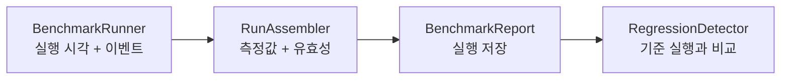

<h1 lang="en">Measurements with meaning.</h1>

**측정값을 비교하기 전에 실행 조건과 관측 범위를 확인하세요.** HALCamera의 벤치마크는 앱에서 관측한 실행 시각과 카메라 콜백을 바탕으로 결과를 저장하고 기준 실행과 비교합니다. [Probe](probe.md)가 읽은 사양과 [CTS](cts.md)의 통과·실패 뒤에 남는 질문, 곧 "얼마나 걸리는가"에 답하는 화면입니다.

이 그림은 벤치마크 결과가 만들어지는 개념적 순서입니다. 실제 호출은 `BenchmarkActivity`가 조정합니다.

<h2 lang="en">Read the result in context.</h2>

| 확인할 항목 | 확인하는 이유 |
| --- | --- |
| 실행과 관측 창 | 카메라를 다시 여는 반복 측정과 관측 세션은 서로 다른 입력을 만듭니다. |
| 워밍업과 표본 | 관측 시작 전에 도착한 프레임 수를 기준으로 워밍업 표본을 제외합니다. |
| 기준 실행 | 지정한 baseline이 없으면 이전의 적격 실행을 reference로 선택합니다. |
| 유효성과 비교 상태 | 측정 불가와 성능 저하를 구분해야 합니다. 값이 없으면 원인을 먼저 확인합니다. |
| profile 이름 | `camera2-standard-v1`과 `camera2-standard-v2`는 서로 비교되지 않습니다. v2는 녹화 측정을 포함하는 대신 기기마다 baseline을 다시 잡아야 합니다. |

측정 대상 카메라는 앱 전체가 함께 쓰는 표기로 적습니다. 카메라 선택 버튼, 실행 기록의 각 행, 시작·결과 화면의 제목 줄에는 `Camera · 0 (Wide · Rear)`를 쓰고, 실행 기록 필터 버튼처럼 칸이 좁은 자리에는 `Camera · 0`으로 줄입니다. 규칙 전문은 [APP-UI.md](https://github.com/TTolsun/hal-camera/blob/main/docs/design/APP-UI.md)의 "카메라를 부르는 이름"에 있습니다.

baseline은 사용자가 명시적으로 지정합니다. baseline이 없으면 결과 화면은 이전의 비교 가능한 실행 대비 변화량만 표시하며, 이력에서 임의로 고른 실행도 실제 baseline이 아닌 한 회귀 판정의 기준이 되지 않습니다.

<h2 lang="en">Recording is measured last.</h2>

실행은 사진 촬영을 마친 뒤 같은 카메라를 연 채로 짧은 녹화를 반복합니다. `camera2-standard-v2`는 9초짜리 녹화를 다섯 번 하고 첫 회는 워밍업으로 제외하므로, 녹화 지표의 유효 표본은 네 개입니다. 표본이 네 개일 때 p95는 사실상 최대값이며 화면은 그 사실을 그대로 적습니다.

녹화를 마지막에 두는 이유는 세 가지입니다. 녹화는 캡처 세션을 다시 구성하므로, 먼저 실행하면 프리뷰 관측 창과 촬영 지연에 그 영향이 섞입니다. 녹화가 실패해도 앞에서 얻은 실행·프리뷰·촬영 표본이 남습니다. 그리고 카메라를 다시 열지 않으므로 warm reopen이라는 조건이 흐려지지 않습니다.

녹화가 약속한 만큼 측정되지 않으면 실행에 `녹화 측정이 부족함` flag가 붙습니다. 이 실행은 측정 자체가 무효는 아니며 사내 비교에도 쓸 수 있지만, 지표 수가 다른 점수는 같은 숫자가 아니므로 교차 기기 점수에서는 빠집니다. 카메라가 녹화 스트림 조합을 거부하면 남은 회차를 시도하지 않습니다. 같은 조합이 다음 회차에서 성공할 이유가 없기 때문입니다.

<h2 lang="en">The verdict comes first.</h2>

결과 화면은 판정 한 줄을 먼저 표시합니다. 문구는 `N metrics degraded`, `No degradation`이며 baseline이 없으면 `First run`입니다. 그 아래에는 측정한 모든 항목을 카테고리별로 묶어 baseline 눈금이 있는 가로 막대로 그립니다. 숫자만 나열하던 `All metrics` 접힘은 없앴습니다. 값과 기준을 나란히 읽는 것이 이 화면의 목적인데, 숫자 행은 막대보다 그 일을 못 하기 때문입니다.

| 화면 요소 | 표시하는 내용 |
| --- | --- |
| 판정 한 줄 | 저하된 지표의 개수, 또는 비교 기준이 없다는 사실을 먼저 알립니다. |
| 지표 막대 | `Launch`·`Preview`·`Capture`·`Stability`·`Record`·`3A` 순서로 묶어, 측정한 항목을 빠짐없이 그립니다. |
| `실행 정보` 접힘 | 기기, 카메라, 시각, OS 빌드, subject, 표본 수, 발열, 비고, 파일을 라벨과 값 한 쌍씩 표시합니다. 비교 화면의 같은 자리도 같은 이름을 씁니다. |
| `내보내기` | 결과를 PC로 옮기는 유일한 경로입니다. 화면 텍스트를 클립보드로 복사하던 버튼은 제거했습니다. |

`Record` 묶음의 이름은 프리뷰의 같은 측정과 짝을 이루도록 접두어를 붙였습니다. `Stalls`와 `Record stalls`는 둘 다 프레임 간격이 기준의 1.5배를 넘은 횟수이고, `Jitter`와 `Record jitter`는 둘 다 그 간격의 편차입니다. 측정 대상이 프리뷰냐 녹화냐만 다릅니다. 두 이름 모두 실제로 프레임을 잃은 개수가 아니며, 원인을 단정하지 않습니다.

`Record fps`는 클수록 좋은 유일한 지표이므로 값이 내려갈 때 저하로 판정합니다. 이 값은 녹화 시작 3초를 건너뛴 뒤의 1초 창들을 센 것입니다. `Record fps`와 `Record jitter`는 소수 한 자리를 유지합니다. 29.8 fps는 창 하나에서 프레임을 놓쳤다는 뜻이고, jitter는 1밀리초보다 작아서 정수로 자르면 모든 값이 0으로 찍히기 때문입니다.

막대 옆 숫자는 표본의 **중앙값**이며, 캡션 `median`이 그 사실을 적습니다. 이름에 이미 통계가 들어 있는 `Interval p50`·`Interval p95`와 개수 지표에는 캡션을 붙이지 않습니다. `Preview` 묶음은 `Frame rate`가 먼저 오고 그 간격 행이 뒤따릅니다. `Frame rate`는 `H.1`을 뒤집은 값이며, 판정 자체는 `H.1` 행이 가집니다.

막대 길이는 **같은 묶음 안에서 단위가 같은 지표끼리 공유하는 축**을 기준으로 그립니다. 그 묶음에서 가장 큰 값이 막대의 80% 자리에 오므로, 이번 실행과 baseline이 아무리 벌어져도 채운 막대와 눈금이 모두 트랙 안에 남습니다. 축을 묶음과 단위에서 끊는 이유는 두 가지입니다. `Preview`의 33밀리초 간격을 `Capture`의 수백 밀리초와 한 축에 올리면 앞쪽 행이 사실상 0으로 뭉개지고, fps와 밀리초와 개수는 애초에 같은 축에 올릴 수 없습니다. 그래서 `Record fps`처럼 묶음 안에서 단위가 혼자인 지표는 자체 축을 쓰며, 이 경우 막대 아래 설명이 다른 행과 길이를 견줄 수 없다는 사실을 적습니다.

3A 항목이 관측 창 안에 수렴하지 못하면 값 대신 `timeout`을 적고 막대를 비웁니다. 이때 저장된 값은 수렴 시각이 아니라 관측 창의 길이이므로, 막대를 그리면 창과 수렴을 견주는 그림이 됩니다.

`실행 정보`의 validity flag는 저장된 코드가 아니라 뜻으로 적습니다(`충전 중`, `빌드 이름 없음`). 코드는 계약이므로 JSON과 CSV에는 그대로 남고, 화면에서만 풀어 씁니다.

비교 화면은 0 기준선 좌우로 변화율 막대를 그리는 delta 차트를 먼저 표시하고, 백분율을 계산할 수 없는 행(count 지표, 단위가 다른 행)은 글줄로 남깁니다.

화면의 언어는 역할에 따라 나뉩니다. 버튼·메뉴·화면 제목과 설명·안내·오류 문장은 앱의 다른 화면처럼 한국어로 씁니다. 지표명·판정 단어·상태 칩은 영어로 씁니다(판정은 `Regressed`가 아니라 `degraded`입니다). 이 이름들은 run JSON과 CLI 출력에 같은 철자로 남으므로, 화면과 파일을 오가며 같은 값을 찾을 수 있어야 하기 때문입니다. `baseline`도 같은 이유로 버튼 안에서 원어를 유지합니다(`baseline으로 지정`).

A number is only useful when its context travels with it.

<h2 lang="en">Work through the run history.</h2>

실행 기록의 각 행은 실행 하나이며 두 줄로 적습니다. 첫 줄은 실행 시각이고, 오른쪽 끝에 배지가 붙을 수 있습니다. 둘째 줄은 `Capture 1.20 s · Camera · 0 (Wide · Rear)`처럼 사실만 적습니다. 빌드 이름을 입력한 실행에는 그 줄이 하나 더 붙습니다. run id, profile, 원본 flag는 행이 아니라 행을 눌러 여는 결과 화면에 있습니다.

baseline인 실행은 시간순 목록에서 빼내 `Baseline · N개` 제목 아래 맨 위에 두고, 나머지는 `다른 실행 · N개` 아래에 최신순으로 이어집니다. 위쪽의 `N개 실행`은 두 묶음을 합친 개수이므로, 제목마다 자기 묶음의 개수를 따로 적습니다. 두 제목은 접근성 제목으로 지정되어 있어 TalkBack에서 제목 단위로 이동할 수 있습니다. baseline은 대개 그 카메라에서 가장 오래된 실행이라 최신순 목록의 맨 끝에 놓이는데, 회색 배지만으로는 어느 실행이 기준인지 찾기 어려웠기 때문입니다. `★ Baseline` 배지는 시작 카드의 발열·배터리 칩과 같은 모양의 칩으로 그립니다. 이 화면에서 파란색은 누를 수 있는 요소를 뜻하므로 배지와 테두리에 파란색을 쓰지 않습니다. 필터와 카메라 선택은 baseline 행에도 똑같이 적용됩니다.

| 배지 | 뜻 |
| --- | --- |
| `★ Baseline` | 이 실행이 현재 baseline입니다. 다른 배지와 달리 테두리가 있는 칩으로 표시합니다. |
| `▲ N degraded` | baseline 대비 N개 지표가 저하되었습니다. |
| `측정 무효`·`비교 불가`·`점수 제외` | 판정이 없을 때, 적격성이 어디서 막혔는지 짧게 알립니다. |
| 없음 | 비교 가능하고 점수도 들어가는 깨끗한 실행입니다. |

판정이 있으면 적격성 문구보다 판정을 먼저 보여 줍니다. 저하된 실행은 점수에서 빠졌는지와 무관하게 열어 볼 값어치가 있고, 두 사실은 결과 화면이 모두 가지고 있기 때문입니다.

1. `두 실행 비교`를 누르고 기준과 현재 실행을 차례로 고릅니다. 선택한 기준은 밝은 파란 테두리로 표시하며 취소나 뒤로 가기로 선택을 해제합니다.
2. 각 행의 `⋮` 메뉴 또는 길게 누르기로 baseline 지정, 비교, JSON·CSV 내보내기, 삭제를 선택합니다.
3. 삭제는 확인을 거친 뒤 파일을 지우고 해당 baseline 포인터를 정리합니다.

닫기와 결과·이력 복귀는 다른 화면과 마찬가지로 화면 제목 왼쪽의 48dp 뒤로 가기 아이콘으로 처리하며, 접근성 이름과 길게 누르기 설명에 복귀 대상을 적습니다. 실행 중에는 이 아이콘을 표시하지 않고 `중단`으로만 멈춥니다. 실행·비교·내보내기·필터처럼 구체적인 작업 이름은 아이콘으로 줄이지 않고 글씨로 유지합니다.

저장 직후에는 `설정`의 `보관 개수`가 적용됩니다. 한도를 넘는 실행 파일을 오래된 것부터 지우며 baseline으로 지정한 실행은 지우지 않습니다. 한도는 슬라이더로 고르고 10부터 100까지 10 단위이며, 그 끝에 `∞`로 표시하는 `무제한`이 한 칸 더 있습니다. 기본값은 `무제한`입니다. 눈금 간격을 일정하게 둔 이유는, 슬라이더가 "같은 거리는 같은 변화"를 약속하기 때문입니다.

<h2 lang="en">Follow the implementation.</h2>

구체적인 실행 순서, 중단 조건, 측정값이 만들어지는 과정은 [아키텍처의 주요 실행 흐름](architecture.md#주요-실행-흐름)에서 확인하세요. 이 페이지는 결과를 읽는 방법을 다루며 별도의 실측 결과를 주장하지 않습니다.

코드 근거를 확인하세요

저장소의 <code>app/src/main/java/dev/halcamera/benchmark/</code>에서 <code>BenchmarkRunner.kt</code>, <code>RunAssembler.kt</code>, <code>BenchmarkActivity.kt</code>, <code>RegressionDetector.kt</code>를 확인하세요. 결과 화면과 비교 화면의 구성은 <code>domain/ResultPresenter.kt</code>·<code>domain/ComparePresenter.kt</code>·<code>ui/MetricBars.kt</code>, 실행 기록은 <code>HistoryActivity.kt</code>·<code>domain/BaselineManager.kt</code>·<code>platform/StoreRunCatalog.kt</code>, 보관 한도는 <code>domain/RunRetention.kt</code>에 있습니다. 녹화 단계는 <code>BenchmarkRunner.kt</code>의 RECORD 단계와 <code>camera/Camera2Engine.kt</code>의 벤치마크 녹화 경로가 실행하고, 지표 계산은 <code>metrics/RecordMetrics.kt</code>에 있습니다. 원고의 검토 상태는 아키텍처 문서 끝에 있습니다.

**다음 단계:** 같은 측정을 터미널에서 반복하려면 [CLI](cli.md)를 읽으세요. 벤치마크 실행 자체는 CLI 명령 집합에서 제외되어 있으며, 그 이유도 그 페이지에 있습니다.
