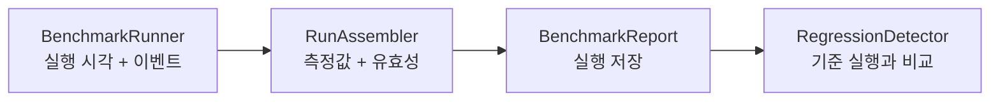

<h1 lang="en">Measurements with meaning.</h1>

**측정값을 비교하기 전에 실행 조건과 관측 범위를 확인하세요.** HALCamera의 벤치마크는 앱에서 관측한 실행 시각과 카메라 콜백을 바탕으로 결과를 저장하고 기준 실행과 비교합니다. [Probe](probe.md)가 읽은 사양과 [CTS](cts.md)의 통과·실패 뒤에 남는 질문, 곧 "얼마나 걸리는가"에 답하는 화면입니다.

이 그림은 벤치마크 결과가 만들어지는 개념적 순서입니다. 실제 호출은 `BenchmarkActivity`가 조정합니다.

<h2 lang="en">Read the result in context.</h2>

| 확인할 항목 | 확인하는 이유 |
| --- | --- |
| 실행과 관측 창 | 카메라를 다시 여는 반복 측정과 관측 세션은 서로 다른 입력을 만듭니다. |
| 워밍업과 표본 | 관측 시작 전에 도착한 프레임 수를 기준으로 워밍업 표본을 제외합니다. |
| 기준 실행 | 지정한 baseline이 없으면 이전의 적격 실행을 reference로 선택합니다. |
| 유효성과 비교 상태 | 측정 불가와 성능 저하를 구분해야 합니다. 값이 없으면 원인을 먼저 확인합니다. |
| profile 이름 | `camera2-standard-v1`과 `camera2-standard-v2`는 서로 비교되지 않습니다. v2는 녹화 측정을 포함하는 대신 기기마다 baseline을 다시 잡아야 합니다. |

측정 대상 카메라는 앱 전체가 함께 쓰는 표기로 적습니다. 카메라 선택 버튼, 시작·결과 화면의 제목 줄, 카메라 필터가 `Camera · 전체`일 때의 실행 기록 행에는 `Camera · 0 (Wide · Rear)`를 쓰고, 실행 기록 필터 버튼처럼 칸이 좁은 자리에는 `Camera · 0`으로 줄입니다. 규칙 전문은 [APP-UI.md](https://github.com/TTolsun/hal-camera/blob/main/docs/design/APP-UI.md)의 "카메라를 부르는 이름"에 있습니다.

baseline은 사용자가 명시적으로 지정합니다. baseline이 없으면 결과 화면은 이전의 비교 가능한 실행 대비 변화량만 표시하며, 이력에서 임의로 고른 실행도 실제 baseline이 아닌 한 회귀 판정의 기준이 되지 않습니다.

<h2 lang="en">Recording is measured last.</h2>

실행은 사진 촬영을 마친 뒤 같은 카메라를 연 채로 짧은 녹화를 반복합니다. `camera2-standard-v2`는 9초짜리 녹화를 다섯 번 하고 첫 회는 워밍업으로 제외하므로, 녹화 지표의 유효 표본은 네 개입니다. 표본이 네 개일 때 p95는 사실상 최대값이며 화면은 그 사실을 그대로 적습니다.

녹화를 마지막에 두는 이유는 세 가지입니다. 녹화는 캡처 세션을 다시 구성하므로, 먼저 실행하면 프리뷰 관측 창과 촬영 지연에 그 영향이 섞입니다. 녹화가 실패해도 앞에서 얻은 실행·프리뷰·촬영 표본이 남습니다. 그리고 카메라를 다시 열지 않으므로 warm reopen이라는 조건이 흐려지지 않습니다.

녹화가 약속한 만큼 측정되지 않으면 실행에 `녹화 측정이 부족함` flag가 붙습니다. 이 실행은 측정 자체가 무효는 아니며 사내 비교에도 쓸 수 있지만, 지표 수가 다른 점수는 같은 숫자가 아니므로 교차 기기 점수에서는 빠집니다. 카메라가 녹화 스트림 조합을 거부하면 남은 회차를 시도하지 않습니다. 같은 조합이 다음 회차에서 성공할 이유가 없기 때문입니다.

<h2 lang="en">The verdict comes first.</h2>

결과 화면은 판정 한 줄을 먼저 표시합니다. 문구는 `N metrics degraded`, `No degradation`이며 baseline이 없으면 `First run`입니다. 그 아래에는 측정한 모든 항목을 카테고리별로 묶어 baseline 눈금이 있는 가로 막대로 그립니다. 숫자만 나열하던 `All metrics` 접힘은 없앴습니다. 값과 기준을 나란히 읽는 것이 이 화면의 목적인데, 숫자 행은 막대보다 그 일을 못 하기 때문입니다.

| 화면 요소 | 표시하는 내용 |
| --- | --- |
| 판정 한 줄 | 저하된 지표의 개수, 또는 비교 기준이 없다는 사실을 먼저 알립니다. |
| 지표 막대 | `Launch`·`Preview`·`Capture`·`Stability`·`Record`·`3A` 순서로 묶어, 측정한 항목을 빠짐없이 그립니다. |
| `실행 정보` 접힘 | 기기, 카메라, 시각, OS 빌드, subject, 표본 수, 발열, 비고, 파일을 라벨과 값 한 쌍씩 표시합니다. 그 아래에 눈금이 가리키는 run(`Baseline`, `Baseline OS`, `Baseline 발열`)과 두 run의 빌드 비교를 이어 적습니다. 이전 run이나 선택한 run과 비교할 때는 라벨도 `이전 run`, `선택한 run`이 됩니다. 화면의 다른 곳과 같은 이름을 써야 같은 run임을 바로 알 수 있기 때문입니다. |
| `내보내기` | 결과를 PC로 옮기는 유일한 경로입니다. 화면 텍스트를 클립보드로 복사하던 버튼은 제거했습니다. |

`Record` 묶음의 이름은 프리뷰의 같은 측정과 짝을 이루도록 접두어를 붙였습니다. `Stalls`와 `Record stalls`는 둘 다 프레임 간격이 기준의 1.5배를 넘은 횟수이고, `Jitter`와 `Record jitter`는 둘 다 그 간격의 편차입니다. 측정 대상이 프리뷰냐 녹화냐만 다릅니다. 두 이름 모두 실제로 프레임을 잃은 개수가 아니며, 원인을 단정하지 않습니다.

`Record fps`는 클수록 좋은 유일한 지표이므로 값이 내려갈 때 저하로 판정합니다. 이 값은 녹화 시작 3초를 건너뛴 뒤의 1초 창들을 센 것입니다. `Record fps`와 `Record jitter`는 소수 한 자리를 유지합니다. 29.8 fps는 창 하나에서 프레임을 놓쳤다는 뜻이고, jitter는 1밀리초보다 작아서 정수로 자르면 모든 값이 0으로 찍히기 때문입니다.

시간 값은 표본의 **중앙값**입니다. 행마다 `median`을 붙이지 않고, 지표 카드 맨 위의 범례 한 줄에 `값: 중앙값`으로 한 번만 적습니다. 범례의 막대 조각과 눈금은 아래 지표 막대와 같은 모양으로 그려 `이번 run`과 `Baseline`(또는 `이전 run`, `선택한 run`)을 가리킵니다. `━`·`│` 같은 글자 기호는 실제 막대와 모양이 달라 무엇을 뜻하는지 연결되지 않았기 때문입니다. 지표 이름 아래에는 그 지표가 재는 Camera2 구간을 작게 적습니다(예: `Open  openCamera → onOpened`, `Partial  onCaptureStarted → onCaptureCompleted`). 정의 원문은 `docs/METRICS.md`에 있고, `First frame`처럼 구현이 표와 다른 지표는 구현 기준(`openCamera → 첫 YUV`)으로 적습니다. `Preview` 묶음은 `Frame rate`가 먼저 오고 그 간격 행이 뒤따릅니다. `Frame rate`는 `H.1`을 뒤집은 값이며, 판정 자체는 `H.1` 행이 가집니다.

막대 길이는 **같은 묶음 안에서 단위가 같은 지표끼리 공유하는 축**을 기준으로 그립니다. 이번 실행의 가장 큰 값이 막대의 80% 자리에 옵니다. 기준 값이 트랙 끝을 넘으면 눈금을 트랙 끝의 ▸로 표시합니다. 전에는 기준 값까지 축에 넣었는데, 3A처럼 기준 하나가 멀리 떨어지면(AF baseline 약 13초) 나머지 막대가 점으로 뭉개졌기 때문입니다. 축을 묶음과 단위에서 끊는 이유는 두 가지입니다. `Preview`의 33밀리초 간격을 `Capture`의 수백 밀리초와 한 축에 올리면 앞쪽 행이 사실상 0으로 뭉개지고, fps와 밀리초와 개수는 애초에 같은 축에 올릴 수 없습니다. 그래서 `Record fps`처럼 묶음 안에서 단위가 혼자인 지표는 자체 축을 씁니다. `Jitter`와 `Record jitter`도 자체 축을 씁니다. 나노초 단위의 편차를 33 ms 간격과 한 축에 올리면 막대와 눈금이 모두 보이지 않기 때문입니다. 기준 run의 값이 timeout(수렴하지 못해 관측 창 길이가 저장된 값)이면 그 값과 비교하지 않고, 눈금과 변화량 없이 막대 아래에 `Baseline은 timeout`이라고 적습니다. 이런 행을 비교하려면 그 지표가 수렴한 run을 baseline으로 새로 지정해야 합니다. 개수 지표(`Stalls`, `Callback fail`, `Record stalls`)는 막대 없이 숫자만 적고, 기준과 같으면 변화량도 적지 않습니다. 0과 0을 견주는 막대는 정보 없이 한 줄을 차지했기 때문입니다. 0.1 ms보다 작은 시간 값(jitter)은 `3 µs`처럼 마이크로초로, 1 µs보다 작으면 `170 ns`처럼 나노초로 적습니다. 소수 한두 자리로는 `0.00 ms`로 보였고, 센서 timestamp 간격이 안정적인 기기에서는 편차가 1 µs보다 작기 때문입니다.

3A 항목이 관측 창 안에 수렴하지 못하면 값 대신 `timeout`을 적고 막대를 비웁니다. 이때 저장된 값은 수렴 시각이 아니라 관측 창의 길이이므로, 막대를 그리면 창과 수렴을 견주는 그림이 됩니다.

`실행 정보`의 validity flag는 저장된 코드가 아니라 뜻으로 적습니다(`충전 중`, `빌드 이름 없음`). 코드는 계약이므로 JSON과 CSV에는 그대로 남고, 화면에서만 풀어 씁니다.

두 run의 비교는 이 막대와 눈금 하나로 보여 줍니다. 전에는 결과 화면의 `비교` 버튼 뒤에 0 기준선 좌우로 변화율 막대를 그리는 차트가 따로 있었고, 실행 기록의 두 실행 비교는 글자 행이었습니다. 같은 비교를 세 가지 그림으로 보여 줄 이유가 없어 막대와 눈금만 남기고 `비교` 버튼을 없앴습니다. 대신 없앤 그림이 보여 주던 내용을 이 카드가 모두 담습니다.

- 지표 이름 아래 줄에 Camera2 구간을 적습니다. 이름 옆에 두면 칸 폭에서 아무 데나 끊겼기 때문입니다(`createCaptureSession →` / `onConfigured`).
- 변화량은 막대 오른쪽 끝에 절댓값과 변화율을 함께 적습니다(`+10 ms · +4%`). 윗줄에는 지표 이름과 값만 둡니다. 한 줄에 이름·값·변화량이 들어가지 않아 이름과 값이 붙어 보였기 때문이고, 막대 옆에 두면 한 행이 두 줄로 끝납니다. 개수 지표는 작은 개수의 백분율이 오해를 부르므로 절댓값만 적습니다.
- 기준 run에만 있는 지표도 행을 남깁니다. 이 경우 값은 `—`이고 눈금만 그리며, 막대 아래에 `이번 run에서 측정되지 않음`이라고 적습니다.
- 판정하지 못한 이유(`조건 불일치`, `표본 부족`, `단위 다름` 등)를 막대 아래에 적습니다.
- 변화량 숫자의 색은 판정만 뜻합니다. 빨강은 저하, 초록은 개선, 회색은 판정하지 않은 변화입니다. 판정은 baseline과 비교할 때만 하므로, 이전 run이나 직접 고른 run과 비교할 때는 빨간 막대도 나오지 않습니다.

화면의 언어는 역할에 따라 나뉩니다. 버튼·메뉴·화면 제목과 설명·안내·오류 문장은 앱의 다른 화면처럼 한국어로 씁니다. 지표명·판정 단어·상태 칩은 영어로 씁니다(판정은 `Regressed`가 아니라 `degraded`입니다). 이 이름들은 run JSON과 CLI 출력에 같은 철자로 남으므로, 화면과 파일을 오가며 같은 값을 찾을 수 있어야 하기 때문입니다. `baseline`도 같은 이유로 버튼 안에서 원어를 유지합니다(`baseline으로 지정`).

A number is only useful when its context travels with it.

<h2 lang="en">Work through the run history.</h2>

실행 기록의 각 행은 실행 하나이며 두 줄로 적습니다. 첫 줄은 실행 시각이고, 오른쪽 끝에 배지가 붙을 수 있습니다. 둘째 줄은 `Capture 1.20 s · Camera · 0 (Wide · Rear)`처럼 사실만 적습니다. 카메라 필터로 카메라 하나를 고른 상태에서는 모든 행의 카메라가 같으므로 `Capture 1.20 s`만 적고, 화면 낭독기가 읽는 행 설명에만 카메라를 남깁니다. 카메라 이름 때문에 사실 줄이 `⋮` 버튼 뒤에서 셋째 줄로 넘어가던 문제도 이렇게 없앴습니다. 빌드 이름을 입력한 실행에는 그 줄이 하나 더 붙습니다. run id, profile, 원본 flag는 행이 아니라 행을 눌러 여는 결과 화면에 있습니다.

baseline인 실행은 시간순 목록에서 빼내 `Baseline` 제목 아래 맨 위에 두고, 나머지는 `다른 실행 · N개` 아래에 최신순으로 이어집니다. baseline은 대개 그 카메라에서 가장 오래된 실행이라 최신순 목록의 맨 끝에 놓이는데, 회색 배지만으로는 어느 실행이 기준인지 찾기 어려웠기 때문입니다. 필터와 카메라 선택은 baseline 행에도 똑같이 적용됩니다.

개수는 목록 위의 별도 줄이 아니라 각 묶음의 제목에 적습니다. baseline이 없으면 제목은 `실행 · N개` 하나입니다. baseline은 카메라마다 하나라서 보통 1개이므로 개수를 적지 않고, `Camera · 전체`처럼 여러 카메라를 함께 볼 때만 `Baseline · 2개`처럼 적습니다. 두 제목은 접근성 제목으로 지정되어 있어 TalkBack에서 제목 단위로 이동할 수 있습니다.

baseline 행에는 배지를 붙이지 않습니다. 이 행은 언제나 `Baseline` 제목 아래에만 나오므로 배지는 같은 말을 반복할 뿐이고, 테두리 있는 칩은 옆의 `⋮` 버튼과 같은 모양이라 누르는 요소처럼 보였기 때문입니다. 화면 낭독기가 읽는 행 설명에는 `★ Baseline`이 그대로 들어갑니다.

`두 실행 비교`와 `목록 CSV 내보내기`는 한 줄에 나란히 둡니다. 전체 폭 버튼 두 개와 개수 줄이 화면 위쪽 절반을 차지해 첫 실행이 화면 중간에서야 보였기 때문입니다. `목록 CSV 내보내기`는 아래 목록에 보이는 실행을 모두 CSV 파일 하나로 내보냅니다. 버튼 이름의 `목록`은 화면이나 실행 하나가 아니라 목록 전체가 파일에 들어간다는 뜻이며, 몇 개인지는 목록 제목과 화면 낭독기 설명에 있습니다.

| 배지 | 뜻 |
| --- | --- |
| `▲ N degraded` | baseline 대비 N개 지표가 저하되었습니다. |
| `측정 무효`·`비교 불가`·`점수 제외` | 판정이 없을 때, 적격성이 어디서 막혔는지 짧게 알립니다. |
| 없음 | 비교 가능하고 점수도 들어가는 깨끗한 실행이거나, `Baseline` 제목 아래의 baseline 행입니다. |

판정이 있으면 적격성 문구보다 판정을 먼저 보여 줍니다. 저하된 실행은 점수에서 빠졌는지와 무관하게 열어 볼 값어치가 있고, 두 사실은 결과 화면이 모두 가지고 있기 때문입니다.

1. `두 실행 비교`를 누르고, 눈금으로 둘 run과 비교할 run을 차례로 고릅니다. 먼저 고른 run은 밝은 파란 테두리로 표시하며, 취소나 뒤로 가기로 선택을 해제합니다. 비교 화면에서 먼저 고른 run은 그것이 지정된 baseline이면 `Baseline`, 아니면 `선택한 run`으로 부르고, 나중에 고른 run은 `이번 run`으로 부릅니다. 화면에서는 `기준`이라는 말을 쓰지 않습니다. 결과 화면이 같은 run을 baseline이라고 부르므로, 다른 이름이 섞이면 같은 run인지 다시 확인해야 하기 때문입니다.
2. 각 행의 `⋮` 메뉴 또는 길게 누르기로 baseline 지정, 비교, JSON·CSV 내보내기, 삭제를 선택합니다.
3. 삭제는 확인을 거친 뒤 파일을 지우고 해당 baseline 포인터를 정리합니다.

닫기와 결과·이력 복귀는 다른 화면과 마찬가지로 화면 제목 왼쪽의 48dp 뒤로 가기 아이콘으로 처리하며, 접근성 이름과 길게 누르기 설명에 복귀 대상을 적습니다. 실행 중에는 이 아이콘을 표시하지 않고 `중단`으로만 멈춥니다. 실행 기록에서 연 결과 화면에는 `실행 기록` 버튼을 두지 않습니다. 이 경우 뒤로 가기 아이콘이 이미 실행 기록으로 돌아가므로 같은 동작이 두 번 있을 필요가 없기 때문입니다. 방금 실행한 결과 화면에서는 뒤로 가기가 카메라로 가므로 `실행 기록` 버튼을 남깁니다. 실행·비교·내보내기·필터처럼 구체적인 작업 이름은 아이콘으로 줄이지 않고 글씨로 유지합니다.

저장 직후에는 `설정`의 `최대 보관 개수`가 적용됩니다. 한도를 넘는 실행 파일을 오래된 것부터 지우며 baseline으로 지정한 실행은 지우지 않습니다. 한도는 슬라이더로 고르고 10부터 100까지 10 단위이며, 그 끝에 `∞`로 표시하는 `무제한`이 한 칸 더 있습니다. 기본값은 `무제한`입니다. 눈금 간격을 일정하게 둔 이유는, 슬라이더가 "같은 거리는 같은 변화"를 약속하기 때문입니다.

<h2 lang="en">Follow the implementation.</h2>

구체적인 실행 순서, 중단 조건, 측정값이 만들어지는 과정은 [아키텍처의 주요 실행 흐름](architecture.md#주요-실행-흐름)에서 확인하세요. 이 페이지는 결과를 읽는 방법을 다루며 별도의 실측 결과를 주장하지 않습니다.

코드 근거를 확인하세요

저장소의 <code>app/src/main/java/dev/halcamera/benchmark/</code>에서 <code>BenchmarkRunner.kt</code>, <code>RunAssembler.kt</code>, <code>BenchmarkActivity.kt</code>, <code>RegressionDetector.kt</code>를 확인하세요. 결과 화면과 비교 화면의 구성은 <code>domain/ResultPresenter.kt</code>·<code>domain/ComparePresenter.kt</code>·<code>ui/MetricBars.kt</code>, 실행 기록은 <code>HistoryActivity.kt</code>·<code>domain/BaselineManager.kt</code>·<code>platform/StoreRunCatalog.kt</code>, 보관 한도는 <code>domain/RunRetention.kt</code>에 있습니다. 녹화 단계는 <code>BenchmarkRunner.kt</code>의 RECORD 단계와 <code>camera/Camera2Engine.kt</code>의 벤치마크 녹화 경로가 실행하고, 지표 계산은 <code>metrics/RecordMetrics.kt</code>에 있습니다. 원고의 검토 상태는 아키텍처 문서 끝에 있습니다.

**다음 단계:** 같은 측정을 터미널에서 반복하려면 [CLI](cli.md)를 읽으세요. 벤치마크 실행 자체는 CLI 명령 집합에서 제외되어 있으며, 그 이유도 그 페이지에 있습니다.
