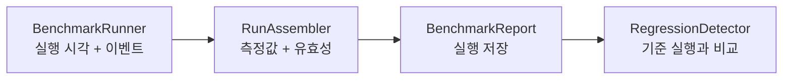

<h1 lang="en">Measurements with meaning.</h1>

**측정값을 비교하기 전에 실행 조건과 관측 범위를 확인하세요.** HALCamera의 벤치마크는 앱에서 관측한 실행 시각과 카메라 콜백을 바탕으로 결과를 저장하고 기준 실행과 비교합니다. [Probe](probe.md)가 읽은 사양과 [CTS](cts.md)의 통과·실패 뒤에 남는 질문, 곧 "얼마나 걸리는가"에 답하는 화면입니다.

이 그림은 벤치마크 결과가 만들어지는 개념적 순서입니다. 실제 호출은 `BenchmarkActivity`가 조정합니다.

<h2 lang="en">Read the result in context.</h2>

| 확인할 항목 | 확인하는 이유 |
| --- | --- |
| 실행과 관측 창 | 카메라를 다시 여는 반복 측정과 관측 세션은 서로 다른 입력을 만듭니다. |
| 워밍업과 표본 | 관측 시작 전에 도착한 프레임 수를 기준으로 워밍업 표본을 제외합니다. |
| 기준 실행 | 지정한 baseline이 없으면 이전의 적격 실행을 reference로 선택합니다. |
| 유효성과 비교 상태 | 측정 불가와 성능 저하를 구분해야 합니다. 값이 없으면 원인을 먼저 확인합니다. |

측정 대상 카메라는 앱 전체가 함께 쓰는 표기로 적습니다. 카메라 선택 버튼, Results의 각 행, 시작·결과 화면의 제목 줄에는 `Camera · 0 (Wide · Rear)`를 쓰고, Results 필터 버튼처럼 칸이 좁은 자리에는 `Camera · 0`으로 줄입니다. 규칙 전문은 [APP-UI.md](https://github.com/TTolsun/hal-camera/blob/main/docs/design/APP-UI.md)의 "카메라를 부르는 이름"에 있습니다.

baseline은 사용자가 명시적으로 지정합니다. baseline이 없으면 결과 화면은 이전의 비교 가능한 실행 대비 변화량만 표시하며, 이력에서 임의로 고른 실행도 실제 baseline이 아닌 한 회귀 판정의 기준이 되지 않습니다.

<h2 lang="en">The verdict comes first.</h2>

결과 화면은 판정 한 줄을 먼저 표시합니다. 문구는 `N metrics degraded`, `No degradation`이며 baseline이 없으면 `First run`입니다. 그 아래에는 측정한 모든 항목을 카테고리별로 묶어 baseline 눈금이 있는 가로 막대로 그립니다. 숫자만 나열하던 `All metrics` 접힘은 없앴습니다. 값과 기준을 나란히 읽는 것이 이 화면의 목적인데, 숫자 행은 막대보다 그 일을 못 하기 때문입니다.

| 화면 요소 | 표시하는 내용 |
| --- | --- |
| 판정 한 줄 | 저하된 지표의 개수, 또는 비교 기준이 없다는 사실을 먼저 알립니다. |
| 지표 막대 | `Launch`·`Preview`·`Capture`·`Stability`·`3A` 순서로 묶어, 측정한 항목을 빠짐없이 그립니다. |
| `Run info` 접힘 | 기기, 카메라, 시각, OS 빌드, subject, 표본 수, 발열, 비고, 파일을 라벨과 값 한 쌍씩 표시합니다. |
| `Export` | 결과를 PC로 옮기는 유일한 경로입니다. 화면 텍스트를 클립보드로 복사하던 버튼은 제거했습니다. |

막대 옆 숫자는 표본의 **중앙값**이며, 캡션 `median`이 그 사실을 적습니다. 이름에 이미 통계가 들어 있는 `Interval p50`·`Interval p95`와 개수 지표에는 캡션을 붙이지 않습니다. `Preview` 묶음은 `Frame rate`가 먼저 오고 그 간격 행이 뒤따릅니다. `Frame rate`는 `H.1`을 뒤집은 값이며, 판정 자체는 `H.1` 행이 가집니다.

3A 항목이 관측 창 안에 수렴하지 못하면 값 대신 `timeout`을 적고 막대를 비웁니다. 이때 저장된 값은 수렴 시각이 아니라 관측 창의 길이이므로, 막대를 그리면 창과 수렴을 견주는 그림이 됩니다.

`Run info`의 validity flag는 저장된 코드가 아니라 뜻으로 적습니다(`충전 중`, `빌드 이름 없음`). 코드는 계약이므로 JSON과 CSV에는 그대로 남고, 화면에서만 풀어 씁니다.

비교 화면은 0 기준선 좌우로 변화율 막대를 그리는 delta 차트를 먼저 표시하고, 백분율을 계산할 수 없는 행(count 지표, 단위가 다른 행)은 글줄로 남깁니다.

화면의 언어는 역할에 따라 나뉩니다. 라벨·버튼·지표명·판정 단어는 영어로 쓰고(판정은 `Regressed`가 아니라 `degraded`입니다), 설명·안내·오류 문장은 한국어로 씁니다.

A number is only useful when its context travels with it.

<h2 lang="en">Work through Results.</h2>

Results의 각 행은 실행 하나이며 두 줄로 적습니다. 첫 줄은 실행 시각이고, 오른쪽 끝에 배지가 붙을 수 있습니다. 둘째 줄은 `Capture 1.20 s · Camera · 0 (Wide · Rear)`처럼 사실만 적습니다. 빌드 이름을 입력한 실행에는 그 줄이 하나 더 붙습니다. run id, profile, 원본 flag는 행이 아니라 행을 눌러 여는 결과 화면에 있습니다.

| 배지 | 뜻 |
| --- | --- |
| `★ Baseline` | 이 실행이 현재 baseline입니다. |
| `▲ N degraded` | baseline 대비 N개 지표가 저하되었습니다. |
| `측정 무효`·`비교 불가`·`점수 제외` | 판정이 없을 때, 적격성이 어디서 막혔는지 짧게 알립니다. |
| 없음 | 비교 가능하고 점수도 들어가는 깨끗한 실행입니다. |

판정이 있으면 적격성 문구보다 판정을 먼저 보여 줍니다. 저하된 실행은 점수에서 빠졌는지와 무관하게 열어 볼 값어치가 있고, 두 사실은 결과 화면이 모두 가지고 있기 때문입니다.

1. `두 실행 비교`를 누르고 기준과 현재 실행을 차례로 고릅니다. 선택한 기준은 테두리로 표시하며 취소나 뒤로 가기로 선택을 해제합니다.
2. 각 행의 `⋮` 메뉴 또는 길게 누르기로 baseline 지정, 비교, JSON·CSV 내보내기, 삭제를 선택합니다.
3. 삭제는 확인을 거친 뒤 파일을 지우고 해당 baseline 포인터를 정리합니다.

닫기와 결과·이력 복귀에는 기존 위치의 48dp 아이콘을 사용하며, 접근성 이름과 길게 누르기 설명에 복귀 대상을 적습니다. 실행·비교·내보내기·필터처럼 구체적인 작업 이름은 아이콘으로 줄이지 않고 글씨로 유지합니다.

저장 직후에는 설정의 `Data limit`이 적용됩니다. 한도를 넘는 실행 파일을 오래된 것부터 지우며 baseline으로 지정한 실행은 지우지 않습니다. 한도는 슬라이더로 고르고 10부터 100까지 10 단위이며, 그 끝에 `∞`로 표시하는 Unlimited가 한 칸 더 있습니다. 기본값은 Unlimited입니다. 눈금 간격을 일정하게 둔 이유는, 슬라이더가 "같은 거리는 같은 변화"를 약속하기 때문입니다.

<h2 lang="en">Follow the implementation.</h2>

구체적인 실행 순서, 중단 조건, 측정값이 만들어지는 과정은 [아키텍처의 주요 실행 흐름](architecture.md#주요-실행-흐름)에서 확인하세요. 이 페이지는 결과를 읽는 방법을 다루며 별도의 실측 결과를 주장하지 않습니다.

코드 근거를 확인하세요

저장소의 <code>app/src/main/java/dev/halcamera/benchmark/</code>에서 <code>BenchmarkRunner.kt</code>, <code>RunAssembler.kt</code>, <code>BenchmarkActivity.kt</code>, <code>RegressionDetector.kt</code>를 확인하세요. 결과 화면과 비교 화면의 구성은 <code>domain/ResultPresenter.kt</code>·<code>domain/ComparePresenter.kt</code>·<code>ui/MetricBars.kt</code>, Results 이력은 <code>HistoryActivity.kt</code>·<code>domain/BaselineManager.kt</code>·<code>platform/StoreRunCatalog.kt</code>, 보관 한도는 <code>domain/RunRetention.kt</code>에 있습니다. 원고의 검토 상태는 아키텍처 문서 끝에 있습니다.

**다음 단계:** 같은 측정을 터미널에서 반복하려면 [CLI](cli.md)를 읽으세요. 벤치마크 실행 자체는 CLI 명령 집합에서 제외되어 있으며, 그 이유도 그 페이지에 있습니다.
