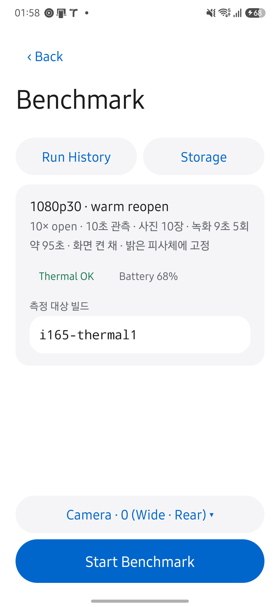
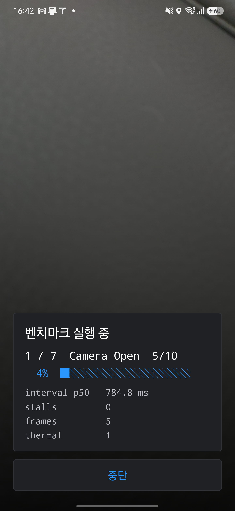
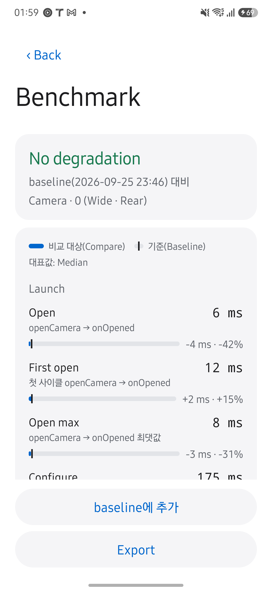
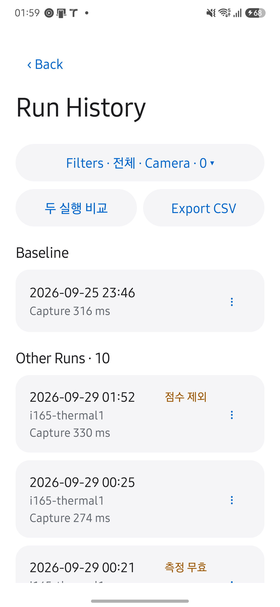

<h1 lang="en">Measurements with meaning.</h1>

**같은 조건에서 측정한 실행을 비교하세요.** Benchmark는 카메라 열기, 프리뷰, 촬영, 녹화에 걸린 시간과 콜백을 기록합니다. 결과 화면에서 [baseline](glossary.md#baseline) 대비 변화를 읽고, 실행 기록에서 비교 대상을 선택하거나 파일을 내보낼 수 있습니다.

아래 화면은 2026년 9월 29일 Galaxy S25+·Android 16에서 HAL CAMERA 0.15.0을 실행해 촬영했습니다. <a href="evidence.html#앱-화면-촬영">촬영 조건과 확인 범위</a>를 함께 확인하세요. 이미지를 누르면 원본이 열립니다.

## 실행 조건을 확인하세요

1. Live에서 `Lab → Benchmark`를 엽니다.
2. 카메라와 [profile](glossary.md#profile)을 확인합니다. Live의 출력 설정과는 별개입니다.
3. 측정을 실행하고 완료될 때까지 기다립니다.
4. 판정과 `Run Details`를 확인합니다. 무효·표본 부족이면 사유를 확인한 뒤 다시 측정합니다.

**현재 앱은 종합 점수를 계산하지 않습니다.** 지표별 측정값과 baseline 대비 저하 판정을 확인하세요.

처음에는 설정을 바꾸지 않고 두 번 실행해 보세요. [두 실행 비교](#실행-기록에서-비교하고-내보내세요)를 열면 같은 조건에서도 달라지는 값을 볼 수 있습니다. 작은 차이를 바로 HAL 변경의 효과로 단정하지 않고 반복 측정할 이유가 여기에 있습니다.

### 비교 기준을 고르세요

**처음 비교한다면 정상 실행을 기준으로 지정하세요.**

1. Benchmark의 `Run History` 또는 `Lab → Run History`를 엽니다.
2. 기준으로 쓸 정상 실행의 `⋮` 메뉴에서 `baseline에 추가`를 선택합니다.
3. 같은 카메라·profile과 환경에서 다시 측정합니다.
4. 결과의 판정과 달라진 지표를 확인합니다.

반복 측정에서는 정상 실행을 다섯 개 이상 baseline에 추가하기를 권장합니다. 한 번만 비교하려면 [두 실행 비교](#실행-기록에서-비교하고-내보내세요)를 사용하세요.

| 상황 | 기준 | 결과 |
| --- | --- | --- |
| 처음 측정했습니다. | 비교할 실행이 없습니다. | 측정값만 봅니다. |
| baseline을 지정하지 않았습니다. | 이전의 비교 가능한 실행입니다. | 변화량만 표시합니다. 저하·개선은 판정하지 않습니다. |
| 정상 실행을 `baseline에 추가`했습니다. | 추가한 정상 실행들의 집합입니다. | 집합의 가장 나쁜 값보다 임계값 이상 나쁠 때 저하로 판정합니다. |
| 실행 기록에서 `두 실행 비교`를 골랐습니다. | 먼저 고른 실행을 이번 비교에만 씁니다. | 그 실행을 기준으로 저하·개선을 판정합니다. 저장된 baseline은 바뀌지 않습니다. |

3A(AE·AF·AWB 수렴)는 장면에 따라 값이 크게 달라집니다. **3A는 변화량만 표시하며 저하로 판정하지 않습니다.**

| 조건 | 비교할 때 확인할 내용 |
| --- | --- |
| 카메라와 profile | `camera2-standard-v1`과 녹화를 포함하는 `camera2-standard-v2`는 서로 비교하지 않습니다. v2의 baseline은 기기별로 새로 지정합니다. |
| 관측 창과 워밍업 | 카메라를 다시 여는 반복 측정과 프리뷰 관측 세션은 구분됩니다. 관측 시작 전에 도착한 프레임은 워밍업으로 제외합니다. |
| 유효성과 환경 | 표본 수, 발열, 충전 상태, 빌드 정보를 `Run Details`에서 확인합니다. 비교 조건이 맞지 않으면 이유를 표시합니다. |

실제 화면 보기

<figure class="app-screenshot">

<figcaption>카메라 0에서 실행하기 전의 조건입니다. 기기에 저장된 측정 대상 빌드 이름을 그대로 표시합니다. <a href="assets/screenshots/benchmark-setup.png">원본 보기</a></figcaption>
</figure>

실제 화면 보기

<figure class="app-screenshot">

<figcaption>카메라 열기 반복 측정이 진행 중입니다. 현재 단계와 회차, 진행률을 확인할 수 있습니다. <a href="assets/screenshots/benchmark-running.png">원본 보기</a></figcaption>
</figure>

진행 표시와 녹화 표본의 세부 규칙

진행 화면은 단계 제목 아래에 준비·첫 프레임 대기·관측·촬영·저장 상태를 짧게 표시합니다. 워밍업과 관측에는 경과 시간과 예정 시간을, 사진에는 현재 촬영 순서를 표시합니다. 녹화 프레임 수는 현재 회차의 capture_result를 집계하므로 새 회차에서 초기화됩니다. 진행률은 표시용 추정치이며 측정값에 영향을 주지 않습니다.

`camera2-standard-v2`는 사진 촬영을 마친 뒤 카메라를 닫지 않고 9초 녹화를 다섯 번 반복합니다. 첫 회를 워밍업으로 제외하므로 녹화 지표의 유효 표본은 네 개이며, 이때 p95는 사실상 최대값입니다. 녹화를 마지막에 실행하므로 녹화 세션 구성의 영향이 앞선 프리뷰 관측과 촬영 지연에 섞이지 않습니다.

녹화 표본이 부족하면 `녹화 측정이 부족함` flag가 붙습니다. 이 flag만으로 측정 전체가 무효가 되지는 않습니다. 지표별 표본과 비교 가능 여부를 확인하세요. 카메라가 녹화 스트림 조합을 거부하면 남은 녹화 회차는 실행하지 않습니다.

## 판정과 막대를 읽으세요

**판정을 먼저 읽고, 달라진 지표를 확인하세요.** 막대만 보고 성능 저하를 판단하지 마세요.

<figure class="doc-visual" aria-labelledby="metric-example-title">

<strong>시간 지표 한 줄 읽기</strong> · 설명용 예시

<dl class="doc-metric-key">
<dt>막대 · 이번 값</dt><dd>120 ms</dd>

<dt>눈금 · 기준 값</dt><dd>100 ms</dd>

<dt>변화량</dt><dd>+20 ms (+20%)</dd>
</dl>
<figcaption>이 예시에서는 20 ms 더 걸렸습니다. 실제 저하 판정은 비교 조건과 지표별 임계값으로 결정합니다. 실측 결과나 앱 화면이 아닙니다.</figcaption>
</figure>

| 판정 | 의미와 다음 행동 |
| --- | --- |
| `Measurement invalid` | 측정 유효성 조건을 충족하지 못했습니다. **Run Details에서 무효 사유를 확인**하고 조건을 바로잡은 뒤 다시 측정하세요. |
| `First run` | 비교할 실행이 없습니다. **이번 조건과 측정값을 확인**하고 같은 조건으로 다음 실행을 측정하세요. |
| `This run is the baseline` | 현재 실행이 기준입니다. **비교할 다른 실행을 선택**하세요. |
| `No baseline` | 이전 실행과의 변화량만 보입니다. 저하 판정이 필요하면 **정상 실행을 baseline에 추가**하세요. |
| `No verdict` | 기준은 있지만 비교 조건을 충족한 지표가 없습니다. **Run Details에서 비교 불가 사유를 확인**하세요. |
| `N metrics degraded` | 저하된 지표가 N개입니다. **해당 지표와 실행 조건 차이를 확인**하고 같은 조건에서 재현되는지 측정하세요. |
| `No degradation` | 판정한 지표에는 저하가 없습니다. **제외된 지표와 경고도 확인**하세요. 모든 HAL 동작이 정상이라는 뜻은 아닙니다. |

실제 화면 보기

<figure class="app-screenshot">

<figcaption>실행 완료 후 기존 baseline과 비교한 화면입니다. 충전 중 측정의 점수 제외 안내가 표시되므로, 이 장면을 앱 버전 간 성능 저하의 증거로 해석하지 않습니다. <a href="assets/screenshots/benchmark-result.png">원본 보기</a></figcaption>
</figure>

막대·단위·프레임 지표 자세히 읽기

지표는 `Launch`·`Preview`·`Capture`·`Stability`·`Record`·`3A`로 묶습니다. 막대는 비교 대상의 값, 눈금은 baseline 또는 이전 실행의 값입니다. 시간 값의 대표값은 중앙값이며, 각 지표 아래에는 측정한 Camera2 구간을 표시합니다. 지표 정의는 [METRICS.md](https://github.com/TTolsun/hal-camera/blob/main/docs/METRICS.md)를 확인하세요. Benchmark의 `Partial`은 `onCaptureStarted → onCaptureCompleted` 구간을 뜻하며, Camera2의 중간 메타데이터 콜백인 `onCaptureProgressed`를 뜻하지 않습니다.

| 표시 | 읽는 방법 |
| --- | --- |
| 막대 길이 | 같은 묶음에서 단위가 같은 지표끼리 축을 공유하며, 이번 실행의 최댓값이 트랙의 80%에 옵니다. 단위가 다른 행이나 다른 묶음의 길이는 직접 비교하지 않습니다. |
| 별도 축 | 묶음에서 단위가 하나뿐인 지표와 `Jitter`·`Record jitter`는 자체 축을 씁니다. |
| 끝의 ▸ | 기준 값이 표시 범위를 넘었습니다. |
| 변화량 | 시간·비율 지표는 절댓값과 변화율을, 개수 지표는 절댓값만 표시합니다. 단위가 다르면 변화율을 표시하지 않습니다. |
| 빨강·초록·회색 | 각각 저하, 개선, 판정하지 않은 변화를 뜻합니다. 이전 실행과의 비교는 회색으로 표시합니다. |
| `timeout` | 3A가 관측 창 안에 수렴하지 않았습니다. 현재 값의 막대는 비우며, 기준 값이 timeout이면 눈금과 변화량을 표시하지 않습니다. |
| `Baseline에만 있음` | 기준 실행에만 값이 있습니다. 현재 값은 `—`로 표시하고 기준 눈금은 남깁니다. |
| `조건 불일치`·`표본 부족` | 해당 지표를 판정하지 못한 이유입니다. |

`Stalls`·`Callback fail`·`Record stalls`는 막대 없이 개수를 표시하며, 기준과 같으면 변화량을 생략합니다. 0.1 ms보다 작은 시간 값은 µs로, 1 µs보다 작으면 ns로 표시합니다.

`Frame rate`는 프리뷰 간격 지표 `H.1`의 역수이며 판정은 `H.1`에 따릅니다. `Record fps`는 녹화 시작 3초를 제외한 뒤 1초 창에서 관측한 프레임 수를 바탕으로 계산하며, 값이 낮아질 때 저하로 판정합니다. `Stalls`와 `Record stalls`는 기준의 1.5배를 넘은 프레임 간격의 횟수이고, `Jitter`와 `Record jitter`는 간격의 편차입니다. 이 수치만으로 HAL 내부의 프레임 손실을 확정할 수는 없습니다.

`Run Details`에는 기기, 카메라, OS 빌드, subject, 표본 수, 발열, 비고, 파일과 비교 기준의 정보가 있습니다. validity flag는 화면에서는 뜻을 풀어 쓰고 JSON과 CSV에는 원래 코드를 유지합니다. `Export`로 결과 파일을 공유합니다.

## 실행 기록에서 비교하고 내보내세요

`Lab → Run History`에서 실행 기록을 엽니다. 지정된 baseline을 위에, 나머지 실행을 최신순으로 표시합니다. 각 행에는 실행 시각과 촬영 지연, 카메라가 나오며 빌드 이름을 입력했다면 한 줄이 추가됩니다. 카메라 하나로 필터링한 목록에서는 행마다 카메라 이름을 반복하지 않습니다.

| 배지 | 의미 |
| --- | --- |
| `▲ N degraded` | 지정된 baseline 대비 N개 지표가 저하되었습니다. |
| `측정 무효`·`비교 불가`·`점수 제외` | 결과의 사용 조건을 충족하지 못했습니다. `점수 제외`는 호환용 적격성 표시이며 현재 점수를 계산한다는 뜻은 아닙니다. |
| 없음 | 저하나 적격성 경고가 없는 실행이거나, 별도 `Baseline` 묶음에 있는 실행입니다. |

1. `두 실행 비교`를 누릅니다.
2. 기준으로 쓸 실행을 먼저 고릅니다.
3. 비교할 실행을 고릅니다. 취소나 뒤로 가기로 선택을 해제할 수 있습니다.

| 할 일 | 조작 |
| --- | --- |
| 실행 하나를 관리합니다. | 행의 `⋮` 메뉴를 누르거나 길게 누릅니다. baseline 추가·빼기, 비교, JSON·CSV 내보내기, 삭제를 고릅니다. |
| 실행을 삭제합니다. | 확인 후 삭제하며, baseline에서도 빠집니다. |
| 현재 목록을 내보냅니다. | `Export CSV`를 누릅니다. 현재 필터에 맞는 실행을 CSV 하나로 저장합니다. |

실제 화면 보기

<figure class="app-screenshot">

<figcaption>저장된 실행을 최신 순서로 표시합니다. 기존 baseline은 별도 묶음에 남아 있습니다. <a href="assets/screenshots/benchmark-history.png">원본 보기</a></figcaption>
</figure>

기본 상태 필터는 `전체`이므로 중단·무효 실행도 보입니다. 찾는 실행이 없으면 profile·camera 조건을 확인하거나 `Reset Filters`를 누르세요.

PC 집계에서 실행 개수가 다를 때

PC의 `tools/aggregate.py`는 기존 점수 적격성 조건으로 필터링합니다. 점수의 유무와는 별개이며, 전체 실행이 필요하면 `--eligibility all`을 사용합니다.

오래된 실행의 자동 삭제와 손상 파일 처리

저장 직후에는 `Storage → Storage Limit`에서 정한 한도를 적용해 오래된 실행부터 삭제합니다. 한도는 10부터 100까지 10 단위로 선택하거나 `무제한`으로 지정하며 기본값은 `무제한`입니다. baseline에 든 실행은 자동 삭제하지 않습니다. 손상된 JSON은 별도로 알리며, baseline 파일을 읽지 못하면 baseline 변경과 삭제를 중단합니다.

## 구현과 검증 범위를 확인하세요

실행 순서와 저장 경로는 [Architecture](architecture.md#주요-실행-흐름), 표본 누락과 시각 해석은 [Troubleshooting](troubleshooting.md)에 있습니다. 이 페이지는 코드에 따른 사용법이며 기기 실측 결과는 [Validation](evidence.md)에서 별도로 확인합니다.

코드 근거를 확인하세요

실행과 조립은 <code>benchmark/domain/BenchmarkRunner.kt</code>·<code>RunAssembler.kt</code>, 판정과 결과 표시는 <code>RegressionDetector.kt</code>·<code>ResultPresenter.kt</code>·<code>ComparePresenter.kt</code>와 <code>ui/MetricBars.kt</code>에서 확인합니다. 실행 기록은 <code>benchmark/HistoryActivity.kt</code>·<code>domain/BaselineManager.kt</code>·<code>platform/StoreRunCatalog.kt</code>, 보관 한도는 <code>domain/RunRetention.kt</code>, 녹화 지표는 <code>metrics/RecordMetrics.kt</code>에 있습니다. 모든 경로는 <code>app/src/main/java/dev/halcamera/</code>를 기준으로 합니다.

**다음 단계:** 프리뷰에서 개별 프레임의 콜백 도착 순서를 보려면 [Callback](callback.md)을 확인하세요.
