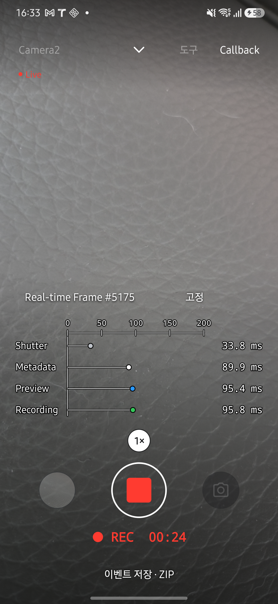
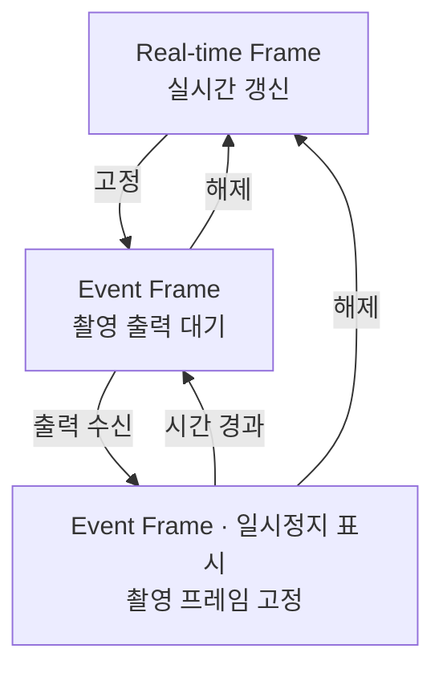
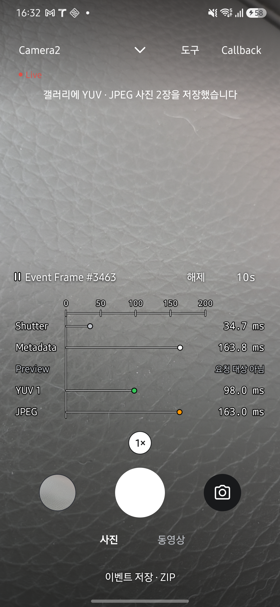

<h1 lang="en">One frame. Every callback.</h1>

**Live 화면의 `Callback`을 누르면 한 프레임의 콜백이 앱에 도착한 시각을 비교할 수 있습니다.** Shutter·Metadata와 현재 세션의 출력 스트림을 같은 시간축에 표시합니다. 점의 위치는 도착 시각이고, 오른쪽 고정 열은 그 값을 ms로 보여 줍니다.

그래프를 켜면 FPS·ISO·노출·AF·AE 정보 두 줄을 숨깁니다. 촬영·녹화 조작부는 그대로 사용할 수 있으며 `Callback`을 다시 누르면 그래프가 닫힙니다.

아래 화면은 2026년 9월 27일 Galaxy S25+·Android 16에서 HAL CAMERA 0.15.0을 실행해 촬영했습니다. <a href="evidence.html#앱-화면-촬영">촬영 조건과 확인 범위</a>를 함께 확인하세요. 이미지를 누르면 원본이 열립니다.

## 시간 기준을 확인하세요

**0ms는 이전 프레임의 `onCaptureStarted` 콜백을 앱에서 받은 시점입니다.** 현재 프레임의 Shutter부터 Metadata와 각 출력까지 모두 이 기준에서 경과한 시간을 표시합니다. 요청을 생성하거나 HAL에 전달한 시점을 기준으로 삼지 않습니다.

| 예시 행 | 표시값 | 읽는 방법 |
| --- | --- | --- |
| Shutter | 33ms | 이전 프레임의 Shutter를 받은 뒤 33ms에 현재 프레임의 Shutter를 받았습니다. |
| Metadata | 90ms | 같은 기준에서 90ms에 최종 메타데이터를 받았습니다. 현재 프레임의 Shutter와는 57ms 차이입니다. |
| Preview | 95ms | 같은 기준에서 95ms에 Preview 버퍼를 받았습니다. 현재 프레임의 Shutter와는 62ms 차이입니다. |

이 표는 읽는 법을 설명하기 위한 예시이며 실측 결과가 아닙니다. 구성 후 첫 프레임의 Shutter는 0ms이고, 이후 Shutter 값은 직전 프레임과의 콜백 간격을 나타냅니다. 기준 시각을 연결할 수 없으면 임의의 0을 넣지 않고 `시작 시각 없음`으로 표시합니다.

시간축은 값에 맞춰 자동으로 늘어납니다. 작은 범위가 3초 동안 유지되면 줄어들며, 자동 고정 중에는 늦게 도착한 결과를 담기 위한 확장만 합니다. 사용자가 범위를 설정할 필요는 없습니다.

## 스트림별 도착 시각을 읽으세요

세션 구성과 그래프는 같은 스트림 목록을 사용합니다. 표시 이름과 별개인 스트림 고유 ID로 결과를 연결하므로, YUV 출력이 여러 개여도 각각 추적합니다. 표시 중인 프레임이 요청하지 않은 출력도 행을 남겨 구분합니다.

| 행 | 앱에서 관측하는 지점 |
| --- | --- |
| Shutter | `onCaptureStarted` 콜백 수신 시점입니다. |
| Metadata | `onCaptureCompleted`의 최종 메타데이터 수신 시점입니다. Partial은 그래프에 표시하지 않습니다. |
| Preview | Camera2의 Android 13 이상에서 PRIVATE 버퍼를 받아 프리뷰로 전달하기 전의 시점입니다. 화면이 실제로 그려진 시각과는 다릅니다. |
| YUV 1, YUV 2, … | 해당 YUV 스트림의 이미지 수신 시점입니다. |
| JPEG | JPEG 이미지 수신 시점입니다. 파일 저장 완료 시점은 아닙니다. |
| Recording | Camera2의 Android 13 이상에서 PRIVATE 버퍼를 받아 인코더로 전달하기 전의 시점입니다. |

<figure class="app-screenshot" id="screen-callback-recording">

<figcaption>Camera2로 녹화하면서 Preview·Recording 값을 확인한 장면입니다. Real-time Frame에서는 시간 버튼이 숨겨지고 프레임이 계속 갱신됩니다. <a href="assets/screenshots/callback-recording.png">원본 보기</a></figcaption>
</figure>

Camera2의 Android 12 이하와 CameraX에서는 Preview·Recording 버퍼 도착을 직접 관측하지 못하므로 `콜백 없음`을 표시합니다. CameraX도 선택한 엔진에서 녹화하며, 녹화 세션에는 Preview·Recording 행이 표시됩니다.

CameraX의 YUV 행은 ImageAnalysis 수신 시점, JPEG 행은 ImageCapture 수신 시점입니다. 사진으로 저장하는 YUV는 JPEG와 시각이 가장 가까운 analysis 프레임이므로 두 행을 같은 촬영 요청의 결과로 해석하지 않습니다. 저장한 두 이미지의 시각 차이는 `media_saved`의 `yuvOffsetNs`에서 확인합니다.

버퍼와 프레임은 센서 타임스탬프가 같은지 확인하여 연결하고, 표시 시간은 앱의 단조 시계로 계산합니다. 이 값은 앱 수신 시각이며 HAL 내부 처리 완료 시각을 직접 측정한 값은 아닙니다.

## 촬영 프레임을 고정하세요

자동 고정은 처음에 켜져 있으며 기본 시간은 3초입니다. JPEG처럼 반복 요청하지 않는 출력이 도착하면 해당 프레임을 정해진 시간 동안 표시합니다. 카메라와 녹화는 계속 동작합니다.

| 표시·버튼 | 동작 |
| --- | --- |
| `Event Frame #1527` | 자동 고정이 켜진 상태입니다. `#1527`은 표시 중인 카메라 프레임 번호이며, 버튼을 누른 횟수가 아닙니다. |
| 프레임 번호 앞의 일시정지 표시 | 촬영 프레임을 실제로 고정하고 있는 동안에만 나타납니다. |
| `해제` | 자동 고정을 끄고 실시간 갱신으로 돌아갑니다. 시간 버튼도 숨깁니다. |
| `Real-time Frame #1527` | 자동 고정이 꺼진 상태입니다. |
| `고정` | 자동 고정을 다시 켭니다. 다음 촬영 출력을 기다리며, 누른 순간의 프리뷰를 즉시 멈추는 버튼은 아닙니다. |
| `3s` | 누를 때마다 `3s → 5s → 10s → 15s → 30s → 1s` 순서로 바뀝니다. |

1. `Event Frame` 상태에서 원하는 고정 시간을 선택합니다.
2. 사진을 촬영합니다. Camera2에서 YUV와 JPEG를 함께 요청했다면 같은 프레임의 두 행을 비교합니다.
3. 일시정지 표시가 나타난 동안 값을 읽습니다. 늦게 도착한 같은 프레임의 결과도 채워집니다.
4. 시간이 지나면 갱신이 재개됩니다. 곧바로 돌아가려면 `해제`를 누릅니다.

<figure class="app-screenshot" id="screen-callback-event">

<figcaption>고정 시간이 10초인 상태에서 사진을 촬영했습니다. 일시정지 표시와 같은 프레임의 YUV 1·JPEG 값을 확인할 수 있습니다. <a href="assets/screenshots/callback-event.png">원본 보기</a></figcaption>
</figure>

## 값이 없는 이유를 확인하세요

| 표시 | 의미 |
| --- | --- |
| 수신 대기 | 표시할 프레임이나 해당 결과를 아직 받지 못했습니다. |
| 요청 대상 아님 | 스트림은 세션에 있지만 표시 중인 프레임이 그 출력을 요청하지 않았습니다. |
| 촬영 대기 | 요청 대상 목록을 알 수 없는 프레임에서 비반복 출력을 기다리는 상태입니다. |
| 콜백 없음 | 현재 엔진·경로에서는 그 출력의 수신 시점을 직접 관측하지 못합니다. |
| 시작 시각 없음 | 출력은 받았지만 공통 기준 시각을 연결하지 못했습니다. |

코드 근거를 확인하세요

화면과 버튼은 <code>MainActivity.kt</code>·<code>ui/ResultCallbackGraph.kt</code>, 프레임 선택과 자동 고정은 <code>ui/ResultCallbackTimeline.kt</code>, 시간 기준과 결과 연결은 <code>ui/ResultCallbackSeries.kt</code>·<code>telemetry/Telemetry.kt</code>에서 확인할 수 있습니다. 세션과 그래프의 공통 스트림 목록은 <code>camera/StreamConfiguration.kt</code>, Camera2의 PRIVATE 버퍼 수신은 <code>camera/PreviewBufferRelay.kt</code>·<code>camera/RecordingBufferRelay.kt</code>가 담당합니다. CameraX의 관측 가능 여부와 출력 구성은 <code>camera/CameraXEngine.kt</code>, 사진 쌍의 연결은 <code>camera/CameraXStillCapture.kt</code>에 있습니다.

**다음 단계:** 반복 측정과 저장된 실행의 비교는 [Benchmark](benchmark.md)에서 확인하세요.
