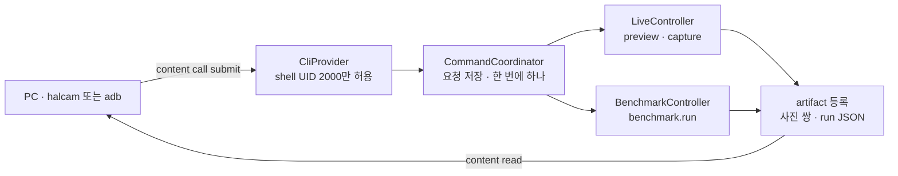

<h1 lang="en">Drive the app from a terminal.</h1>

**CLI는 앱의 기능을 PC로 옮기지 않고, 앱이 하는 일을 PC에서 시작합니다.** ADB로 연결한 PC가 명령을 제출하면 앱이 같은 카메라 엔진·같은 벤치마크 계약으로 실행하고, PC는 결과 JSON과 사진을 회수합니다. 화면에서 실행한 결과와 CLI로 실행한 결과는 같은 파일 형식이며 같은 [Results](benchmark.md)에 남습니다.

이 그림은 명령 하나가 지나가는 개념적 순서입니다. 앱은 명령을 먼저 저장한 뒤 실행하므로, PC의 연결이 끊겨도 요청 ID로 상태와 파일을 다시 찾을 수 있습니다.

<h2 lang="en">Turn it on first.</h2>

CLI는 기본으로 꺼져 있습니다. 앱에서 한 번 켜면 재실행 후에도 유지됩니다.

1. 앱을 열고 Live 화면 상단의 진단 패널을 엽니다.
2. `ADB CLI 허용` 스위치를 켭니다. 카메라 권한이 아직 없다면 Live에서 먼저 허용합니다. CLI는 권한을 대신 요청하지 않습니다.
3. PC에서 `adb devices`로 기기가 `device` 상태인지 확인합니다. USB와 무선 ADB 모두 쓸 수 있고, 둘 다 연결되어 있으면 `--serial`이나 `-s`로 하나를 지정합니다.

스위치를 끄면 새 명령과 파일 읽기는 `CLI_DISABLED`로 거부되고, 실행 중인 작업은 취소 절차로 들어갑니다.

<h2 lang="en">Install halcam.</h2>

`tools/halcam/`은 Python 표준 라이브러리만 쓰는 패키지입니다. Python 3.11 이상과 Android SDK Platform Tools가 있으면 됩니다.

~~~powershell
python -m pip install ./tools/halcam
halcam --serial DEVICE doctor --json
halcam --serial DEVICE cameras --json
~~~

`doctor`는 앱 설치·프로토콜 버전·CLI 허용·카메라 권한·잠금 상태를 한 번에 보고합니다. 여기서 실패하면 아래 명령은 같은 이유로 실패하므로 먼저 해결합니다. 설치 없이 개발 중에는 `python -m halcam`으로 같은 명령을 실행합니다.

<h2 lang="en">What you can run.</h2>

| 명령 | 앱에서 하는 일 | 결과 |
| --- | --- | --- |
| `devices` | 앱에 접근하지 않고 ADB 연결 목록만 봅니다. | 터미널 출력 |
| `doctor` | 앱 상태를 진단합니다. 설치나 권한을 바꾸지 않습니다. | 진단 JSON |
| `launch` | 투명한 `CliLaunchActivity`로 앱을 전면에 띄웁니다. 카메라 준비 완료를 뜻하지 않습니다. | 없음 |
| `cameras` | 논리 카메라와 물리 endpoint 목록을 읽습니다. 카메라를 열지 않습니다. | 카메라 JSON |
| `preview --camera ID` | 지정한 Camera2 논리 카메라의 첫 프리뷰까지 기다립니다. 끝나면 일반 Live 상태입니다. | 상태 JSON |
| `capture --camera ID --output DIR` | 사진 한 쌍(YUV에서 변환한 JPEG과 카메라 JPEG)을 찍어 PC로 받습니다. | JPEG 2장 |
| `benchmark run --camera ID --output DIR` | `camera2-standard-v1` profile로 벤치마크를 한 번 실행하고 run JSON을 받습니다. | schema 4 JSON |
| `probe --output DIR` | 카메라를 열지 않고 모든 카메라의 사양 표를 읽습니다. [Probe](probe.md)의 `JSON`·`TXT` 공유와 같은 파일입니다. 화면이 필요 없습니다. | JSON + TXT |
| `cts cases` | [CTS](cts.md) 체크리스트의 항목과 `cts run`에 넣을 키를 읽습니다. 화면이 필요 없습니다. | 항목 JSON |
| `cts run --case KEY … --output DIR` | 고른 항목을 체크리스트 순서로 실행하고 suite 보고서를 받습니다. FAIL 행은 실행 실패가 아니라 결과입니다. | JSON + TXT |
| `status --request UUID` | 앱을 앞으로 가져오지 않고 요청 상태만 읽습니다. | 상태 JSON |
| `fetch UUID --output DIR` | 이미 끝난 요청의 파일을 다시 받습니다. 촬영과 측정을 반복하지 않습니다. | 파일 |
| `cancel UUID` | 실행 중인 요청을 취소합니다. 끝난 요청에는 현재 결과를 돌려줍니다. | 상태 JSON |

`--camera`에는 `cameras` 결과에서 `selectable: true`인 논리 ID만 넣습니다. `0.2` 같은 물리 endpoint key는 `UNSUPPORTED_CAMERA`로 거부됩니다. `benchmark run`의 `--profile`은 현재 `camera2-standard-v1` 하나만 받습니다.

`cts run`의 키는 `cts cases` 결과의 `key` 그대로이며 `custom:fast_on_off`, `vendored:android.hardware.camera2.cts.RecordingTest#testBasicRecording`처럼 종류 접두어가 붙습니다. 마이크가 필요한 항목(`needs_audio: true`)은 앱에서 녹음 권한을 먼저 허용해야 하고, CLI는 권한을 대신 요청하지 않습니다. 실행 제한 기본값은 1,800초이며 suite가 길면 `--timeout`으로 올립니다(상한 3,600초).

한 번에 하나의 명령만 실행됩니다. 화면에서 촬영·녹화·벤치마크가 진행 중이면 CLI 명령은 `BUSY`로 돌아오고, 반대로 CLI가 실행 중이면 화면 조작도 같은 규칙을 따릅니다. `--json`을 붙이면 stdout에 최종 JSON 하나만 나오고 진행 메시지는 stderr로 갑니다. 종료 코드의 의미는 [CLI 설계 문서](https://github.com/TTolsun/hal-camera/blob/main/docs/design/CLI.md)의 "시간 제한과 종료 코드"에 있습니다.

The app runs it. The PC only asks and collects.

<h2 lang="en">No Python? Use adb directly.</h2>

`halcam`은 ADB 위의 얇은 껍데기입니다. Python이 없는 PC에서는 같은 provider를 `adb`만으로 부를 수 있습니다. 아래는 PowerShell 예시이며, 요청 JSON을 패딩 없는 base64url로 감싸서 보내는 것이 전부입니다.

1. 상태를 읽습니다. `enabled`가 `false`면 앱에서 스위치를 켭니다.

   ~~~powershell
   adb exec-out content read --uri content://dev.halcamera.cli/v1/hello
   adb exec-out content read --uri content://dev.halcamera.cli/v1/status
   ~~~

2. 요청을 만들어 제출합니다. `request_id`는 소문자 UUID여야 하고, `params`에는 `camera_id`·`profile_id`(카메라 명령) 또는 `cases` 배열(`cts.run`)만 들어갑니다. `execution_timeout_ms`는 preview·capture·probe 30초, benchmark 180초, cts.run 1,800초가 기본이며 3,600초를 넘길 수 없습니다.

   ~~~powershell
   $id = [guid]::NewGuid().ToString()
   $json = '{"protocol_version":1,"request_id":"' + $id + '","command":"benchmark.run","params":{"camera_id":"0","profile_id":"camera2-standard-v1"},"execution_timeout_ms":180000}'
   $arg = [Convert]::ToBase64String([Text.Encoding]::UTF8.GetBytes($json)).TrimEnd('=').Replace('+','-').Replace('/','_')
   adb shell content call --uri content://dev.halcamera.cli --method submit --arg $arg
   ~~~

   응답은 `Result: Bundle[{halcam_v1=<base64url>}]` 형태입니다. 값을 base64url로 풀면 `state: "accepted"`가 보입니다.

3. 앱을 전면으로 띄웁니다. `status`의 `screen`이 `"live"`가 아니면 실행이 시작되지 않습니다. `cameras`·`probe`·`cts.cases`는 화면 없이 바로 끝나므로 이 단계가 필요 없습니다.

   ~~~powershell
   adb shell am start -W -f 0x18000000 -n dev.halcamera/dev.halcamera.cli.CliLaunchActivity
   ~~~

4. `state`가 `succeeded`가 될 때까지 요청을 읽고, 등록된 파일을 받습니다. artifact ID는 `file-0`, `file-1` 순서입니다.

   ~~~powershell
   adb exec-out content read --uri content://dev.halcamera.cli/v1/requests/$id
   adb exec-out content read --uri content://dev.halcamera.cli/v1/requests/$id/artifacts/file-0 > run.json
   ~~~

취소는 `--method cancel`에 `{"protocol_version":1,"request_id":"<uuid>"}`를 같은 방식으로 넣습니다. `halcam`이 추가로 하는 일은 응답 JSON의 schema 검사와 파일 크기·SHA-256 대조뿐이므로, 직접 호출할 때는 `size_bytes`와 `sha256`을 받은 파일과 비교하세요. Git Bash에서는 `content://` 경로가 Windows 경로로 바뀌지 않도록 `MSYS_NO_PATHCONV=1`을 앞에 붙입니다.

<h2 lang="en">Not on the CLI yet.</h2>

| 기능 | 현재 경로 |
| --- | --- |
| baseline 지정, 비교, profile 비교 | Results·Compare 화면. CLI가 받은 run JSON을 화면의 JSON 가져오기로 넣으면 같은 비교를 할 수 있습니다. |
| 동영상 녹화, 줌, CameraX 엔진 선택 | Live 화면 |
| incident ZIP 수집 | 진단 패널 |

이 목록은 설계상 "후속 범위"이며 provider의 명령 집합(`/v1/hello`의 `commands`)이 늘어나면 이 표도 줄어듭니다.

<h2 lang="en">When it does not finish.</h2>

`status --request UUID`부터 읽으세요. PC의 대기 시간이 끝난 것과 앱의 실행이 실패한 것은 다른 사건입니다. 자주 만나는 상태와 대응은 [디버깅](troubleshooting.md#cli-작업이-끝나지-않거나-파일이-없을-때)에 있고, 기기별 검증 결과는 [전송 검증 기록](https://github.com/TTolsun/hal-camera/blob/main/docs/validation/cli-transport.md)에 있습니다.

코드 근거를 확인하세요

저장소의 <code>app/src/main/java/dev/halcamera/cli/</code>에서 <code>CliProvider.kt</code>(shell 호출자 검사와 URI), <code>CommandCoordinator.kt</code>(요청 저장·artifact 등록·probe·cts.cases), <code>CliCommand.kt</code>(허용 명령·인자 검사), <code>LiveController.kt</code>·<code>BenchmarkController.kt</code>·<code>CtsController.kt</code>(화면 driver 어댑터)와 <code>tools/halcam/halcam/cli.py</code>(PC 명령 정의), <code>tools/halcam/protocol-v1.schema.json</code>(응답 schema)을 확인하세요. 요청·상태·오류 계약의 원본은 <code>docs/design/CLI.md</code>입니다.

**다음 단계:** `halcam --serial DEVICE benchmark run --camera 0 --output ./runs --json`으로 run 하나를 받고, [Benchmark](benchmark.md)에서 그 JSON의 validity와 점수를 읽는 방법을 확인하세요.
