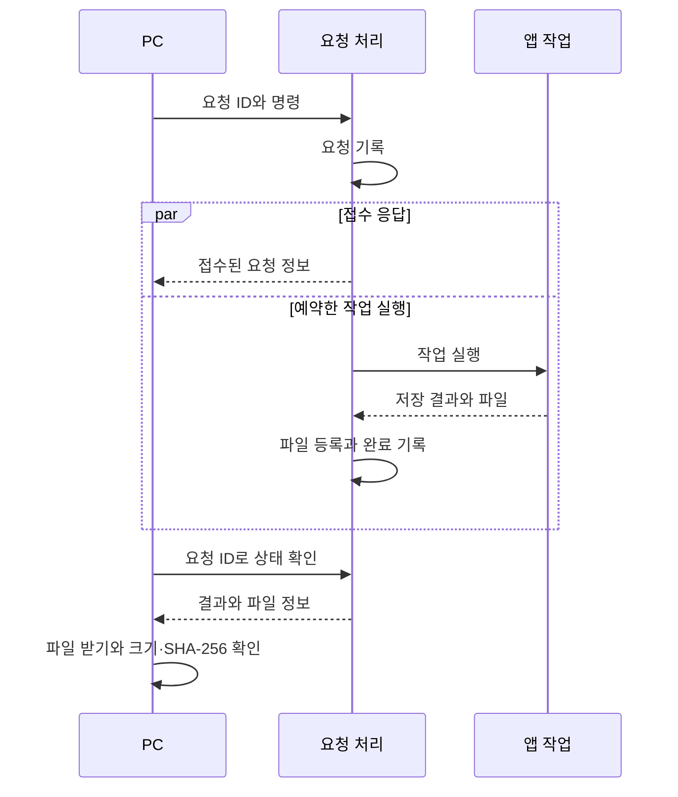

<h1 lang="en">Control the camera with adb.</h1>

**기기를 연결하고 아래 준비 명령으로 사진을 한 번 촬영하세요.** Windows(PowerShell·CMD) 또는 WSL과 `adb`가 필요합니다. 앱 소스나 빌드 도구는 필요하지 않습니다.

ADB CLI는 기본으로 허용됩니다. 직접 꺼 둔 경우에는 앱의 `Lab → ADB CLI`에서 켜세요. 꺼 둔 설정은 업데이트 후에도 유지됩니다.

## 처음 실행하세요

1. 사용할 터미널에서 `adb devices -l`로 연결된 기기를 확인합니다. `unauthorized`이면 기기에서 디버깅을 허용하고, `offline`이면 연결을 복구합니다. 환경별 연결 방법은 아래를 참고하세요.
2. HAL CAM APK를 `adb install -r HALCamera.apk`로 설치하고 앱에서 카메라 권한을 허용합니다. 서명이 맞지 않으면 기존 앱을 삭제하지 말고 같은 서명의 APK를 준비합니다. 화면 잠금을 해제합니다. 소리가 있는 녹화에는 마이크 권한도 필요합니다.
3. 앱에 포함된 스크립트를 기기에 준비한 뒤 촬영합니다. APK를 업데이트하면 첫 번째 명령으로 스크립트도 갱신합니다.

```sh
adb shell "content read --uri content://dev.halcamera.cli/v1/shell > /data/local/tmp/halcam"
adb shell sh /data/local/tmp/halcam doctor
adb shell sh /data/local/tmp/halcam cameras
adb shell sh /data/local/tmp/halcam capture --camera 0
```

앱 열기, 요청 ID 생성, 완료 대기는 자동으로 처리합니다. 결과에 출력되는 `adb pull` 명령으로 파일을 PC에 받습니다. Windows에서도 바이너리 파일을 그대로 복사합니다.

<details>
<summary>Windows·WSL에서 ADB를 연결하는 방법</summary>

`adb version`으로 실행 파일을 확인합니다. 명령을 찾지 못하면 platform-tools의 `adb`를 전체 경로로 실행하거나 PATH에 추가합니다.

**Windows:** Android SDK Platform-Tools 폴더를 PATH에 추가하고 PowerShell 또는 CMD에서 위 명령을 실행합니다. USB 연결은 기기에서 이 PC의 디버깅을 허용합니다.

**WSL:** Linux용 `adb`를 설치하고 무선 디버깅으로 연결하면 WSL 경로로 파일을 받을 수 있습니다. USB 기기를 Windows의 ADB에 연결한 경우에는 WSL에서 해당 `adb.exe`를 호출할 수도 있습니다.

```sh
# Windows 사용자명과 SDK 경로를 실제 설치 위치로 바꿉니다.
adb() { "/mnt/c/Users/USERNAME/AppData/Local/Android/Sdk/platform-tools/adb.exe" "$@"; }
adb devices
```

이 함수로 위의 공통 명령을 실행할 수 있습니다. 다만 Windows `adb.exe`로 파일을 받을 때에는 `adb pull /sdcard/Download/HALCamera-cli/요청ID C:/Users/USERNAME/Downloads`처럼 **Windows 대상 경로**를 사용합니다. Linux `adb`와 Windows `adb.exe`는 연결 목록이 다를 수 있으므로 준비·실행·회수에 같은 실행 파일을 사용합니다.

**무선 연결:** 최초 연결은 `adb pair IP:PAIR_PORT`, 이후 연결은 `adb connect IP:PORT`를 실행합니다. 주소와 코드는 기기의 무선 디버깅 화면에서 확인하며 페어링 포트와 연결 포트는 다를 수 있습니다. 여러 기기가 연결되어 있으면 모든 명령에 `adb -s SERIAL`을 사용합니다. 출력된 `adb pull` 명령에도 같은 `-s SERIAL`을 붙입니다. 동일한 기기가 USB·무선으로 두 번 표시되어도 연결 선택이 필요합니다.

Git Bash에서는 기기 경로가 Windows 경로로 바뀌지 않도록 먼저 `export MSYS2_ARG_CONV_EXCL='*' MSYS_NO_PATHCONV=1`을 실행합니다. PowerShell·CMD·WSL에서는 이 설정이 필요하지 않습니다.

</details>

## 명령을 실행하세요

| 명령 | 동작과 결과 |
| --- | --- |
| `doctor` | 카메라를 열지 않고 기본 준비 상태와 조치 안내를 출력합니다. |
| `preview` 또는 `preview start` | 선택한 엔진의 첫 프리뷰 프레임까지 기다립니다. 이후에도 프리뷰를 유지합니다. |
| `preview stop` | 카메라를 닫고 프리뷰를 멈춥니다. |
| `capture` | 선택한 카메라로 프리뷰를 준비하고 켜진 출력의 사진을 저장합니다. 기본값은 두 장입니다. |
| `record start` | 프리뷰를 준비하고 영상 녹화를 시작합니다. 실제 시작을 확인하면 반환합니다. |
| `record stop` | 현재 CLI 녹화를 끝내고 저장 완료까지 기다립니다. 화면에서 시작한 녹화는 멈추지 않습니다. |
| `streams` | 선택한 카메라와 엔진의 스트림 크기·녹화 옵션을 조회합니다. |
| `cameras` | 논리 카메라와 물리 endpoint를 조회합니다. `selectable: true`인 논리 ID를 선택합니다. |
| `probe` | 카메라 사양 JSON과 TXT를 만듭니다. 카메라를 열지 않습니다. |
| `cts cases` | 실행할 수 있는 CTS 항목의 키와 마이크 필요 여부를 조회합니다. |
| `cts run --cases KEY[,KEY...]` | 선택 항목을 체크리스트 순서로 실행하고 보고서를 저장합니다. |
| `benchmark run [--camera ID] [--profile camera2-standard-v2]` | 앱 화면과 같은 Camera2 벤치마크를 한 번 실행하고 원본 JSON을 회수합니다. |
| `status [UUID]` | 지정한 요청이나 마지막 제출 요청을 조회합니다. 제출 기록이 없으면 앱 상태를 표시합니다. |
| `status --app` | 마지막 요청 기록과 관계없이 앱의 현재 작업과 화면 상태를 조회합니다. |
| `cancel [UUID]` | 지정한 요청이나 마지막 제출 요청을 취소합니다. |
| `fetch [UUID]` | 완료된 요청의 파일을 다시 준비하고 `adb pull` 명령을 안내합니다. 촬영을 반복하지 않습니다. |

<details>
<summary>기본값·실행 제한·기록 보관</summary>

`doctor`는 CLI 허용·카메라 권한·잠금·작업 중 여부를 확인하며, 준비가 부족하면 종료 코드 1과 조치 안내를 출력합니다. 카메라를 열거나 설정을 바꾸지 않으며 마이크·저장소 권한과 실제 카메라 구성 성공까지 보장하지는 않습니다. CLI가 꺼져 있으면 `hello`는 `CLI_DISABLED` 오류를 반환합니다.

카메라 ID의 기본값은 `0`입니다. 기본 사진은 YUV 변환 JPEG과 카메라 JPEG 두 장이며, 영상은 MP4입니다. `--no-audio`로 무음 녹화를 선택합니다. 녹화 실행 제한은 기본 1시간이며 `--timeout 초`로 줄일 수 있습니다. 제한에 도달하면 녹화를 종료하고 요청에 시간 제한 오류를 기록합니다.

CTS 키는 `custom:fast_on_off`나 `vendored:android.hardware.camera2.cts.RecordingTest#testBasicRecording`과 같이 목록에 나온 값을 그대로 사용합니다. CTS 실행 제한은 기본 1,800초이며 최대 3,600초입니다. 사진·프리뷰·probe는 기본 30초입니다. Android 8–9에서 사진이나 영상을 저장할 때에는 저장소 권한도 필요합니다.

녹화 준비에는 최대 30초를 기다립니다. 멈출 CLI 녹화가 없을 때 `record stop`을 호출하면 `NOT_RECORDING`으로 거부합니다. 화면을 벗어나 녹화가 종료되면 `RECORDING_INTERRUPTED`로 기록하여 정상적인 `record stop` 완료와 구분합니다. 완료 기록은 최대 24시간·200개를 보관합니다. CLI는 Android 사용자 0을 대상으로 합니다.

</details>

## 벤치마크를 실행하세요

```sh
adb shell sh /data/local/tmp/halcam benchmark run --camera 0
adb shell sh /data/local/tmp/halcam benchmark run --camera 0 --profile camera2-standard-v2 --no-wait
adb shell sh /data/local/tmp/halcam status REQUEST_ID
adb shell sh /data/local/tmp/halcam cancel REQUEST_ID
adb shell sh /data/local/tmp/halcam fetch REQUEST_ID
```

앞의 두 실행 예제 중 하나를 선택합니다. 기본 실행은 JSON 저장과 회수 준비까지 기다립니다. `--no-wait`은 접수 후 반환하므로 출력된 요청 ID로 상태를 조회합니다. Live 카메라의 종료 콜백을 받은 뒤 벤치마크 화면으로 이동하며, 화면과 동일한 preflight·Runner·판정·저장 경로를 사용합니다. 화면을 켜고 잠금을 해제한 상태를 유지해야 합니다.

프로파일은 `camera2-standard-v2` 하나를 지원하며 생략하면 이 값을 사용합니다. Camera2의 warm reopen·관측·사진·녹화 시퀀스를 실행합니다. `--engine`, Live 스트림 크기, `--no-audio`는 받지 않습니다. 크기 자동 대체나 baseline 자동 지정도 하지 않습니다. 기본 실행 제한은 준비 시간을 포함한 600초이며 `--timeout 초`로 1–3,600초를 지정합니다.

Provider에 JSON으로 직접 제출할 때에는 `command: "benchmark.run"`, `params.camera_id`, `params.profile_id: "camera2-standard-v2"`, `execution_timeout_ms`를 명시합니다. 셸의 `--profile`과 직접 호출의 `--extra profile:s:...`가 JSON의 `profile_id`에 대응합니다.

완료 결과에는 `run_id`, `camera_id`, `profile_id`, `report_schema_version`, `artifact_count`가 들어 있습니다. 요청 성공은 보고서 저장 완료를 뜻합니다. 측정·비교 가능 여부와 성능 저하 판정은 원본 JSON에서 따로 확인하세요. 보고서에는 이미지 픽셀이 포함되지 않으며 녹화 MP4를 CLI 산출물로 내보내지 않습니다.

열 상태·절전 상태·지원 조건이 맞지 않으면 `PREFLIGHT_FAILED`, 실행 중 실패는 `BENCHMARK_FAILED`, 중단은 `CANCELLED`, 실행 제한 초과는 `EXECUTION_TIMEOUT`으로 기록됩니다. 실패·취소 후에도 저장된 JSON이 있으면 `fetch REQUEST_ID`로 회수할 수 있습니다. 앱 프로세스가 종료되면 `interrupted`로 남으며 자동으로 재실행하지 않습니다.

## 스트림 크기를 지정하세요

지원 목록을 먼저 조회한 뒤 프리뷰·촬영·녹화 명령에 크기 옵션을 붙입니다. 엔진의 기본값은 Camera2이며, CameraX를 사용할 때에는 조회와 실행 모두에 `--engine CameraX`를 지정합니다.

```sh
adb shell sh /data/local/tmp/halcam streams --camera 0
adb shell sh /data/local/tmp/halcam streams --camera 0 --engine CameraX
adb shell sh /data/local/tmp/halcam preview --camera 0 --preview-size 1280x720 --yuv-size 640x480 --jpeg-size 1920x1080
adb shell sh /data/local/tmp/halcam capture --camera 0 --engine CameraX --yuv-size off --jpeg-size 1920x1080
adb shell sh /data/local/tmp/halcam record start --camera 0 --video-size 1280x720 --video-fps 30 --codec HEVC --no-audio
adb shell sh /data/local/tmp/halcam record stop
```

`--preview-size`, `--yuv-size`, `--jpeg-size`, `--video-size`는 `너비x높이` 형식을 사용합니다. YUV와 JPEG는 `off`로 끌 수 있지만, `capture`에는 적어도 하나가 필요합니다. `--video-fps`는 녹화 프레임 레이트이고 `--codec`은 Camera2에서 H264·HEVC, CameraX에서 Auto를 사용합니다. CameraX의 실제 녹화 코덱은 라이브러리가 선택합니다.

생략한 값은 기본 설정을 사용하며 이전 UI·CLI 설정을 이어받지 않습니다. 적용한 설정은 명령 완료 후 Live에 남지만 다음 CLI 카메라 명령은 다시 기본값과 명시한 옵션으로 구성합니다. 지원하지 않는 값은 `PREFLIGHT_FAILED`로 거부하며 다른 크기로 자동 변경하지 않습니다. 지원 목록은 개별 크기와 인코더 조건을 나타내며 출력 조합의 성공까지 보장하지 않습니다. 실제 세션 구성에서 실패할 수도 있습니다.

`preview` 완료 결과와 녹화 시작 상태의 `result.streams`에서 적용된 크기를 확인할 수 있습니다.

<details>
<summary>Provider를 직접 호출하는 방법</summary>

Provider 직접 호출에서는 `--extra preview_size:s:1280x720`, `--extra engine:s:CameraX`처럼 문자열로 전달합니다. JSON 제출은 `params.engine`과 `params.streams` 객체를 사용하며, 크기·FPS·코덱 값은 모두 문자열입니다. 예를 들어 `"streams":{"preview_size":"1280x720","yuv_size":"off"}`로 전달합니다.

스크립트 없이도 `content call`로 직접 호출할 수 있습니다. 응답의 `json` 값은 사람이 읽을 수 있는 JSON이며 Base64 변환은 필요하지 않습니다. 사진·프리뷰·녹화·CTS 실행 전에 Live 화면을 엽니다.

```sh
adb shell am start -W -n dev.halcamera/.cli.CliLaunchActivity
adb shell content call --uri content://dev.halcamera.cli --method capture --extra camera:s:0
adb shell content call --uri content://dev.halcamera.cli --method record.start --extra camera:s:0 --extra audio:b:false
adb shell content call --uri content://dev.halcamera.cli --method record.stop
adb shell content call --uri content://dev.halcamera.cli --method cts.run --arg custom:fast_on_off
adb shell content call --uri content://dev.halcamera.cli --method benchmark.run --extra camera:s:0 --extra profile:s:camera2-standard-v2
adb exec-out content read --uri content://dev.halcamera.cli/v1/status
```

CTS 항목만 `--extra`가 아니라 `--arg`로 전달합니다. `--extra`는 값을 `키:타입:값`으로 자르는데 suite 키에는 `custom:`이나 `vendored:` 접두어의 콜론이 들어 있어서, `content`가 앱에 닿기 전에 거부하기 때문입니다. 여러 항목은 쉼표로 이어 붙입니다.

직접 제출한 명령은 접수 결과를 반환합니다. 응답의 `request_id`로 `/v1/requests/UUID`를 읽어 완료를 확인합니다. `--extra request_id:s:UUID`로 같은 ID를 재사용하면 중복 촬영을 막을 수 있고, 다른 인자로 같은 ID를 쓰면 `REQUEST_CONFLICT`가 됩니다. `timeout_ms:l:30000`으로 실행 제한을 지정합니다. 알 수 없는 인자와 잘못된 타입은 거부합니다.

기존 Python 도구의 `submit`·`cancel` Base64 전송은 유지합니다. 지원 명령은 `/v1/hello`의 `commands`, 상태 조회·취소 등의 조작은 `controls`에서 확인합니다.

</details>

<details>
<summary>선택 도구: Python 클라이언트</summary>

사진·probe·CTS·벤치마크 파일 수집을 자동화하려면 Python 3.11 이상에서 다음과 같이 설치합니다. 녹화와 프리뷰 종료는 위의 ADB 스크립트를 사용합니다.

```sh
python -m pip install ./tools/halcam
halcam --serial DEVICE doctor --json
halcam --serial DEVICE streams --camera 0 --engine CameraX --json
halcam --serial DEVICE preview --camera 0 --engine CameraX --preview-size 1280x720 --yuv-size off --json
halcam --serial DEVICE capture --camera 0 --output ./photos --json
halcam --serial DEVICE probe --output ./probe --json
halcam --serial DEVICE benchmark run --camera 0 --output ./runs --json
```

Python 도구의 `--json`은 stdout에 JSON 하나를 출력하며, `--wait-timeout`은 PC에서 기다리는 시간만 제한합니다. ADB 스크립트는 진행 메시지와 요청별 결과를 출력하고 성공 시 0, 오류 시 1을 반환합니다. 기계적으로 JSON만 처리하려면 직접 `content read`를 사용합니다.

</details>

## 요청과 완료를 구분하세요

**접수 응답을 받아도 촬영이나 저장이 끝난 것은 아닙니다.** 파일을 만드는 명령은 결과 파일이 등록된 뒤 회수합니다.


```mermaid
sequenceDiagram
    participant P as PC
    participant C as 요청 처리
    participant A as 앱 작업
    P->>C: 요청 ID와 명령
    C->>C: 요청 기록
    par 접수 응답
        C-->>P: 접수된 요청 정보
    and 예약한 작업 실행
        C->>A: 작업 실행
        A-->>C: 저장 결과와 파일
        C->>C: 파일 등록과 완료 기록
    end
    P->>C: 요청 ID로 상태 확인
    C-->>P: 결과와 파일 정보
    P->>P: 파일 받기와 크기·SHA-256 확인
```

같은 요청 ID와 같은 명령을 다시 보내면 기존 상태나 결과를 돌려줍니다. 같은 ID에 다른 인자를 보내면 충돌로 처리합니다. 조회 명령처럼 파일을 만들지 않는 작업에는 파일 회수 단계가 없습니다.

## 요청이 끝나지 않거나 파일이 없을 때

**같은 촬영을 새로 요청하기 전에 기존 요청의 상태를 확인하세요.** PC의 대기 종료나 연결 끊김만으로 앱 작업이 실패한 것은 아닙니다.

1. 아래 명령에서 `REQUEST_ID`를 기존 요청 ID로 바꿔 상태를 조회합니다.

   ~~~sh
   adb shell sh /data/local/tmp/halcam status REQUEST_ID
   ~~~

2. 아직 실행 중이면 기다린 뒤 다시 조회합니다. 중단해야 한다면 `cancel REQUEST_ID`를 사용합니다. 이미 제출한 사진은 저장될 수 있습니다.
3. 파일이 생성됐으면 아래 명령으로 회수를 다시 준비합니다. 실패·취소한 요청에도 파일이 남을 수 있습니다.

   ~~~sh
   adb shell sh /data/local/tmp/halcam fetch REQUEST_ID
   ~~~

4. 출력된 `adb pull` 명령으로 파일을 PC에 받습니다. 복사 실패와 촬영 실패를 구분하세요.

<details markdown="1" id="cli-request-recovery" data-search-section>
<summary>요청 ID 생략과 기기의 회수용 파일</summary>

`--no-wait`은 접수 직후 반환합니다. `status`·`fetch`·`cancel`에서 ID를 생략하면 마지막 제출 요청을 사용합니다. 다른 작업과 혼동하지 않도록 복구할 때에는 기존 ID를 지정하세요.

회수용 파일은 기기의 `Download/HALCamera-cli/요청ID`에 크기와 SHA-256을 검증한 복사본으로 준비합니다. 이 복사본은 자동으로 삭제하지 않습니다.

</details>


| 상태·오류 | 다음 행동 |
| --- | --- |
| `CLI_DISABLED` | 앱의 **Lab → ADB CLI**에서 **ADB CLI 허용**을 다시 켭니다. adb로는 이 설정을 바꿀 수 없습니다. |
| `PERMISSION_REQUIRED` | 앱에서 필요한 카메라·마이크·저장소 권한을 허용합니다. |
| `BUSY` | UI 또는 CLI의 현재 작업이 끝날 때까지 기다립니다. 기존 작업을 제어하는 `record stop`과 `cancel`은 실행 중에도 사용할 수 있습니다. |
| `interrupted` | 앱 프로세스가 종료된 미완료 기록입니다. 남은 파일을 확인한 뒤 재실행 여부를 정합니다. 자동으로 재실행하지 않습니다. |
| `PREFLIGHT_FAILED` | `streams`로 지원 크기와 코덱을 확인하고 출력 조합을 줄입니다. |
| `UNKNOWN_CASE` | `cts cases`를 다시 조회하고 반환된 키를 그대로 사용합니다. |
| `REQUEST_CONFLICT` | 같은 요청 ID에 다른 인자를 사용했습니다. 기존 요청을 조회하고, 별도 작업을 의도했다면 새 ID로 제출합니다. |

CLI 작업 중에는 화면 조작이 제한됩니다.

**다음 단계:** 에이전트에게 작업을 맡기는 방법은 [Agents](coding-agents.md)를 확인하세요.
