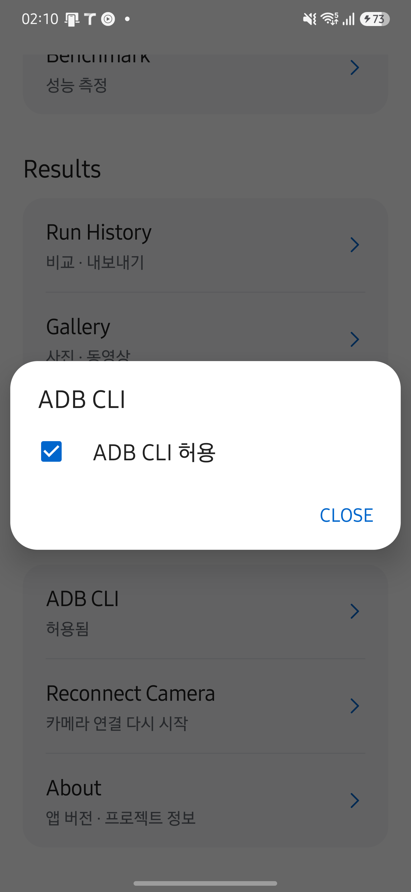

<h1 lang="en">Control the camera with adb.</h1>

PC에는 `adb`만 있으면 됩니다. HAL CAM APK를 설치하고 앱의 **도구 → 설정 · 앱 정보 → ADB CLI 설정**에서 **ADB CLI 허용**을 켭니다. 기본값은 꺼짐이며 adb로는 켤 수 없습니다. 카메라 권한을 허용하고 화면 잠금을 해제합니다. 소리를 포함하여 녹화하려면 마이크 권한도 필요합니다.

<p class="doc-evidence">아래 화면은 2026년 9월 27일 Galaxy S25+·Android 16에서 HAL CAMERA 0.15.0을 실행해 촬영했습니다. <a href="evidence.html#앱-화면-촬영">촬영 조건과 확인 범위</a>를 함께 확인하세요. 이미지를 누르면 원본이 열립니다.</p>

<figure class="app-screenshot" id="screen-cli-settings">
<a href="assets/screenshots/cli-settings.png" aria-label="ADB CLI 허용 상태를 표시하는 앱 설정 원본 보기"></a>
<figcaption>도구 → 설정 · 앱 정보 → ADB CLI 설정을 연 화면입니다. 촬영 기기는 이미 허용된 상태였으며 설정을 변경하지 않았습니다. <a href="assets/screenshots/cli-settings.png">원본 보기</a></figcaption>
</figure>

무선 디버깅 기기는 `adb connect IP:PORT`로 연결합니다. 최초 페어링이 필요하면 기기의 무선 디버깅 화면에서 표시되는 주소와 코드로 `adb pair IP:PAIR_PORT`를 실행합니다. 연결 포트와 페어링 포트는 다를 수 있습니다. 여러 기기가 연결되어 있으면 아래의 모든 명령에 `adb -s IP:PORT`를 사용합니다.

앱에 포함된 스크립트를 기기에 한 번 준비합니다. APK를 업데이트한 뒤에도 같은 명령으로 갱신할 수 있습니다.

```sh
adb shell "content read --uri content://dev.halcamera.cli/v1/shell > /data/local/tmp/halcam"
```

이후 다음 명령을 사용합니다. 앱 열기, 요청 ID 생성, 완료 대기는 자동으로 처리합니다.

```sh
adb shell sh /data/local/tmp/halcam help
adb shell sh /data/local/tmp/halcam cameras
adb shell sh /data/local/tmp/halcam preview --camera 0
adb shell sh /data/local/tmp/halcam capture --camera 0
adb shell sh /data/local/tmp/halcam record start --camera 0
adb shell sh /data/local/tmp/halcam record stop
adb shell sh /data/local/tmp/halcam preview stop
adb shell sh /data/local/tmp/halcam status
```

카메라 ID의 기본값은 `0`이며, `cameras`로 사용 가능한 ID를 확인합니다. 사진은 YUV 변환 JPEG과 카메라 JPEG 두 장입니다. 녹화는 MP4이며 `--no-audio`로 무음 녹화를 선택할 수 있습니다. `record start`는 실제 녹화 시작을 확인한 뒤 반환하고, `record stop`은 MP4 저장과 결과 등록까지 기다립니다. 녹화 실행 제한의 기본값은 1시간이며, `--timeout 초`로 줄일 수 있습니다. 제한에 도달하면 녹화를 종료하고 요청에 시간 제한 오류를 기록합니다.

결과 파일이 있으면 기기의 `Download/HALCamera-cli/요청ID`에 크기와 SHA-256을 검증한 복사본을 준비하고, PC로 받는 `adb pull` 명령 한 줄을 출력합니다. `adb pull`은 CMD와 PowerShell에서도 바이너리를 그대로 복사합니다. 기기 복사본은 자동으로 삭제하지 않습니다.

`--no-wait`은 요청 접수 뒤 바로 반환합니다. 무선 연결이 끊겨도 같은 작업을 다시 실행하지 말고, 재연결 후 `status 요청ID` 또는 `fetch 요청ID`로 확인합니다. ID를 생략하면 스크립트가 마지막으로 제출한 요청을 사용합니다. `cancel 요청ID`로 취소할 수 있으며, 이미 제출한 사진 저장은 완료될 수 있습니다.

`probe`, `cts cases`, `cts run --cases KEY[,KEY...]`도 지원합니다. 벤치마크는 CLI 지원 범위에서 제외하며 앱 화면에서 실행합니다. Python `halcam`은 사진·probe·CTS 파일 수집을 위한 선택 도구입니다. 기본 CLI에 Python이나 pip는 필요하지 않습니다.

## 명령을 실행하세요

| 명령 | 동작과 결과 |
| --- | --- |
| `preview` 또는 `preview start` | Camera2의 첫 프리뷰 프레임까지 기다립니다. 이후에도 프리뷰를 유지합니다. |
| `preview stop` | 카메라를 닫고 프리뷰를 멈춥니다. |
| `capture` | 선택한 카메라로 프리뷰를 준비하고 사진 두 장을 저장합니다. |
| `record start` | 프리뷰를 준비하고 영상 녹화를 시작합니다. 실제 시작을 확인하면 반환합니다. |
| `record stop` | 현재 CLI 녹화를 끝내고 저장 완료까지 기다립니다. 화면에서 시작한 녹화는 멈추지 않습니다. |
| `cameras` | 논리 카메라와 물리 endpoint를 조회합니다. `selectable: true`인 논리 ID를 선택합니다. |
| `probe` | 카메라 사양 JSON과 TXT를 만듭니다. 카메라를 열지 않습니다. |
| `cts cases` | 실행할 수 있는 CTS 항목의 키와 마이크 필요 여부를 조회합니다. |
| `cts run --cases KEY[,KEY...]` | 선택 항목을 체크리스트 순서로 실행하고 보고서를 저장합니다. |
| `status [UUID]` | 지정한 요청이나 마지막 제출 요청을 조회합니다. 제출 기록이 없으면 앱 상태를 표시합니다. |
| `cancel [UUID]` | 지정한 요청이나 마지막 제출 요청을 취소합니다. |
| `fetch [UUID]` | 완료된 요청의 파일을 다시 준비하고 `adb pull` 명령을 안내합니다. 촬영을 반복하지 않습니다. |

CTS 키는 `custom:fast_on_off`나 `vendored:android.hardware.camera2.cts.RecordingTest#testBasicRecording`과 같이 목록에 나온 값을 그대로 사용합니다. CTS 실행 제한은 기본 1,800초이며 최대 3,600초입니다. 사진·프리뷰·probe는 기본 30초입니다. Android 8–9에서 사진이나 영상을 저장할 때에는 저장소 권한도 필요합니다.

녹화 준비에는 최대 30초를 기다립니다. 멈출 CLI 녹화가 없을 때 `record stop`을 호출하면 `NOT_RECORDING`으로 거부합니다. 화면을 벗어나 녹화가 종료되면 `RECORDING_INTERRUPTED`로 기록하여 정상적인 `record stop` 완료와 구분합니다. 완료 기록은 최대 24시간·200개를 보관합니다. CLI는 Android 사용자 0을 대상으로 합니다.

## Provider를 직접 호출하세요

스크립트 없이도 `content call`로 직접 호출할 수 있습니다. 응답의 `json` 값은 사람이 읽을 수 있는 JSON이며 Base64 변환은 필요하지 않습니다. 사진·프리뷰·녹화·CTS 실행 전에 Live 화면을 엽니다.

```sh
adb shell am start -W -n dev.halcamera/.cli.CliLaunchActivity
adb shell content call --uri content://dev.halcamera.cli --method capture --extra camera:s:0
adb shell content call --uri content://dev.halcamera.cli --method record.start --extra camera:s:0 --extra audio:b:false
adb shell content call --uri content://dev.halcamera.cli --method record.stop
adb shell content call --uri content://dev.halcamera.cli --method cts.run --arg custom:fast_on_off
adb exec-out content read --uri content://dev.halcamera.cli/v1/status
```

CTS 항목만 `--extra`가 아니라 `--arg`로 전달합니다. `--extra`는 값을 `키:타입:값`으로 자르는데 suite 키에는 `custom:`이나 `vendored:` 접두어의 콜론이 들어 있어서, `content`가 앱에 닿기 전에 거부하기 때문입니다. 여러 항목은 쉼표로 이어 붙입니다.

직접 제출한 명령은 접수 결과를 반환합니다. 응답의 `request_id`로 `/v1/requests/UUID`를 읽어 완료를 확인합니다. `--extra request_id:s:UUID`로 같은 ID를 재사용하면 중복 촬영을 막을 수 있고, 다른 인자로 같은 ID를 쓰면 `REQUEST_CONFLICT`가 됩니다. `timeout_ms:l:30000`으로 실행 제한을 지정합니다. 알 수 없는 인자와 잘못된 타입은 거부합니다.

기존 Python 도구의 `submit`·`cancel` Base64 전송은 유지합니다. 지원 명령은 `/v1/hello`의 `commands`, 상태 조회·취소 등의 조작은 `controls`에서 확인합니다.

## Python 클라이언트를 사용하세요

기존 자동화에서 Python 도구가 필요하면 다음과 같이 설치합니다. 녹화와 프리뷰 종료는 위의 ADB 스크립트를 사용합니다.

```sh
python -m pip install ./tools/halcam
halcam --serial DEVICE doctor --json
halcam --serial DEVICE capture --camera 0 --output ./photos --json
halcam --serial DEVICE probe --output ./probe --json
```

Python 도구의 `--json`은 stdout에 JSON 하나를 출력하며, `--wait-timeout`은 PC에서 기다리는 시간만 제한합니다. ADB 스크립트는 진행 메시지와 요청별 결과를 출력하고 성공 시 0, 오류 시 1을 반환합니다. 기계적으로 JSON만 처리하려면 직접 `content read`를 사용합니다. 파일 회수 실패에 대한 대응은 다음 절을 확인하세요.

## 요청이 끝나지 않거나 파일이 없을 때

1. `status UUID`로 앱의 상태를 확인합니다. PC의 대기 시간 종료는 앱 실행 실패를 뜻하지 않습니다.
2. 이미 파일이 생성되었다면 `fetch UUID`로 회수를 재시도합니다. 실패하거나 취소된 요청에도 파일이 남을 수 있습니다.
3. 파일 복사 오류와 앱의 촬영 오류를 구분합니다. 연결이 끊겼다는 이유만으로 새 요청을 제출하지 않습니다.

| 상태·오류 | 다음 행동 |
| --- | --- |
| `CLI_DISABLED` | 앱에서 ADB CLI 허용을 켭니다. |
| `PERMISSION_REQUIRED` | 앱에서 필요한 카메라·마이크·저장소 권한을 허용합니다. |
| `BUSY` | UI 또는 CLI의 현재 작업이 끝날 때까지 기다립니다. 기존 작업을 제어하는 `record stop`과 `cancel`은 실행 중에도 사용할 수 있습니다. |
| `interrupted` | 앱 프로세스가 종료된 미완료 기록입니다. 남은 파일을 확인한 뒤 재실행 여부를 정합니다. 자동으로 재실행하지 않습니다. |
| `UNKNOWN_CASE` | `cts cases`를 다시 조회하고 반환된 키를 그대로 사용합니다. |
| `REQUEST_CONFLICT` | 같은 요청 ID에 다른 인자를 사용했습니다. 기존 요청을 조회하고, 별도 작업을 의도했다면 새 ID로 제출합니다. |

CLI 작업 중에는 화면 조작이 제한됩니다. 새 작업을 반복 제출하지 말고 기존 요청 ID로 상태를 확인하세요.

**다음 단계:** 에이전트에게 작업을 맡기는 방법은 [Agents](coding-agents.md)를 확인하세요.
