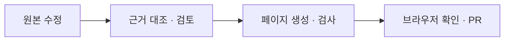

<h1 lang="en">Keep the guide current.</h1>

**원본을 고친 뒤 페이지를 생성하고 검사하세요.** 검토 기록은 실제로 읽고 확인한 범위를 남깁니다.

## 문서를 수정하고 검증하세요

문서 도구에는 **Node.js 24**가 필요합니다. `npm ci --prefix tools/docgen --ignore-scripts`로 공용 엔진을 설치합니다. 문서 원본은 다음과 같이 나뉩니다.

| 수정할 내용 | 원본 |
| --- | --- |
| 구조와 코드 근거 | `.omm/`와 추출 대상 소스를 수정합니다. |
| 생성 본문 | `guide/_content/`의 원고를 수정합니다. 페이지의 `omm:begin`·`omm:end` 사이를 직접 고치지 않습니다. |
| 일반 본문과 메뉴 | `guide/*.md`의 마커 밖 본문과 `guide/_config.yml`을 수정합니다. |
| 페이지별 근거 연결 | `guide/_bindings.yaml`을 수정합니다. |
| 사이트 스타일 | `docs/design/editorial.css`를 수정합니다. 생성된 CSS와 `docs/*.html`은 직접 고치지 않습니다. |

1. 원본을 수정한 뒤 사실 정보를 추출하고 변경된 근거를 확인합니다.

   ~~~powershell
   node tools/docgen/docflow.mjs extract
   node tools/docgen/docflow.mjs verify --changes
   ~~~

2. 코드와 원고를 대조하고 변경 사항을 커밋합니다. 검토 상태를 승인할 때에는 추적되지 않은 파일까지 없는 깨끗한 작업 트리를 사용합니다.

   ~~~powershell
   node tools/docgen/docflow.mjs verify --accept --reviewer=검토자
   node tools/docgen/docflow.mjs generate
   node tools/docgen/docflow.mjs site build
   ~~~

3. 생성된 페이지와 검토 기록을 커밋한 뒤 회귀 검사와 CI용 검사를 실행합니다.

   ~~~powershell
   npm test --prefix tools/docgen
   node tools/docgen/docflow.mjs check --ci
   ~~~

4. 브라우저에서 문장, 링크, 표와 모바일 배치를 확인하고 PR에 검증 결과를 남깁니다. 검토 승인 명령과 자동 검사는 원고를 읽는 일이나 기기 검증을 대신하지 않습니다.

`docs-sync`는 main의 관련 변경에서 근거의 최신성을 확인합니다. PR에서 검토와 재생성을 마쳐 근거 해시가 같으면 추가 동기화 PR 없이 끝납니다. 운영과 실패 복구는 [문서 도구 안내](https://github.com/TTolsun/hal-camera/blob/main/tools/docgen/README.md)에 있습니다.

한국어 문장은 [fluent-korean](https://github.com/snflkd/fluent-korean)과 [공통 집필 규칙](https://github.com/TTolsun/omm-doc-workflow/blob/main/style/README.md)에 따라 다듬습니다. 사용법은 해당 기능 페이지에 한 번만 설명하고, 다른 페이지에서는 필요한 부분으로 연결합니다.

검증 결과와 기기 기록은 [Evidence](evidence.md)를 확인하세요.
