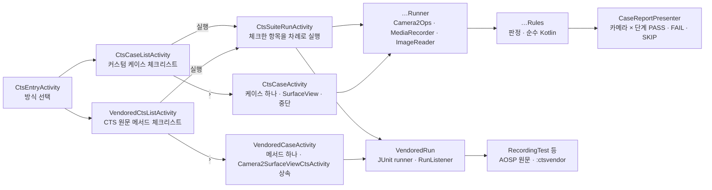

<h1 lang="en">The same test, inside the app.</h1>

**CTS 화면은 CTS가 아닙니다.** 공식 판정은 cts-tradefed의 `test_result.xml`뿐이며, 이 화면은 그 결과를 기다리기 전에 같은 조건을 기기에서 미리 확인하는 용도입니다. 두 방식이 있고, 첫 화면에서 하나를 고릅니다. **커스텀 케이스**는 CTS 카메라 테스트의 판정 규칙과 상수를 앱의 Kotlin으로 옮긴 케이스 다섯 가지로, 카메라와 단계마다 PASS·FAIL·SKIP과 측정값을 보여 줍니다. **CTS 원문 케이스**는 AOSP CTS의 Java 테스트 코드를 그대로 가져와 앱 안의 JUnit으로 실행하며, 테스트 메서드 하나에 판정 하나를 냅니다. 어느 쪽도 Benchmark의 반복 측정이나 회귀 점수에는 들어가지 않습니다.

이 그림은 두 방식이 각각 진행되는 개념적 순서입니다. 두 목록은 모두 체크리스트이고, 체크한 항목을 `실행`하면 `CtsSuiteRunActivity`가 위에서부터 차례로 돌립니다. 이 화면은 가져온 `Camera2SurfaceViewCtsActivity`를 상속하면서 커스텀 러너의 `PreviewHost`도 구현하므로 SurfaceView 하나로 두 종류를 다 호스트하지만, 목록이 분리되어 있으므로 한 번의 실행에는 한 종류만 들어갑니다. 커스텀 케이스의 규칙은 카메라를 모르는 순수 Kotlin이라 JVM 테스트로 검증하고, 러너가 CTS가 기기에서 읽는 값을 채워 넣습니다. 다섯 케이스는 같은 `CtsRunner` 계약을 구현하므로 화면은 케이스를 구분하지 않습니다. CTS 원문 케이스는 코드를 옮기지 않으므로 검사 내용은 AOSP 소스 그대로이고, 앱은 그 코드가 전제하는 instrumentation 대역만 제공합니다.

<h2 lang="en">Pick a custom case.</h2>

| 케이스 | 원본 | 한 번 실행하면 |
| --- | --- | --- |
| 빠른 켜기·끄기 | `custom#FastOnOff` | 표준 열기(열기 → 프리뷰 세션 → 첫 프레임 → 닫기)와 빠른 열기(열기 직후 닫기 → 다시 열기 → 첫 프레임 → 닫기)를 5회씩 번갈아 수행합니다. 첫 프레임의 `SENSOR_TIMESTAMP`와 프레임 번호를 검사하고, 마지막 줄에 두 방식의 첫 프레임 중앙값을 비교합니다. |
| 카메라 전환 | `custom#Switching` | 카메라를 차례로 열어 첫 프레임을 받고 닫는 전환을 5회 반복한 뒤, 카메라마다 가장 큰 CamcorderProfile로 3초 녹화합니다. 녹화는 파일·트랙·크기와 길이 오차 20 %만 검사합니다. |
| 모든 크기 켜기·끄기 | `custom#AllSizeOnOff` | SurfaceHolder로 보고하는 프리뷰 크기 전부를 큰 것부터 하나씩 열어 첫 프레임을 확인합니다. 1080p 상한을 두지 않습니다. |
| 정지 영상 × 프리뷰 조합 | `custom#StillPreviewCombination` | JPEG 크기 전부와 프리뷰 크기(1080p 이하) 전부의 조합마다 세션을 구성해 프리뷰 첫 프레임 뒤 정지 영상을 한 장 찍고, 요청한 크기의 디코딩 가능한 JPEG인지 검사합니다. `StillCaptureTest#testStillPreviewCombination`의 순서와 QCIF 예외를 따르되 AE·AF 수렴은 기다리지 않습니다. |
| 동영상 스냅샷 | `custom#VideoSnapshot` | 가장 큰 CamcorderProfile로 25초를 녹화하면서 5~20초 사이 무작위 시점에 같은 세션으로 JPEG 스냅샷을 한 장 찍습니다. 동영상은 `RecordingTest#testVideoSnapshot`의 프레임 드롭률 8 %(15 MP 초과 스냅샷은 12 %), 스냅샷은 크기와 디코딩을 검사합니다. |

`custom#` 원본은 CTS 클래스에 그대로 대응하는 메서드가 없는 케이스입니다. 검사 문구는 CTS `CameraTestUtils`에 같은 검사가 있으면 그 문구를 따릅니다. `RecordingTest#testBasicRecording`은 커스텀 케이스에 없습니다. 원문 그대로 실행하는 쪽이 옮겨 적는 쪽보다 정확하므로 CTS 원문 케이스로만 제공하며, 녹화 판정 규칙(`BasicRecordingRules`)은 카메라 전환과 동영상 스냅샷이 계속 공유합니다.

<h2 lang="en">Pick a CTS method.</h2>

CTS 원문 케이스 목록은 `:ctsvendor` 모듈에 가져온 테스트 클래스의 `@Test` 메서드를 reflection으로 나열합니다. 지금 가져온 클래스는 세 개입니다.

| 클래스 | 검사하는 것 | 실기기 확인 |
| --- | --- | --- |
| `RecordingTest` | CamcorderProfile 녹화, 동영상 스냅샷, 고속·슬로모션·타임랩스 녹화, 프리뷰 크기별 녹화 등 19개 메서드 | `testBasicRecording` PASS(Galaxy S25+, 1분 58초). 나머지는 아직 돌려 보지 않았습니다. |
| `StillCaptureTest` | JPEG·HEIC·RAW·DNG 정지 영상, AE/AF 수렴, 줌, 회전, 초점 거리, 프리뷰와 정지 영상 크기 조합, 타임스탬프 등 21개 메서드 | 21개 모두 실행, PASS 20 · FAIL 1(Galaxy S25+). `testAeCompensation`이 카메라 0의 노출 시간 범위 초과와 카메라 2의 AE 보정 미적용으로 FAIL했고, 이는 HAL 판정입니다. `testStillPreviewCombination`은 18분 29초가 걸립니다. |
| `BurstCaptureTest` | JPEG·YUV·RAW 연속 촬영의 프레임 순서와 처리량 3개 메서드 | 3개 모두 PASS(Galaxy S25+). |

`UiAutomation`이나 `@TestApi`가 필요한 메서드는 실행하면 초기화 단계에서 FAIL로 끝납니다. `StillCaptureTest`·`BurstCaptureTest`의 24개 메서드에는 그런 메서드가 없었고, `RecordingTest`의 나머지 18개는 아직 돌려 보지 않았습니다. 결과 목록은 `docs/STATUS.md`의 실기기 확인 절에 있습니다. 측정된 적 없는 메서드는 행에 `시간 미상`으로 표시됩니다.

가져온 소스는 AOSP `android16-release` 브랜치의 `cts/tests/camera`와 `frameworks/ex/camera2/public`이며, 원본 커밋과 적용한 패치 일곱 건(`@TestApi`·`@FlaggedApi` 호출을 공개 API로 바꾸거나 제거하고, shell 권한 행을 만들지 않게 한 것)은 `ctsvendor/UPSTREAM.md`에 있습니다. Android 14(API 34) 아래 기기에서는 이 경로가 비활성화됩니다. 업스트림이 이 파일 집합을 `min_sdk_version 34`로 빌드하기 때문입니다.

<h2 lang="en">What one run does.</h2>

1. Live 상단 `도구` 메뉴에서 `CTS`를 고릅니다. Live 카메라의 `close(done)` 콜백을 받은 뒤 방식 선택 화면이 열리고, `커스텀 케이스`나 `CTS 원문 케이스`를 누르면 그 체크리스트가 열립니다.
2. 실행할 항목에 체크합니다. 행마다 제목과 대략의 소요 시간, 원본이 적혀 있고(측정된 적 없는 원문 메서드는 `시간 미상`), 그룹의 `전체 선택`으로 한 번에 고를 수 있습니다. 하단 바에 `선택 N개 · 약 M분`이 갱신되며, 선택은 다음에 열 때 그대로 남아 있습니다.
3. 하단 바의 `실행`을 누르면 실행 화면이 열리고, 카메라 권한(녹화 항목이 있으면 마이크 권한도)을 확인한 뒤 바로 첫 항목을 시작합니다. 각 항목은 공개 카메라 전부를 순회하며, 컬러 출력이 없거나 외장 카메라이면 CTS와 같은 사유로 건너뜁니다. 한 항목이 카메라를 닫고 결과를 보고한 뒤에야 다음 항목이 시작됩니다.
4. 항목마다 카드가 하나씩 놓입니다. 실행 중인 카드에는 단계별 판정이 결정되는 즉시 행이 추가되고, 끝난 카드는 `PASS`·`FAIL`·`SKIP`과 소요 시간을 보여 주며 누르면 상세가 펼쳐집니다. `중단`을 누르면 실행 중인 항목만 멈추고(`중단됨`) 나머지는 `실행 안 함`으로 남습니다.
5. 끝나면 머리글에 `N개 중 PASS a · FAIL b · 소요 시간`이 나옵니다. `복사`는 항목 전체의 보고서를 클립보드에 넣고 `공유`는 같은 텍스트를 다른 앱으로 보냅니다. `다시 실행`은 같은 항목을 처음부터 다시 돌립니다.

항목 하나만 따로 보려면 행의 `›`를 누릅니다. 커스텀 케이스는 `CtsCaseActivity`, CTS 원문은 `VendoredCaseActivity`가 열리며, `실행`·`중단`·`복사`·`공유`의 동작은 아래와 같고 결과 표시만 그 항목 하나에 맞춰져 있습니다.

CTS와 달리 한 단계가 실패해도 나머지 단계와 카메라를 계속 실행합니다. 화면의 SurfaceView가 CTS의 `Camera2SurfaceViewCtsActivity` 역할을 하며, 러너가 필요한 크기로 버퍼를 바꾸고 `surfaceChanged`를 기다린 뒤 세션을 엽니다. 카메라 열기·세션 구성·첫 결과·닫기의 대기 시간은 CTS `CameraTestUtils`와 같은 3초입니다.

CTS 원문 케이스의 한 번 실행은 다릅니다. `실행`을 누르면 카메라와 마이크 권한을 확인한 뒤 JUnit이 테스트 메서드를 작업 스레드에서 돌립니다. 테스트는 카메라 전부를 스스로 순회하므로 진행 중에는 경과 시간만 갱신되고, 실패가 생기면 그 즉시 실패 카드가 추가됩니다. `중단`은 실행 중인 테스트가 쥔 카메라를 닫아 테스트를 실패시키는 방식이라 몇 초 뒤에 `중단됨`으로 끝납니다. JUnit에는 실행 중인 본문을 멈출 수단이 없기 때문입니다. 실행 화면 자체가 CTS의 `Camera2SurfaceViewCtsActivity`를 상속하므로 테스트의 `updatePreviewSurface`가 같은 SurfaceView를 그대로 씁니다.

A rule you can run on the JVM is a rule you can trust on the device.

<h2 lang="en">Read the verdicts.</h2>

커스텀 케이스의 `PASS`·`FAIL`·`SKIP`은 카메라와 단계 단위로 붙습니다. 단계는 케이스마다 다릅니다. 동영상 스냅샷은 프로파일 이름, 빠른 켜기·끄기는 `standard_1`·`fast_1`과 `compare`, 카메라 전환은 `round_1`과 `record`, 크기 케이스는 `1920x1080`, 조합 케이스는 `4000x3000/1920x1080`처럼 정지 영상과 프리뷰 크기입니다. PASS 행에도 열기·세션 구성·첫 프레임·닫기의 소요 시간이나 녹화 길이·프레임 수 같은 수치를 남겨 경계에 가까운 통과를 다시 실행하지 않고 볼 수 있습니다. FAIL의 상세 문구는 CTS의 assertion 메시지와 같으므로 원본 테스트 결과와 나란히 읽을 수 있습니다.

CTS 원문 케이스의 판정은 메서드 하나에 하나입니다. `PASS`는 JUnit이 실패 없이 끝난 것, `FAIL`은 실패가 한 건 이상 있는 것, `SKIP`은 테스트가 assumption으로 스스로 건너뛴 것입니다. 카메라별·프로파일별 세부는 CTS가 `Log`로만 남기고 앱은 logcat을 읽을 권한이 없으므로, 실패 카드에는 예외 메시지와 CTS 코드 안의 호출 위치 세 줄만 남습니다. 어느 카메라에서 무엇이 실패했는지는 그 메시지에 적힌 카메라 ID로 읽습니다.

녹화한 동영상은 앱 전용 폴더에 `test_video.mp4`로 쓰고 판정 뒤 삭제하며, 정지 영상과 스냅샷은 크기와 디코딩만 확인하고 버립니다. CTS 원문 케이스도 같은 앱 전용 폴더(`getExternalFilesDir`)에 씁니다. 앨범에는 아무것도 남지 않습니다.

<h2 lang="en">Add a case.</h2>

커스텀 케이스를 추가하려면 다음 순서를 따릅니다.

1. 케이스별 하위 패키지(`cts/onoff/`처럼)에 판정을 담은 순수 Kotlin `…Rules`와 카메라를 다루는 `…Runner`를 둡니다. 러너는 `CameraCaseRunner`를 상속해 `runCamera`(카메라마다) 또는 `runCameras`(카메라를 섞어 쓰는 경우)를 구현합니다.
2. 열기 → 프리뷰 → 첫 프레임 → 닫기가 필요하면 `openCycle`과 `OpenCycle`을, 녹화가 필요하면 `CamcorderRecording`을, 정지 영상이 필요하면 `JpegReader`와 `Camera2Ops.captureStill`을 재사용합니다.
3. `CtsCatalog`에 id·원본·제목·요약을, `CtsRunners`에 러너 생성을 등록합니다. 규칙의 JVM 테스트를 함께 씁니다.

CTS 원문 클래스를 추가하려면 테스트마다 코드를 쓰지 않습니다.

1. AOSP 같은 브랜치에서 테스트 클래스 파일을 `ctsvendor/src/main/java/`의 같은 패키지 경로에 복사합니다. `Camera2SurfaceViewTestCase`나 `Camera2AndroidTestRule` 계열이 아니면 그 기반 클래스도 함께 가져옵니다.
2. `./gradlew :ctsvendor:compileDebugJavaWithJavac`로 컴파일합니다. 오류가 난 호출이 곧 `@TestApi`·`@FlaggedApi` 목록이므로, `UPSTREAM.md`의 패치처럼 공개 API로 바꾸거나 그 메서드를 제거하고 패치 목록에 적습니다.
3. `VendoredCatalog.classes`에 클래스를 넣습니다. `@Test` 메서드는 reflection으로 나열되므로 목록은 자동으로 늘어납니다.

코드 근거를 확인하세요

저장소의 <code>app/src/main/java/dev/halcamera/cts/</code>에서 <code>CtsEntryActivity.kt</code>(방식 선택), <code>CtsCatalog.kt</code>(케이스 목록), <code>CtsRunner.kt</code>·<code>CameraCaseRunner.kt</code>·<code>Camera2Ops.kt</code>(공통 계약과 Camera2 호출), <code>CtsCaseListActivity.kt</code>·<code>CtsCaseActivity.kt</code>(화면), <code>CaseReportPresenter.kt</code>(보고서), <code>suite/</code>의 <code>CtsChecklistActivity.kt</code>·<code>CtsSuiteRunActivity.kt</code>(체크리스트와 차례 실행)와 <code>SuitePlan.kt</code>·<code>SuiteReport.kt</code>(선택·예상 시간·통합 보고서), 그리고 <code>onoff/</code>·<code>switching/</code>·<code>sizes/</code>·<code>combination/</code>·<code>snapshot/</code>의 <code>…Rules.kt</code>(판정)와 <code>…Runner.kt</code>(실행), 공유 규칙 <code>recording/BasicRecordingRules.kt</code>를 확인하세요. CTS 원문 경로는 <code>cts/vendored/</code>의 두 화면과 <code>ctsvendor/src/main/java/dev/halcamera/ctsvendor/</code>의 <code>VendoredCts.kt</code>·<code>VendoredRun.kt</code>·<code>VendoredCatalog.kt</code>, 패치 목록 <code>ctsvendor/UPSTREAM.md</code>입니다. JVM 테스트는 <code>app/src/test/java/dev/halcamera/cts/</code>에 있습니다. 원고의 검토 상태는 아키텍처 문서 끝에 있습니다.

**다음 단계:** 판정에 쓰인 시간 규칙이 어디서 오는지 [Benchmark](benchmark.md)의 측정 범위와 비교해 읽으세요. CTS는 통과·실패를, Benchmark는 얼마나 걸리는지를 답합니다.
